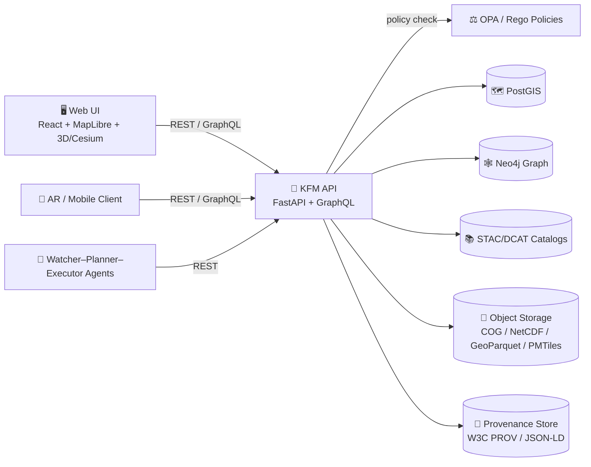

# 🧭 Kansas Frontier Matrix (KFM) — Server API


> [!IMPORTANT]  
> **This service is the single supported boundary** between KFM clients (Web UI, automation agents, AR/3D clients) and KFM data stores (PostGIS, Neo4j, catalogs, object storage).  
> ✅ **Clients must not query PostGIS/Neo4j directly.** All access goes through the API so we can enforce policy, provenance, redaction, caching, and observability.

---

## 🔗 Quick navigation

- [🎯 What this API does](#-what-this-api-does)
- [🧱 Architecture](#-architecture)
- [📦 Core concepts](#-core-concepts)
- [🛣️ Endpoint surface](#️-endpoint-surface)
- [🔐 Auth, roles, and policy-as-code](#-auth-roles-and-policy-as-code)
- [🧾 Data formats & standards](#-data-formats--standards)
- [🧠 Focus Mode (AI) contract](#-focus-mode-ai-contract)
- [📦 Ingest, pipelines, and idempotency](#-ingest-pipelines-and-idempotency)
- [🧯 Errors, pagination, and time](#-errors-pagination-and-time)
- [⚡ Performance & caching](#-performance--caching)
- [🔭 Observability](#-observability)
- [🧪 Testing & CI](#-testing--ci)
- [🧩 Contributing](#-contributing)
- [🗺️ Roadmap](#️-roadmap)
- [📚 Reference docs](#-reference-docs)

---

## 🎯 What this API does

This folder (`src/server/api/`) contains the **KFM API Layer** (FastAPI + GraphQL) responsible for:

- 🗺️ **Geospatial data access** (dataset metadata, filtered features, raster/vector tiles)
- 🧠 **Focus Mode (AI Assistant)** requests with **evidence + citations** (RAG + graph context)
- 🧩 **Knowledge Graph access** (Neo4j-backed relationships + semantics)
- 🧵 **Story Nodes / narratives** (interactive storytelling objects tied to maps & timelines)
- ⚙️ **Ingestion + pipelines orchestration** (run pipelines, check status, enforce “provenance-first”)
- 🔐 **Policy enforcement** (OPA/Rego + Conftest gatekeeping + runtime checks)
- 🔭 **Observability** (logs, traces, audit trails, performance signals)

> [!NOTE]  
> The endpoint list below is the **contract target** derived from the KFM design/architecture documents.  
> Always confirm live paths in the service’s **OpenAPI docs** and/or **GraphQL schema** once running.

---

## 🧱 Architecture

### 🧩 Where the API sits



### 🧪 Data lifecycle (why provenance matters)

```mermaid
flowchart TD
  Raw[🧊 Raw Ingest (read-only)] --> Work[🧰 Work / Staging]
  Work --> Proc[✅ Processed / Validated]
  Proc --> Catalogs[📚 Catalogs (STAC / DCAT)]
  Catalogs --> Graph[🕸️ Graph (Neo4j)]
  Graph --> API[🧠 API Layer]
  API --> UI[🖥️ UI & Story/Focus]
```

**Design intent:** every dataset, analysis output, and AI answer should be traceable back to:
- the input(s),
- the pipeline/config,
- the code version,
- the policy checks passed,
- and the provenance record(s).

---

## 📦 Core concepts

### 🧾 Dataset
A stable logical unit exposed to clients. Usually backed by:
- 🧠 **Catalog metadata** (DCAT summary + STAC links)
- 🗺️ **Spatial storage** (PostGIS tables/views, rasters, or external assets)
- 🧾 **Provenance** (PROV graph records and evidence manifests)

### 🧩 STAC / DCAT
- **STAC Items** describe spatiotemporal assets (imagery, scenes, observations).
- **DCAT Datasets** describe higher-level published datasets for discovery and governance.

### 🕸️ Knowledge graph (Neo4j)
Used for:
- relationships between places/people/events,
- linking datasets to real-world context,
- semantic search + Focus Mode grounding.

### 🧵 Story Node
A narrative step that can reference:
- time ranges (timeline),
- map layers and view states,
- media + citations,
- graph entities.

### 🧠 Focus Mode
Evidence-backed AI Q&A with:
- controlled retrieval,
- graph context injection,
- citation/provenance enforcement,
- prompt-security layers.

### 🧪 Pulse Threads (future)
A “traceable stream” concept that packages:
- a **question** / user intent,
- the **evidence** used,
- the **transformations** applied,
- and the **result** (map/story/answer),
into a shareable, verifiable thread.

---

## 🛣️ Endpoint surface

> [!TIP]  
> Keep REST endpoints **resource-oriented** and **versioned** (e.g., `/api/v1/...`).  
> Use GraphQL when you need flexible joins across domains (places ↔ datasets ↔ events ↔ story nodes).

### ✅ Meta & health

- `GET /healthz` — liveness
- `GET /readyz` — readiness (deps reachable)
- `GET /version` — build/version metadata
- `GET /openapi.json` — OpenAPI spec
- `GET /docs` — Swagger UI (FastAPI)

---

### 📚 Catalog & datasets

- `GET /api/v1/datasets/{id}`  
  Returns dataset metadata (DCAT summary + STAC links).

- `GET /api/v1/datasets/{id}/data?format=geojson&bbox=minx,miny,maxx,maxy&limit=...`  
  Returns filtered features (GeoJSON / JSON / Parquet export — depending on implementation).

- `GET /api/v1/catalog/search?keyword=...&bbox=...&time=...`  
  Dataset discovery across STAC/DCAT.

<details>
<summary>📌 Example: fetch dataset metadata</summary>

```bash
curl -s "http://localhost:8000/api/v1/datasets/ks_hydrology_1880" | jq
```
</details>

---

### 🗺️ Spatial query (ad‑hoc / safe query surface)

- `GET /api/v1/query?table=geo_counties&bbox=...&select=...&where=...&limit=...`

> [!WARNING]  
> Treat `/query` as a **controlled interface**: parameterize, restrict tables/views, enforce row/column policies, and log PROV for every execution.

<details>
<summary>📌 Example: quick table query</summary>

```bash
curl -s "http://localhost:8000/api/v1/query?table=geo_counties&limit=5" | jq
```
</details>

---

### 🧱 Tiles (2D/3D clients)

#### Vector tiles (MVT)
- `GET /tiles/{layer}/{z}/{x}/{y}.pbf`

#### Raster tiles (common patterns)
- `GET /tiles/{layer}/{z}/{x}/{y}.png`
- `GET /tiles/{layer}/{z}/{x}/{y}.webp` (optional)

> [!NOTE]  
> A key KFM goal is that **MapLibre, Cesium/3D clients, and AR/mobile** can all “drink from the same well” of standardized APIs.

<details>
<summary>📌 Example: fetch a vector tile</summary>

```bash
curl -I "http://localhost:8000/tiles/landcover/7/26/49.pbf"
```
</details>

---

### 🕸️ Graph access

#### GraphQL gateway
- `POST /graphql`

Use GraphQL for complex, client-shaped queries:
- place → datasets → related events → story nodes
- dataset → provenance → generating pipeline runs

<details>
<summary>📌 Example: GraphQL query</summary>

```graphql
query PlaceContext($placeId: ID!) {
  place(id: $placeId) {
    id
    name
    datasets(limit: 10) { id title }
    relatedEvents(timeRange: { from: "1850-01-01", to: "1900-12-31" }) {
      id
      label
      date
    }
  }
}
```
</details>

---

### 🧵 Story Nodes (narratives)

- `POST /api/v1/story` — create a story node (typically contributor+)
- `GET  /api/v1/story/{id}` — fetch story node
- `GET  /api/v1/story?bbox=...&time=...&tag=...` — browse story nodes

<details>
<summary>📌 Example: create a story node</summary>

```bash
curl -X POST "http://localhost:8000/api/v1/story" \
  -H "Content-Type: application/json" \
  -H "Authorization: Bearer $KFM_TOKEN" \
  -d '{
    "title": "Kansas From Above — 1870 to 1900",
    "time_range": {"from": "1870-01-01", "to": "1900-12-31"},
    "map_state": {"center": [-98.0, 38.5], "zoom": 6},
    "layers": ["railroads_1880", "counties_1890"],
    "citations": [{"dataset_id":"ks_railroads_1880","note":"Primary layer"}]
  }'
```
</details>

---

### 🧠 Focus Mode (AI)

- `POST /api/v1/ai/query` — ask a question
- `POST /api/v1/ai/stream` — streaming answer (SSE/WebSocket, if enabled)
- `GET  /api/v1/ai/suggestions?context=...` — “what to ask next” / dataset suggestions (optional)

See [🧠 Focus Mode (AI) contract](#-focus-mode-ai-contract).

---

### ⚙️ Ingest & pipelines

- `POST /api/v1/ingest` — direct ingest (typically **admin-only**)
- `POST /api/v1/ingest/runPipeline` — run a named pipeline
- `GET  /api/v1/pipelines/status` — pipeline run status
- `GET  /api/v1/pipelines/{run_id}` — detailed run + provenance links

See [📦 Ingest, pipelines, and idempotency](#-ingest-pipelines-and-idempotency).

---

### 📡 Real-time / live feeds (optional, but designed-in)

- `GET /api/v1/transport/buses?since=<iso8601>`  
  A canonical example of live/streaming “Watcher” outputs surfaced as queryable data.

---

## 🔐 Auth, roles, and policy-as-code

### 👥 Roles (conceptual baseline)

- 👀 **Public Viewer** — read-only access to public datasets & stories
- ✍️ **Contributor** — can submit story nodes and proposed data additions
- 🧰 **Maintainer** — can approve/curate/merge contributions
- 🛡️ **Admin** — can run privileged ingest actions, manage policies & secrets

> [!IMPORTANT]  
> Every request path must be governed by **RBAC + policy checks** (including data sensitivity labels).

### ⚖️ Policy Pack (OPA/Rego + Conftest)

**What policy should enforce (high-level):**
- ✅ **Pipeline ordering** (Raw → Work → Processed → Catalogs → Graph → API → UI)
- 🚫 **API boundary** (no bypassing the API for data/graph access)
- 🧾 **Provenance-first publishing** (nothing goes public without provenance + required metadata)
- 🔐 **Security checks** (no secrets, validated schemas, safe query rules)
- 🧠 **AI answer requirements** (e.g., “must include at least one citation”)

> [!TIP]  
> Treat policy files as **first-class code**: versioned, tested, reviewed, and run in CI.

---

## 🧾 Data formats & standards

### 🗺️ Geospatial exchange formats
- **GeoJSON** — ad-hoc feature responses / exports
- **MVT (.pbf)** — high-performance vector tiles
- **COG (Cloud-Optimized GeoTIFF)** — raster assets served via tile APIs
- **NetCDF (chunked)** — scientific rasters/time-series (served via derived tiles or subsets)
- **GeoParquet** — columnar analytics export (optional)
- **PMTiles** — portable offline tile packaging (planned)

### 📚 Catalogs & provenance
- **STAC** (Items/Collections) for spatiotemporal assets
- **DCAT** for dataset-level discovery and governance metadata
- **W3C PROV / PROV-O** (often JSON-LD) for lineage + auditability

---

## 🧠 Focus Mode (AI) contract

> [!IMPORTANT]  
> Focus Mode is **not** “chat with the database.” It’s a governed system: retrieval is controlled, graph context is used responsibly, and responses **must carry citations**.

### Request (baseline shape)

```json
{
  "question": "What was the water level near Topeka in spring 1951?",
  "context": {
    "bbox": [-96.9, 39.0, -95.9, 39.3],
    "time_range": { "from": "1951-03-01", "to": "1951-06-30" },
    "layers": ["river_gauges", "flood_extent_1951"],
    "place_ids": ["place_topeka_ks"]
  },
  "options": {
    "max_citations": 8,
    "response_style": "explainable",
    "allow_external_web": false
  }
}
```

### Response (evidence-forward)

```json
{
  "answer": "…",
  "citations": [
    {
      "dataset_id": "ks_river_gauges",
      "stac_item": "river_gauges_1951-05-12_topeka",
      "provenance": { "prov_activity": "prov:run/abcd1234" },
      "excerpt": "…"
    }
  ],
  "provenance": {
    "prov_activity": "prov:ai_query/efgh5678",
    "used_entities": ["dataset:ks_river_gauges", "stac:item/river_gauges_1951-05-12_topeka"]
  },
  "safety": {
    "redactions_applied": true,
    "policy_checks": ["ai.citations.required", "data.sensitivity.enforced"]
  }
}
```

---

## 📦 Ingest, pipelines, and idempotency

### 🧊 Ingest philosophy (why we’re strict)
- Raw inputs are treated as **immutable**.
- Processing is **deterministic/config-driven**.
- Publishing is **provenance-first** and **policy-gated**.

### 🔁 Idempotency (must-have for safe automation)
Any mutating endpoint should support:

- `Idempotency-Key: <stable-digest>` header  
- server-side de-duplication + “replay yields the same result” semantics  
- provenance for each run so we can answer: **“what created this and why?”**

### 🧾 Run manifests (recommended)
For pipelines or automated agents, prefer a **Run Manifest** that includes:
- inputs (dataset refs, digests),
- pipeline/config version,
- parameters,
- expected outputs,
- and policy checks run.

This enables:
- reproducibility,
- artifact signing,
- and “evidence manifests” attached to catalog entries.

---

## 🧯 Errors, pagination, and time

### 🔥 Error shape (recommended)

```json
{
  "error": {
    "code": "KFM_FORBIDDEN",
    "message": "You are not allowed to access this dataset.",
    "request_id": "req_01H...",
    "details": { "policy": "data.sensitivity.enforced" }
  }
}
```

### 📄 Pagination (recommended)
- `limit`, `offset` for simple lists
- `cursor` for stable, scalable pagination in large catalogs

### ⏱️ Time rules
- Use ISO‑8601 strings (`YYYY-MM-DD` or `YYYY-MM-DDTHH:mm:ssZ`)
- Be explicit about time zones (prefer UTC)

---

## ⚡ Performance & caching

- 🧱 **Tile caching** is first-class (HTTP cache headers + CDN where possible)
- 🧠 Avoid N+1 graph/data patterns (GraphQL resolvers should batch/cache)
- 🧰 Parameterize and restrict query surfaces (especially `/query`)
- 🗺️ Use spatial indexes and simplified geometries for high zoom tiles
- 🚦 Prefer async/background tasks for heavy compute (analysis, bulk exports)

---

## 🔭 Observability

- 📈 **OpenTelemetry traces** (API → PostGIS → Neo4j → object storage)
- 🧾 **Audit logs** for:
  - sensitive datasets,
  - Focus Mode queries,
  - story publishing,
  - ingestion/pipeline runs.
- ⚡ Optional: “energy / cost” instrumentation for compute-heavy steps (design goal)

---

## 🧪 Testing & CI

### ✅ What we expect in CI
- unit tests (routes/services)
- integration tests (PostGIS + Neo4j + catalogs)
- schema validation (STAC/DCAT/PROV + API payloads)
- policy pack checks (Conftest)
- security checks (secrets scanning, dependency checks)

### 🧠 Policy tests
Policies should be testable with “good” and “bad” fixtures:
- ✅ compliant dataset metadata passes
- ❌ missing license fails
- ❌ AI output without citations fails
- ❌ bypass attempt fails

---

## 🧩 Contributing

### 🧾 Contract-first workflow
When adding/changing endpoints:

1. ✅ Update request/response schemas (Pydantic + OpenAPI)
2. ✅ Update GraphQL schema/resolvers (if applicable)
3. ✅ Add/adjust OPA policy checks (runtime + CI)
4. ✅ Add tests (unit + integration)
5. ✅ Update this README’s endpoint index
6. ✅ Ensure provenance is emitted for any mutating action

> [!TIP]  
> If a change cannot be validated deterministically, it probably needs a tighter contract.

---

## 🗺️ Roadmap

- 📦 **Offline Data Packs** for rural/field use (bundled tiles + catalogs + models)
- 🌎 **Federation** (multi-region “Frontier Matrix” interoperability)
- 🧊 **Artifact distribution via OCI** (signed data packs + verifiable provenance)
- 🧠 **GraphQL subscriptions / streaming** for live feeds + Focus Mode streams
- 🛰️ **Remote sensing pipelines** (ML-based products surfaced as datasets)
- 📱 **AR/mobile clients** (same APIs; different UX + filtering strategies)
- 🌐 **OGC API Features / WMS/WFS** compatibility (where it helps adoption)

---

## 📚 Reference docs

These docs define the contract and design intent that this API README follows:

- 📘 *KFM – Comprehensive Technical Documentation*
- 🏗️ *KFM – Comprehensive Architecture, Features, and Design*
- 🧭🤖 *KFM – AI System Overview*
- 🧩 *KFM – Comprehensive UI System Overview*
- 📚 *KFM Data Intake – Technical & Design Guide*
- 🌟 *KFM – Latest Ideas & Future Proposals*
- 💡 *Additional Project Ideas*
- 🚀 *Innovative Concepts to Evolve KFM*
- 🗺️ *Maps / WebGL / Virtual Worlds reference portfolio*
- 🧠 *AI Concepts reference portfolio*
- 🗃️ *Data Management / Architecture reference portfolio*
- 🧰 *Programming languages & resources reference bundle*

---

> [!NOTE]  
> **If you update APIs, update docs.** The UI, agents, and future AR clients all depend on this contract staying trustworthy. ✅