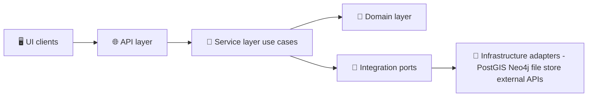

# 🧠 KFM Server Domain (`src/server/domain`)

   

> According to a document from **2026-01-24** (project documentation snapshot), KFM uses a **multi-layer clean architecture** where the **Domain Layer** defines core entities with **no external dependencies**, while outer layers orchestrate workflows and integrate technologies like PostGIS / Neo4j / API frameworks. :contentReference[oaicite:0]{index=0}:contentReference[oaicite:1]{index=1}

---

## 🎯 Why this folder exists

This folder is the **meaning layer** of the Kansas Frontier Matrix (KFM) server:

- ✅ Defines *what things are* (core entities like land parcels, historical maps, sensor readings, people) as plain objects.
- ✅ Encodes the **rules that must always be true** (evidence-first publishing, provenance expectations, governance constraints, versioning).
- ✅ Stays independent from storage, web frameworks, and external services to keep the system testable and swappable. :contentReference[oaicite:2]{index=2}

KFM’s backend is described as a hybrid of geospatial + semantic graph + AI/analytics services (PostGIS + Neo4j + API), but the domain should **not** import or “know” any of that directly. :contentReference[oaicite:3]{index=3}:contentReference[oaicite:4]{index=4}

---

## ✅ What belongs in `domain/`

**Put these here** 👇

- **Entities** 🧩  
  Real-world things with identity and lifecycle (e.g., `LandParcel`, `HistoricalMap`, `SensorReading`, `Person`) modeled as simple classes/structs. :contentReference[oaicite:5]{index=5}

- **Value Objects** 🧷  
  Immutable “meaning” values: `DatasetId`, `TimeRange`, `GeoBounds`, `License`, `Classification`, `Digest`, etc.

- **Domain rules / invariants** 🛡️  
  Guardrails like “evidence triplet required before publish” and “no mystery nodes”.

- **Domain events** 🔔  
  Things that happened in the domain: `DatasetPublished`, `StoryNodeCreated`, `PolicyGateFailed`, `RunManifestRecorded`.

- **Ports (interfaces) only if your codebase places them here** 🔌  
  In KFM docs, the “Integration Layer” is where repository interfaces live (ports/adapters). If your repo keeps ports alongside the domain, keep them **pure** (interfaces only). :contentReference[oaicite:6]{index=6}

---

## ❌ What does NOT belong in `domain/`

**Keep these out** 🚫

- SQL/ORM, Neo4j drivers, HTTP clients, filesystem, cloud SDKs  
- FastAPI/Express controllers, GraphQL resolvers, web framework DTOs  
- Raster/Vector processing libs (GDAL, Rasterio, GeoPandas)  
- Anything that makes your domain non-deterministic or environment-dependent

KFM docs are explicit: **domain logic never directly executes SQL or HTTP**; it relies on interfaces so core logic stays clean and bounded. :contentReference[oaicite:7]{index=7}

---

## 🧱 Architecture boundaries (mental model)



- **Domain Layer** = “what exists + what must be true”  
- **Service Layer** = “what we do” (workflows/use cases)  
- **Ports/Adapters** = “how we talk to the outside world” :contentReference[oaicite:8]{index=8}

---

## 🧠 Core domain model (KFM vocabulary)

KFM’s knowledge graph and catalogs commonly revolve around these concepts:

| Concept 🧩 | What it is | Why it matters in domain |
|---|---|---|
| **Place** 🗺️ | A spatial entity (point/region/bounds) | Links datasets, events, stories, and observations spatially :contentReference[oaicite:9]{index=9} |
| **Person / Agent** 👤 | Someone/something responsible | Provenance + accountability (PROV Agent) :contentReference[oaicite:10]{index=10} |
| **Event** 🕰️ | A historical / real-world event | Semantic joins across time, place, documents, datasets :contentReference[oaicite:11]{index=11} |
| **Dataset** 📦 | A publishable unit of data (DCAT Dataset) | Governed metadata, licensing, sensitivity, versioning :contentReference[oaicite:12]{index=12} |
| **Observation / Asset** 🔭 | A specific spatiotemporal slice (STAC Item/Asset) | Powers time slider + map layers; ties to provenance :contentReference[oaicite:13]{index=13} |
| **Provenance Activity** 🧾 | How something was produced | “No mystery nodes” + reproducibility expectations :contentReference[oaicite:14]{index=14} |
| **Story Node** 📖 | Narrative + a map state | The storytelling “unit” of KFM’s guided tours :contentReference[oaicite:15]{index=15} |
| **Concept (Attention Node)** 🧠✨ | A thematic hub (“drought”, “heritage”) | Curates AI + UI exploration pivots :contentReference[oaicite:16]{index=16} |
| **Pulse Thread** 🧵 | Living, time-updating narrative thread | Real-time discussion with sources + CARE constraints :contentReference[oaicite:17]{index=17} |

---

## 🧾 Evidence-first publishing (STAC + DCAT + PROV)

KFM’s intake docs describe an “evidence triplet” requirement:

- **DCAT** → discoverability & governance metadata  
- **STAC** → spatiotemporal indexing for map/time  
- **PROV** → auditability & lineage (Entity/Activity/Agent)

> Data isn’t considered officially part of the platform until these metadata are in place (“evidence-first publishing”). :contentReference[oaicite:18]{index=18}

Domain implications ✅  
- A `Dataset` (domain) should not transition to `Published` unless evidence artifacts exist (or are referenced).
- `DatasetId` and related identifiers should be stable and versionable (e.g., IDs like `kfm.ks.landcover.2000_2020.v1` are referenced as a convention). :contentReference[oaicite:19]{index=19}

---

## 🕸️ Knowledge graph semantics (Neo4j) + geospatial truth (PostGIS)

Intake docs describe a hybrid store strategy:

- **PostGIS** = spatial “heavy lifting” + fast geospatial queries  
- **Neo4j** = relationships & semantic context (datasets ↔ places ↔ events ↔ users ↔ stories)

Graph ingestion is driven from catalogs (STAC/DCAT/PROV) into a governed ontology (CIDOC-CRM, GeoSPARQL, OWL-Time are explicitly mentioned) and **“no mystery nodes”** are allowed. :contentReference[oaicite:20]{index=20}:contentReference[oaicite:21]{index=21}

Domain implications ✅  
- Model relationships explicitly (even if storage uses Neo4j).
- Keep provenance references on every meaningful object.
- Include sensitivity/classification in domain so downstream layers can enforce restrictions (e.g., restricted coordinates flagged). :contentReference[oaicite:22]{index=22}

---

## 🤖 Focus Mode + hybrid retrieval (domain-facing contracts)

KFM’s AI system description emphasizes:

- Deep integration of **knowledge graph queries** (Neo4j) and spatiotemporal context (e.g., “events here in the 1930s”).  
- A **hybrid retrieval pipeline (RAG)** that combines structured querying (graph/GIS) + semantic search over documents.  
- Use of indices like **PostGIS** for spatial queries and **Neo4j** traversals for multi-hop reasoning context. :contentReference[oaicite:23]{index=23}

Domain implications ✅  
- Represent user intent as a domain “question plan” (e.g., `GeoTemporalQuery`, `EntityGraphQuery`, `NarrativeRequest`) so service layer can execute deterministically.
- Preserve traceability: answers link back to sources. :contentReference[oaicite:24]{index=24}

---

## 📖 Story Nodes + community storytelling (domain rules)

**Story Nodes** are described as narrative building blocks combining:

- Markdown narrative content (with citations)
- JSON configuration defining map layers + camera view  
- A sequence of nodes forming a storyboard synced with map and time. :contentReference[oaicite:25]{index=25}:contentReference[oaicite:26]{index=26}

Planned UX includes a “Story Builder” that generates the Markdown + JSON behind the scenes. :contentReference[oaicite:27]{index=27}

Innovative concepts propose a **Story Archive** where citizens upload memories tied to locations, supported by:
- peer review/moderation
- reputation/trust levels
- human-in-the-loop AI checks to detect errors and suggest verification points. :contentReference[oaicite:28]{index=28}

Domain implications ✅  
- `StoryNode` should carry:
  - `MapState` (camera, layers, time window)
  - `NarrativeContent` (markdown + citations)
  - `ModerationState` (draft → provisional → reviewed → published)
- Domain events for moderation + publishing make audit trails natural.

---

## 🛡️ Governance is a first-class domain concern (Policy Pack)

KFM proposes a **Policy Pack** using **Open Policy Agent (Rego)** + **Conftest** to enforce:
- FAIR data principles
- CARE principles (sensitive handling)
- retention policies
- coding/data standards  
…and run them in CI as a “policy gate” that rejects violations. :contentReference[oaicite:29]{index=29}

Additional governance patterns include:
- Policy-as-code rules verifying license/provider requirements and scanning for secrets, **fail-closed** by default. :contentReference[oaicite:30]{index=30}
- Run manifests with **JSON canonicalization (RFC 8785)** + SHA-256 digest used as idempotency keys, tied into provenance. :contentReference[oaicite:31]{index=31}

Domain implications ✅  
- Model **PolicyDecision** and **PolicyFinding** as domain outputs (not “CI-only” concerns).
- Treat license + sensitivity + provenance requirements as domain constraints.

---

## 🤖 Provenance-first automation (Watcher → Planner → Executor)

KFM “Latest Ideas” describes an auditable automation pattern:

- **Watcher** observes and emits immutable facts/alerts  
- **Planner** deterministically generates a change plan  
- **Executor** opens a PR (never auto-merges)  
- Includes idempotency keys + kill-switch for safety. :contentReference[oaicite:32]{index=32}

Domain implications ✅  
- Domain should be able to represent:
  - `Alert` / `Finding`
  - `Plan` (deterministic)
  - `ProposedChange` (reviewable)
  - `RunManifest` (signed + traceable)

---

## 🗺️ Geospatial & time semantics (CRS, normalization, quality)

KFM documentation highlights metadata expectations:
- Track CRS and normalize distribution to WGS84 (EPSG:4326) while retaining original CRS metadata. :contentReference[oaicite:33]{index=33}
- Practical GIS work benefits from always checking projection metadata; many public datasets use EPSG:4326 or EPSG:3857. :contentReference[oaicite:34]{index=34}

Data quality is a recurring theme: incorrect/inconsistent data can distort results; preparation/cleaning is essential. :contentReference[oaicite:35]{index=35}

Domain implications ✅  
- Store `CrsInfo` + `SourceProjection` on geo artifacts.
- Include `QualityFlags` / `ValidationStatus` in entities that represent ingested data.

---

## 🌐 Federation-ready by design

KFM’s roadmap imagines federating to other “Frontier Matrix” instances (Nebraska, Oklahoma, etc.) using standardized APIs and schemas. :contentReference[oaicite:36]{index=36}

Domain implications ✅  
- IDs must be globally stable (region-qualified).
- Domain references should serialize cleanly to enable cross-instance sharing (datasets/places/pulse threads).

---

## 🧩 Adding a new domain feature (Design Pack mindset)

Additional ideas define **Design Packs** as modular blueprints that include:
- schema + ontology + pipeline integration points
- domain-specific specs like `SampleUnitSpec`, `PreprocessSpec`, `MetricSpec` (versionable, referenceable in provenance). :contentReference[oaicite:37]{index=37}

Suggested workflow ✅  
1. Define/extend the domain entities & invariants here (`domain/`)  
2. Define ports/interfaces in the integration layer (or alongside domain if that’s your repo style)  
3. Implement adapters in infrastructure (PostGIS/Neo4j/files/external APIs)  
4. Add/extend policy gates + manifests so governance stays enforceable

---

## 🧭 Suggested folder layout (if you’re organizing this package)

> This is a recommended structure to keep meaning clear and dependencies out. 🧼

```text
📁 src/server/domain/
├─ 📁 entities/          # Aggregate roots + entities (Dataset, Place, StoryNode…)
├─ 📁 value-objects/     # IDs, TimeRange, Bounds, License, Classification, Digest…
├─ 📁 events/            # Domain events (DatasetPublished, PolicyGateFailed…)
├─ 📁 rules/             # Invariants + pure validation logic
├─ 📁 services/          # Domain services (pure, deterministic)
├─ 📁 errors/            # Domain error types
└─ 📄 README.md          # (you are here ✨)
```

---

## 📚 Source PDFs used to shape this domain

> Some auxiliary PDFs are packaged as **PDF portfolios** that may require Adobe Reader/Acrobat to view fully. :contentReference[oaicite:38]{index=38}

- :contentReference[oaicite:42]{index=42} 📘 *Kansas Frontier Matrix (KFM) – Comprehensive Technical Documentation*  
- :contentReference[oaicite:43]{index=43} 🏗️ *Kansas Frontier Matrix (KFM) – Comprehensive Architecture, Features, and Design*  
- :contentReference[oaicite:44]{index=44} 🧭🤖 *Kansas Frontier Matrix (KFM) – AI System Overview*  
- :contentReference[oaicite:45]{index=45} 🎛️ *Kansas Frontier Matrix – Comprehensive UI System Overview*  
- :contentReference[oaicite:46]{index=46} 📥 *KFM Data Intake – Technical & Design Guide*  
- :contentReference[oaicite:47]{index=47} 💡 *Innovative Concepts to Evolve the Kansas Frontier Matrix (KFM)*  
- :contentReference[oaicite:48]{index=48} 🧪 *Additional Project Ideas*  
- :contentReference[oaicite:49]{index=49} 🌟 *Latest Ideas & Future Proposals*  
- :contentReference[oaicite:50]{index=50} 🧠 *AI Concepts & more*  
- :contentReference[oaicite:51]{index=51} 🗺️ *Maps / GoogleMaps / VirtualWorlds / WebGL (portfolio)*  
- :contentReference[oaicite:52]{index=52} 💻 *Various programming langurages & resources (portfolio)*  
- :contentReference[oaicite:53]{index=53} 🧮 *Data Management / Architectures / Bayesian Methods (portfolio)*  

---
