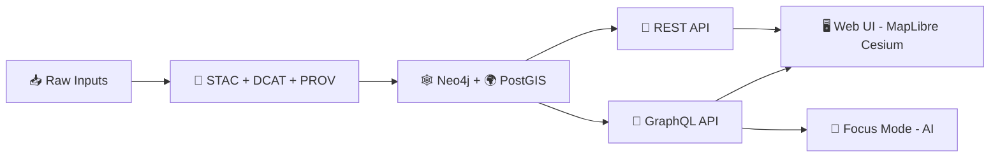

# 🧬 GraphQL API — Kansas Frontier Matrix (KFM)  
`src/server/graphql/`


-7F2BF1?logo=open-policy-agent&logoColor=white)

> 🧾 **Mission:** Provide a *governed, evidence-first* GraphQL contract over the KFM Knowledge Graph + Spatial DB, powering **Map UI**, **Story Nodes**, and **Focus Mode (AI)** — without bypassing the catalog/provenance pipeline.

---

## 🧭 Table of Contents
- [Why GraphQL in KFM](#-why-graphql-in-kfm)
- [Big Picture Architecture](#-big-picture-architecture)
- [Non‑negotiables](#-non-negotiables)
- [Folder Layout](#-folder-layout)
- [Schema Contract](#-schema-contract)
- [Resolver & Data Access Patterns](#-resolver--data-access-patterns)
- [Geospatial + Temporal Querying](#-geospatial--temporal-querying)
- [Story Nodes + Evidence Manifests](#-story-nodes--evidence-manifests)
- [Focus Mode (AI) Integration](#-focus-mode-ai-integration)
- [Artifacts + Offline Packs](#-artifacts--offline-packs)
- [Governance, Security, and Privacy](#-governance-security-and-privacy)
- [Testing + Quality Gates](#-testing--quality-gates)
- [Roadmap Hooks](#-roadmap-hooks)
- [Design References](#-design-references)

---

## 🧩 Why GraphQL in KFM
GraphQL exists here to:
- 🔎 Enable **semantic traversal** across KFM’s core entities (e.g., `Person → Event → Place → Dataset`) without the UI needing bespoke endpoints for every narrative path.
- 🗺️ Provide a single **contract** for the Web UI’s map/story experiences and the AI system’s evidence retrieval.
- 🧱 Enforce KFM’s core architecture rule: **the UI and clients never talk directly to Neo4j/PostGIS** — they go through governed APIs (REST + GraphQL).

---

## 🗺️ Big Picture Architecture



---

## ✅ Non‑negotiables
These rules are *contract-level invariants* for this folder:

1. **No stage skipping** 🚫  
   Raw inputs must become the **evidence triplet** (STAC/DCAT/PROV) *before* they become graph entities.  
2. **No DB bypass** 🧱  
   UI/clients must not query Neo4j/PostGIS directly; GraphQL/REST are the enforcement boundary.
3. **No “mystery nodes”** 🕵️‍♂️❌  
   Every returned entity must be attributable to catalog/provenance (and ideally expose pointers).
4. **CARE/FAIR governance is not optional** 🤝  
   Sensitivity markings (e.g., `care_label`) must flow through schema + resolvers + policy gates.

---

## 📂 Folder Layout
> This is the **recommended** organization for `src/server/graphql/`. If your implementation is code-first vs SDL-first, adapt the exact filenames (but keep the responsibilities).

```text
src/server/graphql/
├─ 📄 README.md                     # 📘 GraphQL layer overview: schema strategy, auth/policy model, and ops limits
├─ 🧬 schema/                       # GraphQL schema source (SDL) + composition utilities
│  ├─ 📜 *.graphql                  # SDL files (schema-first) grouped by domain/type
│  ├─ 🧩 index.*                    # Schema composition (stitch/merge/order) + export helpers
│  └─ 🧪 scalars/                   # Custom scalars (DateTime, JSON, GeoJSON, BBox, etc.)
├─ 🧠 resolvers/                    # Resolver implementations (thin; delegate to services/ports; policy-aware)
│  ├─ 🔎 Query.*                    # Query resolvers (read-only; enforce pagination/cost limits)
│  ├─ ✍️ Mutation.*                 # Mutation resolvers (if enabled; audited; policy-gated)
│  ├─ 📡 Subscription.*             # Subscriptions (if enabled; streaming/auth considerations)
│  └─ 🧾 types/                     # Type resolvers (Person, Place, Event, Dataset, StoryNode… field composition)
├─ 🧰 loaders/                      # DataLoader/batching layer (prevents N+1; centralizes query shapes)
│  ├─ 🕸️ neo4j.*                    # Neo4j batching loaders (parameterized, read-only by default)
│  └─ 🗺️ postgis.*                  # PostGIS batching loaders (spatial/time filters; safe query wrappers)
├─ 🧩 directives/                   # Schema directives enforcing cross-cutting rules at field level
│  ├─ 🔐 @auth.*                    # Role/claim based gating (RBAC/ABAC entrypoints)
│  ├─ ⚖️ @policy.*                  # OPA hooks (policy decisions + obligations)
│  └─ 🧿 @sensitive.*               # Sensitivity gating (CARE labels, redaction/obfuscation requirements)
├─ 🧾 context/                      # Request context construction (shared across all resolvers)
│  ├─ 🧾 buildContext.*             # Builds context: principal, request id, policy client, loaders, stores
│  └─ 🗄️ datastores.*               # Store wrappers: Neo4j/PostGIS/Catalog/Artifacts (ports/adapters)
├─ 🧪 __tests__/                    # GraphQL tests (schema, resolvers, policy gating)
│  ├─ 🧪 schema.test.*              # Schema compilation + snapshot of SDL (optional)
│  ├─ 🧪 resolvers.test.*           # Resolver behavior tests (mocked stores; deterministic fixtures)
│  └─ 🧪⚖️ policy.test.*            # Policy/directive tests (OPA rules + field-level gates + redaction obligations)
└─ 🧱 utils/                        # Utility guards for safe GraphQL operation
   ├─ 📈 complexity.*               # Query cost estimation + enforcement hooks
   ├─ 🧱 depthLimit.*               # Depth limiting middleware (abuse prevention)
   └─ 📑 pagination.*               # Pagination helpers (cursor encoding/decoding, page bounds, defaults)
```

---

## 📜 Schema Contract

### 🧱 Core entities (KFM “spine”)
The core graph contract should be built around these types:

- 👤 **Person**
- 📍 **Place** (including geometry / bbox)
- 🗓️ **Event** (time-bounded, linked to place/person/datasets)
- 📦 **Dataset** (catalog-backed; resolvers must expose provenance pointers)

### 🧾 Provenance-first fields
Every “real” entity type should expose:
- `provenance` (pointers to **STAC/DCAT/PROV** artifacts)
- `careLabel` / sensitivity marker (for governance + redaction)
- stable `id` (used across catalogs + graph + UI)

Suggested shape (illustrative):

```graphql
type ProvenanceRefs {
  stacItemId: ID
  dcatDatasetId: ID
  provBundleId: ID
  # Optional: signed artifact digests for packaged distributions (PMTiles/GeoParquet/COG)
  artifactDigests: [String!]
}

enum CareLabel {
  public
  restricted
  culturally_sensitive
}

interface KfmEntity {
  id: ID!
  label: String
  provenance: ProvenanceRefs!
  careLabel: CareLabel!
}
```

### 📄 Story Nodes (narrative layer)
Story Nodes are treated as first-class objects that combine:
- ✍️ **Markdown narrative**
- 🧭 **Map/timeline state config** (JSON)
- 🔗 **Citations** (human-readable) + **evidence manifest** (machine-verifiable)

Suggested shape:

```graphql
type StoryNode {
  id: ID!
  slug: String!
  title: String!
  markdown: String!
  config: JSON!
  citations: [Citation!]!
  evidenceManifestRef: String # e.g., EM-84.yaml
  provenance: ProvenanceRefs!
  careLabel: CareLabel!
}

type Citation {
  key: String!      # e.g., "1"
  label: String!    # e.g., "1908 newspaper clipping..."
  url: String
  checksum: String
}
```

---

## ⚙️ Resolver & Data Access Patterns

### 🧠 Data sources (expected)
Resolvers typically federate data from:
- 🧠 **Neo4j** for relationship traversal and conceptual graph structure  
- 🌍 **PostGIS** for spatial filtering, geometry operations, and map-layer queries  
- 🧾 **Catalog triplet** (STAC/DCAT/PROV) for evidence + metadata integrity  
- 📦 **Artifact registry/storage** for packaged data (PMTiles, GeoParquet, COGs), ideally content-addressed + signed

### 🧯 Guardrails (required)
GraphQL must protect the system from expensive queries:
- ✅ Depth limit / recursion guard
- ✅ Query complexity scoring
- ✅ Pagination required for collections (no unbounded lists)
- ✅ Rate limiting / per-role quotas (implementation-specific)
- ✅ Batching to avoid N+1 (DataLoader pattern)

> Rule of thumb: if the query *can* explode combinatorially, it *will*.

### 🧵 Resolver checklist
When adding/changing a resolver:
1. **Does it return provenance pointers?** (`STAC/DCAT/PROV`)  
2. **Does it enforce `care_label` / sensitivity?**  
3. **Is it paginated + filterable?**  
4. **Is it batched/cached?**  
5. **Is it covered by policy tests + unit tests?**

---

## 🌎 Geospatial + Temporal Querying

### 🧭 Common filters
Design spatial queries around:
- `bbox` (minLon, minLat, maxLon, maxLat)
- `geometry` (Polygon/MultiPolygon)
- `timeRange` (start/end; supports timeline slider + narratives)

Example “events in space + time” query (illustrative):

```graphql
query EventsInBbox($bbox: BBoxInput!, $time: TimeRangeInput!) {
  events(bbox: $bbox, time: $time, first: 50) {
    edges {
      node {
        id
        name
        date
        place { id name geometry }
        provenance { stacItemId dcatDatasetId provBundleId }
      }
    }
  }
}
```

### 🗺️ Output formats
Prefer:
- `GeoJSON` scalar for features/collections
- typed geometries for UI-friendly rendering
- “artifact refs” for high-volume map layers (PMTiles/COGs), not raw features

---

## 📖 Story Nodes + Evidence Manifests

### ✅ Why this matters
Story Nodes are not “just markdown pages.” In KFM they are:
- **queryable narrative objects**
- backed by **citations** + **evidence manifests**
- connected into the provenance graph (PROV)

### 🧾 Story Node front-matter (illustrative)
```markdown
---
id: story.dust-bowl.1935
title: "Dust Bowl: 1935"
year: 1935
care_label: public
evidence_manifest: "EM-84.yaml"
map:
  camera: { lon: -99.5, lat: 38.5, zoom: 6.2 }
layers:
  - "layer.drought-index"
  - "layer.county-boundaries"
---
# Dust Bowl: 1935
...narrative text...
```

### 🔌 GraphQL responsibilities for Story Nodes
- Provide the **renderable narrative** (`markdown`)
- Provide the **state config** (`config`) to drive UI (map/layers/timeline)
- Provide **citations + manifest references** for “View Evidence”
- Provide **graph connections**: `relatedDatasets`, `relatedPlaces`, `relatedEvents`, etc.

---

## 🤖 Focus Mode (AI) Integration
Focus Mode is only trustworthy if it can:
- pull **graph-grounded context**
- cite **verifiable evidence**
- obey governance constraints (`care_label`, role-based access)

GraphQL’s job in that loop:
- Provide **safe, bounded** retrieval endpoints (subgraph slices, dataset summaries, provenance pointers)
- Return **citation-ready references** (STAC/DCAT/PROV + evidence manifests)

> 🧠 Keep “AI text generation” separate from “evidence retrieval.” GraphQL should be the *retrieval contract*.

---

## 📦 Artifacts + Offline Packs

KFM supports (or is designed to support) **offline packs** and **field kit** scenarios:
- PMTiles / GeoParquet / COG bundles for offline usage
- digests/hashes for reproducibility
- signatures for supply-chain trust

GraphQL should expose “artifact manifest” metadata rather than streaming huge binaries:

```graphql
type ArtifactRef {
  kind: String!          # pmtiles | geoparquet | cog | model | ...
  uri: String!           # storage or registry locator
  digest: String!        # content hash
  mediaType: String!
  signatures: [Signature!]!
}

type Signature {
  kind: String!          # cosign | x509 | ...
  issuer: String
  subject: String
  verified: Boolean!
}
```

---

## 🔐 Governance, Security, and Privacy

### 🛡️ Policy-as-code
Expect policy enforcement to be done via:
- OPA/Rego policy pack
- CI gating (fail-closed)
- Runtime checks (directives/middleware) for field-level authorization

### 🧬 Sensitivity and `care_label`
**care_label** is a *data contract*, not an annotation:
- It impacts what fields can be returned
- It may require geometry fuzzing/redaction
- It must be enforced consistently across resolvers

### 🕵️ Query auditing & inference safety
GraphQL should emit auditable events (who queried what) and prevent inference leakage via:
- role-based restrictions
- throttling
- aggregation controls (where needed)

---

## 🧪 Testing + Quality Gates

### ✅ Required test layers
- **Schema compilation / type checks**
- **Resolver unit tests** (Neo4j/PostGIS adapters mocked or test containers)
- **Contract tests** for key UI operations (Map + Story + Focus)
- **Policy tests** (OPA/Rego + conftest)
- **Graph integrity checks** (orphan detection, missing provenance pointers, broken IDs)

### 🧾 Definition of Done (DoD) ✅
- [ ] New fields are documented + have example query
- [ ] Pagination enforced where applicable
- [ ] Provenance pointers included (STAC/DCAT/PROV)
- [ ] care_label honored (and tested)
- [ ] Policy tests added/updated
- [ ] Complexity/depth impact reviewed

---

## 🚧 Roadmap Hooks
This module should stay extendable for:
- 🔔 **Subscriptions / WebSockets** (live layers, streaming updates)
- 🧠 **Conceptual Attention Nodes** (theme hubs used by AI + UI)
- 🧵 **Pulse Threads** (micro-stories with evidence, shareable across federated instances)
- 🧪 **Narrative Pattern Detection** (detectors → narrative templates → evidence)
- 🕶️ **AR / Digital Twin overlays** (anchors, time travel, 4D views)

---

## 📚 Design References
These project docs are the “source of truth” for intent and constraints (read these before refactoring):

### 🧱 Core KFM architecture & API
- **KFM — Comprehensive Technical Documentation** (GraphQL interface, schema concepts, repo overview)
- **KFM — Comprehensive Architecture, Features, and Design** (UI ↔ API, map tech stack)
- **KFM — Data Intake Technical & Design Guide** (evidence triplet, provenance-first pipeline)
- **KFM — Comprehensive UI System Overview** (Story Nodes, Focus Mode UI integration)
- **KFM — AI System Overview** (Focus Mode behavior, citations & governance)
- **KFM — Latest Ideas & Future Proposals** (offline packs, PMTiles/GeoParquet, policy gates)

### 💡 Future concepts (shape the GraphQL roadmap)
- **Innovative Concepts to Evolve KFM**
- **Additional Project Ideas** (evidence manifests, OCI artifacts, policy gates, concept nodes, integrity checks)

### 📦 Reference libraries (PDF portfolios)
These are curated “bookshelves” used as implementation reference packs:
- **AI Concepts & more** (AI/ML references)
- **Maps / Google Maps / Virtual Worlds / WebGL** (geospatial + visualization references)
- **Data Management / Architectures / Bayesian Methods** (data systems + methods references)
- **Various programming languages & resources** (language/tool references)

> 🧠 Tip: keep this README updated as the schema evolves — it’s part of the contract.
