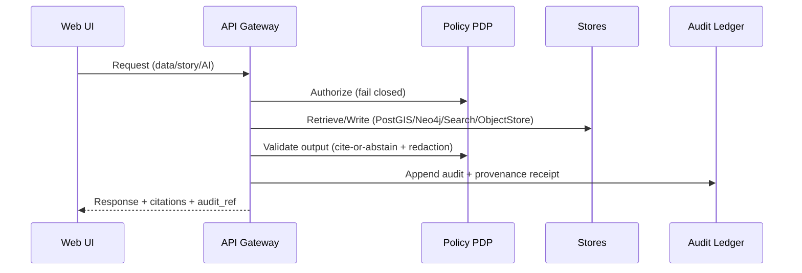

<!--
File: src/server/infrastructure/README.md
Layer: Infrastructure
Scope: Concrete adapters + wiring for external systems inside KFM’s trust membrane
-->

# Server Infrastructure


This directory contains the **Infrastructure layer** for the KFM server: the concrete code that talks to **databases, search, object storage, policy engines, and external APIs**, plus the **composition root** that wires these implementations into the governed API boundary.

> [!IMPORTANT]
> This layer sits on (or directly adjacent to) the **trust membrane**. Changes here can bypass or weaken governance if done incorrectly.
>
> The infra layer is where we implement the “not optional” invariants:
> - every request is authenticated and policy-evaluated,
> - outputs are redacted/validated,
> - audit + provenance are produced on the normal request path,
> - and the UI never talks to storage directly.

---

## What belongs in infrastructure

Infrastructure is the home for **concrete implementations** of ports/contracts defined elsewhere (typically in an “interfaces” or “integration” layer). It is allowed to depend on frameworks and vendors.

### Included concerns

- **API adapters**
  - REST controllers / handlers
  - GraphQL resolvers (if present)
  - request/response DTO mapping at the boundary
- **Policy enforcement adapters**
  - OPA client (PDP queries)
  - policy decision caching (if allowed)
  - output validation hooks (cite-or-abstain)
- **Persistence adapters**
  - PostGIS repository implementations
  - Neo4j repository implementations
  - migrations and schema/versioning glue
- **Search and indexing adapters**
  - OpenSearch or Postgres-based search
  - vector store adapters if used
- **Object storage adapters**
  - large assets (COGs, media, bundles)
  - signed URL generation (if used)
- **Audit and provenance adapters**
  - append-only audit ledger client
  - provenance bundle emitter / resolver glue
- **Observability**
  - structured logging
  - metrics / tracing integration
  - health/readiness reporting

### Excluded concerns

- **Domain rules** and business invariants belong in `domain/`.
- **Workflows / business logic** belong in `usecases/`.
- **Port definitions** belong in `interfaces/` or `integration/`.
- **UI code** does not belong here (and the UI must never access storage directly).

---

## Non-negotiables and guardrails

> [!WARNING]
> These are system-level invariants. Violations are treated as governance regressions.

### Trust membrane invariants

- **No UI direct database access**
- **Policy checks fail closed**
- **Policy evaluation occurs on every data, story, and AI request**
- **Backend logic uses repository interfaces and cannot bypass them**
- **Audit and provenance are produced as part of the normal request path**
- **Processed is the only publishable source of truth**
  - raw/work zones are never served directly

### Trust membrane mechanics at runtime

Every read/write that crosses the trust membrane must go through:

1. Authentication
2. Policy evaluation
3. Query shaping and redaction
4. Audit and provenance logging

This is enforced by tests and belongs in infra because infra is the layer that owns the concrete gateways.

---

## Layer dependency rules

Infrastructure is “outermost” and can depend on the other layers; the other layers must not depend on infra.

| From layer | May import | Must not import |
|---|---|---|
| domain | (none, or stdlib only) | usecases, interfaces, infrastructure |
| usecases | domain + interfaces | infrastructure |
| interfaces | domain (types) | infrastructure |
| infrastructure | domain + usecases + interfaces + vendors | none (it’s the edge) |

> [!TIP]
> If you ever find yourself wanting to import a DB driver in `usecases/`, you’re in the wrong layer.

---

## Directory layout

Adjust names to match the repo, but **keep the responsibilities** intact.

```text
src/server/infrastructure/
├─ README.md
├─ di/                     # Composition root (dependency injection / wiring)
├─ http/                   # REST controllers, middleware, auth, request context
├─ graphql/                # GraphQL schema + resolvers (if used)
├─ policy/                 # OPA client + PEP hooks, policy decision helpers
├─ persistence/
│  ├─ postgis/             # DB connection + repositories + migrations glue
│  ├─ neo4j/               # Graph client + repositories
│  └─ transactions/        # Unit-of-work, tx helpers, outbox (if used)
├─ search/                 # OpenSearch or PG search adapters, indexing helpers
├─ object_store/           # Asset storage client, signed URLs, bundle fetch
├─ audit/                  # Append-only audit ledger writer
├─ provenance/             # Evidence bundle assembly/resolution utilities
├─ telemetry/              # Logging, metrics, tracing
└─ shared/                 # Infra-only utilities (retry, backoff, timeouts)
```

> [!NOTE]
> “shared/” here is for infra-only helpers. If it’s used across layers, move it upward (e.g., to `interfaces/` for shared DTOs or to a neutral utility module that does not drag infra dependencies).

---

## Key runtime flows

### High-level trust membrane sequence



### Evidence-first response contract

Infrastructure is responsible for ensuring that **every user-visible claim can be traced to evidence** (dataset version + record-level references). If evidence cannot be resolved, the response must abstain or be explicitly scoped to what is proven.

---

## Configuration and secrets

### Principles

- **No secrets in git**.
- **No secrets in logs**.
- Prefer a single **RequestContext** object that carries:
  - caller identity claims
  - policy decision context
  - request id / trace id
  - auditing metadata
  - locale/timezone (if relevant)

### Suggested patterns

- `.env.example` for local dev defaults
- runtime secret injection via your platform (Kubernetes/OpenShift secret mounts, vault, etc.)
- strict startup checks: fail fast if required config is missing

> [!CAUTION]
> “Works without policy configured” is a bug. If OPA is unavailable, default to deny and fail closed.

---

## Persistence adapters

### PostGIS adapters

Responsibilities typically include:

- pooled connection management
- transaction boundaries
- parameterized queries
- enforcing **processed-only** reads
- row-level redaction hooks as required by policy decisions

Common anti-patterns:

- doing business logic in SQL functions that is not versioned or tested
- building SQL via string concatenation
- returning raw tables directly to the API boundary without shaping/DTO mapping

### Neo4j adapters

Responsibilities typically include:

- query templates for graph traversals used by use cases
- enforcing policy on relationship traversal (do not leak restricted nodes/edges)
- returning typed domain-oriented results (not driver-specific objects)

---

## Search and indexing adapters

Search adapters must be treated as **derived indices**, not truth:

- source-of-truth is processed datasets + catalogs
- search indices are refreshed from processed/published versions
- policy-aware search is mandatory (filtering and redaction)

---

## Object storage adapters

Used for:

- large spatial assets (COGs, rasters, vectors, media)
- evidence bundles and/or their referenced artifacts (implementation dependent)
- cacheable tiles or derived previews (if present)

Rules:

- never expose raw/work zone assets directly
- signed URL generation must respect policy decisions
- attach provenance pointers for assets returned to clients

---

## Policy adapters and enforcement points

Infrastructure implements:

- **PEP behavior** at the API boundary (request authorization + query shaping)
- calls to **OPA** for:
  - access decisions
  - redaction instructions
  - output validation rules (cite-or-abstain)

> [!IMPORTANT]
> Policy decisions must be:
> - fail-closed
> - auditable (policy version / hash recorded with the decision)
> - test-covered (OPA unit tests + server contract tests)

---

## Audit and provenance adapters

Infrastructure must append audit records and provenance references during normal request execution.

A minimal audit record should be able to answer:

- who requested what
- what policy decision was applied
- which dataset versions and evidence records were used
- what was returned (or why it was denied/abstained)
- correlation ids (request id, trace id)

> [!TIP]
> If your response includes an `audit_ref`, infra should be able to resolve it back to an immutable audit entry.

---

## Local development with Docker Compose

The canonical quickstart is:

```bash
cp .env.example .env
docker compose up --build
```

Common baseline services include:

- api
- web
- postgis
- neo4j
- opensearch
- opa

> [!NOTE]
> If ports differ in your repo, keep this README updated so new contributors can get a full stack running quickly.

---

## Testing expectations

Infrastructure should be covered by:

- **Integration tests**
  - real containers (or ephemeral services) for PostGIS/Neo4j/Search/OPA
  - verify redaction behavior and deny-by-default behavior
- **End-to-end smoke tests**
  - request → policy → stores → audit ledger → response path
  - validate that responses include provenance bundle + audit reference where required
- **Contract tests**
  - API responses include expected evidence bundle structures
  - policy enforcement does not regress

### Minimum Definition of Done for infra changes

- [ ] Ports/contracts are implemented without changing domain invariants
- [ ] Policy enforcement exists at the correct hook points
- [ ] Output validation is in place for any user-visible response
- [ ] Audit and provenance are emitted and include policy context
- [ ] Integration tests cover happy path and deny/redaction path
- [ ] No secrets in code/config/logs
- [ ] Observability signals exist (logs + metrics/traces as applicable)
- [ ] README updates if new services/env vars are introduced

---

## How to add a new infrastructure adapter

1. **Add or reuse a port** in the interfaces layer
2. Implement the port here in infra using the vendor client
3. Ensure policy enforcement exists:
   - before data access
   - during shaping/redaction
   - before returning outputs
4. Register it in the **composition root** (`di/`)
5. Add:
   - integration test that exercises real behavior
   - contract test for response schema and evidence bundle
6. Update documentation and local dev config if needed

<details>
  <summary>Example patterns for implementing a repository adapter</summary>

**TypeScript style (illustrative)**

```ts
// interfaces/DatasetRepository.ts
export interface DatasetRepository {
  getDatasetSummary(datasetId: string, ctx: RequestContext): Promise<DatasetSummary>;
}

// infrastructure/persistence/postgis/PostgisDatasetRepository.ts
export class PostgisDatasetRepository implements DatasetRepository {
  constructor(private readonly pool: PgPool) {}

  async getDatasetSummary(datasetId: string, ctx: RequestContext): Promise<DatasetSummary> {
    // 1) policy pre-check (ctx already contains policy decision or must trigger it)
    // 2) query processed-only views/tables
    // 3) apply shaping/redaction rules
    // 4) return typed DTO
  }
}
```

**Python style (illustrative)**

```py
# interfaces/dataset_repository.py
class DatasetRepository(Protocol):
    def get_dataset_summary(self, dataset_id: str, ctx: RequestContext) -> DatasetSummary: ...

# infrastructure/persistence/postgis/dataset_repo.py
class PostgisDatasetRepository(DatasetRepository):
    def __init__(self, pool): self.pool = pool

    def get_dataset_summary(self, dataset_id: str, ctx: RequestContext) -> DatasetSummary:
        # 1) policy pre-check
        # 2) query processed-only
        # 3) apply shaping/redaction
        # 4) return typed DTO
        ...
```

</details>

---

## Common pitfalls

- Calling databases directly from controllers/resolvers without going through ports
- Returning data without running policy shaping/redaction
- Forgetting to emit audit/provenance in error paths
- Treating search indices as truth rather than derived artifacts
- Logging sensitive payloads or raw coordinates for restricted datasets

---

## References

These documents define the invariants this layer must uphold:

- **Kansas Frontier Matrix Next-Generation Blueprint and Primary Guide** (prepared 2026-02-12)
- **KFM Data Source Integration Blueprint** (version 1.0, 2026-02-12)

If anything in the code conflicts with these invariants, default to:
**fail closed, cite or abstain, and record audit + provenance.**

