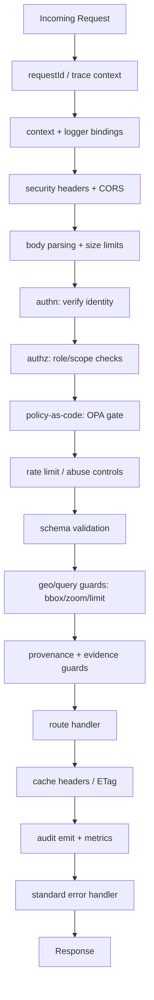

# 🧩 Server Middleware (KFM)


-purple)


> [!IMPORTANT]
> This folder is the **runtime enforcement layer** for Kansas Frontier Matrix (KFM).  
> If it crosses the API boundary (UI ↔ API, pipelines ↔ API, MCP/agents ↔ API), middleware is where we enforce: **security, provenance, evidence, privacy, performance**. ✅

---

## ⚡ Quick links

- 📜 Governance + CI invariants: `../../../.github/README.md`
- 🧑‍⚖️ Policy rules (OPA/Conftest): `../../../tools/validation/policy/README.md`
- 🗺️ Data intake + validation expectations: `../../../docs/` (and project PDFs)
- 🧠 Focus Mode expectations (citations-first): `../../../api/` and project PDFs

---

## 🧾 Policy metadata

| Field | Value |
|---|---|
| File | `src/server/middleware/README.md` |
| Status | ✅ Active |
| Default posture | 🔒 Fail-closed on governance-critical routes |
| Primary responsibilities | 🛡️ Auth • ⚖️ Policy • 🧾 Provenance • 🔍 Audit • 🚀 Performance |
| “Don’t surprise the graph” | ✅ Middleware must produce predictable, replayable outcomes |

---

## 📌 What this folder is

**Middleware** = composable functions that run **before/after** route handlers to enforce cross-cutting concerns consistently.

In KFM, middleware is not “nice to have.” It is how we guarantee:

- 🧭 **Contract-first** APIs (schema/shape/limits)
- 🧾 **Provenance-first** outputs (traceability to sources + transformations)
- 📚 **Evidence-first** narratives + AI responses (citations/links to artifacts)
- 🛡️ **Security + privacy** (least privilege, sensitive location controls)
- 🔍 **Auditability** (append-only logs + correlation IDs)
- 🚀 **Performance** (cache, rate limits, geospatial query guards)

---

## 🧠 KFM middleware philosophy (rules of thumb)

✅ Put it in middleware if it is:

- required for **every** request (or every request in a route group)
- required for **compliance/governance**
- required for **consistent observability**
- required to enforce **limits / safety** (payload size, bbox, zoom level, etc.)

❌ Don’t put it in middleware if it is:

- domain-specific business logic (belongs in the handler/service layer)
- data transformation that should be versioned + replayable in pipelines (belongs in ETL)
- UI-only behavior (belongs in `web/`)

---

## 🧱 Execution order (the stack)

Order matters. Prefer a **single shared stack** plus optional “route packs” (e.g., ingestion pack, tiles pack, AI pack).



> [!TIP]
> “Fail-closed” means: if we can’t decide **allow**, we return **deny** (with a traceable reason).

---

## 📂 Expected folder layout

Your concrete files may differ, but the *capabilities* should map cleanly.

```text
src/
└─ 🌐 server/
   └─ 🧱 middleware/
      ├─ 📄 README.md                 # 📘 Middleware stack overview: ordering, responsibilities, and local/CI testing notes
      ├─ 🧩📄 index.ts                 # Barrel exports + shared stack builder (defines canonical middleware order)
      ├─ 🧷🆔 requestId.ts             # Correlation IDs + traceparent support (propagate to logs/telemetry/downstream calls)
      ├─ 🧠📄 context.ts               # req.kfm typed context population (principal, request id, policy refs, feature flags)
      ├─ 🪵📄 logger.ts                # Structured request logging (PII-safe; redaction-aware; sampling where needed)
      ├─ 🛡️📄 securityHeaders.ts       # Security headers (CSP, HSTS, X-Content-Type-Options, etc.) with safe defaults
      ├─ 🌐📄 cors.ts                  # CORS policy (origins/methods/headers; environment-aware)
      ├─ 📦📄 bodyLimits.ts            # Body size limits + upload controls (JSON/file caps; fail-fast)
      ├─ 🔐📄 authn.ts                 # Authentication (JWT/session/api-key verification; sets Principal in context)
      ├─ 🧑‍⚖️📄 authz.ts               # Authorization glue (RBAC/ABAC checks; role/scope evaluation helpers)
      ├─ ⚖️📄 opaPolicy.ts             # Runtime policy-as-code checks (OPA decisions + obligations application)
      ├─ 🧯📄 rateLimit.ts             # Rate limiting (per-user/per-route throttling; burst/sustained controls)
      ├─ ✅📄 validate.ts              # Request schema validation at the boundary (zod/pydantic; rejects invalid shapes)
      ├─ 🗺️📄 geoGuards.ts             # Geo safety guards (bbox/zoom/maxFeatures limits; prevent heavy queries)
      ├─ 🧾📄 provenance.ts            # Provenance envelope helpers + emit hooks (attach run_id/prov refs where required)
      ├─ 🧬📄 evidenceTriplet.ts       # Evidence triplet checks (STAC/DCAT/PROV presence for governed endpoints)
      ├─ 🫥📄 sensitiveData.ts         # Sensitive data controls (coordinate fuzzing, redaction/obfuscation, label propagation)
      ├─ 🧾📄 audit.ts                 # Append-only audit events (authz denials, sensitive access, admin actions)
      ├─ 🚨📄 errors.ts                # Standardized error mapping (Problem Details envelopes; safe messages; no leaks)
      └─ 📈📄 metrics.ts               # Request metrics (latency, status codes, route tags; audit-safe aggregation)
```

---

## 🧩 Middleware catalog (what each one must guarantee)

### 🔌 Request fundamentals
- **requestId**: generate/propagate `x-request-id` (and/or W3C `traceparent`); attach to logs + audit.
- **context**: attach a **typed** `req.kfm` (or equivalent) that holds identity, roles, requestId, route name, and policy decisions.
- **logger**: structured logs (JSON) that include requestId and route tags; redact sensitive fields.

### 🛡️ Security baseline
- **securityHeaders**: default hardened headers (CSP, HSTS, etc.) with exceptions narrowly scoped.
- **cors**: strict allowlist (environment-driven), least privilege.
- **bodyLimits**: hard size caps, content-type allowlist, safe file handling (no surprises).
- **authn**: verify identity (JWT/session/api key). Must attach `user` to context.
- **authz**: enforce role/scope rules (“viewer”, “contributor”, “admin”, etc.) consistently.

### ⚖️ Policy-as-code (OPA)
- **opaPolicy**: runtime gate that takes `input` (user, route, resource, intent) and returns `allow/deny` + reason.
- Must support **fail-closed** behavior for promotion/ingest/admin actions.

### 🧯 Abuse controls
- **rateLimit**: enforce per-user + per-IP limits; stricter for write endpoints and AI endpoints.
- **geoGuards**: limit expensive queries (bbox size, time windows, max features, max joins, zoom bounds).

### 🧾 Governance & provenance
- **provenance**: ensure write requests carry the minimal provenance envelope (who/what/why) and emit a PROV-friendly event.
- **evidenceTriplet**: for “promoted” outputs, enforce required references to STAC/DCAT/PROV artifacts.
- **audit**: append-only audit events (who did what, when, with what inputs/outputs).

### 🫥 Sensitive data handling
- **sensitiveData**: redact or generalize sensitive locations and cultural/protected data (policy driven, not ad-hoc).

### 🚨 Error + response consistency
- **errors**: normalize all errors to a consistent schema (e.g., Problem Details), include `requestId`, include safe messages.
- **cache headers / ETag**: only for safe endpoints; never cache sensitive responses.

---

## 🔩 Request context contract (TypeScript-friendly pattern)

Middleware should converge on **one** context shape.

```ts
// Example only — align to your framework (Express/Fastify/etc.)
export type KfmRole = "viewer" | "contributor" | "admin" | "service";

export interface KfmRequestContext {
  requestId: string;
  routeId: string;              // stable route name for audit & policy
  startedAt: number;            // epoch ms
  ip?: string;
  userAgent?: string;

  // identity
  user?: {
    id: string;
    roles: KfmRole[];
    orgId?: string;
  };

  // policy decisions (OPA)
  policy?: {
    allow: boolean;
    reason?: string;
    rule?: string;              // optional: which rule was decisive
  };

  // governance hooks
  provenance?: {
    activityId?: string;        // PROV Activity identifier
    agentId?: string;           // PROV Agent identifier
    sourceRefs?: string[];      // dataset/story artifacts referenced
  };
}
```

> [!NOTE]
> Route handlers should treat `req.kfm` as **read-only** after middleware completes.

---

## ⚖️ OPA input/output shape (recommended)

Keep it boring, explicit, and stable.

```json
{
  "input": {
    "request": {
      "id": "01J…", 
      "routeId": "story.submit",
      "method": "POST"
    },
    "actor": {
      "id": "user_123",
      "roles": ["contributor"]
    },
    "resource": {
      "type": "story",
      "id": "draft_456",
      "classification": "public|restricted|sensitive"
    },
    "intent": "create|read|update|delete|promote",
    "environment": {
      "deployment": "local|staging|prod"
    }
  }
}
```

OPA returns:

```json
{
  "allow": false,
  "reason": "Contributor cannot promote without evidence triplet",
  "rule": "kfm.promote.requires_evidence_triplet"
}
```

> [!TIP]
> Keep **authz** (RBAC) fast and local. Use **OPA** when rules become policy/governance level, or when rules evolve frequently.

---

## 🧾 Provenance & audit events (minimum bar)

Every meaningful write should emit a **single** append-only audit event (and optionally a PROV-shaped artifact).

```json
{
  "event": "story.submit",
  "requestId": "01J…",
  "actor": { "id": "user_123", "roles": ["contributor"] },
  "resource": { "type": "story", "id": "draft_456" },
  "timestamp": "2026-01-24T00:00:00Z",
  "result": "deny|allow|error",
  "policy": { "rule": "…", "reason": "…" },
  "hashes": {
    "bodySha256": "…",
    "outputSha256": "…"
  }
}
```

✅ Properties we want:
- deterministic identifiers (so we can replay + diff)
- safe redaction (no secrets, no raw sensitive coordinates)
- easy to ship to a ledger/index

---

## 🧠 Focus Mode / AI middleware (guardrails)

If your server routes expose AI features (Focus Mode / assistants), middleware should enforce:

- 🧯 **Prompt-injection resistance**: treat external content as data, not instructions
- 📚 **Citation gate**: if the response makes factual claims, require evidence links/IDs
- 🫥 **PII + sensitive location redaction**: policy-driven masking
- 🧱 **Rate limiting + cost control**: stronger limits than normal reads
- 🧾 **Audit**: capture model/config version + retrieval set hashes (not raw private docs)

> [!IMPORTANT]
> If we can’t provide evidence, the safe output is: **“I don’t know.”** ✅

---

## 🌍 Geospatial middleware patterns (KFM-specific)

These guardrails keep PostGIS/graph queries safe and predictable:

- **bbox sanity**: max area, max aspect ratio, max zoom span
- **time window sanity**: cap `since/until` ranges for streaming endpoints
- **result limits**: enforce `limit` ceilings, default pagination
- **format negotiation**: safe allowlist (`application/json`, `application/geo+json`, tiles)
- **tile safety**: validate `{z}/{x}/{y}` bounds, cap `z` for expensive layers
- **sensitive layer controls**: fuzzy coordinates (e.g., grid/H3) or suppressed geometry

---

## 🧪 Testing checklist

✅ Add tests when you add middleware:

- Unit tests: allow/deny, bad inputs, redaction behavior
- Integration tests: middleware stack order, error normalization
- Policy tests: OPA rules + expected reasons
- Replay tests (if enabled): same inputs → same outputs

---

## ➕ How to add a new middleware

1. 🧭 Write the **contract** first  
   - inputs it expects  
   - outputs/side effects it guarantees  
   - what it logs (and what it must never log)

2. 🧩 Implement it as a pure(ish) function  
   - avoid hidden global state  
   - prefer dependency injection (logger, opaClient, clock)

3. 🧪 Add tests + a failure-mode test  
   - if dependency is down, does it fail open or fail closed? (document why)

4. 🧷 Register it in the shared stack  
   - export from `index.ts`
   - add to the stack builder in the correct position

5. 📝 Update this README  
   - add it to the catalog + note when it’s required

---

## 🧭 Related reading (repo-local)

- `../../../.github/README.md` — project invariants + governance posture
- `../../../tools/validation/policy/README.md` — policy-as-code gate rules
- `../../../docs/` — documentation set (if/when mirrored from PDFs)
- `../../../api/` — API services (where domain logic lives)
- `../../../web/` — UI (must talk to API only)

---

> [!TIP]
> Keep middleware **boring** and **predictable**.  
> The magic is in the data, the graph, the UI, and Story Nodes — middleware keeps it trustworthy. ✅
