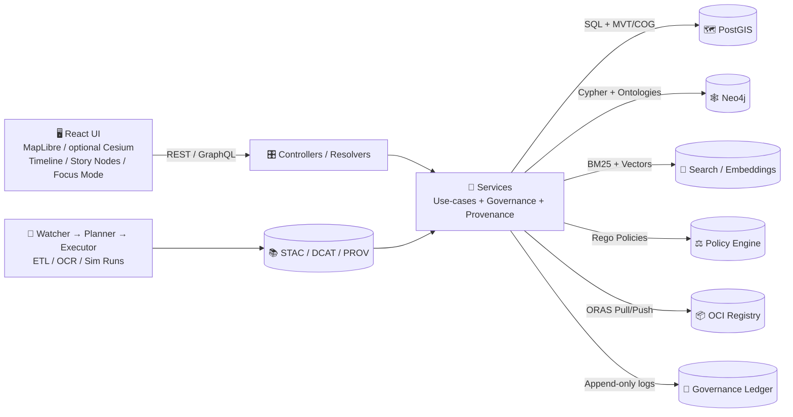

# 🧩 `src/server/services/` — KFM Service Layer


> ✅ **Rule of KFM:** If we can’t trace it back to evidence, we don’t ship it.  
> 🔒 **Fail closed by default:** missing metadata / missing policy decision / missing provenance ⇒ reject or redact.

This folder contains **use-case + business logic** for the Kansas Frontier Matrix (KFM) server.  
Controllers/Resolvers call Services; Services orchestrate the **evidence stack** (STAC/DCAT/PROV), apply **policy-as-code** (OPA), and talk to external systems via **adapters** (PostGIS, Neo4j, search, OCI registries, etc.).

---

## 🧭 Contents

- [Why this folder exists](#-why-this-folder-exists)
- [Service boundaries](#-service-boundaries)
- [KFM architecture at a glance](#-kfm-architecture-at-a-glance)
- [Service catalog](#-service-catalog)
- [Standard service contract](#-standard-service-contract)
- [Evidence-first patterns](#-evidence-first-patterns)
- [Governance & security patterns](#-governance--security-patterns)
- [Adding a new service](#-adding-a-new-service)
- [Testing & QA](#-testing--qa)
- [Observability & audit](#-observability--audit)
- [Appendix: Glossary](#-appendix-glossary)
- [References](#-references)

---

## 🎯 Why this folder exists

KFM is a **map + timeline + story + AI** platform where **every output is auditable**:
- Map layers must point to their catalogs/metadata (STAC/DCAT) and lineage (PROV).
- Focus Mode (AI assistant) must return answers **with citations** or refuse.
- Pipelines (watchers/ETL/simulation) must be deterministic, idempotent, and produce run manifests.

The Service Layer is where we enforce that system-wide promise.

---

## 🚧 Service boundaries

### ✅ Services DO
- Implement **use-cases** (not HTTP wiring).
- Apply **governance** rules (FAIR/CARE, sensitivity classification, RBAC, redaction rules).
- Maintain **provenance chains** (return citations / evidence bundles, log activities).
- Orchestrate **ports/adapters**:
  - 🗺️ spatial queries/tiles (PostGIS)
  - 🕸️ semantic/lineage graph (Neo4j)
  - 🔎 text + vector retrieval (search + embeddings)
  - 📦 artifact distribution (OCI/ORAS + Cosign)
  - 🧾 policies (OPA / conftest rules at CI, and optional runtime checks)

### ❌ Services DO NOT
- Depend on HTTP framework objects (Request/Response) directly.
- Contain raw SQL scattered everywhere (use an adapter/port).
- Return “mystery” results without metadata, citations, or policy decisions.
- Hardcode Kansas-only assumptions when a config-driven approach exists.

> 🧠 Think of services as **“truth-to-glass”**: the last authoritative place before results hit UI/API.

---

## 🧱 KFM architecture at a glance



---

## 🗂️ Service catalog

> This is a **conceptual map** of service responsibilities. Implementation may differ, but the boundaries should stay consistent.

### 🗺️ Map, Layers, and Tiles
- **TileService**
  - Serves MVT/vector tiles, raster tiles, or references to packaged tiles (e.g., PMTiles).
  - Enforces sensitivity rules (e.g., generalize locations if needed).
- **SpatialQueryService**
  - bbox/time filtering, geometry lookups, area/distance computations.

### 📚 Catalog & Discovery
- **CatalogService**
  - STAC Collection/Item queries (spatial + temporal extents)
  - DCAT dataset discovery, facets, licensing and attribution retrieval
- **DatasetAccessService**
  - Resolves “how to get the bytes” (local store, signed URL, or OCI pull by digest)

### 🕸️ Knowledge Graph & Lineage
- **GraphService**
  - Entity lookups (people/places/events/documents), multi-hop graph traversals
  - Ontology-aware querying (e.g., CIDOC-CRM concepts; OWL-Time temporal modeling)
- **ProvenanceService**
  - PROV bundles for datasets, stories, and AI outputs
  - Links run manifests ↔ datasets ↔ graph entities ↔ UI results

### 🧾 Stories & Narratives
- **StoryService**
  - Story Node retrieval and validation (Markdown + JSON/YAML front-matter)
  - Evidence manifests + PROV snippet generation/validation
  - Publishes “governed narrative” outputs

### 🧠 Focus Mode (AI)
- **FocusModeService**
  - RAG pipeline: parse → retrieve → draft → governance check → answer w/ citations
  - Prompt security, tool allowlists, sensitivity checks
  - Logs answers to immutable governance ledger

### ⚡ Pulse Threads (Streaming Insights)
- **PulseService**
  - Produces short “micro-stories” (Pulse Threads) tied to evidence
  - Emits structured evidence manifests
- **GraphIntegrityService**
  - Runs periodic “graph health” checks (orphans, broken provenance, schema drift)

### 📥 Ingestion, Watchers, Simulation
- **IngestionService**
  - Orchestrates deterministic runs, writes run manifests, triggers policy gates
- **WatcherService** (often scheduled/CI-driven)
  - Real-time feeds (e.g., GTFS-RT / sensors), idempotent updates
- **SimulationService** (planned/optional)
  - Runs scenario jobs and publishes `kfm-sim-run` artifacts with full provenance

### ⚖️ Governance, Security & Accounts
- **PolicyService**
  - Central place to evaluate OPA decisions (runtime) and enforce “fail closed”
- **AuthzService**
  - RBAC enforcement (Admin / Maintainer / Contributor / Public)
- **AuditService**
  - Writes audit events (who did what, when, with which evidence)

### 📦 Artifacts & Offline Packs
- **ArtifactService**
  - Pull/push data artifacts using OCI registry semantics (ORAS)
  - Verifies Cosign signatures & attaches/reads SBOM / provenance referrers
- **OfflinePackService**
  - Builds offline data packs for field use (tiles + selected datasets + story nodes)

---

## 📜 Standard service contract

### 🧾 Service context (input)

Every service method should accept a **ServiceContext** so governance and provenance never depend on “hidden globals”.

Typical fields (adapt as needed):

```ts
export type ServiceContext = {
  requestId: string;                 // correlation id
  actor: {
    userId?: string;
    roles: Array<"admin"|"maintainer"|"contributor"|"public">;
  };
  map?: {
    bbox?: [number, number, number, number];
    zoom?: number;
    center?: [number, number];
    activeLayers?: string[];
  };
  time?: {
    start?: string; // ISO
    end?: string;   // ISO
  };
  governance?: {
    // optional extra flags: “show restricted?” “allow AI?” etc.
    allowRestricted?: boolean;
  };
};
```

### 📦 Service result (output)

Services should return a **payload + proof**:

```ts
export type EvidenceRef =
  | { kind: "stac"; id: string; href?: string }
  | { kind: "dcat"; id: string; href?: string }
  | { kind: "prov"; id: string; href?: string }
  | { kind: "graph"; id: string }
  | { kind: "doc"; id: string; locator?: { page?: number; lines?: [number, number] } };

export type PolicyDecision = {
  decisionId: string;
  allow: boolean;
  reason?: string;
  redactions?: string[];
};

export type ServiceResult<T> = {
  data: T;
  evidence: EvidenceRef[];         // citations / references
  policy: PolicyDecision;          // allow/deny + redactions
  meta?: {
    timingsMs?: Record<string, number>;
    cache?: { hit: boolean; key?: string };
    version?: { canonicalDigest?: string; runId?: string };
  };
};
```

> 🔥 **Non-negotiable:** services that power UI-visible outputs (maps, stories, AI) must return evidence references.

---

## 🔗 Evidence-first patterns

### 1) STAC + DCAT + PROV “boundary artifacts”
When data becomes “published,” it must have:
- ✅ STAC (collection/item)
- ✅ DCAT (dataset entry)
- ✅ PROV (lineage bundle)
These become the stable interface between ingestion → graph → API → UI.

### 2) Deterministic “Run Manifest” for every run
A pipeline run (ETL, OCR, simulation, watcher update) should emit a `run_manifest.json` like:

```json
{
  "schema_version": "1.0",
  "run_id": "run_2026-01-24T19:43:12Z_abc123",
  "run_time": "2026-01-24T19:43:12Z",
  "idempotency_key": "sha256:…",
  "canonical_digest": "sha256:…",
  "source_urls": ["https://example.gov/source.csv"],
  "tool_versions": {
    "pipeline": "kfm-intake@1.4.0",
    "python": "3.12.1",
    "gdal": "3.8.0"
  },
  "summary_counts": {
    "records_in": 10234,
    "records_out": 10198,
    "errors": 0
  },
  "outputs": [
    { "kind": "stac", "id": "stac:item:county_yields_2020" },
    { "kind": "dcat", "id": "dcat:dataset:county_yields" },
    { "kind": "prov", "id": "prov:activity:run_2026-01-24T19:43:12Z_abc123" }
  ]
}
```

> 🧷 Tip: Hash the **canonicalized** JSON (RFC 8785) so the same inputs yield the same digest.

### 3) Story Nodes with evidence manifests
Story Nodes are “governed narrative datasets.” Prefer:
- a small citations block for humans
- a machine-readable evidence manifest
- a compact PROV JSON-LD snippet

```yaml
# story front-matter (example)
id: story:arkansas_river_floods_1908
title: "Floods of 1908"
evidence_manifest: evidence/EM-84.yaml
prov_snippet: prov/EM-84.prov.jsonld
```

### 4) Pulse Threads as “micro-stories”
Pulse outputs must be treated as **evidence artifacts**, not “chatty notifications.”

Minimum shape:

```json
{
  "id": "pulse:thread:2026-01-24:transit-delay",
  "title": "Transit Delay Spike (Douglas County)",
  "summary": "Observed increased delays along Route 5 since 18:00.",
  "time_window": { "start": "2026-01-24T18:00:00Z", "end": "2026-01-24T19:00:00Z" },
  "evidence": [
    { "kind": "stac", "id": "stac:item:gtfsrt:obs:…" },
    { "kind": "prov", "id": "prov:activity:watcher_run:…" }
  ],
  "policy": { "decisionId": "opa:…", "allow": true }
}
```

---

## 🛡️ Governance & security patterns

### ⚖️ Policy-as-code (OPA) everywhere it matters
Services should consult a central **PolicyService** to:
- block unlicensed data
- enforce required metadata fields
- redact or generalize sensitive locations
- prevent secrets / PII leakage
- enforce “no output less restricted than inputs”

**Fail closed**: missing policy decision = deny or redact with explanation.

### 🧼 Prompt security for Focus Mode
Focus Mode service must:
- sanitize inputs (prompt injection filtering)
- restrict tools (allowlist only)
- enforce “no internet tools”
- run an output policy check before returning
- refuse if claims can’t be grounded/cited

### 🧬 Supply chain integrity for artifacts
When services generate or serve artifacts (tilesets, packs, models):
- Prefer **OCI registry distribution** (content-addressable digests)
- Verify **Cosign signatures**
- Attach / read **SBOMs** and provenance attestations (SLSA-style)
- Support rollback by pinning digest

### 🧑‍🤝‍🧑 RBAC and contributor workflows
Common roles:
- 👑 **Admin**: manage policies, sensitive layers, system configuration
- 🧰 **Maintainer**: approve merges/releases, manage catalogs
- ✍️ **Contributor**: add data/stories via PR workflows, limited publish rights
- 🌍 **Public**: read-only access (with redactions)

---

## 🧪 Adding a new service

### ✅ Checklist (copy into PR)
- [ ] **Contract first**: OpenAPI / GraphQL schema updated under `src/server/contracts/`
- [ ] DTOs validated (schema-based)
- [ ] Policy checks included (OPA decision + redactions if applicable)
- [ ] Evidence returned (STAC/DCAT/PROV/graph/doc references)
- [ ] Deterministic outputs (stable ordering, stable IDs, canonical digests when relevant)
- [ ] Audit events logged (requestId + actor + evidence)
- [ ] Tests: unit + contract + (if needed) integration
- [ ] Docs updated (this folder + endpoint docs)

### 🧱 Service template

```ts
// services/example/ExampleService.ts
import type { ServiceContext, ServiceResult, EvidenceRef } from "../_shared/types";

export class ExampleService {
  constructor(
    private readonly policy: { evaluate: (ctx: ServiceContext, input: unknown) => Promise<{ allow: boolean; reason?: string; decisionId: string; redactions?: string[] }> },
    private readonly catalog: { getDataset: (id: string) => Promise<{ dcatId: string; stacId: string; provId?: string }> },
    private readonly audit: { log: (evt: unknown) => Promise<void> }
  ) {}

  async getExample(ctx: ServiceContext, datasetId: string): Promise<ServiceResult<{ datasetId: string }>> {
    const decision = await this.policy.evaluate(ctx, { action: "example:get", datasetId });
    if (!decision.allow) {
      // fail-closed: do not leak restricted data
      return {
        data: { datasetId },
        evidence: [],
        policy: decision
      };
    }

    const meta = await this.catalog.getDataset(datasetId);

    const evidence: EvidenceRef[] = [
      { kind: "dcat", id: meta.dcatId },
      { kind: "stac", id: meta.stacId },
      ...(meta.provId ? [{ kind: "prov", id: meta.provId } as const] : [])
    ];

    await this.audit.log({ type: "example:get", requestId: ctx.requestId, actor: ctx.actor, datasetId, evidence, decision });

    return {
      data: { datasetId },
      evidence,
      policy: decision,
      meta: { cache: { hit: false } }
    };
  }
}
```

---

## ✅ Testing & QA

### 🧫 Recommended test layers
- **Unit tests**: mock ports; verify policy + evidence behavior
- **Contract tests**: ensure API contract ⇄ service DTOs stay aligned
- **Golden tests**: deterministic outputs (especially for manifests and citations)
- **Integration tests** (when needed):
  - PostGIS spatial queries / tile generation
  - Neo4j traversal queries
  - Artifact pull/verify workflows

### 🚦 Policy tests
Treat governance policies as first-class tests:
- missing license / provenance → fail
- sensitive data exposure → fail or redact
- secrets scanning → fail

---

## 📡 Observability & audit

Services should emit:
- 🧾 **structured logs** (with `requestId`)
- 🧵 traces/metrics (latency, cache hits, DB timings)
- 🔏 governance ledger entries for:
  - AI outputs (answer + citations + policy decision)
  - dataset publish events (run_id + digests)
  - story publish events (evidence manifest + PROV link)

> 🌱 Sustainability note (optional but encouraged): track compute/energy for heavy tasks (model runs, large reprojections) and expose it as service metadata where useful.

---

## 📎 Appendix: Glossary

<details>
<summary><strong>Click to expand 📚</strong></summary>

- **STAC**: SpatioTemporal Asset Catalog — geospatial item/collection metadata.
- **DCAT**: Data Catalog Vocabulary — dataset discovery metadata (often JSON-LD).
- **PROV**: W3C Provenance — lineage model linking entities, activities, agents.
- **OPA / Rego**: Policy engine + policy language for governance and security rules.
- **ORAS**: OCI Registry As Storage — push/pull arbitrary artifacts to OCI registries.
- **Cosign / Sigstore**: Signing + verification for supply chain integrity.
- **SBOM**: Software Bill of Materials — what’s inside an artifact.
- **SLSA**: supply-chain framework for provenance and build integrity.
- **RAG**: Retrieval-Augmented Generation — LLM answers grounded in retrieved sources.
- **CIDOC-CRM / OWL-Time**: ontologies supporting historical and temporal semantics.
- **PMTiles / COG / GeoParquet**: common geospatial distribution formats.

</details>

---

## 📚 References

These documents informed the rules and responsibilities of the Service Layer:

- 📘 **KFM – Comprehensive Technical Documentation**
- 🧭🤖 **KFM – AI System Overview (Focus Mode, governance, RAG)**
- 🖥️ **KFM – Comprehensive UI System Overview (UI↔API separation, story nodes, offline packs)**
- 📥 **KFM – Data Intake Technical & Design Guide (run manifests, policy gates, pipelines)**
- 🌟 **KFM – Latest Ideas & Future Proposals (RBAC, supply chain, GTFS-RT watcher ideas)**
- 🧠 **Innovative Concepts to Evolve KFM (AR, digital twin, cultural protocols, ethics)**
- 💡 **Additional Project Ideas (Pulse Threads, evidence manifests, OCI artifacts, graph health checks)**
- 🧱 **KFM – Comprehensive Architecture, Features, and Design**
- 📦 **Reference Portfolios**
  - AI Concepts & more (AI/ML reference library)
  - Maps / WebGL / GIS (geospatial + visualization reference library)
  - Data Management / Bayesian / Security / Clean Architecture (systems + data engineering reference library)
  - Various programming languages & resources (general engineering reference library)
