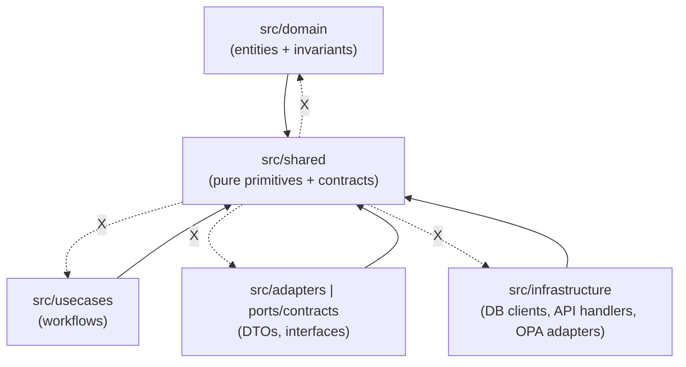

<!--
File: src/shared/README.md
Status: Governed internal artifact (see "Governance & Change Control")
-->

# `src/shared`


Cross-cutting **primitives, contracts, and utilities** that are shared across multiple parts of the system.

> [!IMPORTANT]
> **Dependency rule (non‑negotiable):** `src/shared` is a *dependency sink*.
>
> ✅ Everything may **depend on** `src/shared`  
> ❌ `src/shared` must **not depend on** any other KFM internal layer/package (Domain / Use Cases / Adapters / Infrastructure)  
>
> This keeps the architecture testable, prevents cycles, and avoids “shared” becoming a hidden backdoor around governance and policy boundaries.

---

## Table of contents

- [What belongs in `src/shared`](#what-belongs-in-srcshared)
- [What must NOT go in `src/shared`](#what-must-not-go-in-srcshared)
- [Architecture contract](#architecture-contract)
  - [Trust membrane invariants](#trust-membrane-invariants)
  - [Clean-layer import rules](#clean-layer-import-rules)
- [Recommended directory layout](#recommended-directory-layout)
- [Public API and import style](#public-api-and-import-style)
- [Key shared building blocks](#key-shared-building-blocks)
  - [Errors and result types](#errors-and-result-types)
  - [Evidence and citation references](#evidence-and-citation-references)
  - [Audit references](#audit-references)
  - [Time and geometry basics](#time-and-geometry-basics)
  - [Policy input/output primitives](#policy-inputoutput-primitives)
- [How to add something to `src/shared`](#how-to-add-something-to-srcshared)
- [Testing and CI expectations](#testing-and-ci-expectations)
- [Security, privacy, and sensitivity](#security-privacy-and-sensitivity)
- [Versioning and compatibility](#versioning-and-compatibility)
- [Governance & change control](#governance--change-control)
- [Appendix](#appendix)
  - [Smell tests](#smell-tests)
  - [Glossary](#glossary)

---

## What belongs in `src/shared`

`src/shared` is for **foundation-level** code that:

1. Is used by **2+ layers/modules** and would otherwise be duplicated,
2. Can be implemented as **pure / deterministic** logic (or near-pure) with minimal side effects,
3. Must remain **stable** because many layers will transitively depend on it,
4. Helps keep KFM’s governance invariants “designed in” rather than bolted on later.

### Typical categories

| Category | Examples | Why “shared”? | Must be… |
|---|---|---|---|
| **Primitives & value types** | `AuditRef`, `CitationRef`, `DatasetId` (as strings), `TimeRange`, `BBox` | Used across API, policy, UI contracts | Small, immutable |
| **Error taxonomy** | error codes, typed exceptions, failure envelopes | Every layer needs consistent failures | Deterministic, documented |
| **Result / response envelope** | `Result<T>`, `Ok/Err`, response metadata | Avoid ad-hoc error handling | No I/O |
| **Evidence utilities** | citation parsing, ref normalization, resolver helpers | Evidence-first behavior needs consistency | Pure string/struct transforms |
| **Policy primitives** | policy input DTO primitives, redaction helpers | Policy must be enforceable everywhere | Fail-closed defaults |
| **Time/geo normalization helpers** | ISO 8601 parsing, bbox normalization, precision rules | Used in data queries + UI context | Safe, tested |
| **Schema helpers** | JSON schema helpers, “contract-first” validators | Contracts must be easy to enforce | No network |

> [!NOTE]
> Domain-specific concepts (e.g., *StoryNode*, *DatasetVersion*, *LayerDefinition*) usually belong in `src/domain` (entities/value objects) or in an Integration/Contracts module. Keep `shared` focused on *foundations* and *cross-cutting* contracts.

---

## What must NOT go in `src/shared`

> [!CAUTION]
> If any of the following creeps into `src/shared`, it becomes a hidden “god module” and breaks clean architecture.

### Disallowed content

- **Database access** (PostGIS clients, SQL builders tied to a specific DB, migrations)
- **Network calls / HTTP clients** (including “quick fetch” utilities)
- **OPA client adapters** that talk to the policy engine over HTTP (belongs in Infrastructure)
- **Framework-specific runtime code** (FastAPI route handlers, GraphQL resolvers, React components)
- **Secrets/config loading** from environment or vault
- **Feature-specific business logic** (belongs in Domain/Use Cases)
- **Anything that forces heavy dependencies** on all consumers

---

## Architecture contract

### Trust membrane invariants

KFM is governed by a “trust membrane” where policy enforcement happens for every request and the frontend never directly touches databases. This directory must **support** that model—not bypass it.

`src/shared` must not introduce shortcuts that allow:

- UI → DB access paths,
- bypassing policy checks,
- bypassing repository interfaces/ports,
- generating user-facing answers without traceable evidence metadata.

### Clean-layer import rules

This repo follows a clean architecture shape under `src/` (Domain / Use Cases / Integration / Infrastructure). `src/shared` is designed to be imported by any layer without creating cycles.



> [!TIP]
> If you ever feel tempted to import “up” from `shared` into a layer: **don’t**. Move the needed code down into `shared`, or move the consumer code up into the appropriate layer.

---

## Recommended directory layout

This is a **recommended** layout for clarity and discoverability. Create folders as needed.

```text
src/shared/                                   # Cross-cutting shared code (pure, reusable, no service wiring)
├─ README.md                                  # What belongs here, layering rules, and “no side effects” expectations
│
├─ errors/                                    # Error codes + typed failures + exception helpers (portable)
├─ result/                                    # Result<T> / Ok-Err patterns + standard response envelopes
├─ ids/                                       # Stable ID types + parsing/validation (slugs, ULIDs/UUIDs, canonical forms)
├─ time/                                      # ISO-8601 helpers, time-range utilities, timezone-safe parsing
├─ geo/                                       # Bounding box + geometry precision helpers (NO GIS DB code here)
├─ evidence/                                  # Citation refs + Evidence bundle primitives + resolver-friendly helpers
├─ policy/                                    # Policy input primitives + redaction helpers (pure logic; no OPA runtime)
├─ schema/                                    # Schema helpers (jsonschema validation, model utilities, normalizers)
├─ logging/                                   # Logging interfaces + thin helpers (NO runtime logger initialization)
└─ testing/                                   # Shared test utilities (pure + deterministic; no network/files unless injected)
```

---

## Public API and import style

### Goal
Make it easy to use shared utilities **without** deep-importing random internals that later become breaking changes.

### Rules
- Prefer importing from a stable root (barrel) module.
- Treat internal modules as private unless explicitly documented.

<details>
<summary><strong>Python-style export pattern (recommended)</strong></summary>

- Re-export stable names from `src/shared/__init__.py`
- Keep submodules focused and small

```python
# src/shared/__init__.py
from .errors.codes import ErrorCode
from .result.types import Result, Ok, Err
from .evidence.types import Citation, CitationRef
from .audit.types import AuditRef
```

Then consume as:

```python
from shared import Result, Ok, Err, CitationRef
```

</details>

<details>
<summary><strong>TypeScript-style export pattern (if applicable)</strong></summary>

- Re-export stable names from `src/shared/index.ts`

```ts
// src/shared/index.ts
export * from "./result";
export * from "./errors";
export * from "./evidence";
```

Then consume as:

```ts
import { Result, CitationRef } from "@/shared";
```

</details>

---

## Key shared building blocks

This section defines the **canonical** shapes we want reused everywhere, so audits, evidence, policy, and contracts stay consistent.

> [!NOTE]
> Exact filenames and language constructs may differ; the important thing is: **shape consistency + one source of truth**.

### Errors and result types

**Why:** Shared error handling reduces brittle “stringly-typed” failures and keeps API responses/policy inputs consistent.

Minimum expectations:
- Error codes are enumerated and documented.
- Failures are serializable (for API responses and audit logs).
- No stack traces leaked by default in user-facing surfaces.

Example (shape, not implementation):

```text
Result<T> =
  | Ok { value: T, meta?: { warnings?: string[] } }
  | Err { code: ErrorCode, message: string, details?: object, retryable?: boolean }
```

### Evidence and citation references

KFM is evidence-first: user-facing narratives and Q&A must be grounded.

**Canonical concept:** a `Citation` points to evidence using a `ref` string that can be resolved by the system.

```text
Citation = {
  ref: CitationRef,              # e.g., "prov://…", "stac://…", "doc://…"
  label?: string,                # short human label
  locator?: { page?: number, span?: [number, number], bbox?: [..] },
  snippet?: string               # small excerpt (optional, policy-limited)
}
```

**CitationRef conventions (recommended):**
- `prov://…` provenance bundle references
- `stac://…` STAC items/collections
- `dcat://…` dataset/catalog references
- `doc://…` documentation/story excerpts
- `graph://…` knowledge graph entity/edge references

> [!IMPORTANT]
> A reference format is only “real” if the API can resolve it. Do not mint `ref` strings that the resolver cannot interpret.

### Audit references

Audit refs are returned alongside responses and are used to retrieve “what happened” details later.

```text
AuditRef = string  # opaque, stable identifier returned to callers
```

Suggested attributes (not necessarily in the `AuditRef` itself):
- timestamp
- actor role
- request endpoint + normalized inputs
- decision (allow/deny)
- citations emitted (or abstention)

### Time and geometry basics

To keep cross-layer behavior consistent, shared provides **small** geo/time primitives (no DB dependencies).

Recommended shared primitives:
- `TimeRange = [start_iso, end_iso]` (ISO 8601)
- `BBox = [minLon, minLat, maxLon, maxLat]` (WGS84)

Normalization helpers should:
- validate ordering (`start <= end`)
- clamp/validate bbox ranges
- handle empty/optional ranges safely

### Policy input/output primitives

KFM is policy-driven. Shared types should make policy enforcement easy and consistent (including “default deny” behavior when inputs are missing).

Recommended minimal shapes:

```text
PolicyActor = { role: "public" | "reviewer" | "admin", attributes?: object }

PolicyRequest = {
  endpoint: string,
  context?: {
    time_range?: TimeRange,
    bbox?: BBox,
    active_layers?: string[],
    story_node_id?: string
  }
}

PolicyAnswer = {
  has_citations: boolean,
  citations?: Citation[],
  sensitivity_ok: boolean
}
```

---

## How to add something to `src/shared`

### Step-by-step checklist

- [ ] **Confirm it’s truly shared** (used by ≥ 2 places/layers)
- [ ] **Confirm it’s foundation-level** (not feature/business logic)
- [ ] **Keep it dependency-light** (no heavy frameworks)
- [ ] **Add tests** (fast unit tests; deterministic)
- [ ] **Document it** (update this README and any relevant contracts)
- [ ] **Export it** via the stable shared API (barrel / `__init__`)
- [ ] **Run architecture checks** (no cycles, no forbidden imports)

### PR “Definition of Done” for shared changes

- [ ] No new internal layer dependency introduced
- [ ] Public API changes are **explicitly** called out in PR description
- [ ] Backward compatibility considered (or justified if breaking)
- [ ] Tests added/updated
- [ ] Security/sensitivity reviewed if touching evidence, redaction, or identifiers

---

## Testing and CI expectations

Shared code is supposed to be easy to test.

**Minimum expectations**
- Fast unit tests only (no DB/network)
- Deterministic behavior
- Clear input validation

**Recommended test categories**
- Pure unit tests for utilities
- Schema/contract tests for serialization compatibility (if shared defines API-facing types)
- Property-based tests for edge cases (time ranges, bbox normalization, ID parsing)

> [!TIP]
> If a test requires spinning up containers or calling services, it’s not a shared-layer test.

---

## Security, privacy, and sensitivity

Shared code often becomes “everywhere code,” so security mistakes propagate widely.

### Rules of thumb

- Do not log secrets, raw tokens, or sensitive geometry at high precision
- Prefer allowlisted parsing and strict validation
- Use safe serialization (avoid `eval`, unsafe YAML loaders, etc.)
- Ensure redaction utilities default to **fail-closed** behaviors

### Sensitive location handling (conceptual)

When you must support restricted/precise vs public/generalized representations:
- model sensitivity labels explicitly,
- keep precision rules centralized,
- ensure evidence/provenance can represent the transformation (e.g., “generalized for public release”).

---

## Versioning and compatibility

Even inside a monorepo, `src/shared` behaves like a “mini‑platform.”

Guidelines:
- Treat exported symbols as **public API**
- Breaking changes should be rare and intentional
- Prefer additive changes
- If you must break, coordinate across consumers and update contract tests

---

## Governance & change control

This README and the `src/shared` contract are governed artifacts.

**Expectations**
- Changes require review like production code
- Changes that affect evidence/policy/audit primitives should trigger extra scrutiny
- Keep docs and schemas in sync; avoid “implementation drift”

> [!NOTE]
> If your change touches evidence references, policy inputs, audit refs, or redaction rules, treat it as **high governance impact**.

---

## Appendix

### Smell tests

If **any** of these are true, reconsider putting code in `src/shared`:

- “It’s only used in one module but might be useful later”
- “It needs an HTTP call to work”
- “It needs database credentials”
- “It imports infrastructure adapters”
- “It’s convenient to put it here” (this is the #1 smell)

### Glossary

- **Shared (this folder):** foundational, low-dependency code reused across layers.
- **Domain:** business concepts + invariants.
- **Use Cases:** workflows that orchestrate domain operations via ports.
- **Adapters/Integration:** ports, DTOs, contract boundaries.
- **Infrastructure:** concrete DB clients, API handlers, policy engine adapters.
- **Trust membrane:** the governed boundary where policy decisions are enforced.

---

