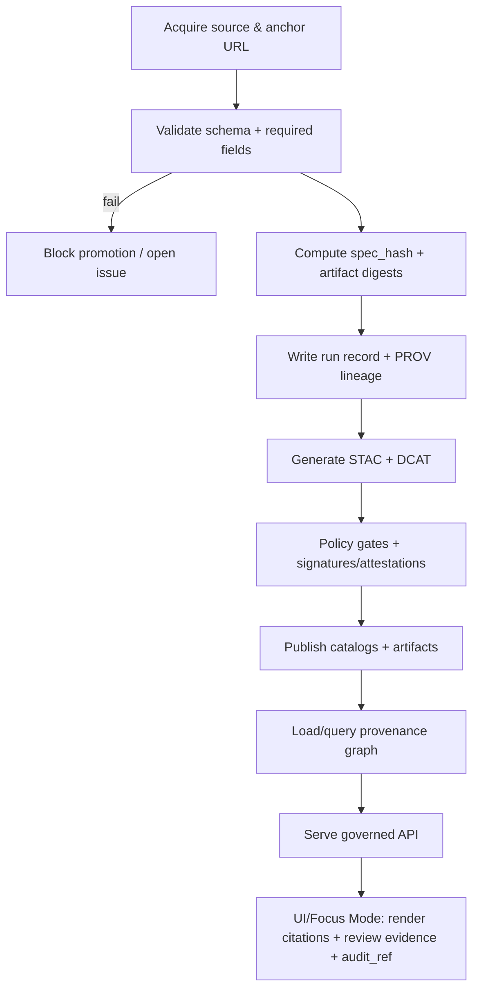

# KFM Provenance (Shared)


> [!IMPORTANT]
> This folder is part of KFM’s **trust membrane**: it defines shared, policy-facing primitives for **evidence**, **citations**, **provenance**, and **audit references**.
>
> **This package MUST remain side-effect free** (no DB drivers, no file I/O, no network calls).
> It exists so *both* UI and server can speak the same contracts without bypassing governance.

---

## Why this exists

KFM is a provenance-first, evidence-first system. That means:

- Datasets are not publishable unless they have validated **STAC/DCAT/PROV** catalogs plus **checksums** and run history (promotion gates).
- Focus Mode answers must **cite or abstain**, and every answer must include an **audit_ref**.
- Every evidence reference must be resolvable to a human-readable view (“review evidence”) and machine-readable artifacts.

This directory is where we standardize the shared vocabulary and helper utilities required to make the above **enforceable** (CI + policy + runtime), not just aspirational.

---

## Non‑negotiable invariants (contract, not “guidelines”)

> [!CAUTION]
> If a change here weakens any invariant below, it is a governance regression and must be blocked by CI.

1. **Trust membrane is unbypassable**
   - UI/external clients never access databases directly.
   - All access is through governed APIs and policy checks.

2. **Fail‑closed by default**
   - If policy evaluation fails, is missing, or cannot run: **deny**.
   - If evidence is missing/insufficient: **abstain** (never “best guess”).

3. **Promotion requires evidence artifacts**
   - Promotion to processed/public is blocked unless:
     - license present
     - sensitivity classification present
     - schema/geospatial checks pass
     - checksums computed
     - STAC/DCAT/PROV exist **and validate**
     - audit event recorded
     - human approval if sensitive

4. **Evidence must be resolvable**
   - Any `citation.ref` must resolve to a human-readable evidence view in ≤2 API calls.
   - Evidence references use stable schemes (see **EvidenceRef**).

---

## Where this fits in the repo (expected layout)

> [!NOTE]
> The repo’s documentation map and schema directories commonly place contracts under `schemas/` (including `schemas/stac`, `schemas/dcat`, `schemas/prov`). Keep provenance contracts aligned with that structure.

```text
schemas/
  stac/        # STAC profile + JSON Schema validators
  dcat/        # DCAT profile + JSON Schema / SHACL (as used)
  prov/        # PROV(-JSON/JSON-LD) profiles and constraints
  ui/          # UI-facing contracts (e.g., EvidenceResolver responses)
src/
  shared/
    provenance/
      README.md         # you are here
      (not confirmed in repo) index.ts
      (not confirmed in repo) types.ts
      (not confirmed in repo) refs.ts
      (not confirmed in repo) specHash.ts
      (not confirmed in repo) validators.ts
      (not confirmed in repo) __tests__/
```

---

## Core artifacts and how they relate



---

## Shared contracts

### EvidenceRef (the universal pointer)

Evidence references MUST be stable, parseable, and resolvable by an API endpoint.

**Supported schemes (minimum):**

| Scheme | Meaning | Resolves to |
|---|---|---|
| `prov://…` | Provenance record / chain | PROV bundle / run lineage |
| `stac://…` | STAC Item/Collection | STAC JSON + derived UI view |
| `dcat://…` | DCAT Dataset/Distribution | DCAT JSON/JSON‑LD + landing view |
| `doc://…` | Document evidence | doc/page/span + snippet view |
| `graph://…` | Graph node/edge | graph entity view + neighbors |
| `audit://…` *(recommended)* | Audit ledger entry | audit event + linked evidence pack |
| `bundle://sha256:<digest>` *(recommended)* | Evidence bundle | OCI/object-store bundle view |

> [!IMPORTANT]
> EvidenceRef is **not** a storage URL.
> Storage URLs (S3, file paths) are implementation details; EvidenceRefs are **governed references**.

#### Minimal TypeScript shape (recommended)

<details>
<summary><strong>Proposed TS interfaces (not confirmed in repo)</strong></summary>

```ts
export type EvidenceScheme = "prov" | "stac" | "dcat" | "doc" | "graph" | "audit" | "bundle";

export type EvidenceRef = {
  /** e.g., "prov://dataset/example/run_2026-02-12T..." */
  ref: string;
  scheme: EvidenceScheme;
  /** stable identifier portion, parsed from ref */
  id: string;
  /** optional human label (UI convenience) */
  label?: string;
};
```
</details>

---

### Citation

Citations are *UI-renderable* objects that always link back to resolvable evidence.

<details>
<summary><strong>Proposed Citation shape (not confirmed in repo)</strong></summary>

```ts
export type Citation = {
  ref: string;                 // EvidenceRef string (prov://, stac://, …)
  kind: "prov"|"stac"|"dcat"|"doc"|"graph";
  title?: string;
  locator?: {
    page?: number;            // docs
    span?: [number, number];  // char offsets
    bbox?: [number, number, number, number]; // geo evidence
    time?: [string, string];  // temporal evidence
  };
  snippet?: string;           // short excerpt for UI (never long)
};
```
</details>

---

### AuditRef

Audit references let us trace any user-visible output back to a tamper-evident audit event.

<details>
<summary><strong>Recommended AuditRef (not confirmed in repo)</strong></summary>

```ts
export type AuditRef = {
  audit_ref: string;     // "audit_..." (opaque stable id)
  /** Optional: evidence pack root pointer for review */
  evidence_pack_ref?: string; // bundle://sha256:...
};
```
</details>

---

## Audit ledger

KFM’s audit ledger is the system-of-record for “who did what, when, under what policy, producing what output”.

### Design constraints

- **Append-only** (no UPDATE/DELETE on existing rows; corrections become new rows)
- **Tamper-evident checkpointing**
  - periodic checkpoints to object storage
  - checkpoints include checksums / hash chain
- **Interoperable identifiers**
  - link audit objects to PROV identifiers (or vice versa)

### Recommended fields

| Field | Why it matters |
|---|---|
| `audit_ref` | stable handle returned to users (Focus Mode, exports) |
| `at` | event time |
| `actor` | role + stable subject id (no PII unless required and permitted) |
| `action` | e.g., `focus.query`, `dataset.promote`, `layer.view` |
| `policy_bundle_version` | which policy pack evaluated |
| `decision` | allow/deny/abstain + reasons |
| `inputs[]` | EvidenceRefs for inputs used |
| `outputs[]` | EvidenceRefs for outputs produced |
| `sensitivity` | classification and any redaction/generalization applied |
| `integrity` | checkpoint hash / signature references (if used) |

> [!TIP]
> If your platform supports signing and attestations, consider signing checkpoints (or bundles) so audit trails can be independently verified.

---

## Pipeline run records and promotion gates

### Run records

Every pipeline job should emit:

- a **run record** (JSON receipt / manifest)
- a **validation report**

Promotion is blocked unless both exist and are complete.

#### Minimal run record keys (recommended)

- `run_id`
- `dataset_id`
- `inputs[]` (uri + sha256)
- `code` (git SHA + image/tag)
- `outputs[]` (uri + sha256)
- `validation_report` (ref/path)
- `prov_ref` (prov://… pointer)

### Promotion gate checklist (minimum)

To promote to processed/public:

- ✅ license present
- ✅ sensitivity classification present
- ✅ schema and geospatial checks pass
- ✅ checksums computed
- ✅ STAC/DCAT/PROV exist and validate
- ✅ audit event recorded
- ✅ human approval if sensitive

---

## Deterministic identity: `spec_hash`

### What is `spec_hash`?

`spec_hash` is a deterministic fingerprint of a schema-defined “spec” object, used to make:

- ingestion specs comparable across time and tools
- watcher/ETag workflows reproducible
- policy gating decisions stable and reviewable

### Normative definition (recommended)

- `spec_hash = sha256(JCS(spec))`
- `spec` MUST be a schema-defined object
- include `spec_schema_id` and `spec_recipe_version` alongside the hash

> [!IMPORTANT]
> **Canonicalization is the difference between “hashing” and “trustworthy hashing.”**
> Use RFC 8785 JSON Canonicalization Scheme (JCS) semantics for JSON inputs.

---

## Addressing and “where is the data?”

KFM patterns highlight a common failure mode: mixing storage paths and content-addresses without a resolver makes assets ambiguous.

### Recommended addressing hierarchy

1. **Content address** for evidence bundles (e.g., digest / OCI)
2. **Stable gateway URL** derived from digest (governed)
3. Storage URL (S3 path, filesystem path) as an implementation detail

### Resolver expectation

A resolver endpoint should exist for bundles, e.g.:

- `GET /bundles/{digest}` → returns metadata + download URLs + attached evidence (receipts, SBOMs, signatures)

This module should provide the types and parsing utilities needed to represent digests and bundle refs consistently (even if the runtime implementation lives elsewhere).

---

## Evidence UX requirements

### “Review evidence” is not optional

UI must support a review flow for:

- map layers/features (provenance for hovered/selected features where available)
- Focus Mode answers (footnotes + audit panel)

### Export behavior

Exports (screenshots, story exports) should embed citation lists so evidence context travels outside the live UI.

---

## Policy-as-code integration

### Default deny (illustrative)

Policy evaluation should be deny-by-default. For Focus Mode, allow only if:

- citations exist
- sensitivity is OK for the requesting actor

> [!NOTE]
> The exact policy bundle structure lives in the policy pack (OPA/Rego). This module provides **shared input/output types** used by policy tests and contract tests.

### CI gates that depend on this module

Minimum hardening gates (recommended):

- Validate governed Markdown + Story Nodes
- Validate STAC/DCAT/PROV for new/changed datasets
- Run OPA policy tests (default deny, cite-or-abstain)

---

## Sensitivity + FAIR/CARE hooks

KFM governance requires sensitivity classification and policy tags to be:

- controlled vocabulary (not free-text drift)
- enforced by policy
- reflected in UI behavior (e.g., generalized vs precise geometry, restricted access)

### Sensitive record handling (minimum expectations)

- Caller claims model (roles/scopes)
- Audit logging for sensitive access decisions
- Tests for “UI never fetches precise geometry without grant”

---

## Immutability and signing (optional but strongly recommended)

For higher assurance:

- Store provenance/audit logs in **append-only** stores
- Hash checkpoints regularly (tamper-evident)
- Consider signing provenance bundles (or the provenance graph) so downstream consumers can verify integrity

If provenance records must be updated, record revisions as new bundles/records and connect them via revision semantics (e.g., prov-style revision links).

---

## Testing and acceptance criteria

### Acceptance criteria (minimum)

- [ ] Given any `citation.ref` in a FocusAnswer, the UI can resolve it to a human-readable evidence view in ≤2 API calls.
- [ ] EvidenceRef parsing rejects unknown schemes unless explicitly allowed.
- [ ] Policy inputs/outputs validate against shared schemas (contract tests).
- [ ] Promotion gates fail closed if any required artifact is missing.

### Suggested test matrix

| Test type | Examples |
|---|---|
| Unit | parse/format EvidenceRef; JCS canonicalization determinism; spec_hash fixtures |
| Contract | FocusAnswer schema; EvidenceResolver response shape; policy input schema |
| Integration | evidence resolver resolves prov/stac/dcat/doc/graph refs end-to-end |
| Regression | deny-by-default behavior when policy missing; abstain when evidence missing |

---

## Change management (governed)

> [!CAUTION]
> Changes to shared provenance types can silently break governance. Treat them like API changes.

- Follow semver for this package (recommended).
- If a change impacts API payloads or policy inputs, run contract tests and version accordingly.
- Keep `/api/v1` compatibility: no breaking changes without explicit version bump and migration path.

---

## Glossary (selected)

- **Evidence**: any verifiable artifact used to support a claim (doc span, dataset record, STAC item, PROV chain).
- **Citation**: a UI-friendly pointer to evidence with enough locator info to review it.
- **Provenance**: transformation lineage describing entities, activities, agents (PROV model).
- **Audit ledger**: append-only record of governed decisions and outputs, referenced via `audit_ref`.
- **spec_hash**: deterministic hash of a canonicalized spec object used to identify and compare ingestion recipes.

---

## Quick “do not do this” list

- ❌ Don’t embed storage URLs (S3 paths) as canonical citations.
- ❌ Don’t allow “best guess” answers without citations.
- ❌ Don’t add DB/network side effects into `src/shared/provenance`.
- ❌ Don’t treat provenance as “nice to have”—promotion and publication depend on it.

---

## References (repo-local)

- KFM Next-Gen Blueprint & Primary Guide (v1.x internal draft)
- KFM Comprehensive Data Source Integration Blueprint
- “New Ideas Feb-2026” integration playbooks (promotion contract, acceptance harness)
- Standards profiles & schemas:
  - `schemas/stac/`
  - `schemas/dcat/`
  - `schemas/prov/`

