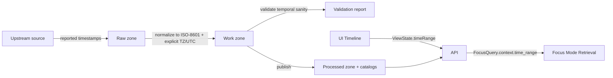

<!--
File: src/shared/time/README.md

KFM Governed Module Doc (engineering-facing)
Purpose: Shared time semantics + utilities used across pipeline, API, and UI.

NOTE: Any module-level claims about exports/file names are marked when not confirmed in repo.
-->

# KFM Shared Time (`src/shared/time`) ⏱️

> [!IMPORTANT]
> KFM’s canonical **time model** is:  
> **(1)** use **ISO-8601 timestamps** with **explicit time zones (or UTC)**, and  
> **(2)** represent uncertain time as **`[start, end]` intervals**, while **preserving “reported” vs “derived” timestamps** (and, for historical sources, keeping *publication time* and *event date claims* separately with provenance handled by higher layers).

---

## What this module is

`src/shared/time` is the **single source of truth** for:

- **Types** and **contracts** for timestamps and time ranges used across KFM
- **Normalization** utilities that turn messy inputs into canonical ISO-8601 forms
- **Validation** utilities used by:
  - ingestion pipelines (“timestamp sanity”)
  - CI validators (“time_range present, parseable, consistent”)
  - API adapters (ensuring request/response contracts are satisfied)
- **Range operations** needed for timeline filtering and query shaping (intersections, contains, etc.)
- **Deterministic time helpers** (e.g., `Clock` injection) to keep hashing, audit trails, and tests stable

### What this module is not

- ❌ Not a UI component (no date pickers / timeline controls)
- ❌ Not a persistence layer (no DB calls)
- ❌ Not a provenance store (PROV/DCAT/STAC linking happens in higher layers)
- ❌ Not a policy engine (OPA/policy decides what to redact; this module can offer *mechanics* like truncation)

---

## Directory layout

> [!NOTE]
> If the exact file names differ in the repo, keep the **conceptual split** (types vs parsing vs ranges vs clock), and ensure `index.ts` re-exports the public API. *(Some specifics below are not confirmed in repo.)*

```text
src/shared/time/
├── README.md                 # this document
├── index.ts                  # module public exports (recommended) (not confirmed in repo)
├── types.ts                  # IsoDateTime, TimeRange, roles/kinds (recommended) (not confirmed in repo)
├── iso8601.ts                # parsing + normalization helpers (recommended) (not confirmed in repo)
├── range.ts                  # TimeRange validation + operations (recommended) (not confirmed in repo)
├── clock.ts                  # Clock interface + SystemClock (recommended) (not confirmed in repo)
└── __tests__/                # deterministic tests (recommended) (not confirmed in repo)
    ├── iso8601.test.ts
    ├── range.test.ts
    └── clock.test.ts
```

---

## Why KFM needs a shared time module

KFM threads **time** through every layer:

- **Ingestion** normalizes time to **ISO 8601** and validates temporal sanity.
- **Canonical data model** includes:
  - `DatasetVersion.time_range` (coverage),
  - `Event.time_range` (bounded occurrence),
  - `Place.valid_from/to` (time-valid geometries),
  - `Observation.time` (measurement time).
- **UI ViewState** contains a `[start, end]` time range used by the timeline and passed to Focus Mode.
- **Focus Mode API** accepts `context.time_range` as exactly **two `date-time` strings**.

So: if each layer handles time differently, you get subtle bugs (timezone drift, inconsistent filtering, “future” timestamps sneaking into historical datasets, etc.). This module prevents that.

---

## Canonical definitions

### 1) Timestamp strings

**Canonical form:** ISO-8601 **date-time** string with an explicit offset or `Z`.

Examples (canonical):
- `2026-02-12T18:30:00Z`
- `2026-02-12T12:30:00-06:00`

Non-canonical (do not emit):
- `2026-02-12 12:30:00` (no zone, not ISO 8601)
- `02/12/2026` (ambiguous locale format)

### 2) Time ranges

**Canonical representation:** a 2-tuple/array `[start, end]` where both values are timestamp strings.

- UI: `ViewState.timeRange: [string, string]`
- API (Focus Mode): `FocusQuery.context.time_range: [date-time, date-time]`
- Story Nodes: `time_range: [string, string]` (schema is looser; still normalize to match API/UI expectations)

> [!WARNING]
> The docs specify “`[start, end]` intervals” but do not explicitly define **closed** vs **half-open** semantics.  
> This module must expose helpers that make that choice explicit (see **Open Decisions**).

---

## Time semantics in KFM

KFM repeatedly distinguishes **different “roles” of time** and expects systems to store them separately when available:

| Time role | Example field(s) | Why it matters |
|---|---|---|
| **Event time** | `Event.time_range`, `Observation.eventDate` | “When did it happen?” |
| **Observation time** | `Observation.time`, `observedAt` | “When was it measured/recorded?” |
| **Publication time** | `Artifact.publication_date` | “When was this document published?” |
| **Event date claim** | `Artifact.event_date_claim` | “What date does the source claim?” (can differ from publication) |
| **Validity time** | `Place.valid_from`, `Place.valid_to` | Boundaries/geometries change over time |
| **Audit / transaction time** | `AuditRecord.timestamp`, pipeline run start/end | Needed for governance and reproducibility |

> [!IMPORTANT]
> KFM integration guidance explicitly expects:
> - keeping **reported** timestamps vs **derived/normalized** timestamps,
> - and storing **publication date** vs **event date claims** separately for historical/fuzzy sources.

This module provides the mechanics for representing/validating these values; provenance linkages live outside this package.

---

## Data flow (where time is transformed)



---

## Public API (recommended)

> [!NOTE]
> The exact exports may differ. The **minimum** is: types, ISO normalization, range validation, range ops.  
> Anything beyond that should be added only if it stays deterministic and environment-safe. *(Some items below are not confirmed in repo.)*

### Types

```ts
/**
 * ISO-8601 date-time string with explicit timezone offset or Z.
 * Examples: 2026-02-12T18:30:00Z, 2026-02-12T12:30:00-06:00
 */
export type IsoDateTime = string;

/**
 * Optional: reduced precision ISO date string (YYYY-MM-DD) for fuzzy/historical inputs.
 * NOTE: Do not send IsoDate where the API requires format: date-time.
 */
export type IsoDate = string;

/** Canonical interval representation. */
export type TimeRange = readonly [IsoDateTime, IsoDateTime];

export type TimeKind = "reported" | "derived";

export type TimeRole =
  | "event_time"
  | "observed_at"
  | "publication_time"
  | "event_date_claim"
  | "valid_from"
  | "valid_to"
  | "audit_time";

/** Parsed/normalized timestamp for comparisons and sorting. */
export interface TimeStamp {
  iso: IsoDateTime;   // canonical
  epochMs: number;    // derived numeric representation (UTC-based)
}
```

### ISO-8601 utilities

```ts
/** Strict check: ISO-8601 date-time with explicit zone. */
export function isIsoDateTime(value: string): boolean;

/** Normalize/validate into canonical ISO-8601 with explicit TZ/UTC. Throws on invalid input. */
export function normalizeIsoDateTime(
  value: string,
  opts?: { defaultZone?: "UTC" | string }
): IsoDateTime;

/** Parse canonical ISO into epoch milliseconds for stable comparisons. */
export function parseIsoDateTime(value: IsoDateTime): TimeStamp;
```

### Time range construction + validation

```ts
export type DateOnlyPolicy =
  | "reject"                // safest: require date-time
  | "assume_start_of_day"   // coerce YYYY-MM-DD to start-of-day in defaultZone
  | "expand_to_day_range";  // treat YYYY-MM-DD as an uncertain range for that day (needs agreed semantics)

export interface MakeTimeRangeOptions {
  dateOnly?: DateOnlyPolicy;
  defaultZone?: "UTC" | string;
  /** Allow start==end for instantaneous events (explicit). */
  allowEqual?: boolean;
}

export function makeTimeRange(start: string, end: string, opts?: MakeTimeRangeOptions): TimeRange;

export interface ValidateTimeRangeOptions {
  allowEqual?: boolean;
  /** Guardrail for fat-fingered years like 22026. */
  maxYearsFromNow?: number;
  /**
   * When true, reject ranges that extend into the future IF the caller says this is a historic dataset/context.
   * (The caller decides what "historic" means.)
   */
  disallowFuture?: boolean;
}

export function assertValidTimeRange(range: TimeRange, opts?: ValidateTimeRangeOptions): void;
```

### Range operations

```ts
export function intersects(a: TimeRange, b: TimeRange): boolean;
export function intersection(a: TimeRange, b: TimeRange): TimeRange | null;
export function contains(range: TimeRange, t: IsoDateTime): boolean;
export function durationMs(range: TimeRange): number;
```

### Deterministic clock helpers

```ts
export interface Clock {
  nowIso(): IsoDateTime;
  nowMs(): number;
}

export const SystemClock: Clock;
```

> [!TIP]
> Prefer passing a `Clock` into functions (or using dependency injection) rather than calling `Date.now()` inside business logic. This keeps tests deterministic and avoids “hidden” time dependencies.

---

## Contracts this module must uphold

### UI ViewState contract

UI timeline uses:

```ts
type ViewState = {
  timeRange: [string, string];
  bbox: [number, number, number, number];
  activeLayers: string[];
  // ...
};
```

**This module’s responsibility:** ensure `ViewState.timeRange` strings are valid, normalized, and safe to pass to API without timezone drift.

### Focus Mode request contract

Focus Mode uses:

```yaml
FocusQuery:
  context:
    time_range:
      type: array
      items: { type: string, format: date-time }
      minItems: 2
      maxItems: 2
```

**This module’s responsibility:** provide `timeRangeToApiContext()`-style helpers (if needed) that guarantee the `date-time` requirement.

### Pipeline / validator expectations

Validators and ingestion gates expect:
- `time_range` present
- values parseable
- intervals consistent
- temporal sanity checks (e.g., no negative durations; no future dates for historic archives)

**This module’s responsibility:** expose deterministic validation functions that higher layers can call.

---

## Normalization rules

> [!IMPORTANT]
> When time is *evidence-adjacent*, never “fix” it silently.

### Rule 1: Always retain “reported” time when you derive a normalized time

If upstream time is:
- missing a timezone,
- non-ISO,
- fuzzy,
- or inconsistent,

then:
1) store the upstream value as **reported** (raw string) in a record that can be cited/audited, and  
2) store the **derived** canonical ISO value used for joins/filtering alongside it.

This module provides:
- `normalizeIsoDateTime()` (derived)
- helper types for expressing `TimeKind: "reported" | "derived"` (higher layers decide storage)

### Rule 2: Use explicit time zones or UTC

If time zones are known, emit ISO with offsets.
If not known, emit UTC and treat any conversions as derivations.

### Rule 3: Uncertainty becomes an interval

If a source only gives a date (or a month/year), represent that uncertainty as a bounded interval `[start, end]`.

> [!NOTE]
> Exact expansion rules (e.g., date-only to day interval) must be consistent across pipeline + API + UI; see **Open Decisions**.

---

## Example usage

### 1) Validating UI time range before sending FocusQuery

```ts
import { assertValidTimeRange, makeTimeRange } from "./"; // or from module root export

function buildFocusQueryContext(viewState: { timeRange: [string, string] }) {
  const range = makeTimeRange(viewState.timeRange[0], viewState.timeRange[1], {
    dateOnly: "reject",
    defaultZone: "UTC",
    allowEqual: true,
  });

  assertValidTimeRange(range, {
    allowEqual: true,
    maxYearsFromNow: 500,
  });

  return { time_range: range };
}
```

### 2) Connector normalization (pipeline)

```ts
import { normalizeIsoDateTime, makeTimeRange } from "./";

function normalizeEventTimes(input: { start: string; end: string }) {
  // keep raw/reported elsewhere; here we produce derived canonical times:
  const start = normalizeIsoDateTime(input.start, { defaultZone: "UTC" });
  const end = normalizeIsoDateTime(input.end, { defaultZone: "UTC" });

  return makeTimeRange(start, end, { allowEqual: true });
}
```

### 3) Intersection for filtering timeline results

```ts
import { intersects } from "./";

const withinView = intersects(dataset.time_range, viewState.timeRange);
```

---

## Testing expectations

> [!IMPORTANT]
> Time bugs hide in edge cases. Tests must be explicit.

### Minimum test matrix

| Category | Must cover |
|---|---|
| Parsing | `Z` vs `±HH:MM`, fractional seconds, invalid strings |
| Range sanity | end before start, equal endpoints, huge year typos |
| Uncertainty | date-only inputs (if supported), fuzzy ranges |
| Determinism | same input => same output regardless of system TZ |
| Historic constraints | optional “no future dates” checks for historic contexts |

---

## Governance notes

- Treat time as **evidence-adjacent metadata** whenever it is derived from a source claim.
- If a time is changed/normalized, the derivation must be expressible in PROV (handled elsewhere), and the original must remain recoverable.
- If policy ever requires **time generalization** (e.g., rounding timestamps to day/month for privacy), implement rounding/truncation here **as pure deterministic functions**, but enforce the decision in the policy layer.

---

## Open decisions (do not ship ambiguous behavior)

> [!WARNING]
> These must be pinned down in repo-level contracts/validators to avoid inconsistent filtering.

- [ ] Are ranges treated as **closed** `[start, end]` or **half-open** `[start, end)` for filtering?
- [ ] Canonical precision: seconds vs milliseconds (and whether to normalize trailing `.000Z`)
- [ ] Default zone when input lacks one (UTC vs source-specific vs user-specific)
- [ ] Representation of open-ended ranges (unknown end) without breaking “2-item array” contracts
- [ ] Pre-1970 support requirements across all runtime targets (browser/Node) for Kansas historical work

---

## References (governed docs)

- *KFM – Data Source Integration Blueprint* (v1.0, 2026-02-12): time model, “reported vs derived” timestamps, connector normalization to ISO 8601, and temporal validation gates.
- *KFM – Next-Generation Blueprint & Primary Guide* (v1.1 draft, 2026-02-12): UI ViewState `timeRange`, FocusQuery `context.time_range` schema, Story Node `time_range` front matter schema, and validator rule emphasis.

