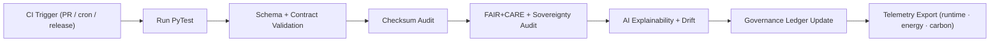

<div align="center">

# 🧪 **KFM v11 — Source Tests & Validation Suite**  
`src/tests/`

### **FAIR+CARE · Sovereignty · Reliability · Explainable AI · Telemetry**

The Source Test Suite provides **governed, reproducible, ethics-aligned validation** for  
ETL, AI, governance, lineage, metadata, telemetry, and Focus Mode pipelines.

It is the **first and last line of defense** before a dataset, model, or narrative  
enters the governed KFM ecosystem.

</div>

---

## 📘 1. Purpose

The test suite ensures:

- Schema integrity across all pipeline artifacts  
- FAIR+CARE ethics conformance  
- Sovereignty and A2C (Authority to Control) compliance  
- Explainable AI, bias, and drift validations  
- Provenance correctness (OpenLineage + PROV-O)  
- Sustainability telemetry (energy, carbon)  
- Reliability & idempotency tests for autonomous pipelines  
- Masking and redaction correctness for sensitive data  

All tests must be **deterministic** and **hermetic** by design.

---

## 🗂️ 2. Directory Layout (v11)

```text
src/tests/
│
├── README.md
│
├── test_etl_pipelines.py              # ETL harmonization · CRS rules · STAC/DCAT schema
├── test_ai_reasoning.py               # SHAP/LIME explainability · bias thresholds · drift
├── test_validation_workflows.py       # JSON Schema · Pydantic · contracts · care gates
├── test_governance_sync.py            # IPFS CID generation · ledger writes · provenance
├── test_telemetry_reporting.py        # Energy · carbon · runtime · event correctness
│
├── conftest.py                        # Deterministic fixtures and global pytest config
│
├── fixtures/
│   ├── mock_dataset.json
│   ├── mock_ai_output.json
│   └── mock_provenance_entry.json
│
└── metadata.json                      # Test suite provenance · sha256 lineage registry
```

---

## ⚙️ 3. Test Execution Workflow (v11)



---

## 🧩 4. Example Test Metadata Record (v11)

```json
{
  "id": "src_tests_session_v11.0.0_2025Q4",
  "tests_executed": [
    "test_etl_pipelines.py",
    "test_ai_reasoning.py",
    "test_validation_workflows.py",
    "test_governance_sync.py",
    "test_telemetry_reporting.py"
  ],
  "tests_passed": 271,
  "tests_failed": 0,
  "checksum_verified": true,
  "fairstatus": "certified",
  "ai_explainability_score": 0.994,
  "sustainability_score": 0.989,
  "coverage": 99.6,
  "governance_registered": true,
  "created": "2025-11-24T12:30:00Z",
  "validator": "@kfm-tests"
}
```

---

## 🧠 5. FAIR+CARE Governance Matrix (v11)

| Principle | Implementation | Oversight |
|-----------|----------------|-----------|
| **Findable** | Validation artifacts indexed with unique ledger URIs + timestamps. | `@kfm-data` |
| **Accessible** | Reports emitted as JSON/CSV with redaction/pruning rules. | `@kfm-accessibility` |
| **Interoperable** | Mapped to ISO 19115 · STAC/DCAT · OWL-Time · CIDOC-CRM. | `@kfm-architecture` |
| **Reusable** | MIT-licensed tests + deterministic fixtures. | `@kfm-design` |
| **Collective Benefit** | Transparency, reproducibility, and AI safety built-in. | `@faircare-council` |
| **Authority to Control** | CARE + sovereignty checks amply logged in ledgers. | `@kfm-governance` |
| **Responsibility** | Engineers uphold ethical, sustainable validation norms. | `@kfm-sustainability` |
| **Ethics** | Bias + inclusion + accessibility tests conducted per release. | `@kfm-ethics` |

---

## 🧪 6. Key Test Suite Components (v11)

| File | Function | Governance Role |
|------|----------|------------------|
| `test_etl_pipelines.py` | CRS · schema · metadata checks | FAIR+CARE & lineage |
| `test_ai_reasoning.py` | SHAP/LIME explainability + bias checks | Ethical AI |
| `test_validation_workflows.py` | JSONSchema · Pydantic | Data Integrity |
| `test_governance_sync.py` | IPFS + ledger correctness | Provenance |
| `test_telemetry_reporting.py` | Energy, carbon, runtime | Sustainability |

---

## ⚖️ 7. Retention & Provenance Policy

| Artifact | Retention | Notes |
|----------|-----------|-------|
| Test Logs | 90 days | Rotated post-telemetry sync |
| FAIR+CARE Reports | 365 days | Governance review |
| AI Audit Logs | 180 days | Aligned to retraining |
| Provenance Records | Permanent | Ledger anchored |
| Metadata | Permanent | sha256 lineage registry |

---

## 🌿 8. Sustainability Metrics (Example)

| Metric | Value | Verified By |
|--------|-------|-------------|
| Energy (avg) | 1.1 Wh | `@kfm-sustainability` |
| Carbon Output | 1.3 gCO₂e | `@kfm-security` |
| Renewable Energy | 100% | `@kfm-infrastructure` |
| FAIR+CARE Compliance | 100% | `@faircare-council` |

---

## 🕰️ 9. Version History

| Version | Date | Summary |
|--------:|------|---------|
| v11.0.0 | 2025-11-24 | Full KFM-MDP v11 rewrite with sovereignty rules, AI explainability, reliability alignment, contract checks, telemetry v11. |
| v10.1.0 | 2025-11-10 | Previous suite: Focus v2 tests, DCAT/STAC checks, enhanced metrics. |

---

<div align="center">

**Kansas Frontier Matrix — Test Suite v11**  
*Reproducibility × FAIR+CARE × Sovereignty × Provenance × Sustainable Engineering*  
Diamond⁹ Ω / Crown∞Ω  

</div>