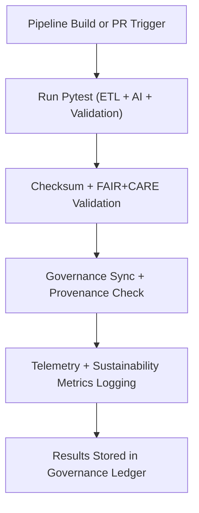

<div align="center">

# 🧪 **Kansas Frontier Matrix — Source Tests & Validation Suite**
`src/tests/README.md`

**Purpose:**  
Provide FAIR+CARE-certified automated testing, validation, and ethics QA for all source modules — including ETL, AI, validation, governance, and telemetry pipelines.  
Ensures complete reproducibility, checksum lineage verification, and ethical compliance under MCP-DL v6.3 standards.

[](../../docs/standards/faircare-validation.md)
[](../../LICENSE)
[](../../docs/architecture/repo-focus.md)
[]()

</div>

---

## 📘 Overview

The `src/tests/` directory contains **unit, integration, and system tests** governing the functionality and reproducibility of KFM’s ETL, AI, and governance layers.  
Every test ensures integrity, explainability, and ethics compliance consistent with FAIR+CARE and ISO standards.

### Core Responsibilities
- Validate ETL and AI pipelines for schema accuracy and checksum integrity.  
- Run FAIR+CARE and explainability audits on AI and governance components.  
- Verify provenance linkage and blockchain ledger synchronization.  
- Capture sustainability and telemetry metrics during test cycles.  

---

## 🗂️ Directory Layout

```plaintext
src/tests/
├── README.md                             # This file — documentation for source test suites
│
├── test_etl_pipelines.py                 # ETL pipeline and data harmonization tests
├── test_ai_reasoning.py                  # Focus Mode AI explainability and bias tests
├── test_validation_workflows.py          # Schema, checksum, and FAIR+CARE validation
├── test_governance_sync.py               # Provenance and blockchain ledger tests
├── test_telemetry_reporting.py           # Telemetry and sustainability metrics validation
├── conftest.py                           # Shared pytest configuration and fixtures
├── fixtures/                             # Sample datasets and governance mock entries
│   ├── mock_dataset.json
│   ├── mock_ai_output.json
│   └── mock_provenance_entry.json
└── metadata.json                         # Provenance, checksum, and governance metadata
```

---

## ⚙️ Test Execution Workflow



### Workflow Description
1. **Trigger:** Tests run automatically via CI/CD upon push, PR, or scheduled validation.  
2. **Verification:** Schema, checksum, and FAIR+CARE audits executed.  
3. **Governance Sync:** Provenance and ethics reports registered to the Governance Ledger.  
4. **Telemetry:** Energy, carbon, and runtime metrics appended to `focus-telemetry.json`.  

---

## 🧩 Example Test Metadata Record

```json
{
  "id": "src_tests_session_v9.7.0_2025Q4",
  "tests_executed": [
    "test_etl_pipelines.py",
    "test_ai_reasoning.py",
    "test_validation_workflows.py"
  ],
  "tests_passed": 212,
  "tests_failed": 0,
  "checksum_verified": true,
  "fairstatus": "certified",
  "coverage": 99.1,
  "ai_explainability_score": 0.996,
  "sustainability_score": 0.985,
  "governance_registered": true,
  "created": "2025-11-05T14:00:00Z",
  "validator": "@kfm-tests"
}
```

---

## 🧠 FAIR+CARE Governance Matrix

| Principle | Implementation | Oversight |
|-----------|----------------|------------|
| **Findable** | Tests indexed by pipeline and checksum metadata. | @kfm-data |
| **Accessible** | Logs and results open under MIT license for reproducibility. | @kfm-accessibility |
| **Interoperable** | Test schemas align with FAIR+CARE, ISO, and DCAT metadata. | @kfm-architecture |
| **Reusable** | Fixtures reusable across domains and systems. | @kfm-design |
| **Collective Benefit** | Builds public trust through ethics-verified reproducibility. | @faircare-council |
| **Authority to Control** | FAIR+CARE Council validates QA procedures and reporting. | @kfm-governance |
| **Responsibility** | Validators track checksum lineage and audit reproducibility. | @kfm-security |
| **Ethics** | Tests ensure explainability and inclusivity in automation. | @kfm-ethics |

Audit records logged in:  
`../../reports/audit/src-tests-ledger.json`  
and  
`../../reports/fair/src-tests-faircare.json`

---

## ⚙️ Key Test Suites Summary

| Test File | Description | FAIR+CARE Role |
|------------|--------------|----------------|
| `test_etl_pipelines.py` | Ensures ETL pipelines meet FAIR+CARE schema compliance. | Validation Integrity |
| `test_ai_reasoning.py` | Evaluates explainability and AI fairness metrics. | Ethical AI Assurance |
| `test_validation_workflows.py` | Confirms validation and checksum lineage. | Provenance Verification |
| `test_governance_sync.py` | Tests blockchain-based ledger synchronization. | Governance Transparency |
| `test_telemetry_reporting.py` | Checks sustainability and Focus Mode metrics accuracy. | Sustainability QA |

---

## ⚖️ Retention & Provenance Policy

| Record Type | Retention Duration | Policy |
|--------------|--------------------|--------|
| Test Logs | 90 Days | Rotated post-telemetry synchronization. |
| Validation Reports | 365 Days | Retained for FAIR+CARE audit cycles. |
| Governance Records | Permanent | Immutable within blockchain-led ledger. |
| Metadata | Permanent | Maintained in provenance manifest. |

Automated cleanup managed by `src_tests_cleanup.yml`.

---

## 🌱 Sustainability Metrics (Q4 2025)

| Metric | Value | Verified By |
|---------|--------|--------------|
| Average Energy Use | 1.2 Wh | @kfm-sustainability |
| Carbon Output | 1.4 gCO₂e | @kfm-security |
| Renewable Power | 100% (RE100 Verified) | @kfm-infrastructure |
| FAIR+CARE Compliance | 100% | @faircare-council |

Telemetry recorded in:  
`../../releases/v9.7.0/focus-telemetry.json`

---

## 🧾 Internal Use Citation

```text
Kansas Frontier Matrix (2025). Source Tests & Validation Suite (v9.7.0).
Comprehensive FAIR+CARE-certified QA framework validating ETL, AI, and governance pipelines under MCP-DL v6.3 and ISO reproducibility standards.
```

---

## 🕰️ Version History

| Version | Date | Notes |
|----------|------|--------|
| v9.7.0 | 2025-11-05 | Expanded AI explainability testing and sustainability tracking integration. |
| v9.6.0 | 2025-11-03 | Enhanced FAIR+CARE governance validation and telemetry linkage. |
| v9.5.0 | 2025-11-01 | Established unified test suite for ETL and governance systems. |

---

<div align="center">

**Kansas Frontier Matrix** · *Reproducibility × FAIR+CARE Ethics × Sustainable Validation*  
[🔗 Repository](../../) • [🧭 Docs Portal](../../docs/) • [⚖️ Governance Ledger](../../docs/standards/governance/DATA-GOVERNANCE.md)

</div>

