<div align="center">

# 🧪 **Kansas Frontier Matrix — Source Tests & Validation Suite**
`src/tests/README.md`

**Purpose:**  
Provide FAIR+CARE-certified **unit, integration, and system validation** for all source modules — ETL, AI, governance, and telemetry — ensuring **reproducibility, checksum lineage, and ethical compliance** under MCP-DL v6.3.

[](../../docs/standards/)
[](../../docs/standards/faircare-validation.md)
[](../../LICENSE)
[]()
[]()

</div>

---

## 📘 Overview

The `src/tests/` package is the **quality gate** for KFM’s automation stack.  
It verifies schema conformance, explainable AI behavior, provenance ledgering, and sustainability telemetry — aligned to **FAIR+CARE** and **ISO** standards.

### Core Responsibilities
- Validate **ETL & schema** (checksum lineage, STAC/DCAT, ISO 19115).  
- Audit **AI explainability & bias** (Focus Transformer v2 + XAI metrics).  
- Verify **governance provenance** (IPFS + blockchain ledger sync).  
- Capture **runtime, energy, and carbon** telemetry during test runs.

---

## 🗂️ Directory Layout

```plaintext
src/tests/
├── README.md                              # This document
│
├── test_etl_pipelines.py                  # ETL harmonization + schema compliance tests
├── test_ai_reasoning.py                   # Focus Transformer v2 explainability & bias
├── test_validation_workflows.py           # JSONSchema + checksum + FAIR+CARE validation
├── test_governance_sync.py                # IPFS & blockchain/ledger provenance checks
├── test_telemetry_reporting.py            # Runtime, energy, carbon, FAIR metrics
├── conftest.py                            # Pytest fixtures and global config
├── fixtures/                              # Minimal, deterministic sample data
│   ├── mock_dataset.json
│   ├── mock_ai_output.json
│   └── mock_provenance_entry.json
└── metadata.json                          # Test session provenance & checksum registry
```

---

## ⚙️ Test Execution Workflow

```mermaid
flowchart LR
    A["Build / PR / Schedule Trigger"] --> B["Run Pytest (ETL · AI · Validation)"]
    B --> C["Checksum & FAIR+CARE Audits"]
    C --> D["Provenance Write (IPFS + Ledger)"]
    D --> E["Telemetry Export (Runtime · Energy · Carbon)"]
    E --> F["Artifacts & Reports Published"]
```



**Pipeline:** CI/CD invokes PyTest → validates schemas & checksums → commits provenance → exports telemetry → publishes reports.

---

## 🧩 Example Test Metadata Record

```json
{
  "id": "src_tests_session_v10.1.0_2025Q4",
  "tests_executed": [
    "test_etl_pipelines.py",
    "test_ai_reasoning.py",
    "test_validation_workflows.py",
    "test_governance_sync.py",
    "test_telemetry_reporting.py"
  ],
  "tests_passed": 248,
  "tests_failed": 0,
  "checksum_verified": true,
  "fairstatus": "certified",
  "coverage": 99.3,
  "ai_explainability_score": 0.996,
  "sustainability_score": 0.990,
  "governance_registered": true,
  "created": "2025-11-10T12:30:00Z",
  "validator": "@kfm-tests"
}
```

---

## 🧠 FAIR+CARE Governance Matrix

| Principle | Implementation | Oversight |
|-----------|----------------|-----------|
| **Findable** | Tests indexed in `metadata.json` with ISO timestamps. | @kfm-data |
| **Accessible** | Logs & results published under MIT with redaction policies. | @kfm-accessibility |
| **Interoperable** | Assertions for STAC 1.0 / DCAT 3.0 / ISO 19115. | @kfm-architecture |
| **Reusable** | Deterministic fixtures; hermetic tests; containerized CI. | @kfm-design |
| **Collective Benefit** | Transparent QA and public reports. | @faircare-council |
| **Authority to Control** | Council-reviewed ethics & accessibility checks. | @kfm-governance |
| **Responsibility** | Energy & carbon recorded; provenance immutable. | @kfm-security |
| **Ethics** | Bias & inclusion tests run per release. | @kfm-ethics |

Audit records:  
`../../reports/audit/src-tests-ledger.json` · `../../reports/fair/src-tests-faircare.json`

---

## 🧪 Key Test Suites Summary

| Test File | Description | FAIR+CARE Role |
|-----------|-------------|----------------|
| `test_etl_pipelines.py` | STAC/DCAT/ISO schema + checksum lineage. | Validation Integrity |
| `test_ai_reasoning.py` | SHAP/LIME explainability + bias thresholds. | Ethical AI Assurance |
| `test_validation_workflows.py` | JSONSchema + Pydantic structural checks. | Provenance Verification |
| `test_governance_sync.py` | IPFS CID + ledger tx confirmation. | Governance Transparency |
| `test_telemetry_reporting.py` | Runtime/Energy/Carbon metrics accuracy. | Sustainability QA |

---

## ⚖️ Retention & Provenance Policy

| Record Type | Retention | Policy |
|-------------|-----------|--------|
| Test Logs | 90 Days | Rotated after telemetry sync. |
| Validation Reports | 365 Days | Retained for FAIR+CARE audit cycles. |
| Governance Records | Permanent | Immutable on blockchain-led ledger. |
| Metadata | Permanent | Stored in session manifest. |

Automated cleanup via `src_tests_cleanup.yml`.

---

## 🌱 Sustainability Metrics (Q4 2025)

| Metric | Value | Verified By |
|--------|-------|-------------|
| Average Energy Use | 1.1 Wh | @kfm-sustainability |
| Carbon Output | 1.3 g CO₂e | @kfm-security |
| Renewable Power | 100% (RE100) | @kfm-infrastructure |
| FAIR+CARE Compliance | 100% | @faircare-council |

Telemetry recorded in:  
`../../releases/v10.1.0/focus-telemetry.json`

---

## 🧾 Internal Use Citation

```text
Kansas Frontier Matrix (2025). Source Tests & Validation Suite (v10.1.0).
FAIR+CARE-certified QA framework validating ETL, AI, governance, and telemetry pipelines under MCP-DL v6.3 and ISO-aligned reproducibility standards.
```

---

## 🕰️ Version History

| Version | Date | Notes |
|---------|------|------|
| **v10.1.0** | 2025-11-10 | Upgraded to v10.1.0: streaming ETL fixtures, Focus v2 tests, DCAT/STAC bridge checks, improved energy metrics. |
| **v10.0.0** | 2025-11-08 | Added AI reasoning & sustainability tracking; FAIR+CARE full certification. |
| **v9.7.0** | 2025-11-05 | Expanded explainability & sustainability test coverage. |

---

<div align="center">

**Kansas Frontier Matrix** · *Reproducibility × FAIR+CARE Ethics × Sustainable Validation*  
[🔗 Source Index](../) · [🧭 Docs Portal](../../docs/) · [⚖️ Governance Charter](../../docs/standards/governance/DATA-GOVERNANCE.md)

</div>
