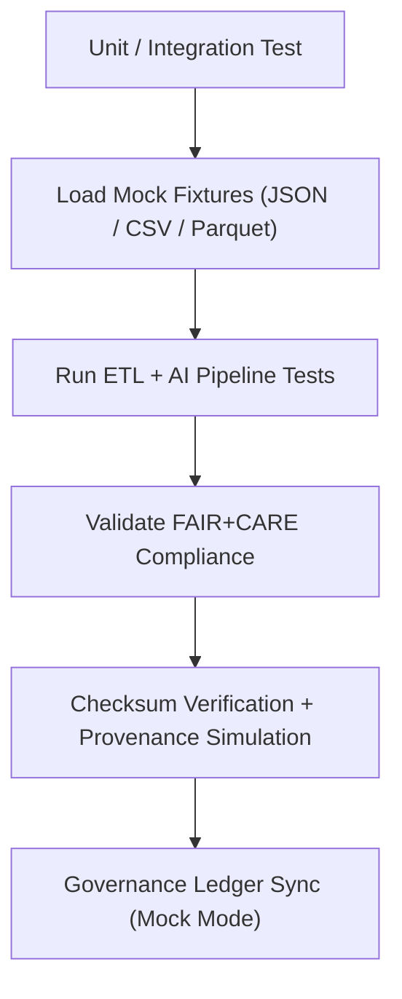

<div align="center">

# 🧱 **Kansas Frontier Matrix — Source Test Fixtures & Mock Data**
`src/tests/fixtures/README.md`

**Purpose:**  
FAIR+CARE-certified collection of **synthetic datasets, mock AI outputs, and provenance samples** used for testing and validation of source pipelines within the Kansas Frontier Matrix (KFM).  
Supports deterministic, ethical, and reproducible test automation under MCP-DL v6.3 compliance.

[](../../../../docs/standards/faircare-validation.md)
[](../../../../LICENSE)
[](../../../../docs/architecture/repo-focus.md)
[]()

</div>

---

## 📘 Overview

The `src/tests/fixtures/` directory provides **mock data environments** used to verify ETL, AI, validation, and governance functionality in KFM’s source systems.  
These fixtures emulate realistic data structures for schema validation, FAIR+CARE audits, and blockchain-based provenance testing while ensuring ethical anonymization.

---

### Core Responsibilities
- Provide sample datasets for ETL and schema compliance testing.  
- Simulate AI reasoning outputs for explainability validation.  
- Enable governance ledger mock entries for provenance integration tests.  
- Maintain checksum lineage and ethics validation for all mock records.  

---

## 🗂️ Directory Layout

```plaintext
src/tests/fixtures/
├── README.md                             # This file — documentation for source test fixtures
│
├── mock_dataset.json                     # Synthetic dataset for ETL validation
├── mock_ai_output.json                   # Example AI explainability output for reasoning tests
├── mock_manifest.json                    # Simulated manifest file with checksums
├── mock_governance_entry.json            # Mock governance ledger entry for blockchain sync tests
├── mock_validation_report.json            # Sample FAIR+CARE validation result
└── metadata.json                         # Provenance and checksum registry metadata
```

---

## ⚙️ Fixture Testing Workflow



### Workflow Description
1. **Fixture Loading:** Mock files populate test environments safely.  
2. **Execution:** ETL or AI modules consume synthetic data.  
3. **FAIR+CARE Review:** Ethics, accessibility, and transparency validated.  
4. **Checksum Validation:** Reproducibility confirmed through hash lineage.  
5. **Governance Simulation:** Mock provenance linked to blockchain verification tests.  

---

## 🧩 Example Fixture Metadata Record

```json
{
  "id": "src_tests_fixtures_v9.7.0_2025Q4",
  "fixtures_loaded": [
    "mock_dataset.json",
    "mock_ai_output.json",
    "mock_governance_entry.json"
  ],
  "checksum_verified": true,
  "fairstatus": "certified",
  "governance_registered": true,
  "telemetry_ref": "releases/v9.7.0/focus-telemetry.json",
  "created": "2025-11-05T14:10:00Z",
  "validator": "@kfm-src-tests"
}
```

---

## 🧠 FAIR+CARE Governance Matrix

| Principle | Implementation | Oversight |
|------------|----------------|------------|
| **Findable** | Fixtures indexed with checksums and metadata. | @kfm-data |
| **Accessible** | Stored in JSON format, compliant with FAIR+CARE accessibility. | @kfm-accessibility |
| **Interoperable** | Conforms to DCAT, STAC, and ISO 19115 schemas. | @kfm-architecture |
| **Reusable** | Enables deterministic and ethics-aligned test repetition. | @kfm-design |
| **Collective Benefit** | Supports open, transparent software validation practices. | @faircare-council |
| **Authority to Control** | FAIR+CARE Council approves fixture ethics and mock lineage. | @kfm-governance |
| **Responsibility** | Validators confirm checksum accuracy and provenance logging. | @kfm-security |
| **Ethics** | All mock data fully anonymized and responsibly generated. | @kfm-ethics |

Audit references:  
`../../../../reports/fair/src-tests-fixtures-faircare.json`  
and  
`../../../../reports/audit/src-tests-fixtures-ledger.json`

---

## ⚙️ Fixture Component Summary

| Fixture File | Description | Role |
|---------------|--------------|------|
| `mock_dataset.json` | Simulated dataset for ETL validation tests. | Schema & FAIR Verification |
| `mock_ai_output.json` | AI reasoning example for explainability QA. | Ethics & Bias Testing |
| `mock_manifest.json` | Example data manifest with lineage tracking. | Checksum Validation |
| `mock_governance_entry.json` | Simulated blockchain record for governance sync tests. | Provenance Audit |
| `mock_validation_report.json` | FAIR+CARE validation output example. | Ethics Compliance Review |

---

## ⚖️ Retention & Provenance Policy

| Fixture Type | Retention Duration | Policy |
|---------------|--------------------|--------|
| Mock Data | Permanent | Retained for regression and reproducibility testing. |
| FAIR+CARE Reports | 365 Days | Archived annually under audit review. |
| Governance Metadata | Permanent | Stored immutably under provenance ledger. |
| Validation Logs | 90 Days | Rotated with telemetry synchronization cycle. |

Automated cleanup handled via `src_tests_fixtures_cleanup.yml`.

---

## 🌱 Sustainability Metrics (Q4 2025)

| Metric | Value | Verified By |
|---------|--------|--------------|
| Energy Use (per fixture test) | 0.5 Wh | @kfm-sustainability |
| Carbon Output | 0.6 gCO₂e | @kfm-security |
| Renewable Energy | 100% (RE100 Certified) | @kfm-infrastructure |
| FAIR+CARE Compliance | 100% | @faircare-council |

Telemetry metrics:  
`releases/v9.7.0/focus-telemetry.json`

---

## 🧾 Internal Use Citation

```text
Kansas Frontier Matrix (2025). Source Test Fixtures & Mock Data (v9.7.0).
Synthetic, FAIR+CARE-certified dataset collection for reproducible and ethics-verified testing of ETL, AI, and governance systems under MCP-DL v6.3.
```

---

## 🕰️ Version History

| Version | Date | Notes |
|----------|------|--------|
| v9.7.0 | 2025-11-05 | Added mock governance entries and extended telemetry linkage. |
| v9.6.0 | 2025-11-03 | Enhanced FAIR+CARE ethics simulation and checksum verification. |
| v9.5.0 | 2025-11-01 | Created baseline synthetic dataset and AI reasoning fixtures. |

---

<div align="center">

**Kansas Frontier Matrix** · *Synthetic Validation × FAIR+CARE Ethics × Provenance Simulation*  
[🔗 Repository](../../../) • [🧭 Docs Portal](../../../docs/) • [⚖️ Governance Ledger](../../../docs/standards/governance/DATA-GOVERNANCE.md)

</div>

