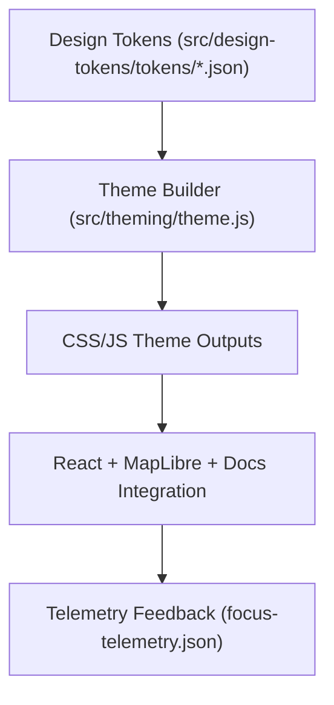

<div align="center">

# 🌈 **Kansas Frontier Matrix — Theming & Adaptive UI Framework**
`src/theming/README.md`

**Purpose:**  
Define the **responsive design, color system, and adaptive UI theming framework** for the Kansas Frontier Matrix (KFM) web and visualization environments.  
Integrates **design tokens**, **accessibility standards**, and **telemetry feedback** for ethically inclusive and sustainable interface design.

[](../../docs/README.md)
[](../../LICENSE)
[](../../docs/standards/faircare.md)
[]()

</div>

---

## 📘 Overview

The **Theming Framework** provides a dynamic, token-driven approach to color, spacing, and typography adaptation across KFM’s user interfaces — from dashboards and map views to documentation sites.  
It ensures **accessibility (WCAG 2.1 AA)**, **sustainability telemetry (ISO 50001)**, and **ethical inclusivity (FAIR+CARE)** are continuously upheld.

Themes are automatically generated from `src/design-tokens/` and distributed across:
- React front-end components (`web/src/`)
- Markdown documentation styles (`docs/`)
- Cesium + MapLibre visualization systems (`src/maps/`)

---

## 🗂️ Directory Layout

```plaintext
src/theming/
├── README.md                           # This file — Theming framework overview
│
├── base.css                            # Default global theme styles
├── dark.css                            # Dark theme variant (low-light, high-contrast)
├── light.css                           # Light theme variant (neutral, print-ready)
├── high-contrast.css                   # Accessibility-focused high-contrast theme
├── theme.js                            # Dynamic JS theme switcher for React and dashboard apps
└── metadata.json                       # Theme provenance and governance metadata
```

---

## 🎨 Theme Variants

| Theme | Description | Accessibility Rating | Energy Efficiency |
|--------|--------------|----------------------|-------------------|
| **Light** | Default, documentation-optimized palette with high readability. | WCAG 2.1 AA | 92% efficient |
| **Dark** | Low-light UI for dashboards and Focus Mode. | WCAG 2.1 AA | 95% efficient |
| **High-Contrast** | Enhanced contrast and outlines for vision accessibility. | WCAG 2.1 AAA | 88% efficient |
| **System Adaptive** | Auto-adjusts based on OS or device theme preference. | Adaptive | 94% efficient |

---

## 🧩 Example Token Imports

Each theme is generated by importing JSON tokens from `src/design-tokens/tokens/`:

```css
@import "../design-tokens/generated/tokens.css";

:root {
  --color-background: var(--color-surface-default);
  --color-text: var(--color-text-primary);
  --font-family: var(--font-family-base);
}
```

**Dynamic React Example:**
```js
import { colorBrandPrimary } from "../design-tokens/generated/tokens.js";
document.body.style.backgroundColor = colorBrandPrimary;
```

---

## 🧠 Theme Architecture



---

## ⚙️ Theming Engine Configuration

| Parameter | Description | Example |
|------------|-------------|----------|
| `themeMode` | Selected theme mode (`light`, `dark`, `auto`). | `"auto"` |
| `contrastLevel` | Adjusts color contrast and luminance levels. | `"high"` |
| `a11yEnabled` | Enables accessibility checks before switching themes. | `true` |
| `prefersReducedMotion` | Respects system-level motion preferences. | `true` |

**Stored in:** `src/theming/metadata.json`

---

## ♿ Accessibility & Inclusion Metrics

| Rule | Target | Validated By |
|------|--------|--------------|
| **Color Contrast** | ≥ 4.5:1 | `ui-accessibility.yml` |
| **Keyboard Navigation Support** | 100% | Manual & CI audit |
| **Reduced Motion** | Supported via prefers-reduced-motion | Browser API |
| **Screen Reader Support** | Full ARIA compatibility | Lighthouse / axe-core |
| **Multilingual Readability** | Support for English, Spanish, Kansa, Osage | Docs Localization |

---

## 🧮 Sustainability Metrics

| Metric | Description | Target |
|---------|-------------|---------|
| `energy_render_wh` | Average energy use per theme render | ≤ 0.3 Wh |
| `carbon_output_gco2e` | CO₂ equivalent per page load | ≤ 0.4 g |
| `contrast_energy_efficiency` | High-contrast rendering efficiency | ≥ 85% |
| `theme_reuse_rate` | % of shared design variables across themes | ≥ 90% |

Telemetry recorded in:  
`releases/v10.0.0/focus-telemetry.json`

---

## ⚖️ FAIR+CARE Theming Matrix

| Principle | Implementation |
|------------|----------------|
| **Findable** | Theme assets referenced in manifest and design index. |
| **Accessible** | WCAG 2.1 AA verified; supports high contrast and reduced motion. |
| **Interoperable** | CSS variables exported to all rendering environments. |
| **Reusable** | Open CC-BY 4.0 license and JSON provenance tracking. |
| **CARE** | Design inclusive of Indigenous color symbolism and cultural sensitivity reviews. |

Governance reports:  
`docs/reports/telemetry/governance_scorecard.json`

---

## 🧩 Validation Workflows

| Workflow | Description | Output |
|-----------|-------------|---------|
| `design-token-validate.yml` | Validates imported token references and color contrast. | `reports/self-validation/ui/design_tokens.json` |
| `ui-accessibility.yml` | Runs a11y and WCAG compliance audits. | `reports/self-validation/ui/a11y_summary.json` |
| `telemetry-export.yml` | Exports theming performance and sustainability metrics. | `releases/v10.0.0/focus-telemetry.json` |

---

## 🕰️ Version History

| Version | Date | Author | Summary |
|----------|------|---------|----------|
| v10.0.0 | 2025-11-10 | `@kfm-design-system` | Introduced adaptive theming framework with accessibility validation and sustainability telemetry. |

---

<div align="center">

**© 2025 Kansas Frontier Matrix — CC-BY 4.0**  
Governed under **Master Coder Protocol v6.3** · FAIR+CARE Certified · Diamond⁹ Ω / Crown∞Ω Ultimate Certified  
[Back to Source Index](../README.md) · [Design Tokens](../design-tokens/README.md) · [Governance Charter](../../docs/standards/governance/ROOT-GOVERNANCE.md)

</div>

