<div align="center">

# 🌈 **Kansas Frontier Matrix — Theming & Adaptive UI Framework (v11)**  
`src/theming/README.md`

### **Accessibility · FAIR+CARE · Sovereignty-Aware UI · Adaptive Systems · Sustainability**

The KFM v11 Theming Framework defines a **token-driven, accessibility-first, sovereignty-respecting, and telemetry-powered UI system** that governs all interface layers:

- React UI (`web/src/`)
- MapLibre visual layers
- Cesium 3D scenes
- Documentation and dashboards
- Focus Mode v3 narrative interfaces

</div>

---

# 📘 1. Purpose

The framework ensures:

- **WCAG 2.1 AA/AAA** compliance  
- **Ethical + inclusive design** (FAIR+CARE)  
- **Sovereignty-sensitive color systems**  
- **Token-based determinism** across environments  
- **Energy + performance** telemetry for sustainable UIs  
- **Auto-responsive** adaptation across devices and OS modes  
- **Design governance** via provenance/metadata and versioning  

The system harmonizes UI behavior across both **static documentation** and **interactive geospatial interfaces**.

---

# 🗂️ 2. Directory Layout (v11)

```text
src/theming/
│
├── README.md                # This document
├── base.css                 # Global base styling
├── light.css                # Light theme (docs-first)
├── dark.css                 # Low-light theme (map-focused)
├── high-contrast.css        # AAA compliance theme
├── theme.js                 # Runtime adaptive theme controller
└── metadata.json            # Provenance + FAIR+CARE + A11y metadata
```

---

# 🎨 3. Theme Variants (v11)

| Theme | Description | WCAG Rating | Energy Efficiency |
|-------|-------------|-------------|-------------------|
| **Light** | Documentation & reading-optimized palette with stable luminance. | AA | 92% |
| **Dark** | Dashboard/Focus Mode, low-light, user fatigue reduction. | AA | 95% |
| **High-Contrast** | Visual accessibility + AAA contrast guarantees. | AAA | 88% |
| **Adaptive/System** | Follows OS theme + device preferences automatically. | Auto | 94% |

---

# 🧩 4. Token-Based Architecture

Design tokens sourced from:

```
src/design-tokens/tokens/*.json
```

are compiled to deterministic CSS/JS variables.

### CSS Example

```css
@import "../design-tokens/generated/tokens.css";

:root {
  --color-background: var(--surface-default);
  --color-text: var(--text-primary);
  --font-family: var(--font-base);
}
```

### JS Example

```js
import { brandPrimary } from "../design-tokens/generated/tokens.js";
document.body.style.backgroundColor = brandPrimary;
```

---

# 🔧 5. Runtime Architecture

```mermaid
flowchart TD
  A["Design Tokens"] --> B["Theme Builder (theme.js)"]
  B --> C["CSS Outputs · JS Vars"]
  C --> D["React · MapLibre · Cesium · Docs"]
  D --> E["Telemetry · A11y Reports · Energy Metrics"]
```



---

# ♿ 6. Accessibility & Inclusion (v11)

| Rule | Target | Validator |
|------|--------|-----------|
| Contrast | ≥ 4.5:1 | Lighthouse · axe-core |
| High-Contrast Mode | Required | ui-accessibility.yml |
| Keyboard Nav | 100% coverage | Manual + CI |
| Reduced Motion | Required | `prefers-reduced-motion` |
| Alt Text | Required for all images | Docs checker |
| Indigenous Language Support | Optional prompts: Kansa, Osage | Docs/localization |

**Accessibility metadata** is recorded in:  
```
src/theming/metadata.json
```

---

# 🌿 7. Sustainability Telemetry (ISO 50001)

The theming engine tracks:

- `energy_render_wh`  
- `carbon_output_gco2e`  
- `contrast_energy_efficiency`  
- `theme_reuse_rate`  

Telemetry exported to:

```
releases/v11.0.0/theming-telemetry.json
```

---

# ⚖️ 8. FAIR+CARE & Sovereignty Alignment

- Avoid culturally sensitive color associations without review  
- Honor Indigenous color symbolism when applicable  
- Provide A2C (Authority to Control) metadata in theme definitions  
- Ensure no UI state exposes sensitive location/origin data  
- All theming updates require governance checks (CI-based)  

---

# 🧪 9. Validation Workflows

| Workflow | Purpose | Output |
|----------|---------|--------|
| `design-token-validate.yml` | Validate token usage + references | `reports/self-validation/ui/tokens.json` |
| `ui-accessibility.yml` | Run WCAG AA/AAA audits | `reports/self-validation/ui/a11y.json` |
| `telemetry-export.yml` | Export energy/sustainability metrics | `releases/.../theming-telemetry.json` |

---

# 🕰️ 10. Version History

| Version | Date | Summary |
|--------:|------|---------|
| v11.0.0 | 2025-11-24 | Complete KFM-MDP v11 rewrite: sovereignty, sustainability, a11y AAA, telemetry v11, design governance. |
| v10.0.1 | 2025-11-16 | Previous theming architecture (v10). |

---

<div align="center">

**Kansas Frontier Matrix — Theming Framework v11**  
*Accessible · Ethical · Sustainable · Sovereign-Aware UI Engineering*  
Diamond⁹ Ω / Crown∞Ω Certified

</div>