# `src/use_cases` 🧩


> Application workflows (“services” / “interactors”) for the Kansas Frontier Matrix (KFM).

---

## Why this folder exists

KFM’s software is designed as a layered clean architecture with a governed access boundary (“trust membrane”). In that model, the **Use Case (Service) layer** orchestrates domain entities to implement application workflows while remaining **UI- and DB-agnostic**.[^kfm-clean] [^kfm-usecases] [^kfm-trust]

This directory is where those workflows live.

Typical examples include:

- ingesting a new dataset
- generating a time series / timeline product for the UI
- assembling story-node payloads (narrative + evidence links)
- performing policy-aware queries over spatial/graph data

> [!NOTE]
> “What is in the repo right now” may differ from this **intended** structure.
> If names/paths don’t match your current codebase, update this README to reflect the authoritative layout.

---

## Responsibilities and non-responsibilities

| ✅ This layer *does* | ❌ This layer *does not* |
|---|---|
| Orchestrate domain entities into user/system workflows | Talk to PostGIS/Neo4j/OpenSearch directly |
| Enforce business rules and validation policies | Define HTTP routes/controllers (that’s `src/server` or equivalent) |
| Depend on abstract ports/repositories (interfaces) | Render UI (React/MapLibre) |
| Return results that are easy to test in isolation | Contain framework bootstrapping / dependency injection wiring |
| Produce (or pass through) provenance/citation hooks | Bypass governance checks or “reach around” the API boundary |

---

## Trust membrane rule (non‑negotiable)

KFM documentation describes a “trust membrane” in which **clients do not bypass the backend**: the UI never talks directly to data stores; access is mediated by the governed backend API and its validation/policy enforcement.[^kfm-trust] [^kfm-whatnot]

> [!IMPORTANT]
> Inside `src/use_cases`, **never** import concrete DB clients, ORMs, HTTP frameworks, or UI modules.
> Depend on **interfaces** (ports/repositories) and pass concrete implementations from the outer layers.

---

## Dependency direction

```mermaid
flowchart LR
  UI[UI / Clients<br/>React • MapLibre] --> API[API Layer<br/>FastAPI/GraphQL routers]
  API --> UC[Use Cases<br/>src/use_cases]
  UC --> DOMAIN[Domain Models<br/>src/domain]
  UC --> PORTS[Ports / Interfaces<br/>src/interfaces]
  PORTS --> ADAPTERS[Adapters<br/>PostGIS • Neo4j • Search • External APIs]

  %% clean-architecture dependency hint
  ADAPTERS -.implements.-> PORTS
```



> [!TIP]
> If you see a use case importing something that *initializes* infrastructure (DB session, HTTP app, config),
> it’s almost certainly in the wrong place.

---

## Suggested directory layout (recommended)

> [!NOTE]
> This is a **recommended** layout for clarity and scale. Adjust to match the repo as needed.

```text
src/
  domain/                 # pure entities/models (no DB/UI deps)
  interfaces/             # repository interfaces / ports
  use_cases/              # <-- YOU ARE HERE
    datasets/
      ingest_dataset.py
      validate_dataset.py
    stories/
      generate_story_node.py
    analytics/
      generate_timeline.py
    common/
      errors.py
      result.py
      policy.py
    README.md
```

---

## Use case design conventions

### 1) Treat use cases as pure workflows

A use case should be *easy to test* by supplying in-memory data and mock repositories.

- ✅ accepts dependencies (ports) via constructor args or function parameters
- ✅ accepts a request DTO (input) and returns a response DTO (output)
- ✅ contains domain-level validation and policy checks
- ✅ emits/returns provenance “breadcrumbs” (dataset version IDs, citation handles)

### 2) Keep I/O at the edges

Use cases should call ports like `ParcelRepository`, `StoryNodeRepository`, or `CatalogRepository`
instead of running SQL/Cypher directly.

### 3) Errors: domain/use-case errors inside, HTTP errors outside

Raise/return **use-case errors** here, and translate them to HTTP response codes in the API layer.

---

## Governance & provenance hooks

KFM’s design emphasizes:

- evidence-backed outputs (maps, story nodes, AI answers)
- traceability to authoritative sources
- FAIR + CARE considerations (including sensitivity handling)[^kfm-governance] [^kfm-whatnot]

Practical expectations for this layer:

- **Provenance**: return the “what, where, and why” of an answer (dataset IDs, version tags, query parameters).
- **Sensitivity**: if a workflow touches sensitive or sovereignty-constrained data, *default to redaction/generalization*
  and route to governance review paths rather than exposing precise details.

> [!WARNING]
> Do **not** encode sensitive location disclosure rules ad-hoc in UI components.
> Handle them in governed back-end logic and policy checks, then expose only compliant outputs.

---

## Testing strategy

| Test type | Goal | Where |
|---|---|---|
| Unit tests | Validate workflow logic with fake repos | `tests/unit/use_cases/` (recommended) |
| Contract tests | Ensure ports behave as expected | `tests/contracts/` (recommended) |
| Integration tests | Verify adapters + real DBs | `tests/integration/` (recommended) |

### Minimal unit-test checklist

- [ ] Happy path (valid request)
- [ ] Validation failures (bad schema, missing fields)
- [ ] Policy failures (insufficient access / restricted dataset)
- [ ] Determinism (same inputs → same outputs)
- [ ] Provenance fields always populated (even on partial failures)

---

## Example pattern (illustrative)

<details>
<summary><strong>Python-style use case skeleton (illustrative)</strong></summary>

```python
from dataclasses import dataclass
from typing import Protocol

# --- Ports (interfaces) live in src/interfaces ---
class ParcelRepository(Protocol):
    def get_by_id(self, parcel_id: str) -> dict: ...
    def save(self, parcel: dict) -> None: ...

# --- Request/Response DTOs ---
@dataclass(frozen=True)
class GetParcelRequest:
    parcel_id: str

@dataclass(frozen=True)
class GetParcelResponse:
    parcel: dict
    provenance: dict  # dataset ids, versions, citations, etc.

# --- Use case ---
class GetParcelUseCase:
    def __init__(self, parcels: ParcelRepository):
        self._parcels = parcels

    def execute(self, req: GetParcelRequest) -> GetParcelResponse:
        parcel = self._parcels.get_by_id(req.parcel_id)

        # domain/policy validation would happen here

        provenance = {
            "inputs": {"parcel_id": req.parcel_id},
            "sources": ["(populate dataset/version/citation handles here)"],
        }
        return GetParcelResponse(parcel=parcel, provenance=provenance)
```

</details>

> [!NOTE]
> The *shape* above matters more than the exact implementation style.
> The key is: **ports in, pure workflow, no infrastructure imports, provenance out.**

---

## When you add a new use case

- [ ] Define/extend ports (interfaces) *first* (integration/interface layer).
- [ ] Implement the workflow here using only domain + ports.
- [ ] Add unit tests with in-memory fakes.
- [ ] Ensure provenance fields are produced (or explicitly “unknown” with reason).
- [ ] If sensitive: add governance notes + redaction behavior.

---

## References (project docs)

[^kfm-clean]: *Kansas Frontier Matrix (KFM) Comprehensive Guide* — “Layered Clean Architecture” and “Use Case (Service) Layer”.
[^kfm-usecases]: *Kansas Frontier Matrix (KFM) Comprehensive Guide* — examples like “ingest new dataset” and “generate crop yield timeline”.
[^kfm-trust]: *Kansas Frontier Matrix (KFM) Comprehensive Guide* — “trust membrane” and governed access boundary.
[^kfm-whatnot]: *Kansas Frontier Matrix (KFM) – Comprehensive Technical Blueprint* — “What KFM Is / Is Not” (UI does not directly touch DB).
[^kfm-governance]: *Kansas Frontier Matrix (KFM) Comprehensive Guide* and *Comprehensive Technical Blueprint* — FAIR/CARE emphasis and ethical handling of sensitive locations.