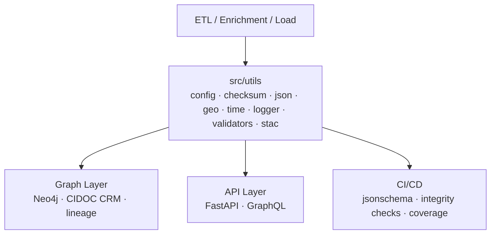

<div align="center">

# ⚙️ Kansas Frontier Matrix — **Core Utilities**  
`src/utils/README.md`

**Shared Tools · Helpers · Configuration · Reproducibility**

[](../../.github/workflows/site.yml)  
[](../../.github/workflows/stac-validate.yml)  
[](../../.github/workflows/codeql.yml)  
[](../../.github/workflows/trivy.yml)  
[](../../docs/)  
[](../../LICENSE)

</div>

---

```yaml
---
title: "KFM • Core Utilities (src/utils)"
version: "v1.7.1"
last_updated: "2025-10-17"
created: "2024-11-05"
owners: ["@kfm-engineering", "@kfm-data", "@kfm-architecture"]
status: "Stable"
maturity: "Production"
tags: ["utilities","config","checksum","json","geo","time","logging","validation","stac","mcp"]
license: "MIT"
semantic_alignment:
  - STAC 1.0.0
  - JSON Schema Draft-07
  - CIDOC CRM (provenance fields)
  - OWL-Time (temporal parsing)
  - DCAT 2.0 (catalog interop)
  - MCP-DL v6.3 (Reproducibility & Provenance)
---
```

## 🎯 Purpose

The **`src/utils/`** package provides **deterministic, dependency-light building blocks** shared by ETL pipelines, AI/NLP modules, the graph loader, and API services.  
Utilities encode **single-responsibility** primitives (config, I/O, hashing, schema checks, temporal & spatial helpers, logging) to uphold **MCP-DL** reproducibility and provenance.

---

## 🏗️ Role in the System


<!-- END OF MERMAID -->

**Patterns implemented**

- Env & file **configuration** with explicit **precedence** (file → env)  
- **Atomic** file I/O, secure temp dirs, path hygiene  
- **SHA-256** hashing & `.sha256` sidecars (verify on read)  
- JSON I/O + **JSON Schema** validation  
- **Geo** helpers (bbox ops, haversine, unions/intersections)  
- **Time** helpers (ISO-8601 parsing, intervals, UTC stamps)  
- **Structured logging** (text/JSON) with `run_id` and fields  
- **STAC utilities** (asset media types, datetime fields, bbox checks)

---

## 📂 Directory Layout

```text
src/utils/
├── __init__.py
├── config.py
├── fileio.py
├── checksum.py
├── json_tools.py
├── geo_utils.py
├── time_utils.py
├── logger.py
├── validators.py
├── stac_tools.py
└── README.md
```

---

## ⚙️ Configuration (`config.py`)

Centralized config with precedence and environment scoping.

```python
from __future__ import annotations
import os, yaml
from dotenv import load_dotenv

load_dotenv()

def _load_yaml(path: str) -> dict:
    if path and os.path.exists(path):
        with open(path, "r", encoding="utf-8") as f:
            return yaml.safe_load(f) or {}
    return {}

def get_config(file: str | None = "config.yml") -> dict:
    file_cfg = _load_yaml(file) if file else {}
    env_cfg = {k: v for k, v in os.environ.items() if k.startswith("KFM_")}
    merged = {**env_cfg, **file_cfg}
    return merged
```

---

## 🔒 Checksums (`checksum.py`)

Integrity via SHA-256 and sidecar verification.

```python
import hashlib, pathlib

def sha256sum(path: str) -> str:
    h = hashlib.sha256()
    with open(path, "rb") as f:
        for chunk in iter(lambda: f.read(32768), b""):
            h.update(chunk)
    return h.hexdigest()
```

---

## 🧩 Validators (`validators.py`)

```python
def ensure_fields(data: dict, required: list[str]) -> None:
    missing = [k for k in required if k not in data]
    if missing:
        raise KeyError(f"Missing required fields: {', '.join(missing)}")

def is_valid_coordinate(lat: float, lon: float) -> bool:
    return -90 <= lat <= 90 and -180 <= lon <= 180
```

---

## 🧰 Usage Examples

```python
from src.utils import checksum, time_utils, logger, json_tools, stac_tools

f = "data/processed/ks_1m_dem.tif"
digest = checksum.write_sidecar(f)
logger.log("checksum generated", action="write_sha", path=f, sha256=digest)
```

---

## 🧪 Testing

```bash
pytest tests/utils -v --cov=src/utils --cov-report=term-missing
```

---

## 🧮 Versioning & Metadata

| Field | Value |
| :-- | :-- |
| **Version** | `v1.7.1` |
| **Codename** | *Provenance Toolkit Alignment* |
| **Last Updated** | 2025-10-17 |
| **Maintainers** | @kfm-engineering · @kfm-data |
| **License** | MIT |
| **Semantic Alignment** | STAC 1.0 · JSON Schema · OWL-Time · DCAT 2.0 · MCP-DL v6.3 |
| **Maturity** | Production |
| **Integrity** | CI verifies schema + checksums + coverage |

---

## 🧾 Changelog

| Version | Date | Author | Summary |
| :------ | :---- | :------ | :-------- |
| **v1.7.1** | 2025-10-17 | @kfm-engineering | Added changelog; integrated DCAT 2.0 fields and STAC utilities |
| **v1.7.0** | 2025-10-17 | @kfm-engineering | Added `stac_tools.py`, unified logging schema, and MCP-DL v6.3 compliance |
| **v1.6.0** | 2025-10-14 | @kfm-data | Introduced structured logger, ISO-8601 parser, and checksum refinements |
| **v1.5.0** | 2025-09-25 | @kfm-architecture | Modularized file I/O and config loading; added testing utilities |

---

## 🧠 MCP-DL v6.3 Compliance

| Principle | Implementation |
| :-- | :-- |
| Documentation-first | Comprehensive README + code docstrings |
| Reproducibility | Checksums, deterministic outputs, and CI coverage |
| Provenance | Run IDs, SHA sidecars, metadata JSON |
| Accessibility | Human-readable logs and structured JSON output |
| Open Standards | JSON, ISO-8601, STAC, JSON Schema |
| Auditability | Coverage ≥ 90% and reproducibility verified in CI |

---

<div align="center">

**© Kansas Frontier Matrix 2025**  
*Efficient Utilities · Transparent Workflows · Provenance by Design*

</div>