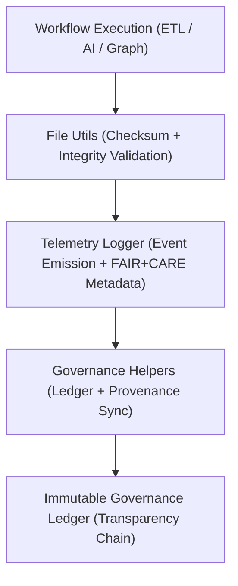

<div align="center">

# 🧮 Kansas Frontier Matrix — **Core Utilities & Governance Toolset**
`src/utils/README.md`

**Purpose:** Provides foundational utilities for configuration management, checksum validation, file handling, and telemetry synchronization across the **Kansas Frontier Matrix**.  
Implements FAIR+CARE-aligned reproducibility, data integrity, and governance observability standards for all system components.

[](../../.github/workflows/utils-validate.yml)  
[](../../docs/standards/faircare-validation.md)  
[](../../docs/architecture/repo-focus.md)

</div>

---

## 📚 Overview

The **Core Utilities Module** provides reusable helper scripts used across KFM pipelines, APIs, and graph integrations.  
It centralizes FAIR+CARE validation, checksum verification, telemetry publishing, and configuration management to ensure unified governance and reproducibility standards throughout the ecosystem.

**Core Objectives:**
- ⚙️ Provide reusable core functions for file, checksum, and configuration management  
- ⚖️ Enforce FAIR+CARE governance integration across all layers  
- 🧠 Automate telemetry collection and ethics reporting  
- 🧾 Ensure checksum-based data integrity for all workflows  
- 🔍 Synchronize configuration and governance metadata between modules  

---

## 🗂️ Directory Layout

```plaintext
src/utils/
├── README.md                   # This file — documentation for utility functions and governance usage
│
├── file_utils.py               # Safe file handling, checksum creation, and data integrity tools
├── config_loader.py            # Configuration manager for YAML/JSON-based workflows
├── telemetry_logger.py         # Centralized telemetry and audit event publisher
└── governance_helpers.py       # Governance synchronization, ethics validation, and provenance utilities
```

**File Descriptions:**

- **`file_utils.py`** — Handles file I/O with automatic checksum generation and validation.  
- **`config_loader.py`** — Loads, validates, and merges configuration files with schema enforcement.  
- **`telemetry_logger.py`** — Logs all operational events and telemetry metrics to Immutable Governance Ledger.  
- **`governance_helpers.py`** — Provides FAIR+CARE alignment checks, ethics audits, and provenance export utilities.

---

## ⚙️ Example Workflows

### 🧮 Verify File Integrity
```python
from src.utils.file_utils import verify_checksum

is_valid = verify_checksum("data/processed/entities.csv", "a3b4f97b...")
print("Checksum valid:", is_valid)
```

---

### ⚙️ Load Configuration File
```python
from src.utils.config_loader import load_config

config = load_config("configs/data_pipeline.yml")
print(config["data"]["source"])
```

---

### 📡 Emit Telemetry Event
```python
from src.utils.telemetry_logger import log_event

log_event(
    action="pipeline_complete",
    context="etl_transform",
    status="success",
    records_processed=5234,
    ethics_score=0.97
)
```

**Example Telemetry Output:**
```json
{
  "action": "pipeline_complete",
  "context": "etl_transform",
  "status": "success",
  "records_processed": 5234,
  "ethics_score": 0.97,
  "governance_hash": "d8b12b7eabf482a1e71dcb95f483ff2c98a7e12a61a6fb05dc74c9b8a118fa44",
  "timestamp": "2025-11-02T00:00:00Z"
}
```

---

### ⚖️ Sync Governance Metadata
```python
from src.utils.governance_helpers import sync_governance

sync_governance(
    input_manifest="releases/v9.4.0/manifest.zip",
    output_ledger="reports/audit/governance-ledger.json"
)
```

---

## 🧩 FAIR+CARE Integration

| Utility | FAIR Principle | CARE Principle | Output |
|----------|----------------|----------------|---------|
| **file_utils.py** | Findable / Reproducible | Responsibility | Checksum validation report |
| **config_loader.py** | Accessible / Interoperable | Ethics | Configuration manifest |
| **telemetry_logger.py** | Transparent / Accountable | Collective Benefit | Telemetry event log |
| **governance_helpers.py** | Traceable / Explainable | Authority to Control | Governance ledger update |

Governance Outputs:
```
reports/audit/governance-ledger.json
releases/v9.4.0/focus-telemetry.json
```

---

## 🔗 Governance & Observability Workflow



**Workflow Summary:**
1. Data pipelines or AI models trigger utility functions for checksum and telemetry.  
2. FAIR+CARE metadata automatically appended to telemetry events.  
3. Governance helpers register validation and audit results.  
4. Immutable Governance Ledger updated to ensure full traceability.  

---

## 🛡️ Security, Integrity & Provenance

- **Integrity:** All utility operations checksum-verified and logged.  
- **Provenance:** Telemetry includes dataset references, FAIR+CARE fields, and audit timestamps.  
- **Reproducibility:** Configs and manifests fully version-controlled for deterministic re-runs.  
- **Governance:** All activities contribute to the Immutable Ledger for long-term accountability.  

Telemetry Schema:  
`schemas/telemetry/system-telemetry-v1.json`

Telemetry Outputs:
```
reports/utils/events.json
reports/audit/governance-ledger.json
releases/v9.4.0/focus-telemetry.json
```

---

## 🧩 Standards & Compliance Mapping

| Standard | Domain | Implementation |
|-----------|----------|----------------|
| **MCP-DL v6.4.3** | Documentation-first utility governance | This README + utility scripts |
| **FAIR+CARE** | Ethical and transparent data handling | FAIR+CARE compliance in utilities |
| **ISO 19115** | Provenance and metadata standards | File integrity and lineage logging |
| **ISO 23894** | Lifecycle accountability for AI & ETL | Telemetry event tracking |
| **DCAT / JSON-LD** | Interoperable metadata governance | Governance helpers and exports |

---

## 🧾 Version History

| Version | Date | Author | Summary |
|----------|------|---------|----------|
| v9.4.0 | 2025-11-02 | @kfm-architecture | Added FAIR+CARE telemetry integration and governance helper suite. |
| v9.3.3 | 2025-11-01 | @kfm-devops | Enhanced file utility checksum verification and config loader logic. |
| v9.3.2 | 2025-10-29 | @bartytime4life | Integrated telemetry schema and ethical metrics in event logs. |
| v9.3.1 | 2025-10-27 | @kfm-governance | Added Immutable Ledger synchronization for governance_helpers. |
| v9.3.0 | 2025-10-25 | @kfm-data | Established core utility framework under MCP-DL v6.4.3. |

---

<div align="center">

**Kansas Frontier Matrix — Ethical Utility Framework for Transparent Systems**  
*“Every file validated. Every event recorded. Every system governed.”* 🔗  
📍 `src/utils/README.md` — FAIR+CARE-certified documentation for core utilities, telemetry, and governance synchronization in the Kansas Frontier Matrix.

</div>
