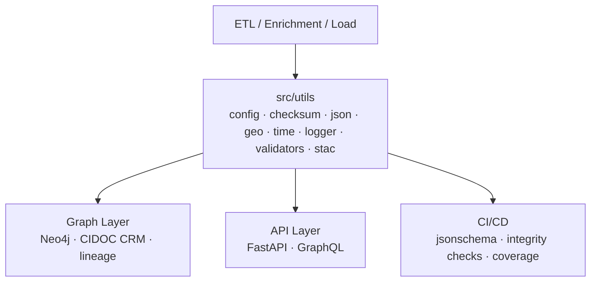

<div align="center">

# ⚙️ Kansas Frontier Matrix — **Core Utilities**  
`src/utils/README.md`

**Shared Tools · Helpers · Configuration · Reproducibility**

[](../../.github/workflows/site.yml)  
[](../../.github/workflows/stac-validate.yml)  
[](../../.github/workflows/codeql.yml)  
[](../../.github/workflows/trivy.yml)  
[](../../docs/)  
[](../../LICENSE)

</div>

---

```yaml
---
title: "KFM • Core Utilities (src/utils)"
version: "v1.8.0"
last_updated: "2025-10-17"
created: "2024-11-05"
owners: ["@kfm-engineering", "@kfm-data", "@kfm-architecture"]
status: "Stable"
maturity: "Production"
tags: ["utilities","config","checksum","json","geo","time","logging","validation","stac","schema","mcp"]
license: "MIT"
semantic_alignment:
  - STAC 1.0.0
  - JSON Schema Draft-07
  - CIDOC CRM (provenance fields)
  - OWL-Time (temporal parsing)
  - DCAT 2.0 (catalog interop)
  - MCP-DL v6.3 (Reproducibility & Provenance)
---
```

## 📚 Table of Contents

1. [🎯 Purpose](#-purpose)  
2. [🏗 Role in the System](#-role-in-the-system)  
3. [📂 Directory Layout](#-directory-layout)  
4. [⚙️ Configuration (`config.py`)](#️-configuration-configpy)  
5. [🔒 Checksums (`checksum.py`)](#-checksums-checksumpy)  
6. [🧮 JSON Tools (`json_tools.py`)](#-json-tools-json_toolspy)  
7. [🌍 Geospatial (`geo_utils.py`)](#-geospatial-geo_utilspy)  
8. [⏱️ Temporal (`time_utils.py`)](#️-temporal-time_utilspy)  
9. [🧾 Logger (`logger.py`)](#-logger-loggerpy)  
10. [✅ Validators (`validators.py`)](#-validators-validatorspy)  
11. [🧷 STAC Helpers (`stac_tools.py`)](#-stac-helpers-stac_toolspy)  
12. [🚀 Quickstart & Examples](#-quickstart--examples)  
13. [🧪 Testing](#-testing)  
14. [🛡 Quality & Security](#-quality--security)  
15. [📈 Performance Notes](#-performance-notes)  
16. [🧮 Versioning & Metadata](#-versioning--metadata)  
17. [🧾 Changelog](#-changelog)  
18. [🔗 Related Documentation](#-related-documentation)

---

## 🎯 Purpose

The **`src/utils/`** package provides **deterministic, dependency-light building blocks** shared by ETL pipelines, AI/NLP modules, the graph loader, and API services.  
Utilities encode **single-responsibility** primitives (config, I/O, hashing, schema checks, temporal & spatial helpers, logging, STAC aids) to uphold **MCP-DL** reproducibility and provenance.

---

## 🏗 Role in the System


<!-- END OF MERMAID -->

**Patterns implemented**

- Env & file **configuration** with explicit **precedence** (file → env)  
- **Atomic** file I/O, secure temp dirs, path hygiene  
- **SHA-256** hashing & `.sha256` sidecars (verify on read)  
- JSON I/O + **JSON Schema** validation  
- **Geo** helpers (bbox ops, haversine, unions/intersections)  
- **Time** helpers (ISO-8601 parsing, intervals, UTC stamps)  
- **Structured logging** (text/JSON) with `run_id`  
- **STAC utilities** (media types, datetimes, bbox checks, small normalizers)

---

## 📂 Directory Layout

```text
src/utils/
├── __init__.py
├── config.py          # YAML/.env/envvars loader + precedence
├── fileio.py          # Atomic R/W, temp dirs, safe path ops
├── checksum.py        # SHA-256 + sidecar write/verify
├── json_tools.py      # JSON I/O + JSON Schema validate
├── geo_utils.py       # bbox ops, haversine, union/intersect
├── time_utils.py      # ISO-8601 parse, intervals, UTC stamps
├── logger.py          # structured logger (text/JSON), run_id
├── validators.py      # required fields, coordinate checks
├── stac_tools.py      # STAC helpers (media, time, bbox normalizers)
└── README.md          # (this file)
```

---

## ⚙️ Configuration (`config.py`)

Centralized config with precedence and environment scoping.

```python
from __future__ import annotations
import os, yaml
from dotenv import load_dotenv

load_dotenv()

def _load_yaml(path: str) -> dict:
    if path and os.path.exists(path):
        with open(path, "r", encoding="utf-8") as f:
            return yaml.safe_load(f) or {}
    return {}

def get_config(file: str | None = "config.yml") -> dict:
    file_cfg = _load_yaml(file) if file else {}
    env_cfg = {k: v for k, v in os.environ.items() if k.startswith("KFM_")}
    return {**env_cfg, **file_cfg}  # file wins on key overlap
```

---

## 🔒 Checksums (`checksum.py`)

Integrity via SHA-256 and sidecar verification.

```python
import hashlib, pathlib

def sha256sum(path: str) -> str:
    h = hashlib.sha256()
    with open(path, "rb") as f:
        for chunk in iter(lambda: f.read(32768), b""):
            h.update(chunk)
    return h.hexdigest()

def write_sidecar(path: str) -> str:
    d = sha256sum(path)
    pathlib.Path(path + ".sha256").write_text(d + "\n", encoding="utf-8")
    return d

def verify(path: str) -> bool:
    sc = pathlib.Path(path + ".sha256")
    return sc.exists() and sc.read_text().strip() == sha256sum(path)
```

---

## 🧮 JSON Tools (`json_tools.py`)

```python
import json, jsonschema
from pathlib import Path

def read_json(path: str | Path) -> dict:
    return json.loads(Path(path).read_text(encoding="utf-8"))

def write_json(obj: dict, path: str | Path, indent: int = 2) -> None:
    Path(path).write_text(json.dumps(obj, indent=indent), encoding="utf-8")

def validate_json(data: dict, schema_path: str | Path) -> None:
    schema = read_json(schema_path)
    jsonschema.validate(instance=data, schema=schema)
```

---

## 🌍 Geospatial (`geo_utils.py`)

```python
import math
from typing import List, Optional

def haversine(lat1: float, lon1: float, lat2: float, lon2: float) -> float:
    R = 6371.0
    dlat, dlon = math.radians(lat2-lat1), math.radians(lon2-lon1)
    a = math.sin(dlat/2)**2 + math.cos(math.radians(lat1)) * math.cos(math.radians(lat2)) * math.sin(dlon/2)**2
    return 2 * R * math.asin(math.sqrt(a))

def bbox_union(a: List[float], b: List[float]) -> List[float]:
    return [min(a[0], b[0]), min(a[1], b[1]), max(a[2], b[2]), max(a[3], b[3])]

def bbox_intersection(a: List[float], b: List[float]) -> Optional[List[float]]:
    x0, y0 = max(a[0], b[0]), max(a[1], b[1])
    x1, y1 = min(a[2], b[2]), min(a[3], b[3])
    return [x0, y0, x1, y1] if (x0 < x1 and y0 < y1) else None
```

---

## ⏱️ Temporal (`time_utils.py`)

```python
from __future__ import annotations
from datetime import datetime
from typing import Optional, Tuple

def parse_date(s: str) -> Optional[str]:
    try:
        return datetime.fromisoformat(s.replace("Z","")).date().isoformat()
    except Exception:
        return None

def parse_interval(start: str | None, end: str | None) -> Optional[Tuple[str, str]]:
    s, e = parse_date(start) if start else None, parse_date(end) if end else None
    return (s, e) if s and e and s <= e else None

def now_iso() -> str:
    return datetime.utcnow().isoformat(timespec="seconds") + "Z"
```

---

## 🧾 Logger (`logger.py`)

```python
import json, logging, sys, uuid
from contextvars import ContextVar

_run_id: ContextVar[str] = ContextVar("_run_id", default=str(uuid.uuid4()))
_log = logging.getLogger("kfm")
_hdl = logging.StreamHandler(sys.stdout)
_hdl.setFormatter(logging.Formatter("[%(asctime)s] [%(levelname)s] %(message)s"))
_log.addHandler(_hdl)
_log.setLevel(logging.INFO)

def set_run_id(run_id: str | None = None) -> str:
    rid = run_id or str(uuid.uuid4()); _run_id.set(rid); return rid

def log(msg: str, level: str = "info", json_mode: bool = False, **fields):
    rid = _run_id.get()
    if json_mode:
        print(json.dumps({"run_id": rid, "level": level.upper(), "msg": msg, **fields}, ensure_ascii=False))
    else:
        getattr(_log, level)(f"[run_id={rid}] {msg} {fields if fields else ''}")
```

---

## ✅ Validators (`validators.py`)

```python
def ensure_fields(data: dict, required: list[str]) -> None:
    missing = [k for k in required if k not in data]
    if missing:
        raise KeyError(f"Missing required fields: {', '.join(missing)}")

def is_valid_coordinate(lat: float, lon: float) -> bool:
    return -90 <= lat <= 90 and -180 <= lon <= 180
```

---

## 🧷 STAC Helpers (`stac_tools.py`)

```python
MEDIA = {
  "cog": "image/tiff; application=geotiff; profile=cloud-optimized",
  "geojson": "application/geo+json"
}

def normalize_asset_media(ext: str) -> str:
    return MEDIA.get(ext.lower(), "application/octet-stream")

def ensure_temporal(props: dict) -> dict:
    if "start_datetime" in props and "end_datetime" in props:
        return props
    if "datetime" in props:
        props["start_datetime"] = props["end_datetime"] = props["datetime"]
    return props

def ensure_bbox(item: dict) -> dict:
    if "bbox" not in item and "geometry" in item:
        coords = item["geometry"]["coordinates"][0]
        xs, ys = zip(*coords)
        item["bbox"] = [min(xs), min(ys), max(xs), max(ys)]
    return item
```

---

## 🚀 Quickstart & Examples

```bash
# Install deps for utils usage (usually installed at repo root)
pip install -r requirements.txt

# Example: emit checksum + metadata sidecar
python - <<'PY'
from src.utils import checksum, json_tools, time_utils
path = "data/processed/ks_1m_dem.tif"
sha  = checksum.write_sidecar(path)
json_tools.write_json({"path": path, "sha256": sha, "at": time_utils.now_iso()}, path + ".meta.json")
print("OK", sha)
PY
```

---

## 🧪 Testing

```bash
pytest tests/utils -v --cov=src/utils --cov-report=term-missing
```

- **Pre-commit:** `ruff` · `black` · `mypy`  
- **Schema checks:** JSON Schemas for configs and STAC snippets  
- **Reproducibility:** checksum verification in CI

---

## 🛡 Quality & Security

- Do **not** log secrets; redact values matching `*_TOKEN` / `*_KEY` patterns  
- Validate external JSON via **JSON Schema** before use  
- Use **atomic writes** and temp dirs; guard against path traversal  
- Prefer read-only operations in notebooks; confine mutations to temp dirs  
- Containers scanned via **Trivy**; code analyzed via **CodeQL**

---

## 📈 Performance Notes

- Stream file reads in **32 KiB** chunks when hashing  
- Keep `geo_utils` math-only (no GDAL dependency)  
- Cache config in-process; set `KFM_RELOAD_CONFIG=1` to force reload

---

## 🧮 Versioning & Metadata

| Field | Value |
| :-- | :-- |
| **Version** | `v1.8.0` |
| **Codename** | *Complete Utilities Parity* |
| **Last Updated** | 2025-10-17 |
| **Maintainers** | @kfm-engineering · @kfm-data |
| **License** | MIT (code) |
| **Semantic Alignment** | STAC 1.0 · JSON Schema · OWL-Time · DCAT 2.0 · MCP-DL v6.3 |
| **Maturity** | Production |
| **Integrity** | CI verifies schema + checksums + coverage |

---

## 🧾 Changelog

| Version | Date | Author | Summary |
| :-- | :-- | :-- | :-- |
| **v1.8.0** | 2025-10-17 | @kfm-engineering | Added ToC, Quickstart, Security & Performance sections; expanded examples; aligned with MCP-DL v6.3 |
| **v1.7.1** | 2025-10-17 | @kfm-engineering | Added changelog; integrated DCAT fields; small API examples |
| **v1.7.0** | 2025-10-17 | @kfm-engineering | Introduced `stac_tools.py`; unified logging schema; MCP-DL v6.3 compliance |
| **v1.6.0** | 2025-10-14 | @kfm-data | Structured logger, ISO-8601 parser, checksum refinements |
| **v1.5.0** | 2025-09-25 | @kfm-architecture | Modularized file I/O & config loading; initial testing utilities |

---

## 🔗 Related Documentation

- **System Architecture** — `../ARCHITECTURE.md`  
- **ETL & STAC Pipelines** — `../../tools/README.md` · `../../data/stac/README.md`  
- **API Services** — `../api/README.md`  
- **Graph Schema** — `../graph/README.md`

---

<div align="center">

**© Kansas Frontier Matrix 2025**  
*Efficient Utilities · Transparent Workflows · Provenance by Design*

</div>