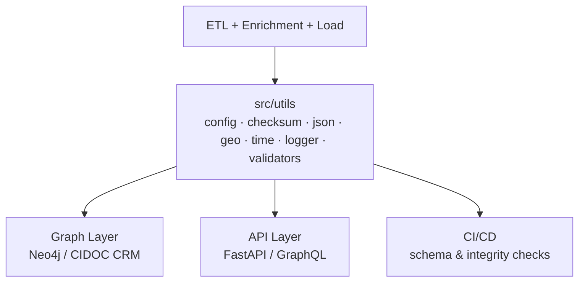

<div align="center">

# ⚙️ Kansas Frontier Matrix — **Core Utilities**  
`src/utils/README.md`

**Shared Tools · Helpers · Configuration · Reproducibility**

[](../../.github/workflows/site.yml)
[](../../.github/workflows/stac-validate.yml)
[](../../.github/workflows/codeql.yml)
[](../../.github/workflows/trivy.yml)
[](../../docs/)
[](../../LICENSE)

</div>

---

```yaml
---
title: "KFM • Core Utilities (src/utils)"
version: "v1.6.0"
last_updated: "2025-10-14"
owners: ["@kfm-engineering", "@kfm-data"]
tags: ["utilities","config","checksum","json","geo","time","logging","validation","mcp"]
license: "MIT"
semantic_alignment:
  - STAC 1.0.0
  - JSON Schema (Draft-07)
  - CIDOC CRM (provenance fields)
  - OWL-Time (temporal parsing)
  - MCP-DL v6.2 (Reproducibility & Provenance)
---
````

## 🎯 Purpose

The **`src/utils/`** package provides **lightweight, shared building blocks** used by KFM’s ETL pipelines, AI/NLP modules, graph loader, and API services.
Utilities are designed to be **deterministic**, **dependency-minimal**, and **auditable**, aligning with **Master Coder Protocol (MCP-DL v6.2)**.

---

## 🏗️ Role in the System



Utilities implement **common patterns**:

* Env configuration & precedence
* File I/O, checksums, and provenance
* Structured logging (text/JSON) with run IDs
* JSON read/write + schema validation
* Spatial helpers (bbox, distance, projection hints)
* Temporal parsing & ISO-8601 normalization
* Lightweight validators (required fields, types)

---

## 📂 Directory Layout

```text
src/utils/
├── __init__.py
├── config.py          # Global config loader (YAML/.env/envvars) + precedence
├── fileio.py          # Safe file read/write (atomic), temp dirs, path tooling
├── checksum.py        # SHA-256 hashing, sidecar generation/verify
├── json_tools.py      # JSON read/write + JSON Schema validation
├── geo_utils.py       # BBox ops, haversine, bbox union/intersect, EPSG hints
├── time_utils.py      # ISO 8601 parsing, intervals, humanization
├── logger.py          # Structured logger (text/JSON), run_id, context vars
├── validators.py      # Required-field checks, coordinate validation
└── README.md          # (this file)
```

---

## ⚙️ Configuration (`config.py`)

Centralizes config loading with clear **precedence**:

1. **Explicit file** passed to `get_config(file=...)`
2. `config.yml` in CWD
3. **Environment variables** (`KFM_*`) loaded via `.env` + process env

```python
# config.py
from __future__ import annotations
import os, yaml
from dotenv import load_dotenv

load_dotenv()

def _load_yaml(path: str) -> dict:
    if os.path.exists(path):
        with open(path, "r", encoding="utf-8") as f:
            return yaml.safe_load(f) or {}
    return {}

def get_config(file: str | None = "config.yml") -> dict:
    file_cfg = _load_yaml(file) if file else {}
    env_cfg = {k: v for k, v in os.environ.items() if k.startswith("KFM_")}
    # file overrides env only for explicit keys; env remains accessible
    return {**env_cfg, **file_cfg}
```

**Usage**

```python
from src.utils.config import get_config
cfg = get_config()
neo4j_uri = cfg.get("KFM_NEO4J_URI", "bolt://localhost:7687")
```

---

## 🔒 Checksums (`checksum.py`)

Provides **integrity verification** and provenance tracking with `.sha256` sidecars.

```python
# checksum.py
import hashlib, pathlib

def sha256sum(path: str) -> str:
    h = hashlib.sha256()
    with open(path, "rb") as f:
        for chunk in iter(lambda: f.read(1 << 15), b""):
            h.update(chunk)
    return h.hexdigest()

def write_sidecar(path: str) -> str:
    digest = sha256sum(path)
    with open(path + ".sha256", "w", encoding="utf-8") as s:
        s.write(digest + "\n")
    return digest

def verify(path: str) -> bool:
    chk = pathlib.Path(path + ".sha256")
    return chk.exists() and chk.read_text().strip() == sha256sum(path)
```

---

## 🧮 JSON Tools (`json_tools.py`)

Simple JSON I/O + schema validation (Draft-07).

```python
import json, jsonschema
from pathlib import Path

def read_json(path: str | Path) -> dict:
    return json.loads(Path(path).read_text(encoding="utf-8"))

def write_json(obj: dict, path: str | Path, indent: int = 2) -> None:
    Path(path).write_text(json.dumps(obj, indent=indent), encoding="utf-8")

def validate_json(data: dict, schema_path: str | Path) -> None:
    schema = read_json(schema_path)
    jsonschema.validate(instance=data, schema=schema)
```

---

## 🌍 Geospatial Utilities (`geo_utils.py`)

Lightweight spatial operations (no heavy GIS runtime).

```python
import math
from typing import List

def haversine(lat1: float, lon1: float, lat2: float, lon2: float) -> float:
    R = 6371.0
    dlat, dlon = math.radians(lat2-lat1), math.radians(lon2-lon1)
    a = math.sin(dlat/2)**2 + math.cos(math.radians(lat1)) * math.cos(math.radians(lat2)) * math.sin(dlon/2)**2
    return 2 * R * math.asin(math.sqrt(a))

def bbox_union(b1: List[float], b2: List[float]) -> List[float]:
    return [min(b1[0], b2[0]), min(b1[1], b2[1]), max(b1[2], b2[2]), max(b1[3], b2[3])]

def bbox_intersection(b1: List[float], b2: List[float]) -> List[float] | None:
    x_min, y_min = max(b1[0], b2[0]), max(b1[1], b2[1])
    x_max, y_max = min(b1[2], b2[2]), min(b1[3], b2[3])
    return [x_min, y_min, x_max, y_max] if (x_min < x_max and y_min < y_max) else None
```

---

## ⏱️ Temporal Utilities (`time_utils.py`)

ISO-8601 parsing + intervals; UTC-safe timestamps.

```python
from __future__ import annotations
from datetime import datetime
from typing import Optional, Tuple

def parse_date(date_str: str) -> Optional[str]:
    try:
        return datetime.fromisoformat(date_str.replace("Z","")).date().isoformat()
    except Exception:
        return None

def parse_interval(start: str | None, end: str | None) -> Optional[Tuple[str, str]]:
    s, e = parse_date(start) if start else None, parse_date(end) if end else None
    return (s, e) if s and e and s <= e else None

def now_iso() -> str:
    return datetime.utcnow().isoformat(timespec="seconds") + "Z"
```

---

## 🧾 Logger (`logger.py`)

Structured logger with **text/JSON** modes and **run_id** context.

```python
import json, logging, sys, uuid
from contextvars import ContextVar

_run_id: ContextVar[str] = ContextVar("_run_id", default=str(uuid.uuid4()))
_logger = logging.getLogger("kfm")
_handler = logging.StreamHandler(sys.stdout)
_handler.setFormatter(logging.Formatter("[%(asctime)s] [%(levelname)s] %(message)s"))
_logger.addHandler(_handler)
_logger.setLevel(logging.INFO)

def set_run_id(run_id: str | None = None) -> str:
    rid = run_id or str(uuid.uuid4()); _run_id.set(rid); return rid

def log(msg: str, level: str = "info", json_mode: bool = False, **fields):
    rid = _run_id.get()
    if json_mode:
        payload = {"run_id": rid, "level": level.upper(), "msg": msg, **fields}
        print(json.dumps(payload, ensure_ascii=False))
    else:
        getattr(_logger, level)(f"[run_id={rid}] {msg} {fields if fields else ''}")
```

---

## 🧩 Validators (`validators.py`)

Basic checks for data integrity.

```python
def ensure_fields(data: dict, required: list[str]) -> None:
    missing = [k for k in required if k not in data]
    if missing:
        raise KeyError(f"Missing required fields: {', '.join(missing)}")

def is_valid_coordinate(lat: float, lon: float) -> bool:
    return -90 <= lat <= 90 and -180 <= lon <= 180
```

---

## 🧰 Usage Examples

```python
from src.utils import checksum, time_utils, logger, json_tools

f = "data/processed/ks_1m_dem.tif"
digest = checksum.write_sidecar(f)
logger.log(f"Checksum {digest} generated for {f}", action="write_sha")

meta = {"id": "ks_dem", "generated_at": time_utils.now_iso(), "sha256": digest}
json_tools.write_json(meta, "data/processed/ks_dem.meta.json")
```

Logs

```
[2025-10-14 12:45:03,120] [INFO] [run_id=3f2e...] Checksum e0d... generated for data/processed/ks_1m_dem.tif {'action': 'write_sha'}
```

---

## 🧪 Testing

Run utility tests (see `tests/utils/`):

```bash
pytest tests/utils -v --cov=src/utils --cov-report=term-missing
```

Quality gates (pre-commit):

* `ruff` · `black` · `mypy`
* JSON Schema checks for sample configs
* Reproducibility checksums in CI

---

## 🔒 Security & Hardening

* Never log secrets; redact values matching `*_TOKEN` / `*_KEY` patterns.
* Validate external JSON against **JSON Schema** before use.
* Treat all file paths as untrusted; use **atomic writes** (`fileio.py`) and restrict traversal.
* Prefer **read-only** operations in notebooks; use temp dirs for mutations.

---

## ⚙️ Performance Notes

* Stream file reads in **8–32 KiB** chunks when hashing.
* Avoid heavy GIS ops in `geo_utils` — keep functions O(1)/O(n) math only.
* Cache configuration in memory per process; re-read on `KFM_RELOAD_CONFIG=1`.

---

## 🧠 MCP Compliance Checklist

| MCP Principle       | Implementation                                  |
| :------------------ | :---------------------------------------------- |
| Documentation-first | Docstrings + this README + examples             |
| Reproducibility     | Checksums, deterministic outputs, CI validation |
| Provenance          | Run IDs in logs, sidecar hashes, metadata JSON  |
| Accessibility       | Clear error messages; human-readable logs       |
| Open Standards      | JSON, JSON Schema, ISO-8601, EPSG:4326          |
| Auditability        | Structured logs, schema reports, coverage ≥ 90% |

---

## 🔗 Related Documentation

* **System Architecture** — `../ARCHITECTURE.md`
* **ETL & STAC Pipelines** — `../../tools/README.md` · `../../data/stac/README.md`
* **API Services** — `../api/README.md`
* **Graph Schema** — `../graph/README.md`

---

<div align="center">

**Kansas Frontier Matrix © 2025**
*Efficient Utilities · Transparent Workflows · Provenance by Design*

</div>
```
