<div align="center">

# ⚙️ Kansas Frontier Matrix — **Core Utilities**  
`src/utils/README.md`

**Shared Tools · Helpers · Configuration · Reproducibility**

[](../../.github/workflows/site.yml)  
[](../../.github/workflows/stac-validate.yml)  
[](../../.github/workflows/codeql.yml)  
[](../../.github/workflows/trivy.yml)  
[](../../docs/)  
[](../../LICENSE)

</div>

---

```yaml
---
title: "KFM • Core Utilities (src/utils)"
version: "v1.7.0"
last_updated: "2025-10-17"
created: "2024-11-05"
owners: ["@kfm-engineering", "@kfm-data", "@kfm-architecture"]
status: "Stable"
maturity: "Production"
tags: ["utilities","config","checksum","json","geo","time","logging","validation","stac","mcp"]
license: "MIT"
semantic_alignment:
  - STAC 1.0.0
  - JSON Schema Draft-07
  - CIDOC CRM (provenance fields)
  - OWL-Time (temporal parsing)
  - DCAT 2.0 (catalog interop)
  - MCP-DL v6.3 (Reproducibility & Provenance)
---
```

## 🎯 Purpose

The **`src/utils/`** package provides **deterministic, dependency-light building blocks** shared by ETL pipelines, AI/NLP modules, the graph loader, and API services.  
Utilities encode **single-responsibility** primitives (config, I/O, hashing, schema checks, temporal & spatial helpers, logging) to uphold **MCP-DL** reproducibility and provenance.

---

## 🏗️ Role in the System

```mermaid
flowchart TD
  A["ETL / Enrichment / Load"] --> U["src/utils<br/>config · checksum · json · geo · time · logger · validators · stac"]
  U --> G["Graph Layer<br/>Neo4j · CIDOC CRM · lineage"]
  U --> API["API Layer<br/>FastAPI · GraphQL"]
  U --> CI["CI/CD<br/>jsonschema · integrity checks · coverage"]
```


<!-- END OF MERMAID -->

**Patterns implemented**

- Env & file **configuration** with explicit **precedence** (file → env)  
- **Atomic** file I/O, secure temp dirs, path hygiene  
- **SHA-256** hashing & `.sha256` sidecars (verify on read)  
- JSON I/O + **JSON Schema** validation  
- **Geo** helpers (bbox ops, haversine, unions/intersections)  
- **Time** helpers (ISO-8601 parsing, intervals, UTC stamps)  
- **Structured logging** (text/JSON) with `run_id` and fields  
- **STAC utilities** (asset media types, datetime fields, bbox checks)

---

## 📂 Directory Layout

```text
src/utils/
├── __init__.py
├── config.py          # YAML/.env/envvars loader + precedence
├── fileio.py          # Atomic R/W, temp dirs, safe path ops
├── checksum.py        # SHA-256 + sidecar write/verify
├── json_tools.py      # JSON I/O + JSON Schema validate
├── geo_utils.py       # bbox ops, haversine, union/intersect
├── time_utils.py      # ISO-8601 parse, intervals, UTC stamps
├── logger.py          # structured logger (text/JSON), run_id
├── validators.py      # required fields, coordinate checks
├── stac_tools.py      # STAC small helpers (media types, time, bbox)
└── README.md          # (this file)
```

---

## ⚙️ Configuration (`config.py`)

Centralized config with clear precedence and environment scoping.

```python
# config.py
from __future__ import annotations
import os, yaml
from dotenv import load_dotenv

load_dotenv()  # loads .env into process env

def _load_yaml(path: str) -> dict:
    if path and os.path.exists(path):
        with open(path, "r", encoding="utf-8") as f:
            return yaml.safe_load(f) or {}
    return {}

def get_config(file: str | None = "config.yml") -> dict:
    file_cfg = _load_yaml(file) if file else {}
    env_cfg = {k: v for k, v in os.environ.items() if k.startswith("KFM_")}
    # explicit file takes priority; env remains accessible
    merged = {**env_cfg, **file_cfg}
    return merged
```

**Usage**

```python
from src.utils.config import get_config
cfg = get_config()
neo4j_uri = cfg.get("KFM_NEO4J_URI", "bolt://localhost:7687")
```

---

## 🔒 Checksums (`checksum.py`)

Integrity via SHA-256 and sidecar verification.

```python
# checksum.py
import hashlib, pathlib

def sha256sum(path: str) -> str:
    h = hashlib.sha256()
    with open(path, "rb") as f:
        for chunk in iter(lambda: f.read(32768), b""):
            h.update(chunk)
    return h.hexdigest()

def write_sidecar(path: str) -> str:
    d = sha256sum(path)
    pathlib.Path(path + ".sha256").write_text(d + "\n", encoding="utf-8")
    return d

def verify(path: str) -> bool:
    sc = pathlib.Path(path + ".sha256")
    return sc.exists() and sc.read_text().strip() == sha256sum(path)
```

---

## 🧮 JSON Tools (`json_tools.py`)

```python
import json, jsonschema
from pathlib import Path

def read_json(path: str | Path) -> dict:
    return json.loads(Path(path).read_text(encoding="utf-8"))

def write_json(obj: dict, path: str | Path, indent: int = 2) -> None:
    Path(path).write_text(json.dumps(obj, indent=indent), encoding="utf-8")

def validate_json(data: dict, schema_path: str | Path) -> None:
    schema = read_json(schema_path)
    jsonschema.validate(instance=data, schema=schema)
```

---

## 🌍 Geospatial Utilities (`geo_utils.py`)

```python
import math
from typing import List, Optional

def haversine(lat1: float, lon1: float, lat2: float, lon2: float) -> float:
    R = 6371.0
    dlat, dlon = math.radians(lat2-lat1), math.radians(lon2-lon1)
    a = math.sin(dlat/2)**2 + math.cos(math.radians(lat1)) * math.cos(math.radians(lat2)) * math.sin(dlon/2)**2
    return 2 * R * math.asin(math.sqrt(a))

def bbox_union(a: List[float], b: List[float]) -> List[float]:
    return [min(a[0], b[0]), min(a[1], b[1]), max(a[2], b[2]), max(a[3], b[3])]

def bbox_intersection(a: List[float], b: List[float]) -> Optional[List[float]]:
    x0, y0 = max(a[0], b[0]), max(a[1], b[1])
    x1, y1 = min(a[2], b[2]), min(a[3], b[3])
    return [x0, y0, x1, y1] if (x0 < x1 and y0 < y1) else None
```

---

## ⏱️ Temporal Utilities (`time_utils.py`)

```python
from __future__ import annotations
from datetime import datetime
from typing import Optional, Tuple

def parse_date(s: str) -> Optional[str]:
    try:
        return datetime.fromisoformat(s.replace("Z","")).date().isoformat()
    except Exception:
        return None

def parse_interval(start: str | None, end: str | None) -> Optional[Tuple[str, str]]:
    s, e = parse_date(start) if start else None, parse_date(end) if end else None
    return (s, e) if s and e and s <= e else None

def now_iso() -> str:
    return datetime.utcnow().isoformat(timespec="seconds") + "Z"
```

---

## 🧾 Logger (`logger.py`)

```python
import json, logging, sys, uuid
from contextvars import ContextVar

_run_id: ContextVar[str] = ContextVar("_run_id", default=str(uuid.uuid4()))
_log = logging.getLogger("kfm")
_hdl = logging.StreamHandler(sys.stdout)
_hdl.setFormatter(logging.Formatter("[%(asctime)s] [%(levelname)s] %(message)s"))
_log.addHandler(_hdl)
_log.setLevel(logging.INFO)

def set_run_id(run_id: str | None = None) -> str:
    rid = run_id or str(uuid.uuid4()); _run_id.set(rid); return rid

def log(msg: str, level: str = "info", json_mode: bool = False, **fields):
    rid = _run_id.get()
    if json_mode:
        print(json.dumps({"run_id": rid, "level": level.upper(), "msg": msg, **fields}, ensure_ascii=False))
    else:
        getattr(_log, level)(f"[run_id={rid}] {msg} {fields if fields else ''}")
```

---

## 🧩 Validators (`validators.py`)

```python
def ensure_fields(data: dict, required: list[str]) -> None:
    missing = [k for k in required if k not in data]
    if missing:
        raise KeyError(f"Missing required fields: {', '.join(missing)}")

def is_valid_coordinate(lat: float, lon: float) -> bool:
    return -90 <= lat <= 90 and -180 <= lon <= 180
```

---

## 📦 STAC Helpers (`stac_tools.py`)

Small helpers for consistent STAC authoring/validation.

```python
MEDIA = {
  "cog": "image/tiff; application=geotiff; profile=cloud-optimized",
  "geojson": "application/geo+json"
}

def normalize_asset_media(ext: str) -> str:
    return MEDIA.get(ext.lower(), "application/octet-stream")

def ensure_temporal(props: dict) -> dict:
    # prefer start/end; fall back to datetime
    if "start_datetime" in props and "end_datetime" in props:
        return props
    if "datetime" in props:
        props["start_datetime"] = props["end_datetime"] = props["datetime"]
    return props

def ensure_bbox(item: dict) -> dict:
    if "bbox" not in item and "geometry" in item:
        coords = item["geometry"]["coordinates"][0]
        xs, ys = zip(*coords)
        item["bbox"] = [min(xs), min(ys), max(xs), max(ys)]
    return item
```

---

## 🧰 Usage Examples

```python
from src.utils import checksum, time_utils, logger, json_tools, stac_tools

f = "data/processed/ks_1m_dem.tif"
digest = checksum.write_sidecar(f)
logger.log("checksum generated", action="write_sha", path=f, sha256=digest)

meta = {"id": "ks_dem", "generated_at": time_utils.now_iso(), "sha256": digest}
json_tools.write_json(meta, "data/processed/ks_dem.meta.json")

item = json_tools.read_json("data/stac/items/ks_dem.json")
item["assets"]["image"]["type"] = stac_tools.normalize_asset_media("cog")
json_tools.write_json(stac_tools.ensure_bbox(stac_tools.ensure_temporal(item)), "data/stac/items/ks_dem.json")
```

---

## 🧪 Testing

```bash
pytest tests/utils -v --cov=src/utils --cov-report=term-missing
```

- Pre-commit: `ruff` · `black` · `mypy`  
- JSON Schema checks for sample configs  
- Reproducibility checksums in CI

---

## 🔒 Security & Hardening

- Do **not** log secrets; redact values matching `*_TOKEN` / `*_KEY` patterns  
- Validate external JSON with **JSON Schema** before use  
- Atomic writes for outputs; guard against path traversal  
- Prefer read-only ops in notebooks; isolate mutations in temp dirs

---

## ⚙️ Performance Notes

- Stream file reads in **32 KiB** chunks when hashing  
- Keep `geo_utils` math-only (no GDAL dependency)  
- Cache config in-process; set `KFM_RELOAD_CONFIG=1` to force reload

---

## 🧮 Versioning & Metadata

| Field | Value |
| :-- | :-- |
| **Version** | `v1.7.0` |
| **Codename** | *Deterministic Utilities Refresh* |
| **Last Updated** | 2025-10-17 |
| **Maintainers** | @kfm-engineering · @kfm-data |
| **License** | MIT (code) |
| **Semantic Alignment** | STAC 1.0 · JSON Schema · OWL-Time · DCAT 2.0 · MCP-DL v6.3 |
| **Maturity** | Production |
| **Integrity** | CI verifies schema + checksums + coverage |

---

## 🧠 MCP-DL v6.3 Compliance

| Principle | Implementation |
| :-- | :-- |
| Documentation-first | Docstrings + this README + runnable snippets |
| Reproducibility | Checksums, deterministic outputs, CI validation |
| Provenance | Run IDs, sidecar hashes, metadata JSON |
| Accessibility | Clear errors; readable logs; UTF-8 everywhere |
| Open Standards | JSON, JSON Schema, ISO-8601, EPSG:4326, STAC |
| Auditability | Structured logs, schema reports, coverage ≥ 90% |

---

## 🔗 Related Documentation

- **System Architecture** — `../ARCHITECTURE.md`  
- **ETL & STAC Pipelines** — `../../tools/README.md` · `../../data/stac/README.md`  
- **API Services** — `../api/README.md`  
- **Graph Schema** — `../graph/README.md`

---

<div align="center">

**© Kansas Frontier Matrix 2025**  
*Efficient Utilities · Transparent Workflows · Provenance by Design*

</div>