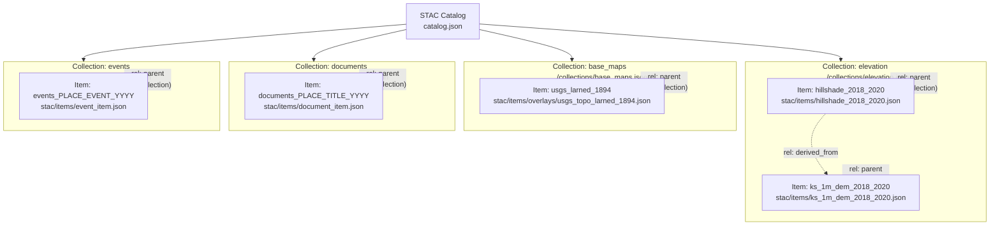

Here’s the **full cleaned `/stac/items/README.md`** with the diagrams included.
You can copy-paste this directly into your repo.

---

````markdown
# STAC Items — Kansas-Frontier-Matrix

This folder contains **STAC 1.0.0 Item JSONs**.  
Each Item represents a single **spatiotemporal asset** (map, raster, vector, document, or event record) in the Kansas-Frontier-Matrix catalog.

An Item is always linked to a **Collection** (`collection` field + `rel: collection` link).

---

## Item Structure

Each Item must include:

- **id** — unique identifier (e.g. `usgs_larned_1894`, `hillshade_2018_2020`)
- **type** — always `"Feature"`
- **stac_version** — `"1.0.0"`
- **geometry** — footprint (Polygon), point location, or line
- **bbox** — bounding box `[west, south, east, north]`
- **properties**:
  - `datetime` (ISO 8601) or `start_datetime` / `end_datetime`
  - Required: `proj:epsg` (usually 4326)
  - Optional: `raster:*` (bands), `gsd`, `file:size`, `checksum:sha256`
  - Thematic keys: `document:type`, `event:type`, `uncertainty:*`
- **assets** — dictionary of downloadable/visualizable files:
  - Examples: `cog`, `thumbnail`, `geojson`, `pdf`, `txt`, `metadata`
- **links**:
  - `rel: self` → this Item file
  - `rel: collection` → parent Collection
  - `rel: parent` → parent Collection (same as above)
  - `rel: root` → `catalog.json`

---

## Examples

### Historical Map (Raster)
Item: `usgs_larned_1894.json`

- **Collection**: `base_maps`
- **Geometry**: footprint polygon from georeferencing
- **Properties**:  
  `datetime: "1894-06-01T00:00:00Z"`
- **Assets**:
  - `cog` → Cloud-Optimized GeoTIFF
  - `thumbnail` → preview PNG
  - optional: `kml` overlay

---

### Hillshade (DEM-derived)
Item: `hillshade_2018_2020.json`

- **Collection**: `elevation`
- **Geometry**: full Kansas bbox
- **Properties**:  
  `start_datetime: "2018-01-01T00:00:00Z"`,  
  `end_datetime: "2020-12-31T23:59:59Z"`
- **Assets**:
  - `cog` → statewide hillshade COG
  - `metadata` → JSON build notes

---

### Archival Document (Text)
Item: `treaty_kansas_1854.json`

- **Collection**: `documents`
- **Geometry**: polygon of treaty boundary (or centroid point)
- **Properties**:
  - `datetime: "1854-05-18T00:00:00Z"`
  - `document:type: "treaty"`
- **Assets**:
  - `pdf` → scanned source
  - `txt` → OCR transcript
  - optional: `summary` → synopsis

---

### Event Record
Item: `greensburg_tornado_2007.json`

- **Collection**: `events`
- **Geometry**: tornado track line
- **Properties**:
  - `datetime: "2007-05-04T21:45:00Z"`
  - `event:type: "tornado"`
- **Assets**:
  - `geojson` → track polyline
  - `report` → NOAA/SPC event report

---

## Design Notes

- Items capture **atomic data points**; Collections group thematically.  
- Use **file:size** + **checksum:sha256** for reproducibility ([Design Audit — Gaps and Enhancement Opportunities][audit]).  
- Include **uncertainty fields** (`uncertainty:*`) when georeferencing or NLP confidence < 1 ([Audit: Uncertainty Layer][audit]).  
- **Document Items** can be enriched via the Knowledge Hub ingestion pipeline ([Knowledge Hub System Design][hub]).  
- **Environmental Items** (DEM, climate, hazards) may link to external sources (NOAA, USGS, Daymet, FEMA, NIFC) ([Dataset Integration Guide][datasets]).

---

## Adding New Items

1. Copy a template JSON from `templates/`.
2. Fill in:
   - `id`
   - `geometry` + `bbox`
   - `properties`
   - `assets`
3. Set the correct `collection` and `links`.
4. Run validation:
   ```bash
   stac-validate stac/items/<item>.json
````

5. Open a Pull Request describing source, provenance, and uncertainty.

---

## CI autofill (checksums & sizes)

Add file sizes and checksums in CI/CD:

```bash
J=stac/items/<item>.json
for A in cog dem image geojson pdf txt; do
  F=$(jq -r ".assets[\"$A\"].href // empty" "$J")
  [ -n "$F" ] || continue
  SIZE=$(wc -c < "$F" | tr -d ' ')
  SHA=$(sha256sum "$F" | awk '{print $1}')
  jq --arg a "$A" --argjson s "$SIZE" --arg sha "$SHA" \
     '.assets[$a]["file:size"]=$s | .assets[$a]["checksum:sha256"]=$sha' \
     "$J" > "$J.tmp" && mv "$J.tmp" "$J"
done
jq '.properties.updated=(now|toiso8601)' "$J" > "$J.tmp" && mv "$J.tmp" "$J"
```

---

## Diagrams

### Catalog → Collections → Items



---

### Item Anatomy

```mermaid
flowchart LR
  I["Item JSON\n(type: \"Feature\")"]

  subgraph P["properties"]
    T["\"title\""]
    D["\"description\""]
    DT["\"datetime\" or\n\"start_datetime\"/\"end_datetime\""]
    EPSG["\"proj:epsg\" = 4326"]
  end

  subgraph G["spatial"]
    GEOM["\"geometry\""]
    BBOX["\"bbox\""]
  end

  subgraph A["assets"]
    COG["\"cog\" → COG GeoTIFF\nroles: data, visual"]
    THMB["\"thumbnail\" → PNG\nroles: thumbnail, overview"]
    META["\"metadata\" → JSON\nroles: metadata"]
  end

  subgraph L["links"]
    SELF["rel: self\n\"./<item>.json\""]
    COLL["rel: collection\n\"../collections/<collection>.json\""]
    PARENT["rel: parent\n(same as collection)"]
    ROOT["rel: root\n\"../catalog.json\""]
  end

  I --> P
  I --> G
  I --> A
  I --> L
```

---

## References

* STAC Spec 1.0.0
* [Kansas-Frontier-Matrix Design Audit – Gaps and Enhancement Opportunities][audit]
* [Kansas Historical Knowledge Hub – System Design][hub]
* [Historical Dataset Integration for Kansas Frontier Matrix][datasets]

---

**Tip:** Items are the **leaves** of the STAC tree. Collections are the **branches**, the Catalog is the **trunk**.

---

[audit]: file-service://file-BgUSuffTiRq4qidye2sPwN
[hub]: file-service://file-P6gGz263QNwmmVYw8LBSvB
[datasets]: file-service://file-EG371w17RJTzXWjXvqgsB6

```

---

Do you want me to also prepare a **validation workflow diagram** (author → `stac-validate` → CI → PR) for this README? That would show how Items move from draft → validation → published.
```
