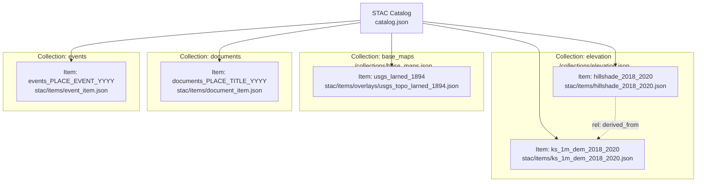
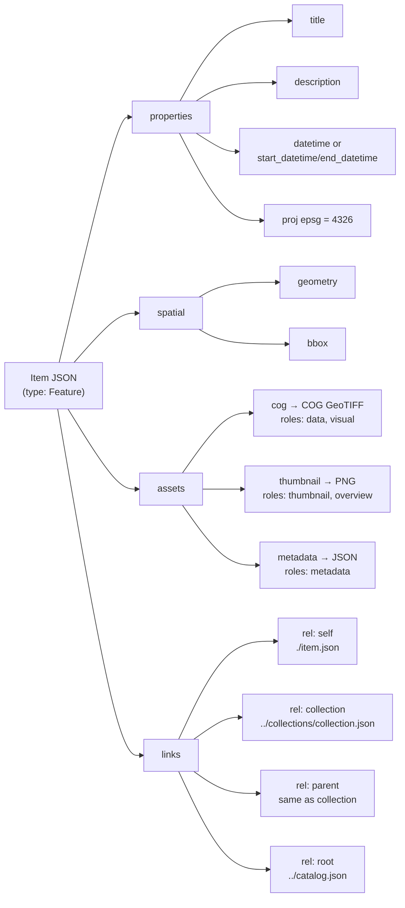
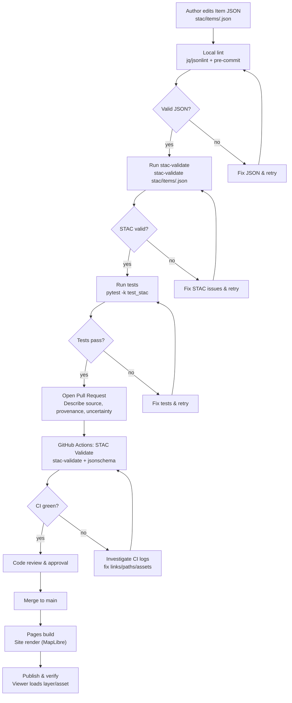
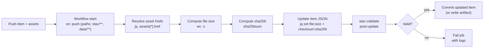

Got it — here’s your **fully corrected README** with Mermaid diagrams that render on GitHub. I simplified subgraph syntax, kept labels quoted, and used `\n` for line breaks. Copy-paste as-is.

````markdown
# STAC Items — Kansas-Frontier-Matrix

This folder contains **STAC 1.0.0 Item JSONs**.  
Each Item represents a single **spatiotemporal asset** (map, raster, vector, document, or event record) in the Kansas-Frontier-Matrix catalog.

An Item is always linked to a **Collection** (`collection` field + `rel: collection` link).

---

## Item Structure

Each Item must include:

- **id** — unique identifier (e.g. `usgs_larned_1894`, `hillshade_2018_2020`)
- **type** — always `"Feature"`
- **stac_version** — `"1.0.0"`
- **geometry** — footprint (Polygon), point location, or line
- **bbox** — bounding box `[west, south, east, north]`
- **properties**:
  - `datetime` (ISO 8601) **or** `start_datetime` / `end_datetime` (set `"datetime": null` for intervals)
  - Required: `proj:epsg` (usually `4326`)
  - Optional: `raster:*` (bands), `gsd`, `file:size`, `checksum:sha256`
  - Thematic keys: `document:type`, `event:type`, `uncertainty:*`
- **assets** — dictionary of downloadable/visualizable files:
  - Examples: `cog`, `thumbnail`, `geojson`, `pdf`, `txt`, `metadata`
- **links**:
  - `rel: self` → this Item file
  - `rel: collection` → parent Collection
  - `rel: parent` → parent Collection (same as above)
  - `rel: root` → `catalog.json`

---

## Examples

### Historical Map (Raster)
Item: `usgs_larned_1894.json`

- **Collection**: `base_maps`
- **Geometry**: footprint polygon from georeferencing
- **Properties**:  
  `datetime: "1894-06-01T00:00:00Z"`
- **Assets**:
  - `cog` → Cloud-Optimized GeoTIFF
  - `thumbnail` → preview PNG
  - optional: `kml` overlay

---

### Hillshade (DEM-derived)
Item: `hillshade_2018_2020.json`

- **Collection**: `elevation`
- **Geometry**: full Kansas bbox
- **Properties**:  
  `start_datetime: "2018-01-01T00:00:00Z"`,  
  `end_datetime: "2020-12-31T23:59:59Z"`
- **Assets**:
  - `cog` → statewide hillshade COG
  - `metadata` → JSON build notes

---

### Archival Document (Text)
Item: `treaty_kansas_1854.json`

- **Collection**: `documents`
- **Geometry**: polygon of treaty boundary (or centroid point)
- **Properties**:
  - `datetime: "1854-05-18T00:00:00Z"`
  - `document:type: "treaty"`
- **Assets**:
  - `pdf` → scanned source
  - `txt` → OCR transcript
  - optional: `summary` → synopsis

---

### Event Record
Item: `greensburg_tornado_2007.json`

- **Collection**: `events`
- **Geometry**: tornado track line
- **Properties**:
  - `datetime: "2007-05-04T21:45:00Z"`
  - `event:type: "tornado"`
- **Assets**:
  - `geojson` → track polyline
  - `report` → NOAA/SPC event report

---

## Design Notes

- Items capture **atomic data points**; Collections group thematically.  
- Use **`file:size`** + **`checksum:sha256`** for reproducibility (autofill in CI).  
- Include **uncertainty fields** (`uncertainty:*`) when georeferencing or NLP confidence < 1.  
- **Document Items** can be enriched via the Knowledge Hub ingestion pipeline.  
- **Environmental Items** (DEM, climate, hazards) may link to external sources (NOAA, USGS, Daymet, FEMA, NIFC) via `links[].rel = "via"`.

---

## Adding New Items

1. Copy a template JSON from `templates/`.
2. Fill in:
   - `id`
   - `geometry` **and** matching `bbox`
   - `properties` (time, `proj:epsg`, title/description, uncertainty if applicable)
   - `assets` (paths relative to `stac/items/`)
3. Set the correct `collection` and required `links` (`self`, `collection`, `parent`, `root`).
4. Run validation:
   ```bash
   stac-validate stac/items/<item>.json
````

5. Open a Pull Request describing source, provenance, and uncertainty.

---

## CI autofill (checksums & sizes)

Add file sizes and checksums in CI/CD:

```bash
J=stac/items/<item>.json
for A in cog dem image geojson pdf txt; do
  F=$(jq -r ".assets[\"$A\"].href // empty" "$J")
  [ -n "$F" ] || continue
  SIZE=$(wc -c < "$F" | tr -d ' ')
  SHA=$(sha256sum "$F" | awk '{print $1}')
  jq --arg a "$A" --argjson s "$SIZE" --arg sha "$SHA" \
     '.assets[$a]["file:size"]=$s | .assets[$a]["checksum:sha256"]=$sha' \
     "$J" > "$J.tmp" && mv "$J.tmp" "$J"
done
jq '.properties.updated=(now|toiso8601)' "$J" > "$J.tmp" && mv "$J.tmp" "$J"
```

---

## Diagrams

### Catalog → Collections → Items



---

### Item Anatomy



---

## Validation & Publishing Flow



---

## Checksum Autofill Micro-Flow (CI job)



---

## References

* STAC Spec 1.0.0
* Kansas-Frontier-Matrix design & audit docs (uncertainty, ingestion, dataset integration)

---

**Tip:** Items are the **leaves** of the STAC tree. Collections are the **branches**, the Catalog is the **trunk**.

```
```
