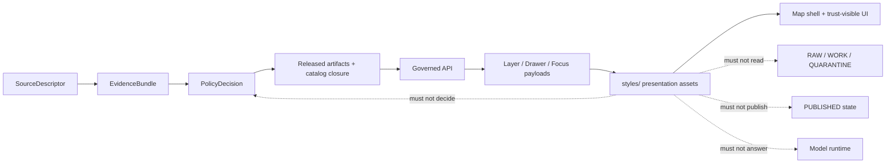

<!-- [KFM_META_BLOCK_V2]
doc_id: kfm://doc/NEEDS-VERIFICATION
title: KFM Styles
type: standard
version: v1
status: draft
owners: OWNER_TBD
created: 2026-05-02
updated: 2026-05-02
policy_label: NEEDS VERIFICATION
related: [kfm://doc/NEEDS-VERIFICATION, PATH_TBD_AFTER_REPO_INSPECTION]
tags: [kfm, styles, governed-ui, maplibre, evidence-drawer, focus-mode]
notes: [UNKNOWN repo implementation depth; target path supplied by current user request; owner, policy label, related links, build stack, and adjacent docs require repo inspection]
[/KFM_META_BLOCK_V2] -->

# KFM Styles

Govern visual styling, design tokens, and presentation assets so KFM remains trust-visible, map-first, accessible, and evidence-subordinate.

> [!IMPORTANT]
> **Status:** experimental  
> **Owners:** OWNER_TBD  
> **Path:** `styles/README.md` — PROPOSED target path from current request; directory existence is **NEEDS VERIFICATION**  
> **Truth posture:** CONFIRMED doctrine / PROPOSED directory contract / UNKNOWN repo implementation depth  
> **Badges:**  
> 
> 
> 
>   
> **Quick links:** [Scope](#scope) · [Repo fit](#repo-fit) · [Accepted inputs](#accepted-inputs) · [Exclusions](#exclusions) · [Directory map](#directory-map) · [Style law](#style-law) · [Validation](#validation-checklist) · [Rollback](#rollback)

> [!NOTE]
> This README is repo-useful but bounded. It states KFM doctrine where supported by project sources. Current `styles/` implementation, owners, package manager, build commands, CI checks, and adjacent repo links remain **UNKNOWN** until the actual repository is mounted and inspected.

## Scope

`styles/` is the proposed home for presentation assets that help KFM show meaning without becoming the source of meaning.

It may hold theme tokens, CSS or stylesheet assets, trust-chip treatments, component-state presentation rules, accessibility notes, and carefully bounded map-style presentation fragments when the real repo confirms that this is the correct home.

It must not become a hidden policy engine, source registry, evidence registry, publication gate, canonical data store, or AI answer surface.

**Operating sentence:** styles make governed state visible; they do not decide governed state.

[Back to top](#kfm-styles)

## Repo fit

| Field | Value |
| --- | --- |
| Target file | `styles/README.md` |
| Target directory | `styles/` — **PROPOSED / NEEDS VERIFICATION** |
| Document type | Directory README + standard doc |
| Upstream doctrine | `PATH_TBD_AFTER_REPO_INSPECTION` — UI doctrine, MapLibre operating architecture, policy docs, source/evidence contracts |
| Upstream machine contracts | `PATH_TBD_AFTER_REPO_INSPECTION` — `LayerManifest`, `StyleManifest`, `EvidenceDrawerPayload`, `FocusModeResponse`, `PolicyDecision` |
| Downstream consumers | `PATH_TBD_AFTER_REPO_INSPECTION` — governed web shell, MapLibre runtime adapter, Evidence Drawer, Focus Mode, export/share surfaces |
| Normal public path | governed API + released artifacts + evidence payloads -> renderer/UI |
| Forbidden public path | `styles/` -> canonical stores, RAW, WORK, QUARANTINE, unpublished candidates, or direct model runtime |

Links are intentionally placeholdered. Do not replace them with guessed relative paths until the mounted repo confirms adjacent docs, apps, package layout, and contract homes.

## Accepted inputs

The following belong here only when they are presentation assets, reviewable, and backed by upstream governed state.

| Input | Status | Notes |
| --- | --- | --- |
| Theme tokens | PROPOSED | Light, dark, high-contrast, print/export, and classroom-friendly themes. |
| Semantic visual tokens | PROPOSED | Tokens for evidence, review, policy, freshness, sensitivity, correction, and negative states. |
| Component stylesheet assets | PROPOSED | Presentation for chips, drawers, panels, timeline controls, legends, layer lists, review banners, and export previews. |
| Map presentation fragments | NEEDS VERIFICATION | Only visual treatment fragments. Source identity, policy, release state, and evidence routes must live outside style expressions. |
| Accessibility notes | PROPOSED | Contrast, focus order, reduced motion, keyboard visibility, and screenshot-baseline notes. |
| Visual fixtures | PROPOSED | Small examples that demonstrate style behavior without real sensitive data. |
| Style governance docs | PROPOSED | Naming rules, token rationale, review checklist, and rollback expectations. |

## Exclusions

| Do not put here | Goes instead | Why |
| --- | --- | --- |
| `SourceDescriptor` records | `PATH_TBD_AFTER_REPO_INSPECTION` | Source identity, rights, cadence, and authority are not presentation concerns. |
| `EvidenceBundle` or evidence refs as authority | `PATH_TBD_AFTER_REPO_INSPECTION` | Evidence resolution must remain governed and inspectable. |
| Policy rules, deny logic, or redaction decisions | `PATH_TBD_AFTER_REPO_INSPECTION` | CSS cannot decide public admissibility, sensitivity, or release state. |
| RAW / WORK / QUARANTINE data | governed data lifecycle homes | Public styling must never read unpublished or unresolved data. |
| Release manifests, proof packs, receipts, or signatures | `PATH_TBD_AFTER_REPO_INSPECTION` | Proof and release objects are separate object families. |
| Generated map tiles, PMTiles, COGs, or GeoParquet outputs | release/delivery artifact homes | Delivery artifacts are rebuildable outputs, not styling source files. |
| Direct model prompts or raw AI output | governed AI/runtime homes | AI is evidence-subordinate and must emit bounded, validated envelopes. |
| Secrets, tokens, service keys, or private source URLs | secure configuration / secret manager | Styling assets must be public-safe by default. |
| CSS-only geoprivacy controls | policy + processing + release pipeline | Hiding a feature in the browser is not redaction. |

> [!WARNING]
> CSS-only hiding is not a KFM sensitivity control. Sensitive or rights-uncertain objects must be denied, generalized, redacted, quarantined, or staged upstream before any public-facing style can render them.

## Directory map

Diagram and file map are **PROPOSED** until the actual repo confirms style-stack conventions.

```text
styles/
├── README.md
├── tokens/
│   ├── README.md
│   ├── semantic.css
│   ├── theme.light.css
│   ├── theme.dark.css
│   └── theme.high-contrast.css
├── components/
│   ├── README.md
│   ├── chips.css
│   ├── drawer.css
│   ├── focus-mode.css
│   ├── timeline.css
│   └── export-preview.css
├── map/
│   ├── README.md
│   ├── layer-legend.css
│   └── map-state-overlays.css
├── accessibility/
│   ├── README.md
│   └── contrast-notes.md
└── fixtures/
    ├── README.md
    └── trust-state-examples.html
```

Use the real repo’s conventions if they differ. Do not create parallel authority for styles, contracts, schemas, or policy.

## Style law

KFM style assets must preserve these boundaries.



**Rules:**

1. Style names should be semantic, not decorative.
2. A trust cue must have an upstream payload field or contract basis.
3. A visible state must not be faked with CSS when the backend state is unknown.
4. Map styles may express visual treatment, not source authority.
5. Layer visibility must not be used as a public-release gate.
6. AI participation badges must remain visible when model-assisted text appears.
7. Negative states such as `ABSTAIN`, `DENY`, stale, restricted, generalized, withdrawn, or citation-failed must be visually supported.
8. Style changes that weaken evidence, policy, review, sensitivity, freshness, or correction visibility require rollback review.

## Visual state vocabulary

The token and class names below are illustrative. Adopt only after checking existing repo naming.

| Cue family | PROPOSED presentation examples | Required upstream basis |
| --- | --- | --- |
| Scope | `--kfm-scope-active`, `.kfm-chip--scope` | Current place, time, layer, audience, or role context. |
| Freshness | `--kfm-fresh-current`, `--kfm-fresh-stale` | Release age, source recency, stale flag, or freshness class. |
| Evidence state | `.kfm-chip--evidence-direct`, `.kfm-chip--evidence-partial` | Evidence support state from governed payload. |
| Rights / sensitivity | `.kfm-chip--restricted`, `.kfm-chip--generalized` | Policy decision, sensitivity posture, redaction/generalization transform. |
| Review state | `.kfm-chip--draft`, `.kfm-chip--reviewed`, `.kfm-chip--withdrawn` | Review record, promotion state, correction state, release state. |
| Knowledge character | `.kfm-chip--observed`, `.kfm-chip--modeled`, `.kfm-chip--documentary` | Source role and knowledge-character field. |
| AI participation | `.kfm-chip--ai-assisted` | AI receipt or model-assisted runtime envelope. |
| Negative outcome | `.kfm-banner--abstain`, `.kfm-banner--deny`, `.kfm-banner--error` | Runtime or policy outcome: `ANSWER`, `ABSTAIN`, `DENY`, `ERROR`. |

> [!TIP]
> Prefer stable semantic tokens over one-off colors. A maintainer should be able to inspect a token name and understand the governed state it represents.

## Map and renderer boundary

`styles/` may support the MapLibre shell, but it must not make MapLibre sovereign.

Map presentation assets may describe:

- layer colors, opacity, iconography, halo behavior, and legend presentation
- selected-feature emphasis and hover/active UI state
- freshness, review, policy, and evidence chips shown near map interactions
- drawer, popup, panel, and export preview presentation
- visual treatments for generalized or restricted public-safe representations

Map presentation assets must not describe:

- source admission
- evidence sufficiency
- policy decisions
- rights clearance
- release approval
- exact-location redaction
- source-role authority
- AI answer validity
- canonical object identity

## Quickstart

No package-manager command is documented here because the target repo build stack is **UNKNOWN**.

After the real repository is mounted, use repo-native tooling and first run a non-destructive inspection:

```bash
# PROPOSED inspection only. Run from the repository root after checkout is mounted.
test -f styles/README.md && sed -n '1,140p' styles/README.md
find styles -maxdepth 2 -type f | sort
grep -RInE 'NEEDS VERIFICATION|OWNER_TBD|PATH_TBD|SOURCE_ID_TBD|ROLLBACK_TARGET_TBD' styles || true
```

Then confirm the style stack before adding commands:

- [ ] Is this repo using plain CSS, CSS modules, Sass, PostCSS, Tailwind, design tokens, CSS-in-JS, or another system?
- [ ] Where are app shell components stored?
- [ ] Where are MapLibre styles, layer manifests, and release manifests stored?
- [ ] Which tests validate visual state, contrast, keyboard focus, screenshot baselines, and no-public-raw-path behavior?
- [ ] Which owner approves trust-cue changes?

## Usage

### Add a new style token

1. Confirm the state exists in a governed payload or contract.
2. Name the token for meaning, not color.
3. Add a minimal fixture showing the positive, negative, and unavailable states.
4. Add or update an accessibility note.
5. Add validation evidence or mark the test gap.
6. Update this README when the token introduces a new governed visual concept.

### Change a trust cue

1. Identify the cue family: evidence, freshness, policy, review, sensitivity, correction, knowledge character, or AI participation.
2. Confirm the upstream object still emits the required field.
3. Confirm the style change does not hide denial, abstention, stale state, redaction, or correction state.
4. Run repo-native visual, accessibility, and no-public-raw-path checks.
5. Record rollback target before merge.

### Add a map presentation treatment

1. Confirm whether the treatment belongs in `styles/`, a style registry, a layer manifest, or a release artifact home.
2. Keep source identity and layer meaning outside style JSON.
3. Confirm that sensitive/generalized states are upstream decisions, not browser-side filters.
4. Add a fixture with at least one ordinary state and one denied or restricted state.
5. Verify the Evidence Drawer remains reachable from the rendered interaction.

## Validation checklist

- [ ] Confirm `styles/` exists or create it through repo-native placement.
- [ ] Confirm owners and CODEOWNERS coverage.
- [ ] Confirm package manager, build system, style stack, and test runner.
- [ ] Confirm upstream contracts for `LayerManifest`, `StyleManifest`, `EvidenceDrawerPayload`, and Focus outcomes.
- [ ] Confirm style assets do not own source identity, policy decisions, evidence sufficiency, or release state.
- [ ] Confirm no style file contains secrets, source credentials, private data paths, or unpublished data references.
- [ ] Confirm negative states are visible: `ABSTAIN`, `DENY`, stale, restricted, generalized, withdrawn, missing evidence, and citation failure.
- [ ] Confirm accessibility smoke checks for contrast, keyboard focus, reduced motion, and visible focus indicators.
- [ ] Confirm map interactions still resolve through governed APIs and EvidenceBundle-backed payloads.
- [ ] Confirm rollback target and screenshot or fixture baseline before merge.

## Rollback

Rollback is required when a style change weakens source integrity, hides trust cues, masks sensitivity, creates CSS-only policy, breaks Evidence Drawer affordances, strips AI participation badges, removes negative states, or makes a public surface appear more certain than its evidence allows.

Rollback target: `ROLLBACK_TARGET_TBD_AFTER_REPO_INSPECTION`

Minimum rollback actions:

1. Restore prior style asset or release branch.
2. Re-run visual-state, accessibility, and no-public-raw-path checks.
3. Confirm Evidence Drawer and Focus Mode still show source, policy, review, freshness, correction, and citation state.
4. Invalidate stale screenshots, story exports, or cached style bundles if they carried the weakened style.
5. Add a correction note when public artifacts were affected.

## Open verification backlog

| Item | Status | Needed evidence |
| --- | --- | --- |
| Directory existence | UNKNOWN | Mounted repo file tree. |
| Owner | OWNER_TBD | CODEOWNERS, docs owner table, or maintainer assignment. |
| Build stack | UNKNOWN | Package files and style tooling. |
| Adjacent docs | PATH_TBD_AFTER_REPO_INSPECTION | Confirm docs, contracts, schemas, policy, apps, tests, and release paths. |
| Badge targets | BADGE_TARGET_TBD | CI/status/coverage/security badge endpoints, if any. |
| Style registry home | NEEDS VERIFICATION | Repo convention for style JSON, design tokens, and MapLibre style artifacts. |
| Accessibility gate | NEEDS VERIFICATION | Test runner, checklist, or CI job. |
| Visual regression gate | NEEDS VERIFICATION | Screenshot baseline or component fixture convention. |
| Runtime trust payloads | NEEDS VERIFICATION | `EvidenceDrawerPayload`, `LayerManifest`, `StyleManifest`, Focus envelope contracts. |
| Rollback target | ROLLBACK_TARGET_TBD_AFTER_REPO_INSPECTION | Release or branch convention for restoring prior visual state. |

<details>
<summary>Evidence boundary and source map</summary>

This README was drafted from KFM doctrine and current-session workspace evidence, not from a mounted repository implementation.

| Source family | Status | Supports | Does not prove |
| --- | --- | --- | --- |
| Current user request | CONFIRMED | Target path `styles/README.md` and repo-ready Markdown mode. | Directory existence or current content. |
| Current workspace inspection | CONFIRMED | No mounted KFM repo was visible in this session. | Actual target repo topology. |
| Pipeline living manual | CONFIRMED doctrine / UNKNOWN implementation | Lifecycle law, governed APIs, evidence-subordinate AI, and implementation-boundary discipline. | Current repo files, tests, workflows, or runtime behavior. |
| MapLibre operating manual | CONFIRMED doctrine / PROPOSED implementation | Renderer boundary, trust membrane, style/layer/release object families, rollback expectations. | Existing MapLibre code or style stack in the repo. |
| MapLibre UI architecture | CONFIRMED doctrine / PROPOSED implementation | Evidence Drawer, Focus Mode, trust-visible UX cues, layer/source/style governance. | Existing UI component names or route names. |
| Documentation architecture | CONFIRMED doctrine / PROPOSED implementation | Anti-sprawl, canonical-home discipline, contracts/schemas/policy separation. | Actual schema or policy homes in this repo. |
| Components synthesis passes | CORPUS-CONFIRMED doctrine / UNKNOWN implementation | Inspectable-claim center, artifactization pressure, proof-object vocabulary, implementation restraint. | Current implementation maturity. |

</details>
