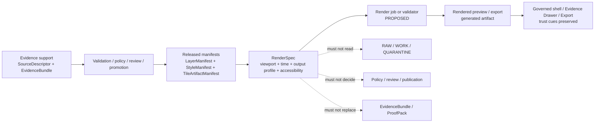

<!-- [KFM_META_BLOCK_V2]
doc_id: kfm://doc/NEEDS-VERIFICATION
title: styles/render_specs
type: standard
version: v1
status: draft
owners: OWNER_TBD_AFTER_REPO_INSPECTION
created: 2026-05-02
updated: 2026-05-02
policy_label: NEEDS VERIFICATION
related: [
  ../README.md,
  ../../README.md,
  ../../docs/README.md,
  ../../contracts/README.md,
  ../../schemas/contracts/v1/README.md,
  ../../policy/README.md,
  ../../tests/README.md,
  ../../data/catalog/README.md
]
tags: [kfm, styles, render-specs, maplibre, rendering, evidence, publication, accessibility]
notes: [
  Generated as a repo-useful draft for styles/render_specs/README.md.
  Current repo tree, owners, adjacent paths, schema home, validator commands, workflow wiring, and emitted artifact homes remain NEEDS VERIFICATION.
  created/updated reflect this generated draft date, not confirmed repository file history.
]
[/KFM_META_BLOCK_V2] -->

<a id="top"></a>

# `styles/render_specs/`

Render specifications for KFM map previews, static outputs, story frames, and other visual products that must remain downstream of released evidence, policy, and review state.

> [!IMPORTANT]
> **Status:** experimental  
> **Doc status:** draft  
> **Owners:** `OWNER_TBD_AFTER_REPO_INSPECTION`  
> **Path:** `styles/render_specs/README.md`  
> **Truth posture:** CONFIRMED doctrine / PROPOSED directory contract / UNKNOWN repo implementation depth  
>
> 
> 
> 
> 
> 
>
> **Quick jumps:** [Scope](#scope) · [Repo fit](#repo-fit) · [Accepted inputs](#accepted-inputs) · [Exclusions](#exclusions) · [Directory map](#directory-map) · [Operating flow](#operating-flow) · [Render spec anatomy](#render-spec-anatomy) · [Validation](#validation-and-definition-of-done) · [Rollback](#rollback) · [Open verification backlog](#open-verification-backlog)

> [!NOTE]
> This README states KFM doctrine where supported by the project corpus and proposes a bounded directory contract for `styles/render_specs/`. Current implementation behavior is **UNKNOWN** because the target repository tree, tests, workflows, schemas, manifests, dashboards, runtime logs, and generated artifacts were not inspected in this session.

## Scope

`styles/render_specs/` is the proposed home for **render-facing declarations** that describe how a released KFM visual output should be produced, checked, reviewed, or reproduced.

A render spec may define:

- the renderer family and expected renderer constraints;
- the style, layer, tile, and catalog manifest references needed for a render;
- the viewport, bounds, time scope, output profile, and accessibility notes;
- the release, review, evidence, policy, and rollback references that keep the rendered product inspectable.

A render spec must not become evidence authority. It is a **visual production contract**, not a source record, not a proof pack, not a publication decision, and not a place to hide policy logic.

## Repo fit

| Field | Value |
| --- | --- |
| Target path | `styles/render_specs/README.md` |
| Document type | Directory README / standard doc |
| Authority class | PROPOSED directory contract |
| Upstream | [`../README.md`](../README.md) — NEEDS VERIFICATION; [`../../docs/README.md`](../../docs/README.md) — NEEDS VERIFICATION; [`../../schemas/contracts/v1/README.md`](../../schemas/contracts/v1/README.md) — NEEDS VERIFICATION |
| Adjacent | [`../../contracts/README.md`](../../contracts/README.md) — NEEDS VERIFICATION; [`../../policy/README.md`](../../policy/README.md) — NEEDS VERIFICATION; [`../../data/catalog/README.md`](../../data/catalog/README.md) — NEEDS VERIFICATION |
| Downstream | `./examples/` — PROPOSED; `./fixtures/` — PROPOSED; [`../../tests/README.md`](../../tests/README.md) — NEEDS VERIFICATION |
| Normal consumer | Renderer jobs, visual regression checks, preview builders, export packaging, review workflows, and governed shell manifests |
| Normal output | References to generated previews or exports, never raw generated artifacts unless the repo later adopts that convention by ADR |

> [!WARNING]
> Do not use render specs to bypass the trust membrane. A render spec must not point public clients at canonical, RAW, WORK, QUARANTINE, proof-pack, review-only, steward-only, or model-runtime stores.

## Accepted inputs

| Input | Status | Required guard |
| --- | --- | --- |
| `*.render-spec.yaml` or `*.render-spec.json` | PROPOSED | Must be declarative, versioned, hashable, and manifest-bound. |
| Valid example specs | PROPOSED | Must use public-safe fixture data and clearly label illustrative values. |
| Invalid example specs | PROPOSED | Must exercise fail-closed cases such as missing manifests, bad digest grammar, missing alt text, or forbidden raw paths. |
| Render registry index | PROPOSED | Must list render spec IDs, products, status, owner, related style/layer manifests, and review state. |
| Accessibility notes | PROPOSED | Must include alt-text rules, output purpose, contrast/readability notes, and reduced-motion considerations where relevant. |
| Visual regression fixture notes | PROPOSED | Must reference expected outputs or tolerances without embedding generated proof logic here. |
| Renderer compatibility notes | PROPOSED | Must distinguish MapLibre, headless renderers, static image generation, and any future 3D/scene handoff. |

## Exclusions

This directory is not the home for:

| Excluded item | Reason | Better home |
| --- | --- | --- |
| RAW, WORK, or QUARANTINE data | Would bypass the lifecycle membrane. | `data/raw/`, `data/work/`, `data/quarantine/` — NEEDS VERIFICATION |
| Canonical evidence records | Render specs are downstream visual contracts. | Evidence/catalog homes — NEEDS VERIFICATION |
| Source descriptors | Source role and rights belong upstream. | `contracts/`, `schemas/contracts/v1/source/`, or source registry — NEEDS VERIFICATION |
| Policy decisions | Policy decisions are standalone governed records. | `policy/` or policy contract home — NEEDS VERIFICATION |
| Proof packs, receipts, release manifests | These object families must remain separate. | `data/proofs/`, `data/receipts/`, `release/` — NEEDS VERIFICATION |
| Generated screenshots, thumbnails, or exports | Avoid mixing specifications with generated products. | `web/assets/`, `public/`, object storage, or release artifact home — NEEDS VERIFICATION |
| Renderer source code | This directory declares render intent; it does not implement the renderer. | `apps/`, `packages/`, or `tools/` — NEEDS VERIFICATION |
| AI prompts or model output | Generated language is evidence-subordinate and belongs in governed envelopes. | Focus/runtime contract homes — NEEDS VERIFICATION |
| Secrets, tokens, signed URLs, or credentials | Render specs must be reviewable and safe for repository storage. | Secret manager / deployment config — NEEDS VERIFICATION |

## Directory map

PROPOSED layout only. Verify repo conventions before creating these paths.

```text
styles/
└── render_specs/
    ├── README.md
    ├── registry.render-specs.index.yaml        # PROPOSED: index of declared render specs
    ├── examples/
    │   ├── README.md                           # PROPOSED
    │   └── hydrology.public-preview.render-spec.yaml
    └── fixtures/
        ├── valid/
        │   └── minimal.public-preview.render-spec.yaml
        └── invalid/
            ├── missing-style-manifest.render-spec.yaml
            ├── forbidden-raw-path.render-spec.yaml
            ├── missing-alt-text.render-spec.yaml
            └── bad-digest.render-spec.yaml
```

## Operating flow

Render specs sit after validation, policy, promotion, and manifest closure. They describe how to render a released visual product; they do not decide what may be released.



## Render spec anatomy

The exact schema home remains **NEEDS VERIFICATION**. The skeleton below is illustrative and must not be treated as implemented.

```yaml
# PROPOSED illustrative render spec skeleton.
version: kfm.render_spec.v1
render_spec_id: kfm://render-spec/NEEDS-VERIFICATION
status: draft
owner: OWNER_TBD_AFTER_REPO_INSPECTION

product:
  purpose: public_preview
  audience: public
  output_profiles:
    - id: thumbnail
      media_type: image/png
      width_px: 320
      height_px: 180
      device_pixel_ratio: 1
    - id: quicklook
      media_type: image/png
      width_px: 1600
      height_px: 900
      device_pixel_ratio: 2

renderer:
  family: maplibre-gl-js
  version: NEEDS_VERIFICATION
  mode: headless-or-browser-render
  compatibility_notes:
    - "Renderer version, package manager, and supported runtime remain NEEDS VERIFICATION."

manifests:
  style_manifest_ref: kfm://style-manifest/NEEDS-VERIFICATION
  layer_manifest_refs:
    - kfm://layer-manifest/NEEDS-VERIFICATION
  tile_artifact_manifest_refs:
    - kfm://tile-artifact-manifest/NEEDS-VERIFICATION

scope:
  bbox_wsen: [-102.1, 36.9, -94.5, 40.1]
  crs: EPSG:4326
  valid_time:
    start: "YYYY-MM-DD"
    end: "YYYY-MM-DD"
  as_of: "YYYY-MM-DDTHH:MM:SSZ"
  viewport:
    center_lng_lat: [-98.5, 38.5]
    zoom: 6
    bearing: 0
    pitch: 0

trust:
  evidence_refs:
    - kfm://evidence-ref/NEEDS-VERIFICATION
  policy_decision_ref: kfm://policy-decision/NEEDS-VERIFICATION
  release_ref: kfm://release/NEEDS-VERIFICATION
  review_state: draft
  sensitivity_posture: public-safe-or-generalized
  correction_ref: kfm://correction/NEEDS-VERIFICATION
  rollback_ref: kfm://rollback/NEEDS-VERIFICATION

accessibility:
  alt_text_template: "{title} — {date_or_range} — {bbox_summary}"
  contrast_notes: NEEDS VERIFICATION
  motion_notes: "No animation in static profiles."

identity:
  spec_hash: sha256:NEEDS-VERIFICATION
  hash_scope:
    - product
    - renderer
    - manifests
    - scope
    - trust
    - accessibility
```

## Minimum field families

| Field family | Why it matters | Must not become |
| --- | --- | --- |
| Identity | Enables deterministic review, replay, and drift checks. | A vague filename-only identity. |
| Product purpose | Distinguishes thumbnails, quicklooks, export frames, story frames, and review captures. | A hidden publication decision. |
| Renderer declaration | Makes renderer/version assumptions visible. | A dependency pin without repo verification. |
| Manifest references | Keeps style/layer/tile artifacts separate and inspectable. | Embedded style JSON or tile payloads by default. |
| Scope | Preserves spatial, temporal, viewport, and audience boundaries. | A false claim of analytical correctness. |
| Trust references | Keeps EvidenceBundle, policy, review, release, correction, and rollback in view. | Evidence, policy, or proof body storage. |
| Accessibility | Makes visual products legible beyond sighted map interaction. | Decorative alt text or optional metadata. |
| Output profiles | Makes dimensions, media type, and deterministic preview intent reviewable. | A generated asset folder. |

## Operating rules

1. **Renderer downstream of trust.** A renderer may draw released artifacts; it must not decide truth, policy, sensitivity, review, citation, release, or correction state.

2. **Manifest-bound rendering only.** Render specs should reference `LayerManifest`, `StyleManifest`, `TileArtifactManifest`, and release/catalog objects rather than embedding upstream meaning.

3. **Cite-or-abstain applies to rendered claim text.** If a render includes labels, captions, callouts, story text, or export summaries that make a consequential claim, those strings must remain traceable to EvidenceBundle support or be omitted.

4. **Time is part of meaning.** A render spec must preserve the active time scope and must not silently substitute ingestion time, observation time, valid time, release time, or correction time.

5. **Sensitive geography fails closed.** Exact sensitive locations, restricted counts, steward-only context, living-person detail, archaeological locations, rare species, critical infrastructure, private land, or rights-uncertain material must be denied, generalized, redacted, or staged before rendering.

6. **Style edits can change meaning.** If a style change changes visual interpretation, the `StyleManifest`, render spec hash, review state, and release path must change accordingly.

7. **Accessibility is not optional.** Static previews, thumbnails, and exports need meaningful alt-text inputs or a documented reason why an accessible equivalent is handled elsewhere.

8. **Generated outputs are derivative.** Screenshots, thumbnails, static maps, and story frames are rebuildable delivery artifacts, not sovereign truth.

## Failure outcomes

| Condition | Outcome | Review note |
| --- | --- | --- |
| Missing style, layer, tile, or release manifest | `ERROR` or `ABSTAIN` | The render cannot prove its released inputs. |
| Forbidden RAW / WORK / QUARANTINE / canonical path | `DENY` | Blocks trust membrane bypass. |
| Sensitive exact geometry in a public profile | `DENY` | Requires redaction/generalization receipt before retry. |
| Missing EvidenceRef for claim-bearing label/caption | `ABSTAIN` | Render may omit claim text or route to review. |
| Missing alt-text support for static public output | `ABSTAIN` | Accessibility requirement is incomplete. |
| Renderer version or style hash drift | `ERROR` or `NEEDS VERIFICATION` | Requires manifest update and visual regression review. |
| Release withdrawn or superseded | `ABSTAIN` | Render should not use stale public authority. |
| Policy package unavailable | `ERROR` | Do not infer policy locally in the render job. |

## Quickstart for maintainers

> [!CAUTION]
> Package manager, validator location, CI wiring, and schema home are **UNKNOWN**. Replace the steps below with repo-native commands after inspection.

1. Confirm the target path and owner.
2. Confirm whether render specs are stored as YAML, JSON, or both.
3. Confirm the machine schema home before adding validators.
4. Create one minimal public-safe valid fixture and at least three invalid fixtures.
5. Add or update validator tests before enabling generated outputs.
6. Ensure generated thumbnails, screenshots, or exports are written outside this spec directory unless an ADR says otherwise.
7. Route any claim-bearing output through EvidenceBundle resolution and policy review before publication.

## Validation and definition of done

A render spec is ready for review when:

- [ ] Target path and owner are confirmed.
- [ ] Schema/contract home is resolved or explicitly ADR-backed.
- [ ] Renderer family and version assumptions are visible.
- [ ] Every style/layer/tile dependency is referenced through a manifest.
- [ ] Spatial scope, temporal scope, viewport, and output profile are declared.
- [ ] `spec_hash` is computed over a stable canonical representation.
- [ ] No forbidden RAW, WORK, QUARANTINE, steward-only, proof-pack, secret, or model-runtime path appears.
- [ ] Sensitive geometry behavior is public-safe, generalized, redacted, or denied.
- [ ] Claim-bearing text has EvidenceRef support or is omitted.
- [ ] Alt text or accessible equivalent is present for static public outputs.
- [ ] Valid and invalid fixtures exist.
- [ ] Visual regression or deterministic render checks are defined where the repo supports them.
- [ ] Rollback target is known before generated outputs are promoted.
- [ ] Generated artifacts remain tied to release, catalog, receipt, and correction state.

## Maintenance triggers

Update or re-review render specs when any of the following changes:

| Trigger | Required response |
| --- | --- |
| Renderer package/version changes | Re-run compatibility and visual regression checks. |
| StyleManifest changes | Recompute render spec hash and check visual meaning. |
| LayerManifest changes | Confirm policy, visibility, legend, label, and evidence behavior. |
| TileArtifactManifest changes | Confirm bounds, zooms, digests, cache policy, and release scope. |
| EvidenceBundle support changes | Recheck labels, captions, story text, and Evidence Drawer continuity. |
| Policy package changes | Re-evaluate DENY/ABSTAIN/ALLOW behavior. |
| Release withdrawn, superseded, or corrected | Stop rendering from the old release unless explicitly preserved as lineage. |
| Accessibility guidance changes | Recheck alt text, output dimensions, contrast, and motion behavior. |

## Rollback

Rollback is required when a render spec weakens source integrity, breaks manifest references, changes visual meaning without review, leaks sensitive data, loses citations, writes generated output into the wrong object family, or bypasses policy gates.

Rollback target: `ROLLBACK_TARGET_TBD_AFTER_REPO_INSPECTION`

Rollback should:

1. withdraw or supersede the render spec;
2. remove or invalidate derivative generated assets tied to that spec hash;
3. restore the prior released style/layer/tile/render manifest combination;
4. preserve receipts, proof objects, review notes, correction notices, and rollback records;
5. add a regression fixture that prevents the failure from returning.

## Open verification backlog

- [ ] Confirm `styles/render_specs/` exists or create it through an ADR-backed placement decision.
- [ ] Confirm owners and CODEOWNERS coverage.
- [ ] Confirm whether this directory uses YAML, JSON, or both.
- [ ] Confirm whether render spec schemas belong under `schemas/contracts/v1/rendering/`, `contracts/rendering/`, or another repo-native home.
- [ ] Confirm related `StyleManifest`, `LayerManifest`, `TileArtifactManifest`, `MapReleaseManifest`, and Evidence Drawer contract names.
- [ ] Confirm generated output home for thumbnails, quicklooks, screenshots, and export frames.
- [ ] Confirm validator language, package manager, and CI entrypoint.
- [ ] Confirm visual regression tolerance and snapshot policy.
- [ ] Confirm accessibility review requirements.
- [ ] Confirm no public path bypasses governed APIs or released artifacts.
- [ ] Confirm rollback and cache-invalidation procedure.

<details>
<summary>Appendix: placement decision notes</summary>

`styles/render_specs/` is a reasonable proposed home when render specs are treated as style-adjacent visual production declarations. If the mounted repo later treats render specs as machine contracts, generated artifact manifests, or renderer job definitions instead, maintainers should move this README or split it into:

- a directory README under the repo-native render-spec instance home;
- a schema README under the repo-native schema/contract home;
- a validator README under the repo-native tools/tests home.

Do not create parallel authority in both `contracts/` and `schemas/` without an ADR.

</details>

[Back to top](#top)
