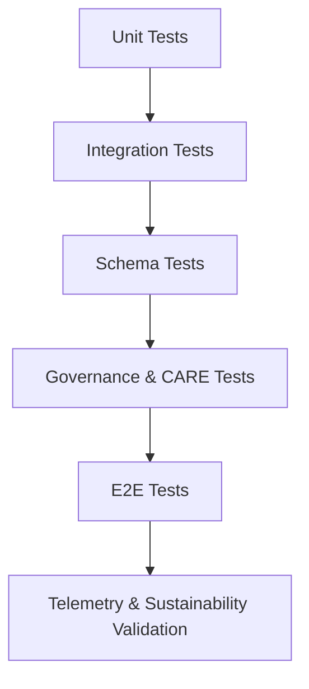

<div align="center">

# 🧪 **Kansas Frontier Matrix — Test Platform Architecture (v11 LTS)**  
`tests/ARCHITECTURE.md`

### **Deterministic · FAIR+CARE · Sovereignty-Safe · Telemetry-Aligned · Diamond⁹ Ω / Crown∞Ω**

This document defines the **full testing architecture** for the Kansas Frontier Matrix v11 monorepo, covering:

- **Unit · Integration · E2E · Schema · Governance · Telemetry · Accessibility**  
- **LangGraph DAG validation (Reliable Pipelines v11)**  
- **Story Node v3 + Focus Mode v3 testing**  
- **Graph, STAC/DCAT, ETL, AI, UI, and sovereignty checks**  
- **OpenTelemetry v11 integration**  
- **FAIR+CARE governance gating**  

The test platform is the **CI/CD backbone** ensuring system-wide trustworthiness.

</div>

---

# 📘 1. Purpose

The KFM Test Platform ensures the entire monorepo remains:

- **Stable** — regressions prevented through deterministic tests  
- **Governed** — FAIR+CARE + sovereignty rules enforced  
- **Semantic-safe** — ontology and schema correctness (CIDOC-CRM, OWL-Time, GeoSPARQL)  
- **A11y-compliant** — WCAG 2.1 AA+ guaranteed  
- **Telemetry-accurate** — sustainability, energy, carbon, and ethics metrics validated  
- **Provenance-aligned** — OpenLineage v2.5 + PROV-O signals validated  

This architecture governs how tests are structured, executed, validated, and incorporated into the release pipeline.

---

# 🗂️ 2. Directory Layout (v11)

```text
tests/
│
├── ARCHITECTURE.md               # This v11 architecture specification
├── README.md                     # High-level test suite overview
│
├── unit/                         # Deterministic pure-logic testing
│   ├── web/                      # React/TS components, hooks, reducers
│   ├── pipelines/                # ETL/AI/utils small-unit tests
│   ├── utils/                    # Pure functions, helpers
│   └── governance/               # CARE + sovereignty rule atomic tests
│
├── integration/                  # Cross-component behavior
│   ├── web/                      # MapLibre + Cesium + timeline behavior
│   ├── stac/                     # STAC/DCAT linking + metadata integrity
│   ├── storynodes/               # Story Node v3 → Focus Mode v3 flows
│   └── telemetry/                # OTel metrics emission, aggregation
│
├── e2e/                          # System-wide behavior (Playwright/Cypress)
│   ├── web-app/                  # UX, navigation, rendering
│   ├── dataset-workflows/        # Upload → validate → publish flows
│   └── governance/               # Ledger audit, CARE masking end-to-end
│
├── schemas/                      # Schema-driven test suites
│   ├── story-node.test.json
│   ├── stac-collection.test.json
│   └── telemetry.test.json
│
└── resources/                    # Static deterministic fixtures
    ├── sample_stac/
    ├── storynodes/
    ├── focus_payloads/
    └── pipelines/
```

---

# 🧬 3. Test Architecture Model (v11)

## 3.1 Layered Model

1. **Unit Layer** — deterministic, side-effect-free  
2. **Integration Layer** — required boundaries across ETL/graph/UI  
3. **E2E Layer** — complete simulated user + pipeline flows  
4. **Schema Layer** — JSON/YAML shape validation  
5. **Governance Layer** — FAIR+CARE + sovereignty enforcement  
6. **Telemetry Layer** — energy, carbon, runtime, A11y usage  

## 3.2 Test Architecture Diagram



---

# 🧪 4. Test Types & Requirements

## 4.1 Unit Tests
- Pure logic  
- React components (no network)  
- STAC/DCAT utilities  
- Graph helpers  
- CARE/A2C atomic checks  
- Deterministic seed (no nondeterministic randomness)  

## 4.2 Integration Tests
Validates:

- Story Node v3 pipeline  
- Focus Mode v3 entity resolution  
- Graph synchronization  
- MapLibre/Cesium + timeline cohesion  
- GE Checkpoints + OTel metrics  
- Data contract enforcement  

## 4.3 E2E Tests (Playwright/Cypress)
Ensures:

- Navigation + UI states  
- A11y flows  
- Timeline brushing  
- Hotfix/rollback UI flows  
- Data ingestion → publish round-trip  
- Governance overlays + redactions  

## 4.4 Schema Tests
Mandatory:

- Story Node v3 schema  
- Telemetry v11 schema  
- STAC Collection/Item shape  
- API payload shapes  

Any schema violation **blocks CI**.

## 4.5 Governance & CARE Tests
Check:

- H3 generalization  
- Sensitive location masking  
- Indigenous data sovereignty rules  
- License exposure  
- Provenance chip visibility  
- Narrative safety  

CARE failures → **no merge**.

## 4.6 Telemetry Tests
Validate:

- WebVitals  
- OTel pipeline metrics  
- Energy & CO₂ estimates  
- Accessibility usage  
- Error logs & event metadata  
- Story Node + Focus Mode telemetry emission  

Outputs must match:

```
releases/v11.0.0/tests-telemetry.json
```

---

# ⚙️ 5. CI/CD Integration

CI executes tests in order:

1. Unit  
2. Schema  
3. Integration  
4. Accessibility  
5. E2E  
6. Governance  
7. Telemetry  

**Any failure blocks:**

- PR merges  
- Release tagging  
- Governance certification  

CI publishes:

- Test JSON reports  
- Coverage maps  
- Telemetry artifacts  
- Governance ledger entries  

---

# 🛡️ 6. Security & Privacy

Tests must **never**:

- Log PII  
- Access production data  
- Leak credentials  
- Expose sensitive graph entities  

Fixtures must be sanitized.

---

# ♿ 7. Accessibility Architecture

A11y tests cover:

- WCAG 2.1 AA+  
- Keyboard navigation  
- Reduced-motion  
- Color contrast ≥ 4.5:1  
- Screen reader flows  
- ARIA labeling  
- Heading/landmark structure  

Accessibility regressions are **CI-blocking**.

---

# 🧾 8. Provenance & Governance

Each test suite execution must emit:

- PROV-O activity logs  
- OpenLineage v2.5 events  
- Ledger entries  
- Test runtime, environment, hash  

Governance ensures:

- CARE rules enforced  
- No weakening of sovereignty protections  
- Ethical, sustainable testing practices  

---

# 🕰️ 9. Version History

| Version | Date | Summary |
|--------:|------|---------|
| v11.0.0 | 2025-11-24 | Complete upgrade to KFM-MDP v11, sovereignty + A11y + telemetry v11 integrated, LangGraph DAG + Reliable Pipelines v11 testing. |
| v10.4.0 | 2025-11-15 | Prior architecture (v10.4): Focus 2.5 + Story Node v3 integration. |
| v10.3.2 | 2025-11-14 | Hardened schema + telemetry testing. |
| v10.0.0 | 2025-11-10 | Initial platform-wide test architecture. |

---

<div align="center">

**© 2025 Kansas Frontier Matrix — MIT License**  
**Diamond⁹ Ω / Crown∞Ω** · FAIR+CARE Certified · MCP-DL v6.3  
Test Platform v11 — *Ethical · Deterministic · Sovereign-Safe · Telemetry-Aligned*

</div>