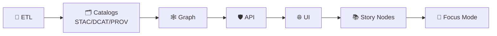

# 🧪 Tests — Kansas Frontier Matrix (KFM) / Kansas‑Matrix‑System


> KFM is a **trust-first** geospatial + knowledge + modeling system.  
> This folder is where we continuously prove that our **code**, **pipelines**, **contracts**, and **UI behaviors** are **correct**, **reproducible**, and **honest about uncertainty**. ✅🧾

---

## 🧭 Quick navigation

- 🚀 Run tests now → [Quickstart](#-quickstart)
- 🔒 Merge requirements → [CI gates](#-ci-gates-non-negotiable)
- 🧪 What to test → [Test pyramid](#-test-pyramid-how-we-keep-velocity--confidence)
- 🧾 Contracts (OpenAPI + STAC/DCAT/PROV) → [Contract tests](#-contract--metadata-tests)
- 🗺️ GIS correctness → [Geospatial tests](#️-geospatial-tests-gis-correctness)
- 🛰️ Remote sensing → [Remote sensing tests](#️-remote-sensing-tests-earth-engine--imagery)
- 🧠 Modeling/simulation validity → [Scientific validation](#-scientific--simulation-validation)
- 🌐 Frontend → [Web / frontend guidance](#-web--frontend-test-guidance)
- 🧱 Suggested layout → [Folder layout](#️-suggested-folder-layout)

---

## 🚀 Quickstart

### 0) Preconditions (one-time)
- 🐍 Python env ready (`venv`, `conda`, `uv`, etc.)
- 🌐 Node env ready (`npm`, `pnpm`, or `yarn`)
- 🐳 Docker installed (recommended for integration parity)

> [!TIP]
> If your PR touches **DB/API/pipelines/contracts**: run at least one Docker-backed integration pass before requesting review.

### 1) Fast checks (pre‑commit vibes ⚡)
```bash
# Python (fast)
pytest -q -m "not integration and not e2e and not slow"

# Web (fast — adjust to your repo)
npm test
```

### 2) Full suite (recommended on feature branches ✅)
```bash
# If you have Make targets (recommended)
make test

# Or explicit slices
pytest -q
pytest -q -m integration
npm run test:e2e
```

### 3) Integration tests with containers (preferred 🐳)
```bash
docker compose up -d --build
pytest -q -m integration
docker compose down -v
```

---

## 🧠 Core invariant tests must protect

> [!IMPORTANT]
> KFM enforces a **non-negotiable** pipeline order:
>
> **ETL → Catalogs (STAC/DCAT/PROV) → Graph → APIs → UI → Story Nodes → Focus Mode**



### ✅ What tests should enforce (practically)
- 🧪 **ETL is deterministic** (stable IDs/hashes; idempotent re-runs)
- 🗂️ **Catalog records exist** for publishable outputs (STAC/DCAT/PROV) **before** graph/UI uses them
- 🕸️ **Graph loads only from catalogs** (no ad‑hoc inserts)
- 🛡️ **API is the only client boundary** (UI never queries graph/DB directly)
- 🔐 **Sensitivity/classification does not downgrade** without an explicit, audited redaction step

---

## 🧱 Test pyramid (how we keep velocity + confidence)

Most tests should be cheap and deterministic. Then we add fewer (but higher-value) integration + E2E checks.

```text
          🔺 E2E (few)         → critical user journeys (UI + API + DB)
        🔺🔺 Integration (some) → services together (DB, API, pipelines)
      🔺🔺🔺 Unit (many)         → pure logic, transforms, validators
```

---

## 🧷 Core test principles (KFM style)

### ✅ Test public behavior, not private plumbing
Prefer testing **public entry points** (functions, use-cases, endpoints, contracts).  
This reduces refactor pain and encourages clean boundaries.

### 🔁 Determinism is a feature
For research/AI/simulation code: set seeds, pin dependencies, eliminate hidden state.

**Determinism checklist:**
- [ ] seeds set (Python, NumPy, ML frameworks)
- [ ] stable sorting (don’t rely on hash iteration order)
- [ ] time mocked/frozen where needed
- [ ] no network calls in unit tests (record/replay if unavoidable)
- [ ] fixtures are tiny & versioned
- [ ] floats use tolerances (`pytest.approx`, `np.testing.assert_allclose`)

### 🧾 Trust-first means we test uncertainty too
If outputs are probabilistic / estimated:
- test **ranges**, **invariants**, or **calibration** (not single-point exact values)
- attach uncertainty artifacts on failure (plots, traces, summaries)
- document tolerances + rationale (in code comments or `TEST_POLICY.md`)

---

## 🗂️ Suggested folder layout

Adapt as needed, but keep intent obvious:

```text
📦 repo-root/
├─ 🧪 tests/
│  ├─ 📄 README.md                      # you are here 👋
│  ├─ 🧷 fixtures/                      # tiny, deterministic test data only
│  │  ├─ 🗺️ geo/                        # small vectors/rasters (safe + tiny)
│  │  ├─ 🧬 ml/                         # toy datasets / tiny model artifacts
│  │  ├─ 🧾 schemas/                    # JSON/YAML schemas used in tests
│  │  └─ 📘 FIXTURES.md                 # fixture rules + provenance notes
│  ├─ 🐍 python/
│  │  ├─ 🧩 unit/
│  │  ├─ 🔌 integration/
│  │  ├─ ✅ validation/                 # scientific V&V (tolerance-based)
│  │  ├─ ⏱️ perf/                       # benchmarks (nightly / non-gating)
│  │  ├─ 🧷 helpers/
│  │  └─ 🧱 conftest.py
│  ├─ 🌐 web/
│  │  ├─ 🧩 unit/
│  │  ├─ 🧱 component/
│  │  ├─ 🧭 e2e/
│  │  ├─ 🖼️ visual/
│  │  └─ 🧷 helpers/
│  ├─ 🗄️ db/
│  │  ├─ 🧬 migrations/
│  │  ├─ 🔌 integration/
│  │  └─ 🧪 seed/
│  ├─ 📜 contracts/
│  │  ├─ 🛡️ api/                        # OpenAPI/GraphQL fixtures
│  │  ├─ 🗺️ stac/                       # STAC contract fixtures
│  │  ├─ 🏷️ dcat/                       # DCAT contract fixtures
│  │  └─ 🧬 prov/                       # PROV contract fixtures
│  ├─ 🧰 tools/                         # optional helpers (run scripts)
│  └─ 📘 TEST_POLICY.md                 # merge gates + definition of done
└─ 🧰 scripts/                          # optional: CI glue & utilities
```

> [!NOTE]
> If you keep tests alongside code (e.g., `src/**/tests`), that’s fine—just keep **naming + markers** consistent.

---

## 🏷️ Test categories & markers (suggested)

### Python (`pytest`) markers
If you use `pytest`, standardize markers so developers can run focused slices:

```ini
# pytest.ini (example)
[pytest]
markers =
  unit: fast pure logic
  integration: hits db/services/filesystem
  e2e: end-to-end journeys (rare for python)
  slow: long-running tests (non-gating)
  validation: scientific/V&V tests (tolerance-based)
  perf: benchmarks (nightly)
  contracts: OpenAPI + metadata contract validation
```

### Web tags
Use your stack’s convention (examples):
- Jest: `test`, `test:unit`, `test:component`
- Playwright/Cypress: `test:e2e`
- Visual regression: `test:visual`

---

## 🛡️ CI gates (non-negotiable)

**Policy:** the pipeline must be green before merge. 🤖✅

Typical PR gates:
1) 🧹 format + lint (Python + JS/TS)
2) 🧪 unit tests
3) 🔌 integration tests (ephemeral DB/services)
4) 🌐 web build (compile check)
5) 🧾 contract/schema validation (OpenAPI + STAC/DCAT/PROV where applicable)
6) 📈 coverage thresholds (target, not a religion)

### 🕛 Nightly / scheduled checks (recommended)
Keep PR CI fast. Push expensive checks to nightly:
- ⏱️ benchmarks (trend monitoring)
- 🧠 long ML training runs (PRs use toy models)
- 🗺️ large raster workloads (PRs use fixtures & sampling)
- 🔐 deeper security scans (if they slow PRs)

---

## 🧾 Contract & metadata tests

KFM is **contract-first** and **catalog-first**. Tests should protect:
- 🛡️ **OpenAPI / GraphQL** contracts (breaking changes are explicit + versioned)
- 🗂️ **STAC** (collections/items link validity + required fields)
- 🏷️ **DCAT** (distributions link to STAC/asset access points)
- 🧬 **PROV** (inputs → activities → outputs; run IDs/configs recorded)

### ✅ What to validate
- JSON parses + schema passes
- links resolve (STAC assets exist; DCAT distributions point somewhere real)
- provenance completeness (raw → work → processed trace exists)
- stable IDs/hashes present where required

### Example checks (starter)
```bash
# JSON sanity
find data/stac data/catalog/dcat data/prov -name "*.json*" -print0 | xargs -0 -n 1 jq empty

# pytest contract suite (example)
pytest -q -m contracts
```

---

## 🐍 Python test guidance

### 🧩 Unit tests
Best for:
- parsers/validators
- coordinate transforms & unit conversions
- domain rules & invariants
- pure math transforms

✅ Tips:
- prefer tolerance-based asserts for floats
- encode invariants (monotonicity, conservation) instead of brittle constants
- include “sad paths” for invalid inputs

### 🔌 Integration tests
Best for:
- PostGIS interactions
- API routes (FastAPI/Flask) against a test DB
- filesystem/object store adapters
- queue/worker boundaries (smoke-level)

✅ Tips:
- use Compose to create repeatable dependencies
- isolate state via transactions or per-test schemas
- avoid public internet in tests (mock or record/replay)

---

## 🧠 Scientific / simulation validation

Treat simulation/analysis code like **scientific instruments** 🔬:
- **verification**: implementation matches intended math
- **validation**: model matches reality within uncertainty
- **regression baselines**: detect drift across refactors

### ✅ Recommended patterns
- analytical solution comparisons (tiny cases with known answers)
- convergence tests (timestep/resolution refinement reduces error)
- invariant checks (symmetry, conservation, monotonicity)
- tolerance-based golden files (with metadata + tolerances)
- uncertainty reporting checks (intervals, credible bands, PPC)

> [!TIP]
> If results are stochastic, test **properties** (ranges, quantiles, calibration) rather than exact values.

---

## 🌐 Web / frontend test guidance

### 🧱 Component tests (fast)
- render correctness given props/state
- event handling correctness
- accessibility checks (labels, keyboard nav, contrast)

### 🧭 E2E tests (few but powerful)
Focus on “money paths” 💸:
- auth/login
- load a layer
- timeline navigation
- select a feature → details panel updates
- export/report flow

### 🖼️ Visual regression (maps + WebGL)
Maps can regress visually while “still passing logic tests.” Use screenshot diffs where it matters:
- symbology doesn’t silently change
- overlays remain legible at common zoom levels
- dark/light modes keep contrast
- WebGL rendering regressions are caught (tolerance-based diffs)

---

## 🗺️ Geospatial tests (GIS correctness)

Geospatial pipelines are fragile in predictable ways—test these explicitly:

- 🌍 **CRS sanity**: EPSG correctness; meters vs degrees issues
- 🧱 **Topology**: geometry validity, no self-intersections when required
- 🧩 **Overlay correctness**: clip/intersect/union behaviors
- 🧊 **Raster alignment**: resolution, nodata handling, resampling method
- 📦 **Format IO**: GeoJSON/GeoPackage/COG round-trips

> [!NOTE]
> Always include CRS + units in test names or fixture metadata. It prevents “silent degrees vs meters” disasters. 🥲

---

## 🛰️ Remote sensing tests (Earth Engine & imagery)

Remote sensing workflows fail quietly unless you test assumptions:
- band availability & naming
- scale / resolution
- cloud masking logic (QA bits)
- temporal compositing rules
- index calculations (e.g., NDVI) & expected ranges
- export formats & metadata consistency

“Truthiness checks” that catch many bugs:
- output range sanity (e.g., NDVI ∈ [-1, 1])
- masked pixel counts within expected bounds
- timestamps monotonic; windows applied correctly

---

## 📊 ML / stats tests (don’t fool yourself)

Data science code needs tests beyond “it runs”:
- split is leak-free (train/val/test)
- metrics stable within tolerance
- baseline comparisons exist (simple model beats random)
- uncertainty reporting present where relevant
- multiple comparisons / p-hacking risks handled (where applicable)

> [!TIP]
> Attach sanity plots as CI artifacts on failure (confusion matrix, residuals, calibration curve). 📎

---

## 🧩 Graphs, agents, optimization, and “hard math” modules

If you include:
- graph algorithms (spectral, routing, clustering)
- autonomous agents / planners
- optimization loops

Add tests that check:
- invariants (symmetry, conservation, monotonicity)
- convergence behavior (within iteration limits)
- gradient checks (finite-difference sanity, if applicable)
- known micro-benchmarks (tiny, deterministic)

---

## 🗄️ Database tests (Postgres/PostGIS, MySQL if applicable)

Principles:
- use ephemeral DBs (containers)
- run migrations in CI
- isolate with transactions
- seed minimal fixtures (never production dumps)

Recommended:
- migration tests: upgrade/downgrade + schema assertions
- query tests: correctness + (where critical) index usage/explain plans
- contract tests: API responses match schema

---

## 🐳 Docker + Compose: the integration backbone

**Pattern:**
- Compose defines `db`, `api`, maybe `worker`
- tests bring stack up, run, tear down
- CI runs the same Compose profile (parity wins 🏆)

Compose tips that make tests reliable:
- add `healthcheck:` and wait for readiness
- keep PR stack minimal (only required services)
- wipe state between runs (`docker compose down -v`)

---

## ✅ PR checklist (copy/paste)

- [ ] Unit tests added/updated
- [ ] Integration tests added (if behavior crosses boundaries)
- [ ] Determinism confirmed (seeds + stable outputs) if ML/sim
- [ ] Contracts updated + verified (OpenAPI/GraphQL) if API changed
- [ ] Catalog/metadata tests updated (STAC/DCAT/PROV) if data outputs changed
- [ ] UI changes include component tests + (if visual) snapshot updates
- [ ] CI is green (required)

---

## 🧯 Troubleshooting

### ❌ Tests fail only in CI?
- check lockfiles & pinned versions
- confirm containers match local versions
- eliminate reliance on local paths, locale, timezone, GPU availability

### 🎲 Flaky tests?
- remove sleeps; wait on conditions
- fix randomness (seed)
- mock/record external services

### 🐳 Docker stack won’t start?
```bash
docker compose logs -f
docker compose config
docker compose up -d --build
```

---

## 📚 Reference pointers (why our test strategy looks like this)

> Keep these in `docs/library/` (or your chosen path) and link them in ADRs/TEST_POLICY when needed.

- 🧱 Architecture & boundaries → `docs/library/clean-architectures-in-python.pdf`
- 🐳 CI parity & Compose patterns → `docs/library/Introduction-to-Docker.pdf`
- 🧠 Modeling V&V & uncertainty posture → `docs/library/Scientific Modeling and Simulation_ A Comprehensive NASA-Grade Guide.pdf`
- ⚠️ Statistical foot-guns → `docs/library/Statistics Done Wrong - Alex_Reinhart-Statistics_Done_Wrong-EN.pdf`

---

## ✨ Small “next improvements” (optional, high ROI)

- Add `make test`, `make test-unit`, `make test-integration`, `make test-e2e`
- Upload CI artifacts on failure (coverage HTML, E2E screenshots, diff images)
- Add metadata validation gates for outputs (STAC/DCAT/PROV) if not already present
- Add nightly benchmarks for geospatial ops + API latencies (separate from PR gates)
