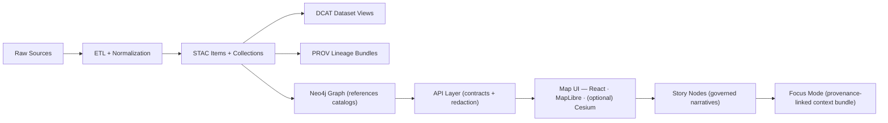

# 🧪 Tests (KFM / Kansas Matrix System)

[](https://github.com/<ORG>/<REPO>/actions/workflows/ci.yml)


> ✅ This folder is the **guardrail suite** for KFM’s **canonical pipeline** — from ETL outputs, to catalog boundary artifacts (STAC/DCAT/PROV), to graph/API/UI contracts, to Story Node + Focus Mode governance.  
> 🔒 If tests or policies fail, we **fail closed** (PR should not merge).  
> 🧭 Tests mirror reality: every stage must produce what the next stage expects.

---

## 📌 Contents

- [⚡ Quickstart](#-quickstart)
- [🧭 Non-negotiable invariants](#-non-negotiable-invariants)
- [🧩 Repo alignment (v13)](#-repo-alignment-v13)
- [🗂️ What belongs in `tests/`](#️-what-belongs-in-tests)
- [🧪 Test suites](#-test-suites)
- [🔁 CI gates (what should run on PRs)](#-ci-gates-what-should-run-on-prs)
- [🧱 Writing great tests (KFM style)](#-writing-great-tests-kfm-style)
- [🧯 Troubleshooting](#-troubleshooting)
- [📚 References (repo-friendly)](#-references-repo-friendly)

---

## ⚡ Quickstart

### 0) Prereqs ✅
- Docker + Compose (recommended for consistent PostGIS + Neo4j + API + UI)
- Python toolchain (backend + pipelines tests)
- Node toolchain (frontend tests)
- Conftest (OPA) for policy validation 🔒

> 🧯 Heads-up: the most common port collisions are **5432** (Postgres/PostGIS), **7474** (Neo4j), plus typical app ports like **8000/3000**.

---

### 1) Start the dev stack 🧱
```bash
# either form is fine (depending on your Docker version)
docker compose up -d
# or
docker-compose up -d
```

---

### 2) Run backend tests (Python) 🐍
```bash
docker compose exec api pytest
# or
docker-compose exec api pytest
```

✅ Tip: if you’re iterating, run the smallest slice:
```bash
pytest tests/unit -q
```

---

### 3) Run frontend tests (React / TypeScript) ⚛️
```bash
docker compose exec web npm test
# or
docker-compose exec web npm test
```

---

### 4) Run policy checks (fail-closed governance) 🔒
```bash
conftest test .
```

> 🔐 Policy failures should block merges. Treat them like failing unit tests.

---

## 🧭 Non-negotiable invariants

These are “system truths.” If a PR violates one, **tests must catch it**. ✅

1) **Pipeline ordering is absolute**  
   `ETL → Catalogs (STAC/DCAT/PROV) → Graph → API → UI → Story Nodes → Focus Mode`  
   No leapfrogging. No bypassing boundary artifacts.

2) **API boundary rule**  
   The **UI must never query Neo4j (or databases) directly**. Everything goes through the governed API.

3) **Provenance-first publishing**  
   Nothing is “published” without boundary artifacts: STAC/DCAT metadata + PROV lineage.

4) **Deterministic, idempotent ETL**  
   Same inputs ⇒ stable outputs. Pipelines should be safely re-runnable.

5) **Evidence-first narrative**  
   No unsourced narrative in Story Nodes or Focus Mode. AI output must be labeled + provenance-linked.

6) **Sovereignty & classification propagation**  
   Outputs can’t be “less restricted” than inputs. Sensitive locations must not leak through the UI.

7) **Governance fails closed** 🔒  
   Missing license, missing provenance, schema violations, policy denials ⇒ pipeline/CI stops.

---

## 🧩 Repo alignment (v13)

This `tests/` folder is **repo-wide** and maps to the v13 subsystem homes:

```text
📦 repo-root/
├─ 🗂️ data/                    # raw/work/processed + catalog outputs
├─ 🧾 schemas/                 # JSON Schemas (STAC/DCAT/PROV/story/UI/etc.)
├─ 🧱 src/
│  ├─ 🛠️ pipelines/            # ETL jobs + normalization
│  ├─ 🕸️ graph/                # Neo4j build + constraints + migrations
│  └─ 🔌 server/               # API boundary + contracts + enforcement
├─ 🌐 web/                     # React + MapLibre UI
├─ 🔒 policy/                  # OPA policies (tested via Conftest)
├─ 🧭 docs/                    # governed docs + story nodes
└─ 🧪 tests/                   # automated tests for all modules ✅
```

### 🗺️ Canonical pipeline (for mental model)



---

## 🗂️ What belongs in `tests/`

**Yes** ✅
- 🔬 Unit tests (pure logic, no network, no DB)
- 🔌 Integration tests (API ↔ PostGIS/Neo4j ↔ services)
- 🧾 Boundary artifact tests (STAC/DCAT/PROV schema + linkage)
- 🕸️ Graph constraints + ontology/label integrity tests
- 🗺️ Geo correctness tests (CRS, geometry validity, GeoJSON output)
- 🔒 Policy tests (Conftest/OPA)
- 🧭 Story Node + Focus Mode governance checks
- 🤖 AI gateway contract tests (stub by default; opt-in live runs)

**No** ❌
- Large raw datasets (use tiny fixtures)
- Flaky tests that depend on real external services by default
- UI tests that bypass the API boundary (that’s a failure condition)

---

## 🧪 Test suites

> 🎯 Rule of thumb: **each pipeline boundary gets a test suite**.  
> If a stage consumes outputs from the previous stage, that is a **contract** → contracts get tests.

---

### 1) 🔬 Unit tests (fast, deterministic)
**Goal:** prove core logic works without containers.

Examples:
- schema validators
- provenance builders
- parsers / normalizers
- CRS conversion utilities
- helper functions used by UI/Story Nodes

✅ Best practice: unit tests should exercise **domain/service** logic and mock adapters.

---

### 2) 🛠️ Pipeline/ETL tests (raw → work → processed)
**Goal:** ensure ETL is deterministic, idempotent, and emits stable outputs.

Recommended checks:
- output file naming + stable IDs
- hashing/signatures on inputs/outputs
- “re-run produces identical artifacts” (or logged deltas)
- pipeline logs exist and are parseable

📁 Data staging convention:
- `data/raw/<domain>/`
- `data/work/<domain>/`
- `data/processed/<domain>/`

---

### 3) 🧾 Boundary artifact tests (STAC/DCAT/PROV)
**Goal:** enforce “publishable = validated metadata + lineage.”

Checks:
- STAC records exist (collections + items)
- DCAT dataset entry exists (title/description/license/keywords/distributions)
- PROV lineage bundle exists and links raw → work → processed
- cross-links are consistent (STAC ↔ DCAT ↔ PROV ↔ graph IDs)

📦 Canonical catalog locations:
- `data/stac/collections/`
- `data/stac/items/`
- `data/catalog/dcat/`
- `data/prov/`

✅ “Boundary artifacts” are the interface to downstream stages (graph/API/UI). Treat them like APIs.

---

### 4) 🕸️ Graph tests (Neo4j integrity + migrations)
**Goal:** keep graph structure stable unless migrations are deliberate.

Recommended checks:
- no orphan labels/types
- required indexes/constraints exist
- ontology changes require migration scripts
- graph nodes reference catalogs (STAC IDs / DCAT IDs) instead of duplicating payloads

---

### 5) 🔌 API integration + contract tests (FastAPI ↔ PostGIS/Neo4j)
**Goal:** validate backend behavior, stability, and enforcement.

Checks:
- endpoint status codes + error shapes
- filtering/sorting/pagination
- OpenAPI contract stability (breaking change ⇒ version bump)
- policy enforcement: API calls must respect allow/deny decisions
- redaction/classification behavior (no sensitive leaks)
- provenance links returned alongside data products

✅ Test the API as your “security boundary” — because it is.

---

### 6) 🌐 UI tests (React + MapLibre)
**Goal:** ensure UI behavior matches contracts and never bypasses governance.

Checks:
- UI only talks to API (no direct graph/db calls)
- layer registry configs load expected layers
- accessibility sanity checks (basic a11y)
- map interactions do not leak sensitive location detail when restricted

> 🧱 If a UI test would be easier by calling the DB directly: **don’t** — write an API fixture instead.

---

### 7) 🧭 Story Node + Focus Mode tests
**Goal:** keep narrative machine-ingestible, provenance-linked, and safe.

Checks:
- Story Node uses the governed template
- every factual claim has citations/links to cataloged evidence
- referenced entities (people/places/events/docs) use stable graph identifiers
- fact vs interpretation is clearly separated
- Focus Mode rules enforced:
  - only provenance-linked content renders
  - AI contributions are opt-in + labeled + confidence surfaced
  - sensitive locations are generalized/blurred (no side-channel leakage)

✅ These tests protect the “no hallucinations” rule.

---

### 8) 🔒 Policy tests (Conftest / OPA)
**Goal:** encode governance so it’s enforceable.

Run:
```bash
conftest test .
```

Patterns:
- `policy/` contains OPA rules
- `tests/policy/fixtures/` contains minimal examples
- policy tests should prove it blocks:
  - missing license
  - missing provenance
  - missing required metadata
  - schema/profile violations
  - restricted datasets exposed without authorization

---

### 9) 🗺️ Geospatial correctness tests (CRS, geometry, GeoJSON)
**Goal:** prevent “maps that look right but are wrong.”

Suggested checks:
- CRS sanity (expected EPSG / axis order / coordinate bounds)
- geometry validity (no self-intersections, empties, invalid rings)
- bbox correctness
- distance/area sanity (use projected CRS when required)
- GeoJSON output is complete (FeatureCollection/Feature, not geometry-only blobs)

🧠 Metadata matters (test it): include map projection / coordinate system / spatial extent / scale, plus copyright & usage permissions where applicable.

---

### 10) 🧭 Navigation & grid overlay tests (UTM / MGRS / lat-long)
If you ship grid overlays or coordinate readouts, test them with known fixtures:

- known lat/long ↔ UTM ↔ MGRS conversions
- formatting and precision rules
- “read right then up” helpers (eastings then northings)

✅ These are perfect for deterministic unit tests.

---

### 11) 🤖 AI / local inference tests (optional, but powerful)
Treat LLMs like any external dependency: **stub by default**.

#### 🧰 Local-first with Ollama
Recommended test layers:
- **unit:** prompt templates + “no unsourced claims” guards
- **integration:** API contract to AI gateway (mock server)
- **live/manual:** opt-in tests talking to a real local Ollama instance

Example local setup:
```bash
ollama serve
ollama run <model>
```

Optional: if you route AI via env config, document test defaults (e.g., stubbed AI, local Ollama only for manual runs).

---

## 🔁 CI gates (what should run on PRs)

> ✅ The goal is a permanently **CI-clean** main branch.

Minimum gates:
- 🧹 linting (Python + JS/TS)
- 🧪 unit + integration tests (backend + pipelines)
- ⚛️ frontend tests
- 🔒 policy checks (Conftest/OPA)
- 🧾 schema/profile validation (STAC/DCAT/PROV/story)
- 🔐 security scans (secrets/sensitive info leaks)

### ✅ PR checklist (copy/paste)
- [ ] I added/updated tests for the behavior I changed
- [ ] Any new dataset includes required STAC/DCAT/PROV artifacts
- [ ] Any Story Node change follows the template and includes citations
- [ ] Policy checks pass (`conftest test .`)
- [ ] No sensitive data leaks (UI + API + catalogs reflect classification)

---

## 🧱 Writing great tests (KFM style)

### ✅ Principles (practical, not preachy)
- **Deterministic** 🎯 (fixed seeds, stable fixtures)
- **Idempotent** 🔁 (ETL can re-run safely)
- **Fast by default** ⚡ (heavy tests are opt-in / nightly)
- **Small fixtures** 🧰 (tiny, legible datasets > giant dumps)
- **Evidence-first failures** 🧾 (tests should explain *why* they failed)
- **Contract-first mindset** 📜 (schemas + OpenAPI + profiles are first-class)

### 🏷️ Naming conventions
- `test_<component>__<behavior>__<expected>()`
- Prefer “behavior” tests over implementation tests.

### 🧪 Suggested markers (recommended)
- `@pytest.mark.unit`
- `@pytest.mark.integration`
- `@pytest.mark.e2e`
- `@pytest.mark.geo`
- `@pytest.mark.policy`

---

## 🧯 Troubleshooting

### 🧨 “Port already in use”
- Stop the conflicting local service, or change ports in `docker-compose.yml`
- Common collisions: `5432`, `7474`, `8000`, `3000`

### 🧱 DB container not ready / migrations not applied
```bash
docker compose down
docker compose up -d
```
Then rerun tests after DB is healthy.

### 🧩 Flaky e2e tests
- stabilize fixtures
- avoid time-based assumptions
- poll readiness endpoints
- stub non-critical external services

---

## 📚 References (repo-friendly)

> 🧭 These should live in-repo under `docs/` (and optionally `docs/library/` for PDFs).  
> Keep links stable — tests will rely on governed contracts and templates.

- `docs/MASTER_GUIDE_v13.md` (canonical pipeline + invariants + directory layout)
- `docs/standards/` (STAC/DCAT/PROV profiles, schema rules)
- `docs/templates/` (universal docs, Story Node template, API contract template)
- `docs/reports/story_nodes/` (governed narratives: draft → published)
- `docs/governance/` (ethics, sovereignty, FAIR/CARE)
- `policy/` (OPA policies; validated via Conftest)
- `schemas/` (machine-validated contracts)

---

<details>
<summary>🧪 “Where do I add my test?” (quick map)</summary>

| You changed… | Add tests in… | And run… |
|---|---|---|
| ETL pipeline code | `tests/pipelines/` | `pytest tests/pipelines` |
| Catalog schemas/metadata | `tests/catalog/` | `pytest tests/catalog` |
| Graph ingest/ontology | `tests/graph/` | `pytest tests/graph` |
| API endpoints/contracts | `tests/api/` | `pytest tests/api` |
| UI behavior | `web/` tests | `npm test` |
| Policies | `tests/policy/` | `conftest test .` |
| Story Nodes / Focus Mode | `tests/story/` | `pytest tests/story` |

</details>