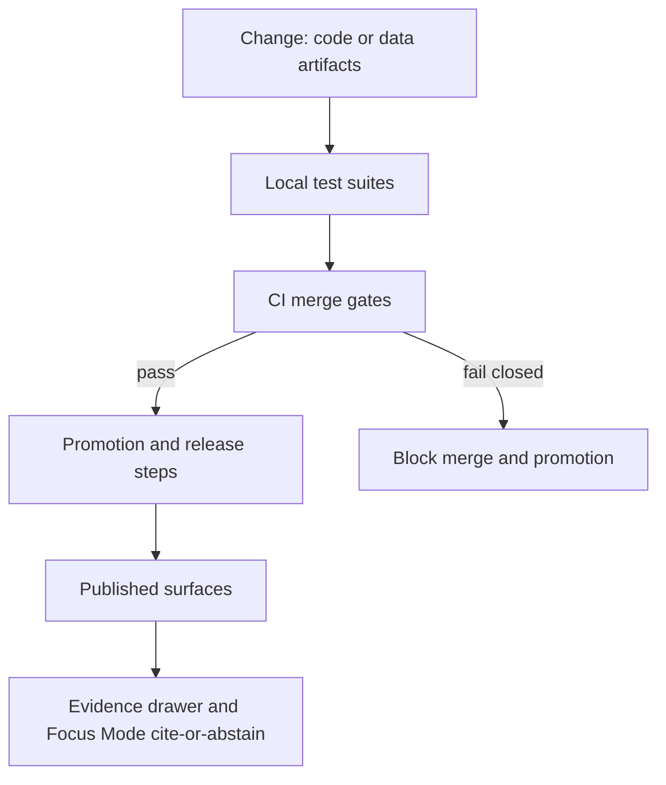
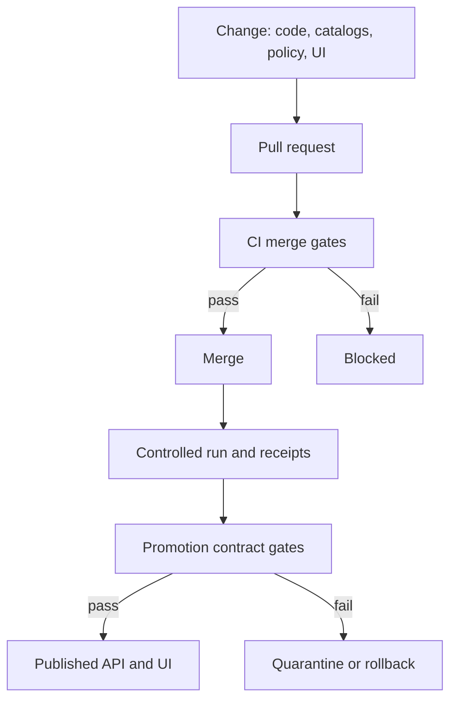

<!-- [KFM_META_BLOCK_V2]
doc_id: kfm://doc/7f06c93b-7c88-4f2b-bba2-4f3d935d3f89
title: tests — Test Strategy, QA, and CI Gates
type: standard
version: v1
status: draft
owners: TODO
created: 2026-02-26
updated: 2026-02-26
policy_label: restricted
related:
  - docs/MASTER_GUIDE_v13.md
  - docs/architecture/
  - .github/workflows/
tags: [kfm, tests, ci, governance]
notes:
  - This README is a governed artifact. Keep it aligned with merge gates and the Promotion Contract.
  - Do not include secrets, restricted datasets, or sensitive location details in this doc or fixtures.
[/KFM_META_BLOCK_V2] -->

# 🧪 `tests/` — Test Strategy, QA, and CI Gates

**Purpose:** Make governance enforceable. Tests are not “nice to have”; they are the mechanism that keeps the trust membrane intact and prevents unsafe or untraceable outputs from shipping.

**Status:** DRAFT • **Owners:** `TODO` • **Last updated:** `2026-02-26`


> **WARNING**
> This directory is part of the **trust membrane**. If a test is flaky, non-deterministic, or can be bypassed, it is a governance risk.

---

## Navigation

- [Purpose and scope](#purpose-and-scope)
- [How tests map to governance](#how-tests-map-to-governance)
- [Running tests](#running-tests)
- [Test categories](#test-categories)
- [Folder layout](#folder-layout)
- [Writing and adding tests](#writing-and-adding-tests)
- [CI gates](#ci-gates)
- [Release definition of done](#release-definition-of-done)
- [Troubleshooting](#troubleshooting)
- [Appendices](#appendices)

---

## Purpose and scope

This `tests/` directory holds **automated tests** that verify:

1. **Correctness** of domain logic.
2. **Governance invariants** (fail closed).
3. **Evidence and citation resolvability** (cite-or-abstain).
4. **Schema and contract stability** (catalog + API).
5. **Safety** for sensitive locations and restricted data.

### What belongs here

- Unit tests for domain logic and deterministic identity logic.
- Schema validation tests for catalog artifacts (STAC/DCAT/PROV).
- Policy tests driven by fixtures (allow/deny/obligations).
- API contract tests (OpenAPI diffs, DTO validation).
- Integration tests for evidence resolution.
- E2E UI tests for evidence drawer and citation resolution.
- Test fixtures that are **synthetic** or **sanitized**, small, and clearly licensed.

### What must not go here

- Real secrets, tokens, credentials, or private keys.
- Raw partner datasets or anything with unclear licensing.
- Restricted or sensitive geometries, precise coordinates, or any fixture that could re-enable targeting.
- Large binaries unless explicitly approved and versioned as test assets with provenance.

---

## How tests map to governance

KFM’s operating stance is **fail closed**: if evidence, policy, licensing, or citations are unclear, the system blocks promotion/publishing.



Practical meaning:

- A feature is not “done” until tests prove it preserves the trust membrane.
- CI gates must block merges when governance checks fail.
- Tests should be deterministic and reproducible; minimize reliance on external systems.

---

## Running tests

> **NOTE**
> This repo should expose a single “run everything” command. If you don’t see one, add it (Makefile/Taskfile/script) and wire CI to use it.

### Common entry points

Pick the command(s) actually used by this repository:

- `make test` or `task test`
- `./tools/test.sh`
- `npm test` / `yarn test` / `pnpm test`
- `pytest`
- `go test ./...`

### Run by category

Examples (adjust paths to match the actual folder structure):

```bash
# Unit tests
pytest -q tests/unit

# Schema tests
pytest -q tests/schema

# Policy tests
pytest -q tests/policy

# Contract tests
pytest -q tests/contract

# Integration tests
pytest -q tests/integration

# E2E UI tests
npx playwright test
```

### Suggested local workflow

1. Run unit + schema + policy tests before pushing.
2. Run integration tests before requesting review.
3. Run E2E tests (or at least the evidence-drawer spec) before merging UI changes.

---

## Test categories

Minimum categories expected in KFM:

| Category | Purpose | Typical failures catch | Evidence required |
|---|---|---|---|
| Unit tests | Validate domain logic and deterministic identity | Wrong spec hashing, bad vocab validation, time logic bugs | Pure code + small fixtures |
| Schema tests | Validate STAC/DCAT/PROV profiles | Invalid JSON, missing required fields, broken cross-links | Schema + sample artifacts |
| Policy tests | Enforce default-deny and obligations | Accidental leakage, incorrect allow/deny decisions | Policy fixtures |
| Contract tests | Prevent breaking API consumers | Breaking OpenAPI diffs, DTO drift | OpenAPI + DTO fixtures |
| Integration tests | Prove the evidence resolver works end-to-end | Broken EvidenceRefs, latency regressions, policy bypass | Sample EvidenceRefs |
| E2E UI tests | Prove the UI shows evidence and citations | Evidence drawer missing, citations not resolvable | Test server + seeded content |

---

## Folder layout

> **NOTE**
> This is the **recommended** layout. If the repo differs, update this README to match reality.

```text
tests/
  README.md

  unit/
    # Domain logic tests, spec hashing, controlled vocab checks

  schema/
    # STAC/DCAT/PROV profile validation, cross-link checks

  policy/
    # OPA fixture-driven allow/deny/obligation tests

  contract/
    # OpenAPI diffs, DTO validation, backward compatibility checks

  integration/
    # Evidence resolver and governed API integration tests

  e2e/
    # End-to-end tests (UI + API) for evidence drawer and citations

  fixtures/
    public/
      # Safe, synthetic fixtures intended for public scenarios
    restricted_sanitized/
      # Sanitized fixtures that never contain restricted geometries or identifiers

  utils/
    # Shared test helpers (builders, fake stores, snapshot utilities)
```

---

## Writing and adding tests

### Golden rules

- **Fail closed**: a missing citation, policy label, license field, or schema link must fail the test.
- **No hidden dependencies**: tests should not require internet access or external credentials.
- **Keep fixtures small and attributable**: each fixture should include a short provenance note (source, license, why it is safe).

### Adding a new feature test checklist

- [ ] Unit test covers domain logic changes.
- [ ] Schema tests cover any catalog output changes.
- [ ] Policy fixture added for any new access pattern.
- [ ] Contract tests updated for any OpenAPI/DTO change.
- [ ] Integration tests cover at least one representative EvidenceRef.
- [ ] E2E test covers the evidence drawer path if the UI is affected.
- [ ] Link checker passes (no broken citations).
- [ ] Accessibility smoke checks pass for UI changes.

### Sensitive data safety patterns

When working with sensitive locations or re-identification risk datasets:

- Prefer generalized or aggregated fixtures.
- Add explicit “no leakage” tests (public tile responses must not contain restricted bounds/fields).
- Assert that public exports omit restricted coordinate fields.

---

## CI gates

These checks are merge-blocking and should run on every PR that changes relevant files:

- Lint and typecheck for frontend and backend
- Schema validation for any changed catalog artifacts
- Story Node template validation
- Policy tests must pass
- Spec hashing tests must pass
- Link checker must pass (no broken citations)
- Security scanning and optional SBOM generation
- Accessibility smoke checks for UI changes

---

## Release definition of done

A release is considered done only when:

- All CI gates pass
- Promotion manifests exist for new dataset versions
- Evidence resolver contract tests pass for public and restricted scenarios
- Focus Mode evaluation harness passes golden queries
- UI regression tests pass and accessibility checks show no major regressions
- Release notes include policy and data changes
- Audit ledger retention and monitoring are configured

---

## Troubleshooting

### Common failure modes

- **Spec hash mismatch**  
  Usually means canonicalization changed. Confirm deterministic field ordering and normalization rules.

- **Broken citations or unresolved EvidenceRefs**  
  Fix the reference target or add missing evidence bundle artifacts. Do not “skip” the test.

- **Policy tests failing unexpectedly**  
  Treat as a potential leakage regression first. Only relax policy with a documented governance decision.

- **Schema tests failing**  
  Update artifact generation to match profiles. Do not patch schemas to “fit the bug” unless it’s an intentional schema change.

- **E2E flakiness**  
  Stabilize by removing timing assumptions, using deterministic seeds, and running browsers in a consistent mode in CI.

---

## Appendices

<details>
<summary><strong>Appendix A — Recommended CI job naming</strong></summary>

- `lint_typecheck`
- `unit`
- `schema_catalog`
- `policy`
- `contract_api`
- `integration_evidence`
- `e2e_ui`
- `link_check`
- `security_scan`
- `a11y_smoke`

</details>

<details>
<summary><strong>Appendix B — Fixture governance template</strong></summary>

Each fixture directory should contain a short `FIXTURE_NOTES.md` with:

- Source and license
- Sensitivity classification
- Redaction steps applied
- Intended test coverage

</details>

---

<a id="back-to-top"></a>
**Back to top:** [Navigation](#navigation)<!-- [KFM_META_BLOCK_V2]
doc_id: kfm://doc/7f06c93b-7c88-4f2b-bba2-4f3d935d3f89
title: tests — Test Strategy, QA, and CI Gates
type: standard
version: v1
status: draft
owners: TODO
created: 2026-02-26
updated: 2026-02-26
policy_label: restricted
related:
  - docs/MASTER_GUIDE_v13.md
  - docs/architecture/
  - .github/workflows/
tags: [kfm, tests, ci, governance]
notes:
  - This README is a governed artifact. Keep it aligned with merge gates and the Promotion Contract.
  - Do not include secrets, restricted datasets, or sensitive location details in this doc or fixtures.
[/KFM_META_BLOCK_V2] -->

# 🧪 `tests/` — Test Strategy, QA, and CI Gates

**Purpose:** Make governance enforceable. Tests are not “nice to have”; they are the mechanism that keeps the trust membrane intact and prevents unsafe or untraceable outputs from shipping.

**Status:** DRAFT • **Owners:** `TODO` • **Last updated:** `2026-02-26`


> **WARNING**
> This directory is part of the **trust membrane**. If a test is flaky, non-deterministic, or can be bypassed, it is a governance risk.

---

## Navigation

- [Purpose and scope](#purpose-and-scope)
- [How tests map to governance](#how-tests-map-to-governance)
- [Running tests](#running-tests)
- [Test categories](#test-categories)
- [Folder layout](#folder-layout)
- [Writing and adding tests](#writing-and-adding-tests)
- [CI gates](#ci-gates)
- [Release definition of done](#release-definition-of-done)
- [Troubleshooting](#troubleshooting)
- [Appendices](#appendices)

---

## Purpose and scope

This `tests/` directory holds **automated tests** that verify:

1. **Correctness** of domain logic.
2. **Governance invariants** (fail closed).
3. **Evidence and citation resolvability** (cite-or-abstain).
4. **Schema and contract stability** (catalog + API).
5. **Safety** for sensitive locations and restricted data.

### What belongs here

- Unit tests for domain logic and deterministic identity logic.
- Schema validation tests for catalog artifacts (STAC/DCAT/PROV).
- Policy tests driven by fixtures (allow/deny/obligations).
- API contract tests (OpenAPI diffs, DTO validation).
- Integration tests for evidence resolution.
- E2E UI tests for evidence drawer and citation resolution.
- Test fixtures that are **synthetic** or **sanitized**, small, and clearly licensed.

### What must not go here

- Real secrets, tokens, credentials, or private keys.
- Raw partner datasets or anything with unclear licensing.
- Restricted or sensitive geometries, precise coordinates, or any fixture that could re-enable targeting.
- Large binaries unless explicitly approved and versioned as test assets with provenance.

---

## How tests map to governance

KFM’s operating stance is **fail closed**: if evidence, policy, licensing, or citations are unclear, the system blocks promotion/publishing.


Practical meaning:

- A feature is not “done” until tests prove it preserves the trust membrane.
- CI gates must block merges when governance checks fail.
- Tests should be deterministic and reproducible; minimize reliance on external systems.

---

## Running tests

> **NOTE**
> This repo should expose a single “run everything” command. If you don’t see one, add it (Makefile/Taskfile/script) and wire CI to use it.

### Common entry points

Pick the command(s) actually used by this repository:

- `make test` or `task test`
- `./tools/test.sh`
- `npm test` / `yarn test` / `pnpm test`
- `pytest`
- `go test ./...`

### Run by category

Examples (adjust paths to match the actual folder structure):

```bash
# Unit tests
pytest -q tests/unit

# Schema tests
pytest -q tests/schema

# Policy tests
pytest -q tests/policy

# Contract tests
pytest -q tests/contract

# Integration tests
pytest -q tests/integration

# E2E UI tests
npx playwright test
```

### Suggested local workflow

1. Run unit + schema + policy tests before pushing.
2. Run integration tests before requesting review.
3. Run E2E tests (or at least the evidence-drawer spec) before merging UI changes.

---

## Test categories

Minimum categories expected in KFM:

| Category | Purpose | Typical failures catch | Evidence required |
|---|---|---|---|
| Unit tests | Validate domain logic and deterministic identity | Wrong spec hashing, bad vocab validation, time logic bugs | Pure code + small fixtures |
| Schema tests | Validate STAC/DCAT/PROV profiles | Invalid JSON, missing required fields, broken cross-links | Schema + sample artifacts |
| Policy tests | Enforce default-deny and obligations | Accidental leakage, incorrect allow/deny decisions | Policy fixtures |
| Contract tests | Prevent breaking API consumers | Breaking OpenAPI diffs, DTO drift | OpenAPI + DTO fixtures |
| Integration tests | Prove the evidence resolver works end-to-end | Broken EvidenceRefs, latency regressions, policy bypass | Sample EvidenceRefs |
| E2E UI tests | Prove the UI shows evidence and citations | Evidence drawer missing, citations not resolvable | Test server + seeded content |

---

## Folder layout

> **NOTE**
> This is the **recommended** layout. If the repo differs, update this README to match reality.

```text
tests/
  README.md

  unit/
    # Domain logic tests, spec hashing, controlled vocab checks

  schema/
    # STAC/DCAT/PROV profile validation, cross-link checks

  policy/
    # OPA fixture-driven allow/deny/obligation tests

  contract/
    # OpenAPI diffs, DTO validation, backward compatibility checks

  integration/
    # Evidence resolver and governed API integration tests

  e2e/
    # End-to-end tests (UI + API) for evidence drawer and citations

  fixtures/
    public/
      # Safe, synthetic fixtures intended for public scenarios
    restricted_sanitized/
      # Sanitized fixtures that never contain restricted geometries or identifiers

  utils/
    # Shared test helpers (builders, fake stores, snapshot utilities)
```

---

## Writing and adding tests

### Golden rules

- **Fail closed**: a missing citation, policy label, license field, or schema link must fail the test.
- **No hidden dependencies**: tests should not require internet access or external credentials.
- **Keep fixtures small and attributable**: each fixture should include a short provenance note (source, license, why it is safe).

### Adding a new feature test checklist

- [ ] Unit test covers domain logic changes.
- [ ] Schema tests cover any catalog output changes.
- [ ] Policy fixture added for any new access pattern.
- [ ] Contract tests updated for any OpenAPI/DTO change.
- [ ] Integration tests cover at least one representative EvidenceRef.
- [ ] E2E test covers the evidence drawer path if the UI is affected.
- [ ] Link checker passes (no broken citations).
- [ ] Accessibility smoke checks pass for UI changes.

### Sensitive data safety patterns

When working with sensitive locations or re-identification risk datasets:

- Prefer generalized or aggregated fixtures.
- Add explicit “no leakage” tests (public tile responses must not contain restricted bounds/fields).
- Assert that public exports omit restricted coordinate fields.

---

## CI gates

These checks are merge-blocking and should run on every PR that changes relevant files:

- Lint and typecheck for frontend and backend
- Schema validation for any changed catalog artifacts
- Story Node template validation
- Policy tests must pass
- Spec hashing tests must pass
- Link checker must pass (no broken citations)
- Security scanning and optional SBOM generation
- Accessibility smoke checks for UI changes

---

## Release definition of done

A release is considered done only when:

- All CI gates pass
- Promotion manifests exist for new dataset versions
- Evidence resolver contract tests pass for public and restricted scenarios
- Focus Mode evaluation harness passes golden queries
- UI regression tests pass and accessibility checks show no major regressions
- Release notes include policy and data changes
- Audit ledger retention and monitoring are configured

---

## Troubleshooting

### Common failure modes

- **Spec hash mismatch**  
  Usually means canonicalization changed. Confirm deterministic field ordering and normalization rules.

- **Broken citations or unresolved EvidenceRefs**  
  Fix the reference target or add missing evidence bundle artifacts. Do not “skip” the test.

- **Policy tests failing unexpectedly**  
  Treat as a potential leakage regression first. Only relax policy with a documented governance decision.

- **Schema tests failing**  
  Update artifact generation to match profiles. Do not patch schemas to “fit the bug” unless it’s an intentional schema change.

- **E2E flakiness**  
  Stabilize by removing timing assumptions, using deterministic seeds, and running browsers in a consistent mode in CI.

---

## Appendices

<details>
<summary><strong>Appendix A — Recommended CI job naming</strong></summary>

- `lint_typecheck`
- `unit`
- `schema_catalog`
- `policy`
- `contract_api`
- `integration_evidence`
- `e2e_ui`
- `link_check`
- `security_scan`
- `a11y_smoke`

</details>

<details>
<summary><strong>Appendix B — Fixture governance template</strong></summary>

Each fixture directory should contain a short `FIXTURE_NOTES.md` with:

- Source and license
- Sensitivity classification
- Redaction steps applied
- Intended test coverage

</details>

---

<a id="back-to-top"></a>
**Back to top:** [Navigation](#navigation)<!-- [KFM_META_BLOCK_V2]
doc_id: kfm://doc/96cf4ebe-f113-4d54-b0c8-2ae15a28d129
title: tests/README.md
type: standard
version: v1
status: draft
owners: TBD
created: 2026-02-22
updated: 2026-02-22
policy_label: public
related:
  - kfm://doc/definitive-design-governance-guide-vnext
tags: [kfm, tests, ci, promotion-gates, governance, fail-closed]
notes:
  - Defines KFM test categories, fixtures, and CI merge gates.
  - Treat this file as the contract for what “green CI” means.
[/KFM_META_BLOCK_V2] -->

# tests — KFM test suite

Executable contracts for the trust membrane, promotion gates, and evidence-first UX.


---

## Navigation

- [Quick start](#quick-start)
- [What we test](#what-we-test)
- [CI gates](#ci-gates)
- [Quality metrics](#quality-metrics)
- [Promotion contract gates](#promotion-contract-gates)
- [Release definition of done](#release-definition-of-done)
- [Recommended layout](#recommended-layout)
- [Writing good tests](#writing-good-tests)
- [Fixtures and test data](#fixtures-and-test-data)
- [Golden queries for Focus Mode](#golden-queries-for-focus-mode)
- [Troubleshooting](#troubleshooting)

---

## Quick start

> NOTE  
> This repository’s exact test runner commands are **not confirmed in repo**.  
> Until a single runner is standardized, use the discovery steps below.

1. **Find the component runner**
   - Node or TypeScript packages: look for `package.json` scripts (example: `test`, `lint`, `typecheck`).
   - Python packages: look for `pyproject.toml` or `requirements.txt` and a `pytest` configuration.
   - Policy: look for an OPA policy bundle and fixtures (often `policy/**/*.rego`, `tests/policy/**`).

2. **Run the merge gates for what you changed**
   - If you changed **catalogs**: run schema + link checks.
   - If you changed **policy**: run policy tests.
   - If you changed **domain logic**: run unit tests.
   - If you changed **API contracts**: run contract tests.
   - If you changed **UI evidence drawer or Story Mode**: run E2E and accessibility smoke checks.

3. **Aim for a single “green bar” command**
   - Target state: a single command (for example `make test-gates` or `./tools/kfm test-gates`) that runs the merge-blocking gate set.

---

## What we test

KFM is only trustworthy if governance invariants are encoded as tests and those tests **fail closed**.

### Test categories

Minimum categories and what they protect:

| Category | Protects | Examples | Merge blocking |
|---|---|---|---|
| Unit | Core correctness and determinism | `spec_hash` canonicalization, controlled vocab validation | Yes |
| Schema | Catalog integrity | DCAT, STAC, PROV profile validation | Yes when catalogs change |
| Policy | Governance outcomes | OPA fixture-driven allow/deny and obligation outputs | Yes |
| Contract | Interface stability | OpenAPI diffs, DTO validation, resolver responses | Yes |
| Integration | Cross-component behavior | evidence resolver resolves sample EvidenceRefs | Yes |
| E2E UI | User-visible trust surface | layer toggle → evidence drawer shows attribution; Story citations resolve; Focus citations resolve | Yes for UI trust changes |

> TIP  
> If a change can affect what the public sees, what gets promoted, or what Focus Mode can cite, it needs a test.

### How tests relate to the trust membrane

We test the boundary, not just the code inside it:

- Frontend and external clients must never access DB or object storage directly.
- Core services must not bypass repositories to reach storage directly.
- All access must go through governed APIs that apply policy decisions, redactions, and logging.

In practice, this means adding tests that:
- deny direct storage paths in build outputs,
- assert API layers enforce policy,
- ensure evidence resolver checks policy before returning evidence bundles.

### Policy parity between CI and runtime

Policy is a shared contract:

- CI and runtime must evaluate policy the same way, using the same fixtures and expected outcomes.
- The evidence resolver and API layer must enforce policy before serving data or evidence.
- The UI may display policy badges and notices, but must not make policy decisions.

---

## CI gates

CI merge gates are **status checks** that block merges when they fail.

### Minimum merge gates

These are the minimum merge gates expected for KFM:

- Lint and typecheck for frontend and backend
- Schema validation for changed catalog artifacts
- Story Node template validation
- Policy tests
- `spec_hash` stability tests
- Citation verification and linting for EvidenceRefs and media rights
- Dependency vulnerability scanning and optional SBOM generation
- Accessibility smoke checks for UI trust-surface changes

CI citation checks should include:

- syntax check for EvidenceRefs
- resolver check in a test environment
- policy check for intended policy label
- rights check for any included media

If citation checks fail, Story Nodes must not merge.

> WARNING  
> A gate that can be bypassed is not a gate. If it matters for governance, it must be merge blocking.

---

## Quality metrics

Track governance and reliability metrics. Use metrics to detect drift and risk, not to create perverse incentives.

- Percent of promoted artifacts with explicit license metadata
- Percent of Story Nodes with fully resolvable citations
- Evidence resolver latency, P95
- Tile serving latency for public layers, P95
- Reindex time from processed artifacts
- Count of quarantined datasets by reason code
- Count of policy denials by reason code

---

## Promotion contract gates

Promotion gates apply when moving a dataset version through the truth path.

### Gate mapping

| Gate | What must be true | What to test |
|---|---|---|
| Gate A | Identity and versioning are stable | `spec_hash` stability; dataset and version IDs are deterministic |
| Gate B | Licensing and rights are explicit | license fields present; rights holder captured; “unclear” fails closed |
| Gate C | Sensitivity classification exists | policy label present; redaction or generalization plan recorded |
| Gate D | Triplet validates and cross-links resolve | DCAT, STAC, PROV validate and referential integrity passes |
| Gate E | Run receipt and checksums exist | receipts present; inputs and outputs enumerated with digests |
| Gate F | Policy and contract checks pass | OPA tests pass; evidence resolver resolves at least one ref; API schemas validate |
| Gate G | Production posture checks | SBOM and build provenance; perf smoke checks; accessibility checks |

> NOTE  
> Promotion gates are not “paperwork.” They are enforced contracts.

---

## Release definition of done

A release is done when:

- All gates pass in CI
- Promotion manifests exist for new dataset versions
- Evidence resolver contract tests pass for public and restricted scenarios
- Focus Mode evaluation harness passes golden queries
- UI regression tests pass and accessibility checks show no major regressions
- Release notes include policy and data changes
- Audit ledger retention and monitoring are configured

---

## Recommended layout

This directory structure is a **recommended** default to keep tests discoverable.

```text
tests/
├─ README.md
├─ fixtures/
│  ├─ catalog/              # minimal DCAT, STAC, PROV fixtures
│  ├─ policy/               # allow and deny fixtures for OPA tests
│  ├─ story/                # Story Node fixture examples
│  └─ evidence/             # EvidenceRef fixtures and expected bundles
├─ unit/                    # pure domain tests
├─ schema/                  # validators + regression fixtures
├─ policy/                  # OPA tests and helper scripts
├─ contract/                # OpenAPI and DTO contract tests
├─ integration/             # evidence resolver + API integration
├─ e2e/                     # UI journeys for trust surfaces
└─ golden/
   └─ focus-mode/           # golden query fixtures for Focus Mode
```

---

## Writing good tests

### Non-negotiables

- **Deterministic:** same inputs → same outputs, same spec → same hash.
- **No network:** tests must not depend on external services unless explicitly marked and isolated.
- **Fail closed:** missing license, missing policy label, missing citations → tests should fail, not warn.
- **Time-aware:** freeze time where needed; do not rely on wall-clock time in assertions.
- **Explain failures:** test output should tell a contributor what to fix.

### What to add when you touch a trust surface

If you change:

- **Catalog schemas or validators** → add schema regression fixtures.
- **Policy rules** → add allow and deny fixtures and obligation assertions.
- **Evidence resolver** → add at least one EvidenceRef fixture that resolves end-to-end.
- **Story Nodes** → add link-check fixtures so citations never silently rot.
- **UI evidence drawer** → add E2E tests that verify:
  - evidence panel opens
  - dataset version, license, policy label display
  - citations resolve

---

## Fixtures and test data

### Fixture rules

- Fixtures are part of the **evidence-first** posture: keep them small, explicit, and readable.
- Do not commit restricted or partner-only source data into test fixtures.
- Prefer synthetic data that still exercises:
  - sensitivity labeling,
  - redaction pipelines,
  - citation resolution.

### Sensitive location protection

If a dataset contains precise or sensitive locations:

- tests must ensure public tiles do not leak restricted bounding boxes,
- tests must ensure public exports do not include forbidden coordinate fields.

---

## Golden queries for Focus Mode

Focus Mode is a governed workflow: it must either cite admissible evidence or abstain.

Recommended golden query harness expectations:

- Every golden query has:
  - a prompt
  - a policy context
  - an expected decision outcome
  - required citations or required abstention
- Golden query tests should fail if:
  - any citation cannot be resolved
  - policy says deny but the system returns content
  - the audit record is not reproducible

---

## Troubleshooting

### Common failure types

- **Link checker fails:** a citation or EvidenceRef is broken. Fix the reference or update the fixture.
- **Policy tests fail:** your change altered allow or deny outcomes. Update fixtures and document the change.
- **Schema validation fails:** catalog output does not match profile. Fix generator or the fixture.
- **`spec_hash` test fails:** you introduced non-determinism or canonicalization drift.
- **E2E flakes:** remove timing assumptions; wait on deterministic UI states and network mocks.

### If you are unsure which gate applies

Start from the change surface:

- Catalog change → schema + link
- Policy change → policy tests
- API change → contract + integration
- UI trust change → E2E + accessibility
- Pipeline change → promotion gate mapping

---

## Appendix

### Test gate flow



Back to top: [Navigation](#navigation)
