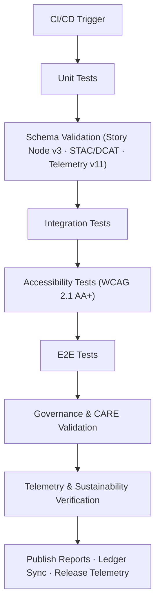

<div align="center">

# 🧪 **Kansas Frontier Matrix — Testing & QA Framework (v11)**  
`tests/README.md`

### **Deterministic · Ethical · Sovereignty-Safe · Telemetry-Driven · Diamond⁹ Ω / Crown∞Ω**

The **Testing & QA Framework v11** is the *CI/CD guardian* for the entire KFM monorepo.  
It validates correctness, ethics, reproducibility, sustainability, and semantic integrity across:

- ETL & AI pipelines  
- Neo4j graph ingestion & reasoning  
- Story Nodes v3  
- Focus Mode v3  
- STAC/DCAT catalogs  
- Governance ledger operations  
- Accessibility (WCAG 2.1 AA+)  
- OpenTelemetry v11 compliance  

</div>

---

# 📘 1. Overview

The v11 QA Framework:

- Executes **unit → integration → E2E** tests  
- Validates **schemas**, **data contracts**, **telemetry**, **ontology alignment**  
- Ensures **CARE-controlled behavior** and sovereignty masking  
- Confirms **AI safety** (explainability, bias, drift, provenance)  
- Guarantees **deterministic ETL outputs** and reproducible state  
- Syncs results to **FAIR+CARE governance ledgers**  
- Writes sustainability metrics to release-level bundles  

Every test suite emits:

- PROV-O + OpenLineage v2.5 activity records  
- Energy/CO₂ telemetry  
- A11y usage + performance metrics  
- Governance and CARE outcomes  

---

# 🗂️ 2. Directory Layout (v11)

```text
tests/
│
├── README.md                      # This file — v11 Testing & QA Framework
├── ARCHITECTURE.md                # Deep platform architecture (v11)
│
├── unit/                          # Pure, deterministic tests
│   ├── pipelines/                 # ETL/AI/utils unit tests
│   ├── web/                       # React UI component tests
│   ├── governance/                # CARE/A2C atomic rule checks
│   └── utils/                     # Pure logic & formatting tests
│
├── integration/                   # Cross-component behavior
│   ├── stac/                      # STAC/DCAT dataset integration
│   ├── storynodes/                # Story Node v3 flows
│   ├── web/                       # MapLibre + Cesium + timeline coherence
│   └── telemetry/                 # OTel v11 emission + aggregation
│
├── e2e/                           # Browser-driven full-system flows
│   ├── web-app/                   # UI, navigation, A11y, inputs
│   ├── governance/                # Ledger & provenance flows
│   └── dataset-workflows/         # Upload → validate → publish
│
├── schemas/                       # Schema-driven test suites
│   ├── story-node.test.json
│   ├── stac-collection.test.json
│   └── telemetry.test.json
│
└── resources/                     # Deterministic fixtures
    ├── sample_stac/
    ├── storynodes/
    ├── focus_payloads/
    └── pipelines/
```

---

# ⚙️ 3. Test Workflow (v11)



Failures in any stage **block promotion, merging, and release tagging**.

---

# 🧬 4. Test Suite Types

## 4.1 Unit Tests
- Deterministic logic  
- No network calls  
- React components (shallow)  
- Contract utilities  
- CARE mask rules  
- Pure geometry/time normalization  

## 4.2 Integration Tests
Validate:

- Story Node v3 → Focus Mode v3  
- Graph + timeline + map coherence  
- STAC/DCAT linking  
- Metadata flow + lineage + checksums  
- GE Checkpoints + OTel v11 metrics  

## 4.3 E2E Tests
Using Playwright/Cypress:

- Full navigation  
- Keyboard-only operation  
- Screen-reader roles  
- Focus Mode UI transitions  
- Dataset ingestion workflows  
- Provenance overlays + CARE context  

## 4.4 Schema Tests
Enforce correctness of:

- Story Node v3  
- Telemetry v11  
- STAC/DCAT  
- API payload DTOs  
- Governance metadata  

Any schema drift blocks CI.

## 4.5 Governance & CARE Tests
Verify:

- H3 generalization  
- Sensitive site masking  
- Authority-to-Control rules  
- Narrative safety filters  
- Provenance chip rules  
- Cultural sensitivity checks  

## 4.6 Telemetry Tests
Validate:

- Energy/CO₂ estimates (ISO 50001 logic)  
- WebVitals  
- AI drift signals  
- Pipeline runtime metrics  
- Test suite performance  

All emitted telemetry must satisfy:

```
telemetry_schema: tests-validation-v11.json
```

---

# 📊 5. Test QA Artifacts

| Artifact | Description | Format |
|----------|-------------|--------|
| `pytest.log` | Execution log | text |
| `coverage.json` | Code + schema coverage | JSON |
| `checksums.json` | SHA-256 lineage | JSON |
| `fairstatus.json` | FAIR+CARE summary | JSON |
| `tests-telemetry.json` | Energy · CO₂ · runtime telemetry | JSON |
| `metadata.json` | Governance + provenance | JSON |

All artifacts are uploaded to the release bundle.

---

# 🛡 6. Security & Privacy Rules

Tests **must not**:

- Emit PII  
- Use production tokens  
- Access restricted datasets  
- Leak coordinates for sovereignty-protected locations  
- Store sensitive intermediate data  

Fixtures must be sanitized and non-identifying.

---

# ♿ 7. Accessibility (WCAG 2.1 AA+)

Accessibility tests validate:

- Keyboard-only flows  
- Landmark structure  
- ARIA roles  
- Heading consistency  
- High-contrast mode compliance  
- Reduced-motion support  
- Alt text presence  
- Screen-reader navigation  

A11y regressions block CI immediately.

---

# 🧾 8. Provenance & Governance Integration

Each test execution emits:

- PROV-O `prov:Activity`  
- OpenLineage v2.5 events  
- Test suite signatures  
- SHA-256 checksums  

Governance ledgers reflect:

- CARE decisions  
- A11y conformance  
- Ethical flags  
- Semantic violations  
- Telemetry anomalies  

---

# 🕰️ 9. Version History

| Version | Date | Summary |
|--------:|------|---------|
| v11.0.0 | 2025-11-24 | Full KFM-MDP v11 upgrade; sovereignty rules; telemetry v11; Story Node v3 + Focus Mode v3 testing. |
| v10.3.1 | 2025-11-13 | Pre-v11 structure; STAC/DCAT bridge; explainability testing. |
| v10.0.0 | 2025-11-10 | Initial QA framework for v10. |
| v9.7.0  | 2025-11-05 | Earlier telemetry + ethics testing layer. |

---

<div align="center">

© 2025 Kansas Frontier Matrix — MIT License  
**Diamond⁹ Ω / Crown∞Ω Certified**  
*Autonomous QA × FAIR+CARE Governance × Sovereignty-Safe Testing*

</div>