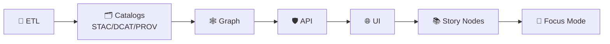

<!--
📌 This README defines the repo-wide testing & verification surface for KFM / Kansas‑Matrix‑System.
🗓️ Last updated: 2026-01-09
-->

<div align="center">

# 🧪 Tests — Kansas Frontier Matrix (KFM) / Kansas‑Matrix‑System

**Trust-first testing for a catalog‑first geospatial + knowledge + modeling stack** 🧾🗺️🧬  
Determinism • Contracts • Governance • Evidence receipts


</div>

> KFM tests don’t just check “it runs.”  
> They prove that our **pipelines**, **catalogs**, **graph**, **APIs**, and **UI behaviors** are **correct**, **reproducible**, and **honest about uncertainty** ✅🔬  
> We test the seams (boundaries + contracts) and treat metadata/provenance as first‑class artifacts 🗂️🧬

---

<details>
<summary><b>🧭 Table of contents</b></summary>

- [🔗 Quick links](#-quick-links)
- [🚦 Non‑negotiables](#-non-negotiables)
- [🚀 Quickstart](#-quickstart)
- [🧩 KFM test matrix](#-kfm-test-matrix-subsystems--what-to-assert)
- [🧠 Core invariant: governed ordering](#-core-invariant-governed-ordering)
- [🔺 Test pyramid](#-test-pyramid-how-we-keep-velocity--confidence)
- [🏷️ Test categories & markers](#️-test-categories--markers-suggested)
- [🧾 Contract & metadata tests](#-contract--metadata-tests)
- [✅ Data validation gates](#-data-validation-gates-fail-fast)
- [🗺️ Geospatial tests](#️-geospatial-tests-gis-correctness)
- [🛰️ Remote sensing tests](#️-remote-sensing-tests-earth-engine--imagery)
- [🧠 Scientific & simulation validation](#-scientific--simulation-validation)
- [📊 ML / stats tests](#-ml--stats-tests-dont-fool-yourself)
- [🕸️ Graph tests](#️-graph-tests-neo4j--algorithms)
- [🛡️ API tests](#️-api-tests-fastapi--graphql)
- [🌐 Web / frontend tests](#-web--frontend-test-guidance)
- [🔐 Security, governance, & ethics tests](#-security-governance--ethics-tests-defensive)
- [🧾 Test artifacts & receipts](#-test-artifacts--receipts)
- [🗂️ Suggested folder layout](#️-suggested-folder-layout)
- [✅ CI gates](#-ci-gates-non-negotiable)
- [✅ PR checklist](#-pr-checklist-copypaste)
- [🧯 Troubleshooting](#-troubleshooting)
- [📚 Reference pointers](#-reference-pointers-library-index)
- [🕰️ Version history](#️-version-history)

</details>

---

## 🔗 Quick links

- 🧭 Repo overview: `../README.md`
- 🧩 Executable boundary (architecture): `../src/README.md`
- 📦 Data lifecycle + governance: `../data/README.md`
- 📓 MCP (experiments + run receipts): `../mcp/MCP-README.md`
- 🧰 Automation helpers: `../scripts/README.md`
- 🌐 Web UI boundary: `../web/README.md` *(if present)*

---

## 🚦 Non‑negotiables

1) **Catalog-first:** nothing is “real” unless it’s cataloged (STAC/DCAT) and traceable (PROV) 🗂️🧬  
2) **Determinism by default:** reruns should match unless inputs/configs change 🔁  
3) **Governed ordering is enforced in tests** (see below) 🧱  
4) **No network in unit tests** (record/replay or mock) 🚫🌐  
5) **Defensive security only:** tests harden systems; they don’t teach exploitation 🛡️  
6) **Evidence over vibes:** failing tests should produce actionable artifacts (logs, diffs, screenshots) 📎

> [!TIP]
> If your PR changes **spatial truth**, it must be **traceable + contractable + testable** 🧾✅

---

## 🚀 Quickstart

### 0) Preconditions (one-time)
- 🐍 Python env ready (`venv`, `conda`, `uv`, etc.)
- 🌐 Node env ready (`npm`, `pnpm`, or `yarn`)
- 🐳 Docker installed *(recommended for integration parity)*

> [!IMPORTANT]
> If your PR touches **DB / API / pipelines / contracts / catalogs / graph**  
> run at least one Docker-backed integration pass before requesting review 🐳✅

### 1) Fast checks (developer loop ⚡)
```bash
# Python (fast)
pytest -q -m "not integration and not e2e and not slow"

# Web (fast — adapt to your repo)
npm test
```

### 2) Full suite (recommended on feature branches ✅)
```bash
make test        # preferred if available

# or:
pytest -q
pytest -q -m integration
npm run test:e2e
```

### 3) Integration tests with containers (preferred 🐳)
```bash
docker compose up -d --build
pytest -q -m integration
docker compose down -v
```

<details>
<summary>🧾 Command cheat sheet (copy/paste)</summary>

```bash
# Contracts only
pytest -q -m contracts

# Geo sanity
pytest -q -m geo

# Earth-observation sanity
pytest -q -m eo

# Scientific V&V
pytest -q -m validation

# Graph slice
pytest -q -m graph

# Defensive security checks
pytest -q -m security
```
</details>

---

## 🧩 KFM test matrix (subsystems + what to assert)

KFM is layered (clean boundaries). Tests should **pin the seams** 🔩:

| 🧱 Subsystem | 🎯 What must never break | 🧪 Best test types | 🧰 Typical tools |
|---|---|---|---|
| 🧪 ETL / pipelines | deterministic outputs, idempotent reruns, schema+CRS correctness | unit ✅ + integration 🔌 + data QA gates ✅ | pytest, GDAL, GeoPandas, validators |
| 🗂️ Catalogs (STAC/DCAT/PROV) | catalogs exist *before* graph/UI uses data; links resolve; provenance complete | contracts 🧾 + integration 🔌 | JSON Schema, jq, custom validators |
| 🕸️ Graph (Neo4j) | graph ingests **from catalogs**, not ad-hoc; constraints hold | integration 🔌 + property tests 🧪 | Neo4j container, Cypher assertions |
| 🛡️ API (REST/GraphQL) | contract stability, authz, deterministic pagination | contracts 🧾 + integration 🔌 | OpenAPI/GraphQL validation, TestClient |
| 🌐 UI (SPA) | responsive + accessible, stable map behaviors, timeline correctness | unit 🧩 + component 🧱 + e2e 🧭 | Jest/Vitest, Playwright/Cypress |
| 🗺️ Maps / 3D | symbology & overlays don’t silently shift; perf budgets | visual 🖼️ + e2e 🧭 | screenshot diffs, WebGL harness |
| 📚 Story Nodes | citations resolve; narrative ordering consistent | unit 🧩 + contracts 🧾 | markdown/link validators |
| 🎯 Focus Mode (AI) | citation discipline, refusal on missing evidence, uncertainty honesty | eval ✅ + contract-like tests 🧾 | golden prompts, retrieval tests |
| 🔐 Governance | licenses, access constraints, auditability | gates ✅ + integration 🔌 | policy validators, CI checks |

---

## 🧠 Core invariant: governed ordering

> [!IMPORTANT]
> KFM enforces a **non‑negotiable** pipeline order:
>
> **ETL → Catalogs (STAC/DCAT/PROV) → Graph → APIs → UI → Story Nodes → Focus Mode**



### ✅ What tests should enforce (practically)
- 🧪 ETL determinism (stable IDs/hashes; idempotent reruns; explicit versions)
- 🗂️ Catalog records exist (STAC/DCAT/PROV) **before** graph/UI uses them
- 🕸️ Graph loads only from catalogs (no ad‑hoc inserts in prod paths)
- 🛡️ API is the only client boundary (UI never queries graph/DB directly)
- 🔐 Classification/sensitivity never downgrades silently (requires audited redaction)
- 🧾 Provenance is complete (inputs → activities → outputs with run IDs/configs)
- 🏷️ License is explicit before publish (block publish if missing/ambiguous)

---

## 🔺 Test pyramid (how we keep velocity + confidence)

Most tests should be cheap and deterministic, then fewer (higher-value) integration + E2E:

```text
          🔺 E2E (few)          → critical user journeys (UI + API + DB)
        🔺🔺 Integration (some)  → services together (DB, API, pipelines)
      🔺🔺🔺 Unit (many)          → pure logic, transforms, validators
```

---

## 🏷️ Test categories & markers (suggested)

### Python (`pytest`) markers
Standardize markers so devs can run focused slices quickly:

```ini
# pytest.ini (example)
[pytest]
markers =
  unit: fast pure logic
  integration: hits db/services/filesystem
  e2e: end-to-end journeys (rare for python)
  slow: long-running tests (non-gating)
  validation: scientific/V&V tests (tolerance-based)
  perf: benchmarks (nightly)
  contracts: OpenAPI + metadata contract validation
  geo: GIS correctness checks
  eo: earth-observation / remote-sensing checks
  graph: graph (Neo4j + algorithms) checks
  security: defensive security checks (no offensive testing)
```

### Web tags (examples)
- Jest/Vitest: `test`, `test:unit`, `test:component`
- Playwright/Cypress: `test:e2e`
- Visual regression: `test:visual`

---

## 🧾 Contract & metadata tests

KFM is **contract-first** and **catalog-first**. Tests must protect:
- 🛡️ OpenAPI / GraphQL contracts (breaking changes are explicit + versioned)
- 🗂️ STAC (collections/items validity + required fields)
- 🏷️ DCAT (distributions point to real assets/endpoints)
- 🧬 PROV (inputs → activities → outputs; run IDs/configs recorded)

### ✅ What to validate
- JSON parses + schema passes
- links resolve (STAC assets exist; DCAT distributions point somewhere real)
- provenance completeness (raw → work → processed trace exists)
- stable IDs/hashes present where required
- time metadata makes sense (windows applied; monotonic when required)

### Example checks (starter)
```bash
# JSON sanity
find data/stac data/catalog/dcat data/prov -name "*.json*" -print0 | xargs -0 -n 1 jq empty

# pytest contract suite
pytest -q -m contracts
```

> [!NOTE]
> Dataset PRs should run a **Catalog QA gate** (schema + links + license) before merge.  
> If metadata is incomplete (e.g., missing license, broken href), CI must fail. 🚫✅

---

## ✅ Data validation gates (fail fast)

These gates are your “no‑bad‑data firewall” 🧱🔥 — especially for GeoParquet + COG pipelines and publish flows.

**Typical gate set (recommended):**
- ✅ field non-empties: required columns present + non-null
- 🧭 CRS required: input CRS present; output CRS standardized; original CRS recorded for lineage
- 🧱 geometry valid: non-empty; policy for `make_valid` explicit
- 🧊 raster sanity: nodata/resolution consistent; alignment rules enforced
- 🧾 catalogs emitted: STAC/DCAT/PROV produced + validate
- 🏷️ license present: block publish if missing/ambiguous
- 🔐 privacy/classification: no downgrades; redaction/aggregation audited

**Example CI hooks (pattern):**
```bash
pytest -q -k "test_<dataset>_etl_"

python scripts/qa/validate_geoparquet_schema.py
python scripts/geo/validate_geom.py
python scripts/governance/validate_license.py
python scripts/qa/catalog_qa.py data/stac  # example name
```

---

## 🗺️ Geospatial tests (GIS correctness)

Geospatial pipelines fail in predictable ways—test them explicitly:

- 🌍 CRS sanity: EPSG correctness; meters vs degrees; axis order
- 🧱 topology: geometry validity; self-intersections per policy
- 🧩 overlay correctness: clip/intersect/union behaviors
- 🧊 raster alignment: resolution, nodata handling, resampling method
- 📦 format IO: GeoJSON/GeoPackage/GeoParquet/COG round-trips
- 🧭 coordinate range checks: latitude/longitude in valid ranges
- 🧮 area sanity (dataset‑specific): within tolerance of mask boundary

> [!TIP]
> Put CRS + units in the **fixture metadata** and test names.  
> It prevents “silent degrees vs meters” disasters. 🥲

---

## 🛰️ Remote sensing tests (Earth Engine & imagery)

Remote sensing workflows fail quietly unless assumptions are tested:
- band availability & naming
- scale / resolution
- cloud masking logic (QA bits)
- temporal compositing rules
- index calculations (NDVI) & expected ranges
- export formats & metadata consistency

Truthiness checks that catch many bugs:
- output range sanity (e.g., NDVI ∈ [-1, 1])
- masked pixel counts within expected bounds
- timestamps monotonic; windows applied correctly

> [!CAUTION]
> Unit tests should not call live services.  
> Prefer recorded fixtures, mock adapters, or small cached exports. ✅

---

## 🧠 Scientific / simulation validation

Treat simulation/analysis code like a **scientific instrument** 🔬:
- **verification**: implementation matches intended math
- **validation**: model matches reality within uncertainty
- **regression baselines**: detect drift across refactors

### ✅ Recommended patterns
- analytical solution comparisons (tiny cases with known answers)
- convergence tests (refinement reduces error)
- invariant checks (symmetry, conservation, monotonicity)
- tolerance-based golden files (with metadata + tolerances)
- uncertainty reporting checks (intervals, credible bands, PPC)

> [!TIP]
> If results are stochastic, test **properties** (ranges, quantiles, calibration), not exact values. 🎲✅

---

## 📊 ML / stats tests (don’t fool yourself)

Data science code needs tests beyond “it runs”:
- split is leak‑free (train/val/test)
- metrics stable within tolerance
- baseline comparisons exist (simple model beats random)
- diagnostics exist (residuals, leverage/outliers, calibration)
- uncertainty reporting present when relevant
- multiple comparisons / p-hacking risks handled (where applicable)

📎 On failure, attach plots as CI artifacts:
- confusion matrix
- residual plots
- calibration curve
- drift dashboards (if applicable)

---

## 🕸️ Graph tests (Neo4j + algorithms)

KFM treats the graph as **derived truth** (built from catalogs + provenance), not a write-anywhere scratchpad.

Test categories:
- 🧾 graph build contract: rebuild from catalogs is reproducible
- 🔒 constraints: uniqueness, required properties, relationship rules
- 🧭 query invariants: deterministic pagination; stable ordering; filters correct
- 🧠 algorithm sanity: tiny deterministic graphs for spectral/routing invariants

Example assertions:
- “Graph contains only entities referenced by STAC/DCAT/PROV”
- “Every published dataset node links to a PROV Activity with run_id + config hash”
- “No unbounded traversals in query layer (guardrails enforced)”

---

## 🛡️ API tests (FastAPI + GraphQL)

What to test:
- 🧾 OpenAPI schema validation (breaking changes explicit)
- 🧾 GraphQL schema validation + query shapes
- 🔐 AuthN/AuthZ: role-based access, classification enforcement
- 🧭 Pagination determinism: stable ordering, cursor correctness
- 🌍 Geo correctness: GeoJSON validity; bbox correctness; CRS behavior
- 🌐 CORS headers correct (UI shouldn’t need workarounds)

---

## 🌐 Web / frontend test guidance

### 🧱 Component tests (fast)
- render correctness given props/state
- event handling correctness
- accessibility checks (labels, keyboard nav, contrast)

### 📱 Responsive tests (mobile-first)
- run tests across multiple viewport sizes
- verify map controls remain usable on small screens
- check touch targets + scroll locking behaviors

### 🧭 E2E tests (few but powerful)
Focus on “money paths” 💸:
- auth/login
- load a layer **from catalog**
- timeline navigation (time slider updates map + panels)
- select feature → details panel updates
- export/report flow (metadata/provenance attached)

### 🖼️ Visual regression (maps + WebGL)
Maps can regress visually while “logic tests” pass. Use screenshot diffs for:
- symbology stability
- overlay legibility at common zooms
- dark/light contrast
- WebGL rendering regressions (tolerance-based diffs)

---

## 🔐 Security, governance, & ethics tests (defensive)

KFM’s security stance is defensive: prevent leaks, enforce policy, keep audit trails.

Test themes:
- 🔐 classification boundaries & redaction rules enforced
- 🕵️ secrets scanning: prevent committed tokens/keys
- 📦 dependency scanning: vulnerable libs flagged
- 🐳 container scanning: base image CVEs flagged
- 🧾 FAIR/CARE gates: required metadata present; access constraints honored
- 🧬 auditability: publish actions produce receipts (who/what/when)

> [!IMPORTANT]
> Do **not** add offensive security instructions here.  
> Security tests are for hardening, verification, and prevention. 🛡️✅

---

## 🧾 Test artifacts & receipts

KFM work is evidence-driven. When tests fail, make failures inspectable:

### ✅ CI artifacts to upload on failure
- structured logs (`.jsonl` or `.txt`)
- diff outputs (schema diffs, snapshot diffs)
- screenshots (UI E2E + map diffs)
- “mini” STAC/DCAT/PROV bundles from fixtures
- performance traces (if relevant)

### 🧾 “Receipt mindset”
For integration tests that simulate real workflows (pipeline → catalogs → graph → API):
- record the run id / config used
- capture hashes of produced artifacts
- include a minimal PROV-like trace for the test run (even if toy)

> [!TIP]
> If a test failure can’t be diagnosed from artifacts alone, it’s a documentation bug. 📓🧯

---

## 🗂️ Suggested folder layout

Adapt as needed, but keep intent obvious:

```text
📦 repo-root/
├─ 🧪 tests/
│  ├─ 📄 README.md                      # you are here 👋
│  ├─ 🧷 fixtures/                      # tiny, deterministic test data only
│  │  ├─ 🗺️ geo/                        # small vectors/rasters (safe + tiny)
│  │  ├─ 🛰️ eo/                         # tiny EO chips / QA bit samples
│  │  ├─ 🖼️ media/                      # tiny images + metadata
│  │  ├─ 🧬 ml/                         # toy datasets / tiny model artifacts
│  │  ├─ 🧾 catalogs/                   # STAC/DCAT/PROV fixtures
│  │  └─ 📘 FIXTURES.md                 # fixture rules + provenance notes
│  ├─ 🐍 python/
│  │  ├─ 🧩 unit/
│  │  ├─ 🔌 integration/
│  │  ├─ ✅ validation/                 # scientific V&V (tolerance-based)
│  │  ├─ ⏱️ perf/                       # benchmarks (nightly / non-gating)
│  │  ├─ 🔐 security/                   # defensive security checks
│  │  └─ 🧱 conftest.py
│  ├─ 🌐 web/
│  │  ├─ 🧩 unit/
│  │  ├─ 🧱 component/
│  │  ├─ 🧭 e2e/
│  │  └─ 🖼️ visual/
│  ├─ 🗄️ db/
│  │  ├─ 🧬 migrations/
│  │  └─ 🔌 integration/
│  ├─ 🕸️ graph/
│  │  ├─ 🔌 integration/
│  │  └─ 🧩 unit/
│  ├─ 📜 contracts/
│  │  ├─ 🛡️ api/                        # OpenAPI/GraphQL fixtures
│  │  ├─ 🗺️ stac/
│  │  ├─ 🏷️ dcat/
│  │  └─ 🧬 prov/
│  └─ 📘 TEST_POLICY.md                 # merge gates + definition of done
└─ 🧰 scripts/                          # CI glue & validators (optional)
```

> [!NOTE]
> If you keep tests alongside code (e.g., `src/**/tests`), that’s fine—just keep naming + markers consistent.

---

## ✅ CI gates (non-negotiable)

**Policy:** the pipeline must be green before merge 🤖✅  
CI should mirror KFM’s “build → test → publish” discipline and keep logs/artifacts for traceability.

Typical PR gates:
1) 🧹 format + lint (Python + JS/TS)
2) 🧱 build (frontend + backend; container build if applicable)
3) 🧪 unit tests
4) 🔌 integration tests (ephemeral DB/services via Compose)
5) 🧾 contract/schema validation (OpenAPI/GraphQL + STAC/DCAT/PROV)
6) ✅ data validation gates (schema + CRS + geometry + license + provenance)
7) 🔐 security scans (secrets, deps, containers; defensive posture)
8) 📈 coverage thresholds (target, not a religion)

### 🕛 Nightly / scheduled checks (recommended)
Keep PR CI fast; push expensive checks to nightly:
- ⏱️ benchmarks (trend monitoring)
- 🧠 longer ML runs (PRs use toy models)
- 🗺️ large raster workloads (PRs use fixtures & sampling)
- 🧪 deeper graph consistency (full rebuild + diff)
- 🔐 deeper security scanning (if it slows PR CI)

---

## ✅ PR checklist (copy/paste)

- [ ] Unit tests added/updated
- [ ] Integration tests added (if behavior crosses boundaries)
- [ ] Determinism confirmed (seeds + stable outputs) if ML/sim
- [ ] Contracts updated + verified (OpenAPI/GraphQL) if API changed
- [ ] Catalog/metadata tests updated (STAC/DCAT/PROV) if outputs changed
- [ ] Data validation gates updated (schema/CRS/geometry) if ETL changed
- [ ] License + governance checks pass (block publish if missing license)
- [ ] UI changes include component tests + (if visual) snapshot updates
- [ ] CI is green (required)

---

## 🧯 Troubleshooting

### ❌ Tests fail only in CI?
- check lockfiles & pinned versions
- confirm containers match local versions
- eliminate reliance on local paths, locale, timezone, GPU availability

### 🎲 Flaky tests?
- remove sleeps; wait on conditions
- fix randomness (seed)
- mock/record external services

### 🐳 Docker stack won’t start?
```bash
docker compose logs -f
docker compose config
docker compose up -d --build
```

---

## 📚 Reference pointers (library index)

These repo library files directly inform KFM’s test posture (V&V, stats rigor, GIS correctness, visualization stability, data governance, security hardening). 🧠🧾

<details>
<summary>🏛️ Architecture, system design, and “how KFM is supposed to work”</summary>

- `Kansas Frontier Matrix (KFM) – Comprehensive Technical Documentation.docx`
- `Scientific Method _ Research _ Master Coder Protocol Documentation.pdf`
- `Kansas-Frontier-Matrix Design Audit – Gaps and Enhancement Opportunities.pdf`

</details>

<details>
<summary>🔬 Scientific modeling, simulation V&amp;V, and uncertainty</summary>

- `Scientific Modeling and Simulation_ A Comprehensive NASA-Grade Guide.pdf`
- `Understanding Statistics & Experimental Design.pdf`
- `think-bayes-bayesian-statistics-in-python.pdf`

</details>

<details>
<summary>📊 Statistics, regression, Bayesian, and analysis discipline</summary>

- `regression-analysis-with-python.pdf`
- `Regression analysis using Python - slides-linear-regression.pdf`
- `graphical-data-analysis-with-r.pdf`
- `Understanding Machine Learning: From Theory to Algorithms.pdf`

</details>

<details>
<summary>🗺️ Geospatial, remote sensing, cartography, and mapping UX</summary>

- `python-geospatial-analysis-cookbook.pdf`
- `Cloud-Based Remote Sensing with Google Earth Engine-Fundamentals and Applications.pdf`
- `making-maps-a-visual-guide-to-map-design-for-gis.pdf`
- `Mobile Mapping_ Space, Cartography and the Digital - 9789048535217.pdf`

</details>

<details>
<summary>🗄️ Data management, interoperability, and scale</summary>

- `PostgreSQL Notes for Professionals - PostgreSQLNotesForProfessionals.pdf`
- `Scalable Data Management for Future Hardware.pdf`
- `Data Spaces.pdf`
- `Spectral Geometry of Graphs.pdf`

</details>

<details>
<summary>🌐 Web UI, WebGL visualization, and responsive design</summary>

- `responsive-web-design-with-html5-and-css3.pdf`
- `webgl-programming-guide-interactive-3d-graphics-programming-with-webgl.pdf`

</details>

<details>
<summary>🛡️ Security, concurrency, law, humanism, and governance</summary>

- `ethical-hacking-and-countermeasures-secure-network-infrastructures.pdf` *(defensive posture only)*
- `Gray Hat Python - Python Programming for Hackers and Reverse Engineers (2009).pdf` *(defensive awareness only)*
- `concurrent-real-time-and-distributed-programming-in-java-threads-rtsj-and-rmi.pdf`
- `On the path to AI Law’s prophecies and the conceptual foundations of the machine learning age.pdf`
- `Introduction to Digital Humanism.pdf`

</details>

<details>
<summary>📚 Language &amp; tooling reference shelves (programming books index)</summary>

- `A programming Books.pdf`
- `B-C programming Books.pdf`
- `D-E programming Books.pdf`
- `F-H programming Books.pdf`
- `I-L programming Books.pdf`
- `M-N programming Books.pdf`
- `O-R programming Books.pdf`
- `S-T programming Books.pdf`
- `U-X programming Books.pdf`

</details>

<details>
<summary>🖼️ Media formats (if you ingest scans/images)</summary>

- `compressed-image-file-formats-jpeg-png-gif-xbm-bmp.pdf`

</details>

---

## 🕰️ Version history

| Version | Date | Summary | Author |
|---:|---|---|---|
| v1.1.0 | 2026-01-09 | Tightened “catalog-first” & data QA gates; added receipts/artifacts section; clarified defensive security stance; aligned CI gates with KFM engineering/testing guidance. | KFM Engineering |
| v1.0.0 | 2026-01-07 | Initial repo-wide testing README: pyramid, markers, subsystem matrix, validation + governance posture. | KFM Engineering |

---

<!--
📎 Evidence anchors (project docs used to update this README)
- KFM testing/CI + data QA gate rationale: :contentReference[oaicite:0]{index=0}
- MCP testing guidance (unit/integration/e2e + data pipeline distribution checks + CI rules): :contentReference[oaicite:1]{index=1}
- MCP determinism + reproducibility practices: :contentReference[oaicite:2]{index=2}
- Data validation patterns (schema, geospatial validity, coordinate ranges, regression diffs): :contentReference[oaicite:3]{index=3}:contentReference[oaicite:4]{index=4}
- Simulation V&V testing patterns (unit/regression/convergence/CI for scientific reproducibility): :contentReference[oaicite:5]{index=5}
- Design audit testing/reproducibility gaps to close (roadmap signal): :contentReference[oaicite:6]{index=6}

🔗 File handles (ChatGPT workspace links; keep in HTML comment so GitHub stays clean)
:contentReference[oaicite:7]{index=7} :contentReference[oaicite:8]{index=8} :contentReference[oaicite:9]{index=9} :contentReference[oaicite:10]{index=10} :contentReference[oaicite:11]{index=11} :contentReference[oaicite:12]{index=12} :contentReference[oaicite:13]{index=13} :contentReference[oaicite:14]{index=14} :contentReference[oaicite:15]{index=15}
:contentReference[oaicite:16]{index=16} :contentReference[oaicite:17]{index=17} :contentReference[oaicite:18]{index=18} :contentReference[oaicite:19]{index=19} :contentReference[oaicite:20]{index=20} :contentReference[oaicite:21]{index=21}
-->
