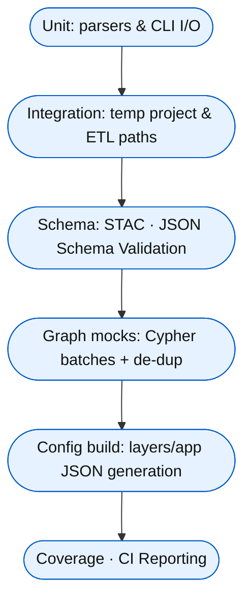

<div align="center">

# 🧪 Kansas Frontier Matrix — **Tools Test Index**  
`tools/tests/`

**Unit · Integration · Schema Validation · Provenance Coverage**

[](../../.github/workflows/tests.yml)
[](https://codecov.io/gh/bartytime4life/Kansas-Frontier-Matrix)
[](https://pre-commit.com/)
[](../../docs/)

</div>

---

```yaml
---
title: "KFM • Tools Test Index (tools/tests/)"
version: "v1.1.0"
last_updated: "2025-10-14"
owners: ["@kfm-data", "@kfm-engineering"]
tags: ["testing","pytest","stac","integration","schema","mcp"]
license: "MIT"
semantic_alignment:
  - STAC 1.0
  - JSON Schema Validation
  - MCP-DL v6.2 Testing Compliance
---
````

---

## 🧭 Overview

The `tools/tests/` suite ensures **functional accuracy**, **schema compliance**, and **provenance reproducibility** for all utility scripts under `/tools/`.
It provides a **unit + integration testing matrix** for every pipeline stage — from data fetching to Neo4j migration — using **pytest**, **pystac**, and **jsonschema** validators.

Each test enforces **MCP-DL v6.2** reproducibility principles:

* Deterministic I/O behavior
* Portable fixtures
* Validated schemas
* Provenance logs and checksums

> **Objective:** Test the glue code — because every helper supports the frontier’s integrity.

---

## 📦 Coverage Summary

| Tool               | Unit | Integration |       I/O Schema      | CLI | Notes                                           |
| :----------------- | :--: | :---------: | :-------------------: | :-: | :---------------------------------------------- |
| `fetch_data.py`    |   ✅  |      ✅      |      ✅ (manifest)     |  ✅  | Mocks HTTP/REST/ArcGIS downloads to `data/raw/` |
| `convert_gis.py`   |   ✅  |      ✅      |           —           |  ✅  | Vector→GeoJSON, Raster→COG; reproject EPSG:4326 |
| `validate_stac.py` |   ✅  |      ✅      |      ✅ (STAC 1.0)     |  ✅  | JSON Schema + STAC validation; CI logs          |
| `checksum.py`      |   ✅  |      —      |           —           |  ✅  | SHA-256 create/verify; tamper detection         |
| `migrate_graph.py` |   ✅  |      ✅      |           —           |  ✅  | Batched Cypher inserts; mocks Neo4j driver      |
| `build_config.py`  |   ✅  |      ✅      | ✅ (layers/app config) |  ✅  | STAC→Web Config JSON; sync verification         |

> All tests are deterministic, use lightweight fixtures, and output structured provenance logs.

---

## 🧱 Directory Layout

```text
tools/tests/
├── test_fetch_data.py
├── test_convert_gis.py
├── test_validate_stac.py
├── test_checksum.py
├── test_migrate_graph.py
├── test_build_config.py
├── conftest.py              # Shared fixtures, env vars, monkeypatch setup
└── fixtures/
    ├── sources_min.json     # Minimal data/sources manifest
    ├── tiny.geojson         # 2 features, WGS84
    ├── tiny.shp/.dbf/.prj   # Micro shapefile set
    ├── tiny_dem.tif         # 10×10 raster (generated dynamically)
    ├── stac_item_min.json   # Minimal valid STAC item
    └── layers_min.json      # Tiny valid web UI layers config
```

---

## 🔁 Test Flow



---

## ▶️ Running Locally

```bash
# Run all tools tests
pytest tools/tests -v --cov=tools --cov-report=term-missing

# Run a specific test case
pytest tools/tests/test_convert_gis.py::test_vector_to_geojson -q
```

Optional environment variables:

```bash
export KFM_DATA_DIR="$(pwd)/.tmp-data"
export KFM_STAC_DIR="$(pwd)/.tmp-stac"
```

> Each test creates and cleans its own temp directory to avoid polluting `data/`.

---

## 🧩 Testing Techniques

* **Network Mocking:** `responses` and `monkeypatch` for HTTP and ArcGIS API calls
* **File Isolation:** `tmp_path` and `pytest` fixtures for sandboxed read/write
* **COG Verification:** Tiny rasters validated with `rasterio` overview inspection
* **Neo4j Simulation:** Patches the driver/session; asserts Cypher statements only
* **Schema Validation:** `jsonschema` + `pystac` ensure structural compliance
* **CLI Contracts:** `--help` smoke tests, exit code checks, minimal I/O roundtrip

---

## 🧪 Example Test Patterns

### 🧰 Mocking a Network Fetch

```python
import responses
from tools.fetch_data import fetch_file

@responses.activate
def test_fetch_manifest(tmp_path):
    url = "https://example.org/data.tif"
    responses.add(responses.GET, url, body=b"FAKE", status=200)
    saved = fetch_file(url, tmp_path)
    assert saved.exists() and saved.read_bytes() == b"FAKE"
```

### 🗺️ Validating a COG Conversion

```python
import rasterio
from tools.convert_gis import convert_to_cog

def test_raster_to_cog(tmp_path):
    src = tmp_path / "tiny_dem.tif"
    dst = tmp_path / "out.tif"
    # helper to generate tiny raster fixture
    convert_to_cog(src, dst)
    with rasterio.open(dst) as ds:
        assert ds.crs.to_epsg() == 4326
        assert ds.overviews(1)  # internal overviews exist
```

### 📄 Checking STAC Schema Compliance

```python
import json
from jsonschema import validate
from tools.utils.schemas import STAC_ITEM_SCHEMA

def test_stac_item_min(fixtures_dir):
    item = json.loads((fixtures_dir / "stac_item_min.json").read_text())
    validate(instance=item, schema=STAC_ITEM_SCHEMA)
```

---

## 🧠 Contributor Guidelines

* Keep fixtures **tiny** (≤ 10 KB) — generate dynamically where possible.
* Always **seed random operations** for deterministic results.
* Use **pytest marks**:

  * `@pytest.mark.slow` → long-running tests
  * `@pytest.mark.integration` → CI matrix jobs only
* Log any unusual behavior to `../../docs/experiment.md`.
* Maintain **consistent CLI UX**: `-h/--help`, exit codes, and error messaging.
* Follow **MCP reproducibility rules**: clear inputs, outputs, and logs.

---

## 🔄 CI Integration

* **Workflow:** `tests.yml` executes tools tests in the CI build matrix
* **Artifacts:** Validation logs and coverage reports uploaded on failure
* **Coverage:** Included in **Codecov** report
* **Security Checks:** CodeQL + Trivy scan run alongside functional tests
* **Schema Verification:** STAC and JSON schema validation enforced automatically

> Network-dependent tests are mocked or run in nightly CI to maintain reliability.

---

## 🧾 Provenance & Integrity

| Artifact         | Description                                          |
| :--------------- | :--------------------------------------------------- |
| **Inputs**       | Fixture datasets, sample manifests, tiny rasters     |
| **Outputs**      | Logs, checksums, validation reports                  |
| **Dependencies** | pytest, responses, rasterio, jsonschema, pystac      |
| **Integrity**    | CI snapshot hashes confirm reproducibility           |
| **Traceability** | Each test tagged to specific tool and schema version |

---

## 🧠 MCP Compliance Checklist

| MCP Principle       | Implementation                                   |
| :------------------ | :----------------------------------------------- |
| Documentation-first | README & docstrings accompany all test files     |
| Reproducibility     | Stable fixtures + deterministic outputs          |
| Provenance          | Temp data logs and hashes captured per test      |
| Accessibility       | Readable test naming + CI log summaries          |
| Open Standards      | STAC 1.0 + JSON Schema validation                |
| Auditability        | Full coverage reports + reproducibility metadata |

---

<div align="center">

**Tools tests guard the infrastructure of reproducibility.**
*When the helpers work flawlessly, the frontier’s data stands on solid ground.*

</div>
```
