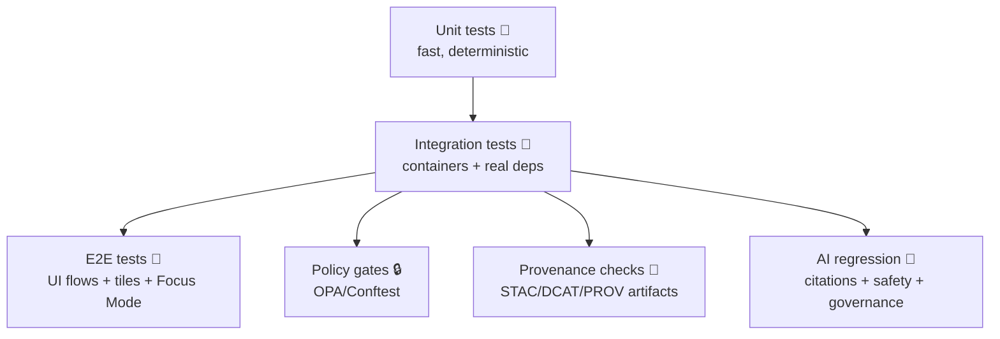

# 🧪 `tests/` — Kansas Frontier Matrix (KFM)


> **Core promise:** “No Source, No Answer.” 🤖📚  
> **Core posture:** “Fail closed.” If metadata/policy/provenance is missing → the build blocks. 🧯🚫

---

<details>
<summary><strong>📚 Table of contents</strong></summary>

- [🎯 What this test suite protects](#-what-this-test-suite-protects)
- [🧱 Test pyramid](#-test-pyramid)
- [📁 Recommended folder layout](#-recommended-folder-layout)
- [🚀 Quick start](#-quick-start)
- [🧩 Suites](#-suites)
  - [🧪 Backend API](#-backend-api)
  - [🗺️ Data pipeline & metadata artifacts](#️-data-pipeline--metadata-artifacts)
  - [🔒 Policy-as-code (OPA)](#-policy-as-code-opa)
  - [🤖 Focus Mode AI regression](#-focus-mode-ai-regression)
  - [🧭 UI & E2E (optional but recommended)](#-ui--e2e-optional-but-recommended)
- [🏷️ Markers, tags, and conventions](#️-markers-tags-and-conventions)
- [✅ CI expectations](#-ci-expectations)
- [🧰 Troubleshooting](#-troubleshooting)
- [🧾 Add-a-test checklist](#-add-a-test-checklist)

</details>

---

## 🎯 What this test suite protects

KFM is **not** “just a map app” or “just a chatbot.” It is a governed system where:

- 🧾 **Provenance is mandatory** (PROV lineage for anything publishable).
- 🔒 **Policies are enforcement gates** (OPA rules in CI and runtime).
- 🌐 **The API is the single entry point** (no direct DB access from UI).
- 🤖 **Focus Mode must cite sources** (answers must carry citations or refuse).

This `tests/` directory is the **evidence layer** that guards these guarantees.

---

## 🧱 Test pyramid



**Rule of thumb** 🧠:
- Unit tests: *logic correctness*
- Integration tests: *contracts + real dependencies*
- E2E tests: *user-critical flows*
- Policy/provenance/AI tests: *trust-critical invariants*

---

## 📁 Recommended folder layout

> This layout is flexible—match your repo, but keep the **intent** consistent.

```text
tests/
├─ README.md                  # 👈 you are here
├─ unit/                      # 🧩 pure logic (fast)
│  ├─ api/
│  ├─ services/
│  └─ utils/
├─ integration/               # 🧪 real services (containers)
│  ├─ api_endpoints/
│  ├─ db_postgis/
│  ├─ db_neo4j/
│  └─ tiles/
├─ policy/                    # 🔒 rego + conftest + fixtures
│  ├─ rego/
│  ├─ testdata/
│  └─ conftest/
├─ data/                      # 🧾 pipeline, catalog, artifacts
│  ├─ fixtures/
│  ├─ stac/
│  ├─ dcat/
│  └─ prov/
├─ ai/                        # 🤖 Focus Mode regression tests
│  ├─ prompts/
│  ├─ fixtures/
│  └─ eval/
└─ e2e/                       # 🧭 Playwright/Cypress (optional)
   ├─ specs/
   └─ fixtures/
```

---

## 🚀 Quick start

### ✅ Prereqs
- 🐳 Docker + Docker Compose (for PostGIS / Neo4j / OPA / optional Ollama)
- 🐍 Python (recommended for FastAPI backend tests; commonly `pytest`)
- 🧑‍💻 Node.js (recommended for UI/E2E tests; optional if you only test backend)

### 🏃 Run “fast” tests (unit only)
```bash
pytest -q
```

### 🧪 Run integration tests (requires services)
```bash
# Start only what you need (example service names)
docker compose up -d postgis neo4j opa

pytest -m integration -q
```

### 🔒 Run policy tests (OPA / Conftest)
```bash
conftest test policy/ -p policy/rego
```

### 🤖 Run Focus Mode AI regression (optional)
```bash
# start ollama if your AI tests need it
docker compose up -d ollama

pytest -m ai -q
```

> Tip 💡: If your AI tests are run in CI, prefer a **small deterministic model** (or mock the LLM) and assert **structure** (citations + policy compliance) instead of exact prose.

---

## 🧩 Suites

## 🧪 Backend API

### What we test
- ✅ **HTTP contracts**: status codes, error format, pagination, timeouts
- ✅ **Governance hooks**: access checks, redaction/sanitization, logging
- ✅ **Key endpoints** (examples):
  - `/api/v1/datasets/{id}` (metadata + asset links)
  - `/api/v1/catalog/search` (keyword/bbox/time filtering)
  - `/api/v1/query` (safe, constrained querying)
  - `/tiles/{layer}/{z}/{x}/{y}.*` (vector/raster tiles)
  - `/api/v1/ai/query` (+ optional `/ai/stream`) for Focus Mode

### Patterns we prefer
- 🧪 Use the framework’s test client (e.g., FastAPI TestClient) for endpoint tests.
- 🧱 Dependency injection overrides for unit tests (fake repo adapters).
- 🐳 For integration tests, use containers and **real** PostGIS/Neo4j/OPA.

### Example assertions (good ✅ vs brittle 🚫)
✅ Assert:
- response schema keys
- policy denial is 403 (or sanitized shape)
- citations exist in AI output
- tiles are valid MVT/PNG and cache headers are sane

🚫 Avoid:
- exact full-text AI answers
- relying on live external APIs
- “sleep-based” race handling

---

## 🗺️ Data pipeline & metadata artifacts

KFM’s data lifecycle is staged and traceable:

- `data/raw/<domain>/` ➜ `data/work/<domain>/` ➜ `data/processed/<domain>/`
- Publication requires boundary artifacts:
  - 🧾 STAC records
  - 🧾 DCAT dataset entry
  - 🧾 PROV lineage bundle

### What we test
- ✅ New/changed datasets produce **STAC + DCAT + PROV**
- ✅ Missing/invalid provenance fails (publish blocked)
- ✅ Determinism: same inputs → same outputs (checksums/manifests)
- ✅ Geo sanity:
  - CRS correctness
  - geometry validity
  - non-empty extents
  - stable IDs / primary keys

### Suggested checks
- 📦 “Artifact presence” test per dataset domain
- 🧬 Schema validation (JSON Schema for STAC/DCAT/PROV)
- 🔁 “Re-run pipeline yields identical manifest” test (where feasible)

---

## 🔒 Policy-as-code (OPA)

KFM uses policy gates at **CI time** and **runtime**.

### What we test
- ✅ Rego rules compile
- ✅ Expected allow/deny cases for:
  - RBAC roles (Public Viewer / Contributor / Maintainer / Admin)
  - sensitivity labels (public/internal/sensitive)
  - AI output rules (citations required, restricted content blocked)
- ✅ “Fail closed” behavior:
  - missing license / missing sensitivity label / missing PROV → CI fails
- ✅ Policy decision metadata is traceable (policy bundle/version tagging if implemented)

### Tooling recommendations
- **Conftest** for CI policy tests
- “Golden” decision fixtures (`input.json` → `allow: false/true`) 🧊

---

## 🤖 Focus Mode AI regression

Focus Mode is governed: it must cite sources or refuse.

### What we test
- ✅ Output includes **citations** (at least one) when answering factual questions
- ✅ Output refuses when evidence is insufficient (“No Source, No Answer”)
- ✅ Output passes policy (no restricted leakage)
- ✅ Optional: ensure certain key terms appear for specific fixtures (lightweight checks)

### How to keep AI tests stable
- 🔧 Prefer:
  - a small local model, or
  - a mock Ollama client returning deterministic responses, or
  - fixed retrieval context fixtures (freeze the evidence bundle)
- 🧪 Assert **structure**, not style:
  - citations present
  - no forbidden phrases
  - output type + fields are correct (e.g., `answer`, `citations[]`, `audit_id`)

### Suggested AI fixture approach
- `tests/ai/fixtures/<case>/question.txt`
- `tests/ai/fixtures/<case>/sources.json` (retrieval payload)
- `tests/ai/fixtures/<case>/expected.json` (minimal required invariants)

---

## 🧭 UI & E2E (optional but recommended)

E2E ensures users can actually do the “Kansas time-travel map” workflows 🗺️🕰️.

### What we test
- ✅ App boots
- ✅ Map loads + tiles render
- ✅ Layer toggles work
- ✅ Timeline changes update the view
- ✅ Focus Mode returns an answer with citations (or refusal)
- ✅ RBAC: restricted layers not visible to unauthorized roles

### Tools
- Playwright or Cypress
- Use seeded data fixtures + test accounts

---

## 🏷️ Markers, tags, and conventions

### Pytest markers (suggested)
- `unit` 🧩
- `integration` 🧪
- `policy` 🔒
- `data` 🧾
- `ai` 🤖
- `e2e` 🧭
- `slow` 🐢

Example run:
```bash
pytest -m "not slow" -q
pytest -m "integration and not ai" -q
```

### Naming
- `test_<thing>_<behavior>.py`
- One **primary assertion** per test (multiple small asserts are fine; avoid mega-tests).

---

## ✅ CI expectations

### PR (fast + trust-critical)
- ✅ unit
- ✅ policy (rego + conftest)
- ✅ artifact validation for touched datasets
- ✅ lightweight integration (API smoke)

### Nightly / scheduled (heavier)
- ✅ full integration suite (DB + tiles)
- ✅ AI regression suite (if enabled)
- ✅ E2E flows

> CI should be treated as a **governance gate**—if it fails, we assume the system would violate provenance/policy promises. 🚧

---

## 🧰 Troubleshooting

### 🐳 Containers won’t start / ports collide
- Check local ports used by Postgres (5432), Neo4j (7474/7687), OPA (8181), Ollama (11434)
- Stop conflicting services or re-map ports in your test compose file.

### 🧠 Neo4j memory errors
- Reduce dataset fixture size
- Increase container memory limits

### 🧾 “Missing PROV / license / sensitivity label”
- This is expected “fail closed” behavior ✅  
  Fix the dataset’s boundary artifacts and re-run the checks.

### 🤖 AI tests are flaky
- Switch to mock Ollama client
- Freeze retrieval payloads
- Assert citations + policy compliance only

---

## 🧾 Add-a-test checklist

When you add or change something, make sure you also add tests that prove the trust contract:

### If you add an API endpoint 🌐
- [ ] Unit tests for service logic
- [ ] Integration test for endpoint contract
- [ ] Policy test (authorized vs unauthorized)
- [ ] Audit/provenance log assertion (if applicable)

### If you add a dataset / pipeline 🗂️
- [ ] Pipeline tests produce `processed/` outputs
- [ ] STAC/DCAT/PROV generated and valid
- [ ] Determinism/manifest check (where feasible)
- [ ] Policy gate tests (license/sensitivity present)

### If you change Focus Mode 🤖
- [ ] Regression test ensures citations
- [ ] Refusal behavior for insufficient evidence
- [ ] Policy block for restricted info
- [ ] Optional: snapshot minimal response structure (not prose)

---

🧠 **Design philosophy:** The tests don’t just prevent bugs — they preserve *trust*.  
🧭 If something cannot be proven (policy, provenance, citation), it’s not “done.”