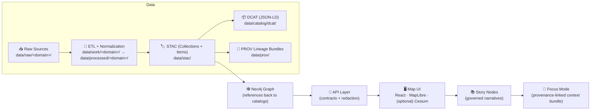
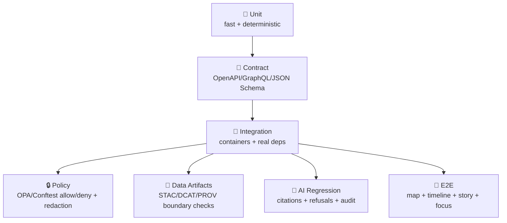

<div align="center">

<!-- 🧭 Optional: place the animated seal at: docs/assets/brand/kfm-seal-animated-320.gif -->


# 🧪 `tests/` — Trust & Governance Test Suite (KFM) 🧾🛡️

**KFM isn’t “just a map app” — it’s a governed evidence engine.**  
<sub><em>“No Source, No Answer.” “Fail closed.” “Contracts before convenience.”</em></sub>

<br/>


<a href="#-quickstart">🚀 Quickstart</a> •
<a href="#-the-kfm-trust-contract">🧬 Trust Contract</a> •
<a href="#-truth-path-the-non-negotiable-ordering">🛣️ Truth Path</a> •
<a href="#-suite-map">🧩 Suite Map</a> •
<a href="#-ci-expectations">✅ CI</a> •
<a href="#-add-a-test-checklist">🧾 Add a Test</a>

</div>

---

> [!WARNING]
> 🚧 **Under construction (active development):**  
> Folder names and commands may evolve, but **the invariants and gates do not**.

---

## 🔗 Quick links (recommended reading order) 🧭

- 📘 **Master Guide (v13)**: `../docs/MASTER_GUIDE_v13.md`
- 🧭 System architecture overview: `../docs/architecture/system_overview.md`
- 🧱 v13 redesign blueprint: `../docs/architecture/KFM_REDESIGN_BLUEPRINT_v13.md`
- 🐳 Local dev stack (Compose): `../docs/dev/docker-compose.md`
- 📐 Schemas (STAC/DCAT/PROV/Story/Telemetry): `../schemas/`
- 📦 Data catalog rules + staging: `../data/README.md`
- 🔒 Policy-as-code source: `../policy/`
- 🧾 Story Node template (citation-governed): `../docs/templates/TEMPLATE__STORY_NODE_V3.md`

> [!NOTE]
> The **tests suite is the executable version** of the Master Guide invariants:
> if a thing can’t be proven (contract / provenance / policy / citation / classification)… it does not ship.

---

## 🧬 The KFM trust contract

This test suite exists to protect the **non‑negotiables**.

### 🔥 Invariants we treat as “system law”
- 🛣️ **Pipeline ordering is absolute**: **ETL → Catalogs (STAC/DCAT/PROV) → Graph → API → UI → Story Nodes → Focus Mode**.
- 🧱 **API boundary rule**: the UI never queries Neo4j (or PostGIS) directly — all access is through the governed API boundary.
- 🧾 **Provenance first**: publishable artifacts must be registered (STAC/DCAT) and lineage-linked (PROV) *before* graph/UI/story/AI use.
- 🧪 **Deterministic, idempotent ETL**: same input → same output; repeatable runs; reproducible results.
- 🧾 **Evidence-first narrative**: Story Nodes and Focus Mode do not allow unsourced claims. If it can’t cite, it must refuse.
- 🏷️ **Sovereignty + classification propagation**: no output artifact may be less restricted than its inputs.
- 🧯 **Fail closed**: missing metadata, missing lineage, forbidden content, policy uncertainty → blocked by default.

> [!IMPORTANT]
> ✅ “Fail closed” here means: **default deny** when required artifacts, required fields, or policy decisions are missing.
> If CI blocks a PR, treat it as a **trust feature**, not friction.

---

## 🛣️ Truth Path (the non-negotiable ordering)

KFM’s “Truth Path” is both a *data pipeline* and a *governance pipeline*.



**Tests enforce that each stage only consumes the formal outputs of the stage before it.**  
That’s how we preserve traceability from **raw evidence → public narrative**.

---

## 🧱 Test pyramid (KFM edition)



**Rule of thumb:**
- Unit → correctness ✅
- Contract → stability 🧷
- Integration → reality check 🐳
- Policy/Provenance/AI → trust guarantees 🧾🛡️
- E2E → “does the Kansas time-travel experience actually work?” 🗺️🕰️

---

## 📁 Recommended structure (v13-aligned; adjust to repo if needed)

> [!TIP]
> Prefer mapping tests to canonical subsystem homes:
> `src/pipelines/`, `src/graph/`, `src/server/`, `web/`, `schemas/`, `policy/`, `data/`.

```text
tests/
├─ README.md                        👈 you are here
│
├─ unit/                            🧩 pure logic, no services
│  ├─ server/                       # src/server/ units (handlers/services/utils)
│  ├─ pipelines/                    # src/pipelines/ units (transform helpers)
│  ├─ graph/                        # src/graph/ units (mapping/constraints)
│  ├─ schemas/                      # schema helper utilities
│  └─ utils/
│
├─ contract/                        📜 interface guarantees (contract-first)
│  ├─ openapi/
│  ├─ graphql/
│  └─ jsonschema/
│
├─ integration/                     🧪 real dependencies (containers)
│  ├─ api_endpoints/
│  ├─ postgis/
│  ├─ neo4j/
│  ├─ tiles/
│  └─ search/
│
├─ data/                            🧾 dataset bundle + metadata gates
│  ├─ fixtures/
│  ├─ stac/
│  ├─ dcat/
│  ├─ prov/
│  └─ bundle_checks/
│
├─ policy/                          🔒 policy tests (policy source lives in ../policy/)
│  ├─ conftest/
│  └─ testdata/
│
├─ ai/                              🤖 Focus Mode regression harness
│  ├─ prompts/
│  ├─ fixtures/
│  ├─ retrieval_bundles/
│  └─ eval/
│
└─ e2e/                             🧭 Playwright/Cypress UI flows (optional)
   ├─ specs/
   └─ fixtures/
```

---

## 🚀 Quickstart

> [!NOTE]
> Commands vary by environment. Use this as a **repeatable pattern**, not a rigid script.

### ✅ Prereqs
- 🐳 Docker + Docker Compose v2 (PostGIS / Neo4j / OPA; optional others)
- 🐍 Python (pytest)
- 🧑‍💻 Node.js (only if running UI/E2E tests)

### 0) Boot the core stack (recommended for integration/policy realism)
```bash
# From repo root
docker compose up -d --build
```

### 1) Fast tests (unit + contract)
```bash
pytest -m "unit or contract" -q
```

### 2) Integration tests (real services)
```bash
pytest -m "integration and not slow" -q
```

### 3) Policy checks (Conftest)
```bash
# Run the same policy scans CI runs (exact target can vary by repo)
conftest test .
```

Run policy checks on a specific path:
```bash
conftest test data/
conftest test policy/
```

### 4) AI regression (optional; if configured)
```bash
pytest -m ai -q
```

### 5) UI/E2E (optional)
```bash
npm ci
npm run test:e2e
```

---

## 🧩 Suite map

### 🧩 Unit tests — “small truths” (fast ✅)
**Purpose:** prove correctness of pure logic with **no network, no time, no randomness**.

Examples:
- bbox/time parsing & normalization
- geometry utilities & ID normalization
- schema helpers (STAC/DCAT/PROV validation utilities)
- redaction utilities (precision reduction, column masking)
- policy client wrappers (input shaping, decision parsing)

---

### 📜 Contract tests — “stable interfaces” 🧷
**Purpose:** protect the contract-first rule:
- OpenAPI request/response shapes
- GraphQL schema types + compatibility
- JSON Schema contracts (dataset manifests, provenance bundles, Story Nodes)

Patterns:
- snapshot OpenAPI schema and compare changes intentionally
- validate example payloads against JSON Schema
- check GraphQL schema composition + query cost limits *(if implemented)*

> [!TIP]
> Contract tests are where breaking changes get caught **before** reviewers miss them.

---

### 🧪 Integration tests — “real stack, real rules” 🐳
**Purpose:** prove KFM works with real dependencies:
- PostGIS spatial queries + bbox/time constraints
- Neo4j traversals (graph references back to cataloged entities)
- tile serving (MVT/raster)
- search behavior
- API authZ + redaction behavior (OPA-driven)
- audit/provenance hooks *(where implemented)*

Good integration assertions:
- endpoint returns correct status + schema
- unauthorized requests → 403 or sanitized output
- tiles render and validate (MVT/PNG/WEBP)
- classification propagation holds across transforms and responses

Avoid brittle checks:
- exact AI prose
- timing-based sleeps
- live calls to external agencies

---

### 🧾 Data artifacts suite — “nothing ships without boundary artifacts”
**Purpose:** enforce bundle completeness & alignment.

**Boundary artifacts are required** before data is considered published:
- processed asset exists ✅ (`data/processed/<domain>/...`)
- STAC references correct assets ✅ (`data/stac/items/` + `data/stac/collections/`)
- DCAT distribution links STAC/assets ✅ (`data/catalog/dcat/`)
- PROV explains raw → processed transform ✅ (`data/prov/`)
- license + classification/sensitivity present ✅
- deterministic manifest/checksum where feasible ✅

#### Minimum publishable bundle (recommended)
```text
data/processed/<domain>/<dataset_id>/...
data/stac/items/<dataset_id>.json
data/catalog/dcat/<dataset_id>.jsonld
data/prov/<dataset_id>.prov.json
```

> [!IMPORTANT]
> Evidence artifacts (including AI/analysis outputs) are treated like first-class datasets:
> store them in processed, catalog them, and trace them in PROV.

---

### 🔒 Policy-as-code suite (OPA / Conftest) — “governance is executable”
**Purpose:** prove:
- rego compiles
- expected allow/deny decisions for RBAC + classification levels
- “fail closed” behavior when required fields are missing
- policy decisions are stable and testable (goldens)

#### Recommended policy test cases
- Public user requests restricted dataset → deny
- Authorized user requests restricted dataset → allow (or sanitize if required)
- Missing license/sensitivity/provenance → deny + CI fail
- Story Node missing citations → deny + CI fail
- Focus Mode answer without citations → deny or force refusal response
- Sensitive locations → enforce masking/rounding rules

<details>
<summary><b>🧊 Golden test pattern (recommended)</b> — deterministic and reviewable</summary>

```text
tests/policy/testdata/
  case_001_public_denied/
    input.json
    expected.json
  case_002_admin_allowed/
    input.json
    expected.json
```

Run:
```bash
conftest test .
```
</details>

---

### 🤖 Focus Mode regression suite — “cite or refuse” 🧠
**Purpose:** prove Focus Mode behaves like a governed analyst:
- answers include citations when answering factual questions
- refuses when evidence is insufficient
- respects classification + redaction rules
- emits audit/provenance linkage metadata *(where implemented)*

#### Stability rules for AI tests
Prefer:
- frozen retrieval bundles (graph + spatial + docs snippets)
- deterministic prompts/templates
- assertions on **structure**, not prose:
  - `citations[]` present (e.g., bracket style like `[1]` or structured citations)
  - `refusal_reason` when no evidence
  - `policy_decision` metadata
  - `audit_id` / `prov_link` fields

Avoid:
- exact paragraph matching
- “model mood” tests

<details>
<summary><b>🧪 Suggested fixture format</b></summary>

```text
tests/ai/fixtures/<case>/
  question.txt
  retrieval_bundle.json
  expected_invariants.json
```

Example `expected_invariants.json`:
```json
{
  "must_refuse_if_no_sources": true,
  "min_citations": 1,
  "must_not_include": ["as an AI language model"],
  "must_include_fields": ["answer", "citations"]
}
```
</details>

---

### 🧭 UI / E2E suite (optional but powerful)
**Purpose:** prove user-critical flows:
- app boots
- map loads & tiles render
- layer toggles work
- time slider updates layers
- Story Nodes render and link to sources
- Focus Mode returns citation-bearing answers or refusals
- RBAC hides restricted layers for unauthorized roles

Tools: Playwright or Cypress (choose one).

---

## 🏷️ Markers, tags, and conventions

### ✅ Pytest markers (suggested)
- `unit` 🧩
- `contract` 📜
- `integration` 🧪
- `policy` 🔒
- `data` 🧾
- `ai` 🤖
- `e2e` 🧭
- `slow` 🐢

Run examples:
```bash
pytest -m "unit or contract" -q
pytest -m "integration and not slow" -q
pytest -m "policy or data" -q
```

### ✅ Naming conventions
- `test_<area>__<behavior>.py`
- one primary behavior per test (small focused tests beat mega-tests)

---

## ✅ CI expectations

> [!IMPORTANT]
> CI is not “just quality control.” In KFM it’s a **governance gate**.

### PR checks (fast + trust‑critical)
- ✅ unit + contract
- ✅ policy scans (rego compile + conftest)
- ✅ schema validation (JSON Schema / OpenAPI / GraphQL)
- ✅ boundary artifact checks for touched datasets (STAC/DCAT/PROV + license/classification)
- ✅ API smoke test (health endpoints + core endpoints)

### Nightly / scheduled (heavier)
- ✅ full integration matrix (PostGIS + Neo4j + tiles + search)
- ✅ Focus Mode regression suite
- ✅ UI/E2E (seeded fixtures)
- ✅ optional performance budgets (tile latency, query ceilings)

---

## 🧰 Troubleshooting

### 🐳 Containers won’t start / ports collide
Common defaults:
- PostGIS: `5432`
- Neo4j: `7474` (UI) / `7687` (bolt)
- API: `8000`
- UI: `3000`
- OPA: `8181`

Fix:
- stop conflicting services, or
- remap ports in compose config.

### 🧠 Neo4j memory issues
- shrink fixtures (prefer tiny graphs)
- increase container memory limit
- prioritize “schema + traversal correctness” over huge datasets

### 🧾 “Missing PROV / license / sensitivity”
✅ This is the system working as designed.  
Add the missing boundary artifacts and rerun.

### 🤖 AI tests are flaky
- freeze retrieval bundles
- assert citation/refusal/policy compliance only
- avoid golden prose diffs

---

## 🧾 Add-a-test checklist

### If you add/modify an API endpoint 🌐
- [ ] unit tests for service logic
- [ ] contract test (OpenAPI/GraphQL schema)
- [ ] integration test for endpoint behavior
- [ ] policy tests (allowed/denied + redaction)
- [ ] classification propagation checks (response never less restricted than inputs)

### If you add a dataset / pipeline 🗂️
- [ ] raw → work → processed staging respected (`data/raw/`, `data/work/`, `data/processed/`)
- [ ] STAC/DCAT/PROV generated and valid
- [ ] boundary artifact completeness passes
- [ ] geometry + CRS + bbox sanity checks
- [ ] license + classification/sensitivity present
- [ ] deterministic manifests/checksums where feasible
- [ ] (v13) domain runbook updated/added under `docs/data/<domain>/...`

### If you change Story Nodes 📚
- [ ] template compliance
- [ ] citations required (no unsourced claims)
- [ ] links point to cataloged artifacts (STAC/DCAT) where applicable

### If you change Focus Mode 🤖
- [ ] citations required test (“answer must cite”)
- [ ] refusal behavior test (“no evidence → refuse”)
- [ ] policy denial/sanitization for restricted data
- [ ] classification propagation enforced

---

## 🧠 North Star

<div align="center">

### 🧾 Tests preserve trust — not just correctness.
If policy, provenance, contracts, or citations can’t be proven… it doesn’t merge. ✅

</div>