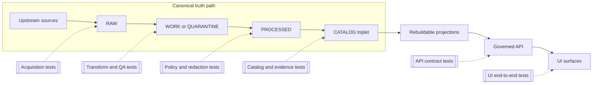

# Tests

**Purpose:** Define how KFM tests enforce governance invariants (truth path, promotion gates, policy, evidence) across pipeline → catalogs → governed APIs → UI.

**Status:** Draft (vNext)  
**Owners:** Platform Engineering · Pipeline Maintainers · Data Stewards · Story Editors  
**Badges:** CI required · Promotion fail-closed · Policy fixtures-driven · Evidence resolvable

---

## Navigation

- [Principles](#principles)
- [Test surfaces](#test-surfaces)
- [Quickstart](#quickstart)
- [Suite layout](#suite-layout)
- [Promotion Contract gate coverage](#promotion-contract-gate-coverage)
- [Fixtures](#fixtures)
- [Writing good KFM tests](#writing-good-kfm-tests)
- [Troubleshooting](#troubleshooting)

---

## Principles

KFM testing is not just “does the code work.” It is how governance becomes enforceable behavior.

Tests MUST protect these non-negotiable system invariants:

- **Truth path lifecycle:** Upstream → RAW → WORK/QUARANTINE → PROCESSED → CATALOG (DCAT + STAC + PROV + run receipts) → projections → governed API → UI.
- **Trust membrane:** Clients never access storage directly; backend domain logic never bypasses repository interfaces; all access flows through governed APIs that apply policy + redaction + logging.
- **Evidence-first UX:** Anything user-visible must open into evidence (version, rights, provenance, checksums, validation, policy obligations).
- **Cite-or-abstain Focus Mode:** Answers cite resolvable evidence bundles or abstain; citation verification is a hard gate; every query emits a run receipt.
- **Canonical vs rebuildable stores:** Object storage + catalogs + audit ledger are canonical; DB/search/graph/tiles are rebuildable projections.
- **Deterministic identity and hashing:** Dataset + DatasetVersion identities are deterministic; artifacts are digest-addressed; hash drift is treated as a failure.

---

## Test surfaces

This repo’s tests are organized by **governed surface**, not by framework:

1. **Domain logic tests**  
   Validate pure logic and invariants without infrastructure.

2. **Policy and redaction tests**  
   Validate that policy labels and obligations behave deterministically and fail-closed.

3. **Catalog and evidence tests**  
   Validate DCAT/STAC/PROV profiles, cross-links, and EvidenceRef resolution.

4. **Governed API contract tests**  
   Validate API schemas, authorization behavior, and policy enforcement across endpoints.

5. **Pipeline integration tests**  
   Validate end-to-end ingest → validate → produce artifacts → catalogs → receipts.

6. **UI end-to-end tests**  
   Validate the evidence drawer, version badges, redaction behavior, and cite-or-abstain UX.

---

## Architecture map



---

## Quickstart

KFM repos SHOULD provide a single “run everything” entrypoint and layer-specific targets.

### Run everything

Preferred:
- `make test`

Acceptable alternatives:
- `./scripts/test`
- `task test`
- `just test`

### Run by layer

Recommended targets (names can vary, but intent must not):
- `test:unit`
- `test:policy`
- `test:catalog`
- `test:contract`
- `test:integration`
- `test:e2e`

### Fail-closed rule

If a test suite cannot run (missing fixture, missing dependency, unresolved EvidenceRef), it MUST fail CI rather than silently skip.

---

## Suite layout

Recommended directory layout (adapt to the repo, but keep the semantics):

```text
tests/
  README.md

  unit/               # pure domain tests (identity, hashing, time rules)
  policy/             # policy fixtures, redaction obligations, access decisions
  catalog/            # DCAT/STAC/PROV schema + cross-link checks
  contract/           # governed API schema + behavior contracts
  integration/        # pipeline end-to-end with small fixture datasets
  e2e/                # UI tests: evidence drawer, citation verification UX

  fixtures/
    policy/           # policy labels, obligations, allow/deny scenarios
    datasets/         # tiny synthetic datasets + manifests
    catalogs/         # golden DCAT/STAC/PROV examples for validation
    receipts/         # golden run receipt examples
    time/             # time fixtures (event/valid/transaction)
```

---

## Promotion Contract gate coverage

Promotion gates MUST be enforced by tests, not by tribal knowledge.

The table below describes what each gate means for tests. Adjust file paths and tooling, but do not weaken the gate semantics.

| Gate | What must be true | Test evidence in this repo |
|---|---|---|
| A Identity and versioning | Dataset ID stable; DatasetVersion deterministic from canonical spec hash; immutable once promoted | Unit tests for canonicalization + hashing; golden ID tests |
| B Licensing and rights | License, rights holder, attribution text, and terms snapshot are captured; ambiguity resolved | Catalog tests ensure required fields; integration tests assert “no promote” when unclear |
| C Sensitivity and redaction plan | Policy label assigned; obligations specified and testable; location and PII risk assessed | Policy fixture tests; redaction tests; UI tests that generalized outputs match label |
| D Catalog triplet validation | DCAT/STAC/PROV exist, validate, and cross-link; EvidenceRefs resolve | Catalog schema validation; link-checker tests; evidence resolver tests |
| E Run receipts and checksums | Inputs/outputs have digests; environment captured; QA results recorded | Receipt validation tests; integration tests confirm digests for all artifacts |
| F Policy and contract tests | Policy fixtures pass; API contract tests pass; evidence resolver works end-to-end | Policy + contract suites required in CI; evidence resolver contract tests |
| G Operational readiness | SBOM and build provenance; perf smoke tests; accessibility smoke tests; monitoring configured | Security checks and smoke tests; waivable only via governed exception workflow |

### Promotion waivers

A promotion waiver is itself a governed artifact. If the repo supports waivers, tests MUST confirm:
- waiver has rationale
- waiver has a time window
- waiver includes mitigations and rollback plan
- waiver is recorded in the audit ledger

---

## Fixtures

### Fixture design rules

Fixtures MUST be:
- **small**: fast to load, fast to validate
- **deterministic**: no network calls, no clock drift, no randomness without a fixed seed
- **safe**: no sensitive real coordinates, no private individual data, no culturally restricted site locations

### Policy fixtures

Policy fixtures define allow/deny decisions and obligations. Every new policy label MUST include:
- at least one allow scenario
- at least one deny scenario
- at least one “allow with obligations” scenario
- explicit tests for “fail closed” behavior

### Catalog fixtures

Catalog fixtures are “golden” DCAT/STAC/PROV objects used to validate:
- required fields exist
- cross-links are correct and resolvable
- policy labels are present where required
- artifact digests match fixture manifests

### Time fixtures

KFM is time-aware. Tests MUST distinguish:
- **event time**
- **valid time**
- **transaction time**

Time parsing/normalization MUST be tested with:
- timezone offsets
- missing time fields
- invalid ranges
- boundary conditions at midnight and DST transitions

---

## Writing good KFM tests

### What to test first

When adding or changing behavior, prioritize tests that protect governance boundaries:

1. **Fail-closed behavior** for promotion and policy decisions  
2. **Deterministic identity** and digest stability  
3. **Catalog triplet validity** and cross-link correctness  
4. **Evidence resolution** from UI-facing identifiers  
5. **API policy enforcement** and trust membrane invariants

### Anti-patterns

Avoid:
- tests that depend on external APIs or live upstream datasets
- snapshot tests that assert entire responses without focusing on contract semantics
- “happy path only” policy tests
- embedding sensitive or precise locations in fixtures

### Minimal Definition of Done for a new feature

- [ ] Unit tests for deterministic logic
- [ ] Policy fixture tests for allow/deny/obligations
- [ ] Catalog validation tests if new catalog fields or linking rules were introduced
- [ ] Contract tests if API surface changed
- [ ] Integration test if pipeline behavior changed
- [ ] E2E test if UI evidence or citation behavior changed

---

## Troubleshooting

### Flaky tests

Common causes:
- non-deterministic time (use time fixtures)
- ordering differences (sort by deterministic key before assertions)
- parallelism races (reduce concurrency only for the specific suite)

### EvidenceRef failures

If EvidenceRef resolution fails:
- verify the DCAT/STAC/PROV cross-links in fixtures
- verify policy evaluation happens before resolution
- confirm the evidence resolver returns allow/deny plus obligations

### Policy tests pass locally but fail in CI

Check:
- fixture drift (fixtures must be committed and versioned)
- environment differences (pin tool versions; capture container digests in receipts)
- missing deny tests (CI should enforce deny coverage for each new label)

---

## Back to top

[↑ Back to top](#tests)
