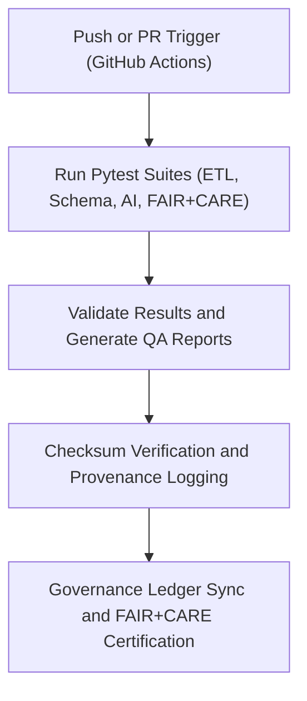

<div align="center">

# 🧪 Kansas Frontier Matrix — **Testing & QA Framework**
`tests/README.md`

**Purpose:**  
FAIR+CARE-certified testing and quality assurance (QA) framework ensuring **pipeline reproducibility, schema integrity, AI ethics validation, and governance compliance** across the Kansas Frontier Matrix (KFM).  
This framework automates validation for all ETL, AI, and governance modules within MCP-DL v6.3 compliance standards.

[](../docs/standards/faircare-validation.md)
[](../LICENSE)
[](../docs/architecture/repo-focus.md)

</div>

---

## 📚 Overview

The `tests/` directory provides **automated testing suites** for all core modules — ensuring each KFM subsystem (ETL, AI, governance, and telemetry) maintains FAIR+CARE alignment, checksum verification, and ethics compliance.  
This QA layer powers autonomous validation pipelines under continuous integration (CI) environments.

### Core Responsibilities
- Execute pytest-based validation suites for ETL, schema, and AI workflows.  
- Enforce FAIR+CARE validation checks across all data and governance layers.  
- Perform regression, integrity, and explainability tests for reproducibility.  
- Synchronize results into governance ledgers and FAIR+CARE dashboards.  

---

## 🗂️ Directory Layout

```plaintext
tests/
├── README.md                              # This file — documentation for testing framework
│
├── test_etl.py                            # Validates ETL pipeline inputs, transformations, and outputs
├── test_schema_validation.py              # Tests schema conformity for datasets and metadata
├── test_faircare_audit.py                 # Verifies FAIR+CARE ethics compliance logic
├── test_ai_explainability.py              # Tests AI explainability and drift response
├── test_governance_sync.py                # Validates governance ledger and provenance link integrity
├── conftest.py                            # Shared test fixtures and configuration for pytest
├── fixtures/                              # Reusable mock datasets and simulated ledger entries
│   ├── mock_dataset.json
│   ├── mock_ai_output.json
│   └── mock_manifest.json
└── metadata.json                          # Provenance and governance linkage metadata
```

---

## ⚙️ Testing Workflow



### Workflow Description
1. **Execution:** Automatically runs pytest suites for all KFM workflows.  
2. **Validation:** Performs schema and FAIR+CARE ethics checks per data contract.  
3. **Integrity:** Cross-verifies checksum hashes for reproducibility validation.  
4. **Governance Sync:** Pushes certified QA outcomes into immutable provenance ledgers.  
5. **Reporting:** Generates detailed logs, coverage summaries, and Focus Mode telemetry updates.

---

## 🧩 Example Test Metadata Record

```json
{
  "id": "tests_framework_v9.5.0_2025Q4",
  "suites_executed": [
    "test_etl.py",
    "test_schema_validation.py",
    "test_ai_explainability.py"
  ],
  "tests_passed": 248,
  "tests_failed": 0,
  "checksum_verified": true,
  "fairstatus": "certified",
  "coverage": 98.9,
  "ai_explainability_score": 0.992,
  "governance_registered": true,
  "telemetry_ref": "releases/v9.5.0/focus-telemetry.json",
  "governance_ref": "reports/audit/ai_tests_ledger.json",
  "created": "2025-11-02T23:59:00Z",
  "validator": "@kfm-tests"
}
```

---

## 🧠 FAIR+CARE Governance Matrix

| Principle | Implementation |
|------------|----------------|
| **Findable** | All test runs indexed by dataset, module, and checksum ID. |
| **Accessible** | Test logs and reports stored in JSON, HTML, and JUnit XML formats. |
| **Interoperable** | Integrated with FAIR+CARE, ISO 19115, and AI ethics standards. |
| **Reusable** | Test fixtures and schemas reusable across validation pipelines. |
| **Collective Benefit** | Promotes transparent and ethical software validation practices. |
| **Authority to Control** | FAIR+CARE Council certifies QA standards for ethical automation. |
| **Responsibility** | Validators ensure AI/ETL integrity through consistent audits. |
| **Ethics** | Maintains human oversight and transparency in all automated validation. |

Audit outputs logged in:  
`reports/audit/ai_tests_ledger.json` • `reports/fair/tests_summary.json`

---

## ⚙️ Test Coverage & QA Artifacts

| File | Description | Format |
|------|--------------|--------|
| `pytest.log` | Full execution log of validation test suite. | Text |
| `coverage.json` | Code and validation coverage summary. | JSON |
| `fairstatus.json` | FAIR+CARE validation and compliance results. | JSON |
| `checksums.json` | Hash validation and lineage verification registry. | JSON |
| `metadata.json` | Governance metadata linking tests to provenance records. | JSON |

Automated by `tests_sync.yml`.

---

## 🧾 Retention Policy

| File Type | Retention Duration | Policy |
|------------|--------------------|--------|
| Test Reports | 365 days | Archived for audit and compliance verification. |
| FAIR+CARE Results | Permanent | Stored for ethics and reproducibility validation. |
| Logs & Coverage | 90 days | Rotated after Focus Mode telemetry export. |
| Metadata | Permanent | Maintained for lineage and governance continuity. |

Cleanup handled by `tests_cleanup.yml`.

---

## 🧾 Internal Use Citation

```text
Kansas Frontier Matrix (2025). Testing & QA Framework (v9.5.0).
FAIR+CARE-certified automated testing system ensuring reproducibility, transparency, and ethical compliance.
Implements continuous validation under MCP-DL v6.3 governance protocols.
```

---

## 🧾 Version Notes

| Version | Date | Notes |
|----------|------|--------|
| v9.5.0 | 2025-11-02 | Added AI explainability and governance sync validation tests. |
| v9.3.2 | 2025-10-28 | Improved FAIR+CARE audit integration with pytest framework. |
| v9.3.0 | 2025-10-26 | Established unified QA framework for all KFM validation modules. |

---

<div align="center">

**Kansas Frontier Matrix** · *Automated QA × FAIR+CARE Ethics × Provenance Validation*  
[🔗 Repository](https://github.com/bartytime4life/Kansas-Frontier-Matrix) • [🧭 Docs Portal](../docs/) • [⚖️ Governance Ledger](../docs/standards/governance/)

</div>
