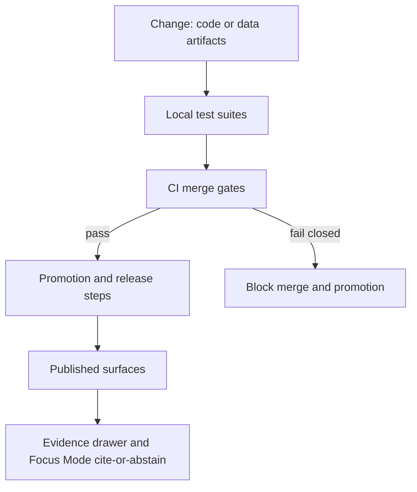

<!-- [KFM_META_BLOCK_V2]
doc_id: kfm://doc/7f06c93b-7c88-4f2b-bba2-4f3d935d3f89
title: tests — Test Strategy, QA, and CI Gates
type: standard
version: v1
status: draft
owners: TODO
created: 2026-02-26
updated: 2026-02-26
policy_label: restricted
related:
  - docs/MASTER_GUIDE_v13.md
  - docs/architecture/
  - .github/workflows/
tags: [kfm, tests, ci, governance]
notes:
  - This README is a governed artifact. Keep it aligned with merge gates and the Promotion Contract.
  - Do not include secrets, restricted datasets, or sensitive location details in this doc or fixtures.
[/KFM_META_BLOCK_V2] -->

# 🧪 `tests/` — Test Strategy, QA, and CI Gates

**Purpose:** Make governance enforceable. Tests are not “nice to have”; they are the mechanism that keeps the trust membrane intact and prevents unsafe or untraceable outputs from shipping.

**Status:** DRAFT • **Owners:** `TODO` • **Last updated:** `2026-02-26`


> **WARNING**
> This directory is part of the **trust membrane**. If a test is flaky, non-deterministic, or can be bypassed, it is a governance risk.

---

## Navigation

- [Purpose and scope](#purpose-and-scope)
- [How tests map to governance](#how-tests-map-to-governance)
- [Running tests](#running-tests)
- [Test categories](#test-categories)
- [Folder layout](#folder-layout)
- [Writing and adding tests](#writing-and-adding-tests)
- [CI gates](#ci-gates)
- [Release definition of done](#release-definition-of-done)
- [Troubleshooting](#troubleshooting)
- [Appendices](#appendices)

---

## Purpose and scope

This `tests/` directory holds **automated tests** that verify:

1. **Correctness** of domain logic.
2. **Governance invariants** (fail closed).
3. **Evidence and citation resolvability** (cite-or-abstain).
4. **Schema and contract stability** (catalog + API).
5. **Safety** for sensitive locations and restricted data.

### What belongs here

- Unit tests for domain logic and deterministic identity logic.
- Schema validation tests for catalog artifacts (STAC/DCAT/PROV).
- Policy tests driven by fixtures (allow/deny/obligations).
- API contract tests (OpenAPI diffs, DTO validation).
- Integration tests for evidence resolution.
- E2E UI tests for evidence drawer and citation resolution.
- Test fixtures that are **synthetic** or **sanitized**, small, and clearly licensed.

### What must not go here

- Real secrets, tokens, credentials, or private keys.
- Raw partner datasets or anything with unclear licensing.
- Restricted or sensitive geometries, precise coordinates, or any fixture that could re-enable targeting.
- Large binaries unless explicitly approved and versioned as test assets with provenance.

---

## How tests map to governance

KFM’s operating stance is **fail closed**: if evidence, policy, licensing, or citations are unclear, the system blocks promotion/publishing.



Practical meaning:

- A feature is not “done” until tests prove it preserves the trust membrane.
- CI gates must block merges when governance checks fail.
- Tests should be deterministic and reproducible; minimize reliance on external systems.

---

## Running tests

> **NOTE**
> This repo should expose a single “run everything” command. If you don’t see one, add it (Makefile/Taskfile/script) and wire CI to use it.

### Common entry points

Pick the command(s) actually used by this repository:

- `make test` or `task test`
- `./tools/test.sh`
- `npm test` / `yarn test` / `pnpm test`
- `pytest`
- `go test ./...`

### Run by category

Examples (adjust paths to match the actual folder structure):

```bash
# Unit tests
pytest -q tests/unit

# Schema tests
pytest -q tests/schema

# Policy tests
pytest -q tests/policy

# Contract tests
pytest -q tests/contract

# Integration tests
pytest -q tests/integration

# E2E UI tests
npx playwright test
```

### Suggested local workflow

1. Run unit + schema + policy tests before pushing.
2. Run integration tests before requesting review.
3. Run E2E tests (or at least the evidence-drawer spec) before merging UI changes.

---

## Test categories

Minimum categories expected in KFM:

| Category | Purpose | Typical failures catch | Evidence required |
|---|---|---|---|
| Unit tests | Validate domain logic and deterministic identity | Wrong spec hashing, bad vocab validation, time logic bugs | Pure code + small fixtures |
| Schema tests | Validate STAC/DCAT/PROV profiles | Invalid JSON, missing required fields, broken cross-links | Schema + sample artifacts |
| Policy tests | Enforce default-deny and obligations | Accidental leakage, incorrect allow/deny decisions | Policy fixtures |
| Contract tests | Prevent breaking API consumers | Breaking OpenAPI diffs, DTO drift | OpenAPI + DTO fixtures |
| Integration tests | Prove the evidence resolver works end-to-end | Broken EvidenceRefs, latency regressions, policy bypass | Sample EvidenceRefs |
| E2E UI tests | Prove the UI shows evidence and citations | Evidence drawer missing, citations not resolvable | Test server + seeded content |

---

## Folder layout

> **NOTE**
> This is the **recommended** layout. If the repo differs, update this README to match reality.

```text
tests/
  README.md

  unit/
    # Domain logic tests, spec hashing, controlled vocab checks

  schema/
    # STAC/DCAT/PROV profile validation, cross-link checks

  policy/
    # OPA fixture-driven allow/deny/obligation tests

  contract/
    # OpenAPI diffs, DTO validation, backward compatibility checks

  integration/
    # Evidence resolver and governed API integration tests

  e2e/
    # End-to-end tests (UI + API) for evidence drawer and citations

  fixtures/
    public/
      # Safe, synthetic fixtures intended for public scenarios
    restricted_sanitized/
      # Sanitized fixtures that never contain restricted geometries or identifiers

  utils/
    # Shared test helpers (builders, fake stores, snapshot utilities)
```

---

## Writing and adding tests

### Golden rules

- **Fail closed**: a missing citation, policy label, license field, or schema link must fail the test.
- **No hidden dependencies**: tests should not require internet access or external credentials.
- **Keep fixtures small and attributable**: each fixture should include a short provenance note (source, license, why it is safe).

### Adding a new feature test checklist

- [ ] Unit test covers domain logic changes.
- [ ] Schema tests cover any catalog output changes.
- [ ] Policy fixture added for any new access pattern.
- [ ] Contract tests updated for any OpenAPI/DTO change.
- [ ] Integration tests cover at least one representative EvidenceRef.
- [ ] E2E test covers the evidence drawer path if the UI is affected.
- [ ] Link checker passes (no broken citations).
- [ ] Accessibility smoke checks pass for UI changes.

### Sensitive data safety patterns

When working with sensitive locations or re-identification risk datasets:

- Prefer generalized or aggregated fixtures.
- Add explicit “no leakage” tests (public tile responses must not contain restricted bounds/fields).
- Assert that public exports omit restricted coordinate fields.

---

## CI gates

These checks are merge-blocking and should run on every PR that changes relevant files:

- Lint and typecheck for frontend and backend
- Schema validation for any changed catalog artifacts
- Story Node template validation
- Policy tests must pass
- Spec hashing tests must pass
- Link checker must pass (no broken citations)
- Security scanning and optional SBOM generation
- Accessibility smoke checks for UI changes

---

## Release definition of done

A release is considered done only when:

- All CI gates pass
- Promotion manifests exist for new dataset versions
- Evidence resolver contract tests pass for public and restricted scenarios
- Focus Mode evaluation harness passes golden queries
- UI regression tests pass and accessibility checks show no major regressions
- Release notes include policy and data changes
- Audit ledger retention and monitoring are configured

---

## Troubleshooting

### Common failure modes

- **Spec hash mismatch**  
  Usually means canonicalization changed. Confirm deterministic field ordering and normalization rules.

- **Broken citations or unresolved EvidenceRefs**  
  Fix the reference target or add missing evidence bundle artifacts. Do not “skip” the test.

- **Policy tests failing unexpectedly**  
  Treat as a potential leakage regression first. Only relax policy with a documented governance decision.

- **Schema tests failing**  
  Update artifact generation to match profiles. Do not patch schemas to “fit the bug” unless it’s an intentional schema change.

- **E2E flakiness**  
  Stabilize by removing timing assumptions, using deterministic seeds, and running browsers in a consistent mode in CI.

---

## Appendices

<details>
<summary><strong>Appendix A — Recommended CI job naming</strong></summary>

- `lint_typecheck`
- `unit`
- `schema_catalog`
- `policy`
- `contract_api`
- `integration_evidence`
- `e2e_ui`
- `link_check`
- `security_scan`
- `a11y_smoke`

</details>

<details>
<summary><strong>Appendix B — Fixture governance template</strong></summary>

Each fixture directory should contain a short `FIXTURE_NOTES.md` with:

- Source and license
- Sensitivity classification
- Redaction steps applied
- Intended test coverage

</details>

---

<a id="back-to-top"></a>
**Back to top:** [Navigation](#navigation)
