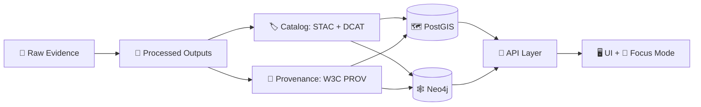
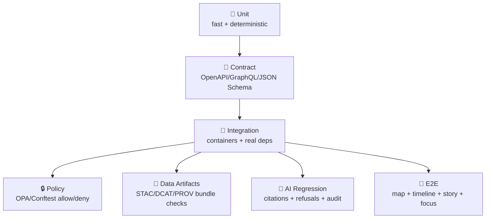

<div align="center">

<!-- 🧭 Optional: place the animated seal at: docs/assets/brand/kfm-seal-animated-320.gif -->


# 🧪 `tests/` — Trust & Governance Test Suite (KFM) 🧾🛡️

**KFM isn’t “just a map app” — it’s a governed evidence engine.**  
<sub><em>“No Source, No Answer.” “Fail closed.” “Contracts before convenience.”</em></sub>

<br/>


<a href="#-quickstart">🚀 Quickstart</a> •
<a href="#-the-kfm-trust-contract">🧬 Trust Contract</a> •
<a href="#-suite-map">🧩 Suite Map</a> •
<a href="#-ci-expectations">✅ CI</a> •
<a href="#-add-a-test-checklist">🧾 Add a Test</a>

</div>

---

> [!WARNING]
> 🚧 **Under construction (active development):**  
> Folder names, commands, and service names may evolve. **Keep the intent stable** even if implementation shifts.

---

## 🔗 Quick links (recommended reading order) 🧭

- 🏗️ System architecture: `../docs/architecture/system_overview.md`
- 🤖 AI architecture: `../docs/architecture/AI_SYSTEM_OVERVIEW.md`
- 🐙 Focus Mode + Ollama integration: `../docs/architecture/ai/OLLAMA_INTEGRATION.md`
- 🚰 Pipelines hub: `../pipelines/README.md`
- 📦 Data vault rules: `../data/README.md` *(or `../data/` docs if split)*

---

## 🧬 The KFM trust contract

This test suite exists to protect the **non‑negotiables**:

### 🔥 Invariants we treat as “system law”
- 🧾 **Provenance is mandatory**: publishable outputs must have lineage (W3C PROV) + discovery metadata (STAC/DCAT).
- 🛡️ **Policy is the enforcement membrane**: authorization & redaction are **policy-driven** and **fail closed**.
- 🧱 **API is the only gateway**: no UI-side direct DB access (PostGIS/Neo4j). Ever.
- 🤖 **Focus Mode must cite or refuse**: if evidence is insufficient → refusal. If evidence exists → citations required.
- 🧬 **Classification propagates forward**: outputs cannot be less restricted than their inputs.

> [!IMPORTANT]
> ✅ “Fail closed” means **default deny** when policy, provenance, license, sensitivity, or metadata is missing.  
> If a test blocks a PR, treat it as a **trust feature**, not an inconvenience. 🧯

---

## 🧭 The “Truth Path” tests must enforce (end‑to‑end)



**If you can wipe the DB and rebuild from `data/processed/` + STAC/DCAT/PROV + pipeline code… the platform stays honest.** ♻️

---

## 🧱 Test pyramid (KFM edition)



**Rule of thumb:**  
- Unit → correctness ✅  
- Contract → stability 🧷  
- Integration → reality check 🐳  
- Policy/Provenance/AI → trust guarantees 🧾🛡️  
- E2E → “does the Kansas time-travel experience actually work?” 🗺️🕰️

---

## 📁 Recommended structure (adjust to repo as needed)

```text
tests/
├─ README.md                        👈 you are here
│
├─ unit/                            🧩 pure logic, no services
│  ├─ api/
│  ├─ services/
│  ├─ schemas/
│  └─ utils/
│
├─ contract/                        📜 interface guarantees
│  ├─ openapi/
│  ├─ graphql/
│  └─ jsonschema/
│
├─ integration/                     🧪 real dependencies (containers)
│  ├─ api_endpoints/
│  ├─ postgis/
│  ├─ neo4j/
│  ├─ tiles/
│  └─ search/
│
├─ data/                            🧾 dataset bundle + metadata gates
│  ├─ fixtures/
│  ├─ stac/
│  ├─ dcat/
│  ├─ prov/
│  └─ bundle_checks/
│
├─ policy/                          🔒 policy-as-code (OPA)
│  ├─ rego/
│  ├─ conftest/
│  └─ testdata/
│
├─ ai/                              🤖 Focus Mode regression harness
│  ├─ prompts/
│  ├─ fixtures/
│  ├─ retrieval_bundles/
│  └─ eval/
│
└─ e2e/                             🧭 Playwright/Cypress UI flows (optional)
   ├─ specs/
   └─ fixtures/
```

> [!TIP]
> Keep fixtures **small, legal, and deterministic**:  
> tests should prove governance rules without shipping sensitive or licensed material.

---

## 🚀 Quickstart

> [!NOTE]
> Command names vary across repo versions. Use this as a **pattern**.

### ✅ Prereqs
- 🐳 Docker + Docker Compose *(for PostGIS / Neo4j / OPA / optional Ollama)*
- 🐍 Python *(commonly `pytest`)*
- 🧑‍💻 Node.js *(optional unless you run UI/E2E tests)*

### 1) Fast tests (unit + contract)
```bash
pytest -q
```

### 2) Integration tests (real services)
```bash
docker compose up -d postgis neo4j opa
pytest -m integration -q
```

### 3) Policy tests (Conftest)
```bash
conftest test tests/policy/ -p tests/policy/rego
```

### 4) Focus Mode regression (optional)
```bash
docker compose up -d ollama
pytest -m ai -q
```

### 5) UI/E2E (optional)
```bash
# Example only
npm ci
npm run test:e2e
```

---

## 🧩 Suite map

### 🧩 Unit tests — “small truths” (fast ✅)
**Purpose:** prove correctness of pure logic.  
**Examples:**
- schema helpers (STAC/DCAT/PROV validation utilities)
- bbox/time parsing & normalization
- geometry utilities & ID normalization
- redaction utilities (precision reduction, column masking)
- policy client wrappers (input shaping, decision parsing)

✅ Prefer **no network, no time, no randomness**.

---

### 📜 Contract tests — “stable interfaces” 🧷
**Purpose:** prove we didn’t accidentally break:
- OpenAPI request/response shapes
- GraphQL schema types + backward compatibility
- JSON Schema contracts (dataset manifests, metadata, provenance bundles)

✅ Typical patterns:
- snapshot OpenAPI schema and compare changes intentionally
- validate example payloads against JSON Schema
- check GraphQL schema composition + query cost limits *(if implemented)*

> [!TIP]
> Contract tests are where “**breaking changes**” should be caught early — before a human reviewer needs to notice. 👀

---

### 🧪 Integration tests — “real stack, real rules” 🐳
**Purpose:** run against containers for:
- PostGIS spatial queries
- Neo4j graph traversals
- tile serving (MVT/raster)
- search index behavior
- API authZ + redaction behavior
- audit/provenance logging hooks

✅ Good integration assertions (stable):
- endpoint returns correct status + schema
- unauthorized requests → 403 or sanitized output
- data queries obey bbox/time constraints
- tiles render and are valid MVT/PNG/WEBP
- every response includes correlation/audit identifiers *(if designed)*

🚫 Avoid brittle checks:
- exact full-text AI prose
- timing-based sleeps
- live calls to external agencies

---

### 🧾 Data artifacts suite — “nothing ships without boundary artifacts”
**Purpose:** enforce dataset bundle completeness & alignment:
- processed asset exists ✅
- STAC item references correct assets ✅
- DCAT distribution links STAC and/or assets ✅
- PROV bundle explains raw → processed transform ✅
- license + sensitivity are present ✅

#### Minimum bundle rule (recommended)
A publishable dataset should have *at least*:
- `data/processed/...`
- `data/stac/items/<dataset_id>.json`
- `data/catalog/dcat/<dataset_id>.jsonld`
- `data/prov/<dataset_id>.prov.json`

> [!IMPORTANT]
> If a dataset is visible in UI/search or usable by Focus Mode, it must be **cataloged + provenance-linked** first. ✅

---

### 🔒 Policy-as-code suite (OPA / Conftest) — “governance is executable”
**Purpose:** prove:
- rego compiles
- expected allow/deny decisions for RBAC and sensitivity levels
- “fail closed” behavior when required fields are missing
- policy decisions can be traced to a policy bundle/version *(if implemented)*

#### Recommended policy test cases
- Public user requests restricted dataset → deny
- Contributor requests internal dataset → allow *(if role permits)*
- Missing license/sensitivity/provenance → deny + CI fail
- AI answer without citations → deny or force refusal response
- Sensitive location precision → enforce masking/rounding rules

<details>
<summary><b>🧊 Golden test pattern (recommended)</b> — deterministic and reviewable</summary>

```text
tests/policy/testdata/
  case_001_public_denied/
    input.json
    expected.json
  case_002_admin_allowed/
    input.json
    expected.json
```

Run:
```bash
conftest test tests/policy/ -p tests/policy/rego
```
</details>

---

### 🤖 Focus Mode regression suite — “cite or refuse” 🧠
**Purpose:** prove Focus Mode behaves like a governed analyst:
- answers include citations when answering factual questions
- refuses when evidence is insufficient
- respects sensitivity classifications and redaction rules
- produces audit/provenance records for responses *(design goal)*

#### How to keep AI tests stable
✅ Prefer:
- frozen retrieval bundles (graph + spatial + docs snippets)
- deterministic prompts/templates
- small local model or mocked Ollama client
- assertions on **structure** not prose:
  - `citations[]` present
  - `refusal_reason` when no evidence
  - `policy_decision` metadata
  - `audit_id` / `prov_link` fields

🚫 Avoid:
- exact paragraph matching
- “model mood” tests

<details>
<summary><b>🧪 Suggested fixture format</b></summary>

```text
tests/ai/fixtures/<case>/
  question.txt
  retrieval_bundle.json
  expected_invariants.json
```

Example `expected_invariants.json`:
```json
{
  "must_refuse_if_no_sources": true,
  "min_citations": 1,
  "must_not_include": ["as an AI language model"],
  "must_include_fields": ["answer", "citations", "audit_id"]
}
```
</details>

---

### 🧭 UI / E2E suite (optional but powerful)
**Purpose:** prove user-critical flows:
- app boots
- map loads & tiles render
- layer toggles work
- time slider updates layers
- story nodes render and link to sources
- Focus Mode returns citation-bearing answers or refusals
- RBAC hides restricted layers for unauthorized roles

Tools: Playwright or Cypress (choose one).

---

## 🏷️ Markers, tags, and conventions

### ✅ Pytest markers (suggested)
- `unit` 🧩
- `contract` 📜
- `integration` 🧪
- `policy` 🔒
- `data` 🧾
- `ai` 🤖
- `e2e` 🧭
- `slow` 🐢

Run examples:
```bash
pytest -m "unit or contract" -q
pytest -m "integration and not slow" -q
pytest -m "policy or data" -q
```

### ✅ Naming conventions
- `test_<area>__<behavior>.py`
- one primary behavior per test (small focused tests beat mega-tests)

---

## ✅ CI expectations

> [!IMPORTANT]
> CI is not “just quality control.” In KFM it’s a **governance gate**. 🧾🛡️

### PR checks (fast + trust‑critical)
- ✅ unit + contract
- ✅ policy (rego compile + conftest allow/deny)
- ✅ metadata/provenance bundle checks for touched datasets
- ✅ API smoke test (healthz + core endpoints)

### Nightly / scheduled (heavier)
- ✅ full integration matrix (PostGIS + Neo4j + tiles + search)
- ✅ Focus Mode regression suite
- ✅ UI/E2E (seeded fixtures)
- ✅ optional performance checks (tile latency budget, query cost ceilings)

---

## 🧰 Troubleshooting

### 🐳 Containers won’t start / ports collide
Common ports:
- PostGIS: `5432`
- Neo4j: `7474` (UI) / `7687` (bolt)
- OPA: `8181`
- Ollama: `11434`

Fix:
- stop conflicting services, or
- remap ports in compose config.

### 🧠 Neo4j memory issues
- shrink fixtures (prefer tiny graphs)
- increase container memory limit
- prefer “schema + traversal correctness” over huge datasets

### 🧾 “Missing PROV / license / sensitivity”
✅ This is the system working as designed.  
Add the missing boundary artifacts and rerun.

### 🤖 AI tests are flaky
- mock Ollama client
- freeze retrieval bundles
- assert citations + refusal logic + policy compliance only

---

## 🧾 Add-a-test checklist

### If you add an API endpoint 🌐
- [ ] unit tests for service logic
- [ ] contract test (OpenAPI/GraphQL schema)
- [ ] integration test for endpoint behavior
- [ ] policy tests (allowed/denied + redaction)
- [ ] audit/provenance assertions *(if applicable)*

### If you add a dataset / pipeline 🗂️
- [ ] pipeline produces `processed/` outputs
- [ ] STAC/DCAT/PROV generated and valid
- [ ] bundle completeness passes
- [ ] geometry + CRS + bbox sanity checks
- [ ] license + sensitivity present
- [ ] deterministic manifest/checksum where feasible

### If you change Focus Mode 🤖
- [ ] citations required test
- [ ] refusal behavior test (“no evidence → refuse”)
- [ ] policy denial test for restricted data
- [ ] audit trail present *(if designed/implemented)*

---

## 🧠 North Star

<div align="center">

### 🧾 Tests preserve trust — not just correctness.
If policy, provenance, or citations can’t be proven… it doesn’t merge. ✅

</div>