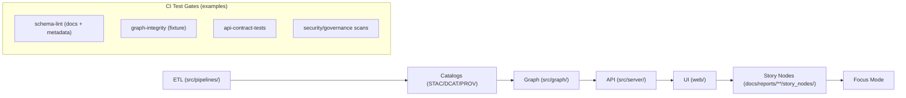

# KFM Test Suite

Governed document. This guide describes how tests are organized and executed in Kansas Frontier Matrix (KFM), and how tests enforce KFM’s pipeline contracts and governance invariants.

## 📘 Overview

### Purpose

KFM tests exist to prevent regressions against the platform’s non‑negotiable pipeline and governance rules:

- **Pipeline ordering is absolute**: ETL → Catalogs (STAC/DCAT/PROV) → Graph → API → UI → Story Nodes → Focus Mode.
- **Contract-first**: schemas/contracts are first-class artifacts; changes trigger compatibility checks.
- **Provenance-first**: nothing reaches Graph/UI/Story unless catalogs + provenance exist and validate.
- **Sovereignty & classification propagate**: derivatives cannot be less restricted than inputs.

This README tells contributors:
- where tests live,
- what they validate,
- how to run the right subset locally,
- what CI gates will run on every PR.

### Scope

In scope:
- test code under `tests/` (unit, integration, contract, and governance checks)
- schema validation harnesses for:
  - governed Markdown (front‑matter + headings)
  - STAC/DCAT/PROV artifacts
  - Story Node schema compliance
- cross-layer tests enforcing API boundaries and redaction/classification rules

Out of scope:
- domain-specific ETL recipes (those live under domain docs like `docs/data/<domain>/README.md`)
- deployment/ops details (covered in infra/deploy docs, if present)

### Audience

- Contributors modifying ETL/pipelines, catalogs, graph/ontology, APIs, UI layers, Story Nodes, or Focus Mode.
- Reviewers who need a checklist of what “done” means for a compliant change.

### Definitions

- **Contract artifact**: a machine-validated spec defining an interface (JSON Schema, OpenAPI, GraphQL SDL, UI registry schema).
- **Boundary artifact**: KFM’s required “gatekeeper” outputs between stages (STAC/DCAT/PROV).
- **Fixture dataset**: a small, deterministic mini‑domain used for integration tests (raw → work → processed + catalogs).

## 🗂️ Directory Layout

### Repository areas tests commonly target (context)

KFM’s repo layout (v13 draft) includes these top-level homes relevant to testing:

- `schemas/` — schema contracts
- `src/` — implementations (`pipelines/`, `graph/`, `server/`)
- `tests/` — test suite root (this README)
- `tools/` — validators, linters, build/test helpers
- `web/` — UI app (React/MapLibre/Cesium optional)
- `docs/` — governed documentation, story nodes, governance

### Recommended `tests/` layout

Your repo may already have a test layout. If not, this structure is recommended because it maps cleanly to KFM’s pipeline stages and CI gates:

```text
📁 tests/
├── 📄 README.md
├── 📁 unit/                    # fast, pure logic tests (no I/O if possible)
├── 📁 integration/             # end-to-end stage integration on fixtures
├── 📁 contracts/               # API + schema contract tests
├── 📁 schemas/                 # schema-lint harness wrappers (markdown, stac/dcat/prov, storynodes)
├── 📁 graph/                   # ontology mapping + graph integrity checks
├── 📁 ui/                      # UI config/schema checks; optional e2e tests
├── 📁 security/                # secret/PII/sensitivity checks (or wrappers)
└── 📁 fixtures/                # small deterministic test datasets
```

Notes:
- **Schema files themselves** should live under `/schemas/**`. The `tests/schemas/**` folder holds test code that validates those schema files and validates data against them.
- Prefer **stage-aligned naming**: a failing test should immediately indicate *which pipeline boundary* is violated.

## 🧭 Context

### Background

KFM is designed to be **governed and reproducible by construction**. Tests are part of the governance mechanism: they enforce that data and narrative cannot “skip ahead” in the pipeline and that contracts remain stable as the repo evolves.

### Constraints & invariants this test suite must enforce

At minimum, tests and CI must detect:

1. **Pipeline ordering violations**
   - Any attempt to load graph/UI/story content that lacks validated catalog artifacts.
2. **API boundary violations**
   - UI must never query Neo4j/graph directly.
3. **Provenance gaps**
   - Missing PROV for outputs; missing licenses; missing required catalog fields.
4. **Non-deterministic ETL**
   - Same inputs/config producing different outputs across runs.
5. **Evidence-first narrative violations**
   - Story Node claims without citations; unresolvable dataset IDs; uncited media.
6. **Sovereignty/classification regressions**
   - Output artifacts less restricted than inputs; sensitive coordinates exposed.

### Test matrix

This table describes what each stage should validate. The exact tools/runners are repo-specific.

| Pipeline stage | What must be true | Typical test types |
|---|---|---|
| ETL (`src/pipelines/`) | Deterministic, idempotent transforms; stable IDs/hashes; correct `data/raw → data/work → data/processed` staging | Unit + integration; golden outputs on fixtures |
| Catalogs (`data/stac`, `data/catalog/dcat`, `data/prov`) | STAC/DCAT/PROV validate against KFM profiles; cross-links resolve; required fields present | Schema tests; link/reference tests |
| Graph (`src/graph/`) | Graph loads reference catalogs (not duplicating payloads); ontology alignment; referential integrity | Graph integrity tests on fixture dataset |
| API (`src/server/`) | Contract tests pass; redaction/classification rules enforced; authz rules correct | Contract tests; integration tests; negative tests (unauthorized) |
| UI (`web/`) | Uses API only; layer registry schema valid; source citations shown in UI where required | UI config tests; e2e smoke tests (optional) |
| Story Nodes (`docs/reports/**/story_nodes`) | Template compliance; all claims cite evidence; IDs resolvable | Story node schema + content validation |
| Focus Mode | Consumes only provenance-linked content; flags AI text properly | Integration tests over Story Node bundles |

## 🗺️ Diagrams

High-level testing alignment with KFM pipeline (conceptual):



## 📦 Data & Metadata

### Fixture datasets (recommended)

Fixtures should be:
- **small**
- **deterministic**
- **safe for open distribution** (no sensitive locations, PII, or restricted cultural data unless stored in a restricted testing context and explicitly gated)

Recommended pattern:

```text
📁 tests/fixtures/<fixture_name>/
├── 📁 data/
│   ├── 📁 raw/<domain>/
│   ├── 📁 work/<domain>/
│   └── 📁 processed/<domain>/
├── 📁 catalogs/
│   ├── 📁 stac/              # items + collections for the fixture
│   ├── 📁 dcat/              # DCAT dataset entry for the fixture
│   └── 📁 prov/              # PROV bundle describing raw→processed
└── 📄 README.md              # what this fixture is meant to test
```

Guidelines:
- Use fixtures to test the *entire pipeline boundary*, not just one file.
- If a test produces outputs, write them to a temp directory, then compare against golden fixture outputs (or validate schema + hashes).

## 🌐 STAC, DCAT & PROV Alignment

KFM tests must validate that boundary artifacts exist and are compliant:

- **STAC**: collections/items are present and conform to KFM STAC profile.
- **DCAT**: dataset entries conform to KFM DCAT profile; distributions link to STAC or processed assets.
- **PROV**: lineage captures raw inputs → work intermediates → processed outputs, including run IDs/commit hashes where used.

Cross-link expectations:
- STAC Items must link to the actual processed assets.
- DCAT must link to STAC/distributions.
- PROV must link to the pipeline activity and inputs/outputs.

Practical rule of thumb:
- If it is not cataloged and validated, it does not proceed to graph/UI/story consumption.

## 🧱 Architecture

### Boundary enforcement tests

Because KFM is contract-first and API-mediated, include tests that verify:

- **API contract stability**
  - Contract artifacts under `schemas/**` and API specs under `src/server/**` (or equivalent) must be validated in CI.
- **UI does not bypass API**
  - Ensure UI code/configs reference API endpoints, not graph connection strings.
- **Redaction & classification enforcement**
  - Sensitive fields or locations must be filtered/blurred at the API boundary, not “handled in UI”.

### Suggested layering for tests

- Unit tests should not require network, DB, or filesystem where feasible.
- Integration tests should use fixture datasets and ephemeral services (e.g., via Docker) and must be reproducible.
- Contract tests should run early and fail fast (schemas and specs are gatekeepers).

## 🧠 Story Node & Focus Mode Integration

Story Nodes are machine-ingestible and must remain evidence-linked.

Tests should validate that Story Nodes:
- use the correct template version,
- include required front-matter and section ordering,
- cite datasets/documents by stable identifiers (resolvable to catalog entries),
- distinguish fact from interpretation (especially for AI-assisted content),
- do not include sensitive coordinates or restricted details unless explicitly governed.

Focus Mode tests (as applicable):
- confirm the “no uncited narrative” rule by checking that all displayed claims resolve to evidence references.
- confirm any AI text is clearly labeled and constrained by evidence.

## 🧪 Validation & CI/CD

### Minimum CI gates (expected)

The Master Guide v13 and Markdown Protocol describe CI gates that should run on every PR. At minimum, expect checks like:

- **markdownlint + schema-lint**
  - YAML front-matter required fields, allowed headings, section order
- **link/reference validation**
  - internal links to docs/catalogs resolve
- **metadata validation**
  - STAC JSON Schema validation
  - DCAT shape validation (SHACL/ShEx, as implemented)
  - PROV structure validation
- **Story Node schema validation**
  - Story Node v3 template compliance + citation requirements
- **graph integrity**
  - run on a small fixture dataset; ensure ontology alignment + catalog references
- **API contract tests**
  - ensure OpenAPI/GraphQL contract matches implementation; protect backward compatibility
- **security & governance scans**
  - secrets detection
  - PII/sensitive location checks
  - classification consistency checks

### Running tests locally (patterns)

Exact commands depend on the repo’s chosen toolchain. Check:
- `.github/workflows/**`
- `Makefile` / `justfile` / `package.json` / `pyproject.toml`
- `tools/**`

Common patterns you may see:

```bash
# Run fast checks
make lint
make schema-lint

# Run unit tests
make test-unit

# Run integration tests (may require docker-compose)
make test-integration

# Run everything
make test
```

If your repo uses language-specific runners, typical equivalents are:

```bash
# Python (example)
python -m pytest -q

# Node (example)
npm test
```

### PR “Definition of Done” for test-impacting changes

- [ ] Any contract change (schema/API/UI registry) includes updated contract tests
- [ ] Any ETL change includes deterministic fixture coverage (or hash-based checks)
- [ ] Any catalog/profile change includes validator updates + new failing/green cases
- [ ] Story Node/template changes include Story Node schema validation updates
- [ ] All CI gates pass locally or are confirmed in CI
- [ ] No secrets/PII/sensitive locations introduced in fixtures or expected outputs
- [ ] Version History updated (this file, if changed)

## ⚖️ FAIR+CARE & Governance

Tests and fixtures must honor KFM governance defaults:

- **No secrets**: do not commit credentials; ensure secret scans stay green.
- **No PII by default**: use synthetic identities; anonymize unless explicitly governed.
- **No sensitive location inference**: do not add precise coordinates for sacred/vulnerable sites.
- **Classification propagation**: derived fixtures/outputs cannot be less restricted than inputs.
- **Human review required** for anything touching sovereignty-sensitive domains, even in tests.

If you are unsure whether a test asset is permissible:
- omit it,
- replace with a synthetic stand-in,
- and flag for governance review.

## 🕰️ Version History

| Version | Date | Summary | Author |
|---|---:|---|---|
| v1.0.0-draft | 2025-12-31 | Initial test-suite README aligned to v13 pipeline + CI gate expectations. | AI-assisted draft (human review required) |
