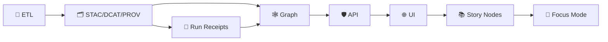

<!--
📌 This README defines the repo-wide testing & verification surface for KFM / Kansas‑Matrix‑System.
🗓️ Last updated: 2026-01-20
🔁 Review cycle: 90 days (or anytime pipeline order / catalogs / policy pack / CI lanes change)
-->

<div align="center">

# 🧪 Tests — Kansas Frontier Matrix (KFM) / Kansas‑Matrix‑System

**Trust-first testing for a contract‑first, catalog‑first geospatial + knowledge + modeling stack** 🧾🗺️🧬  
Determinism • Contracts • Governance • Evidence receipts • “Fail closed” gates ✅🔒


</div>

> KFM tests don’t just check “it runs.”  
> They prove that our **pipelines**, **catalogs**, **graph**, **APIs**, **docs/story nodes**, **Focus Mode**, and **UI behaviors** are:
>
> ✅ **Correct** • ✅ **Reproducible** • ✅ **Governance‑compliant** • ✅ **Honest about uncertainty**  
>
> We test the **seams (boundaries + contracts)** and treat metadata/provenance as **first‑class artifacts** 🗂️🧬

> [!IMPORTANT]
> **tests/** is part of KFM’s *governed surface*.  
> If a change can affect what users see, what the system asserts as “truth”, or what users can infer, it must be **testable**, **traceable**, and **fail‑closed** when requirements aren’t met.

---

<details>
<summary><b>🧭 Table of contents</b></summary>

- [🔗 Quick links](#-quick-links)
- [🚦 Non‑negotiables](#-non-negotiables)
- [🚀 Quickstart](#-quickstart)
- [🧩 KFM test matrix](#-kfm-test-matrix-subsystems--what-to-assert)
- [🧠 Core invariant: governed ordering](#-core-invariant-governed-ordering)
- [🧱 Architecture boundary tests](#-architecture-boundary-tests-clean-architecture)
- [🤖 Agentic QA workflows](#-agentic-qa-workflows-watcherplannerexecutor)
- [🔺 Test pyramid](#-test-pyramid-how-we-keep-velocity--confidence)
- [🏷️ Test categories & markers](#️-test-categories--markers-suggested)
- [🧰 Tool & CLI contract tests](#-tool--cli-contract-tests)
- [📄 Docs, Story Nodes, & Focus Mode validation](#-docs-story-nodes--focus-mode-validation)
- [📄 PDF & doc-portfolio hygiene](#-pdf--doc-portfolio-hygiene)
- [🧾 Contract & metadata tests](#-contract--metadata-tests)
- [🧾 Evidence manifests & run receipts](#-evidence-manifests--run-receipts-run_manifestjson)
- [🧷 Stable IDs & versioning tests](#-stable-ids--versioning-tests-dont-break-links)
- [📜 License, citation, & redistribution tests](#-license-citation--redistribution-tests)
- [✅ Data validation gates](#-data-validation-gates-fail-fast)
- [📡 Streaming & real-time tests](#-streaming--real-time-tests-watchers-sensors-gtfs-rt)
- [🗺️ Geospatial tests](#️-geospatial-tests-gis-correctness)
- [🛰️ Remote sensing tests](#️-remote-sensing-tests-earth-engine--imagery)
- [🧊 3D / WebGL / 3D GIS tests](#-3d--webgl--3d-gis-tests)
- [🧠 Scientific & simulation validation](#-scientific--simulation-validation)
- [📊 ML / stats tests](#-ml--stats-tests-dont-fool-yourself)
- [🧭 Ontology & semantic layer tests](#-ontology--semantic-layer-tests-cidoc-crm-geosparql-owl-time-prov-o)
- [🕸️ Graph tests](#️-graph-tests-neo4j--algorithms)
- [🧵 Pulse Threads & narrative detectors](#-pulse-threads--narrative-detectors)
- [🛡️ API tests](#️-api-tests-fastapi--graphql)
- [🌐 Web / frontend tests](#-web--frontend-test-guidance)
- [📦 Offline packs & AR tests](#-offline-packs--ar-tests)
- [📦 Supply chain & artifact integrity](#-supply-chain--artifact-integrity-oras-cosign-sbom)
- [📈 Performance & capacity tests](#-performance--capacity-tests-latency-throughput-cost)
- [🔐 Security, governance, & ethics tests](#-security-governance--ethics-tests-defensive)
- [🧾 Test artifacts & receipts](#-test-artifacts--receipts)
- [🗂️ Suggested folder layout](#️-suggested-folder-layout)
- [✅ CI gates](#-ci-gates-non-negotiable)
- [✅ PR checklist](#-pr-checklist-copypaste)
- [🧯 Troubleshooting](#-troubleshooting)
- [📚 Reference pointers](#-reference-pointers-project--library-index)
- [🕰️ Version history](#️-version-history)

</details>

---

## 🔗 Quick links

> Paths are relative to `tests/`. If your repo differs, treat these as the **target map** and document any deltas.

- 🧭 Repo overview: `../README.md`
- 📚 Docs boundary (canonical): `../docs/README.md`
- 🧱 Master Guide (v13): `../docs/MASTER_GUIDE_v13.md` *(if present)*
- 📦 Data lifecycle + governance: `../data/README.md`
- 🧬 Schemas registry: `../schemas/` *(STAC/DCAT/PROV/Story/UI contracts)*
- 📓 MCP (methods + receipts + model cards): `../mcp/`
- 🧰 Tools/validators (governed command surface): `../tools/README.md` *(if present)*
- 🧑‍⚖️ Policy pack (OPA/Conftest): `../tools/validation/policy/` *(if present)*
- 🧾 Run receipts / audits: `../data/audits/` *(run manifests, checksums, receipts — if present)*
- 🩺 Graph health reports: `../docs/reports/qa/graph_health/` *(if present)*
- 🤖 Agents (Watcher/Planner/Executor): `../src/agents/` or `../tools/agents/` *(if present)*
- 🛡️ API boundary:
  - `../api/` *(if present — many KFM layouts put FastAPI here)*
  - `../src/server/` *(if present — some layouts put API here)*
- 🛡️ API contracts (OpenAPI/GraphQL): `../src/server/contracts/` *(if present)*
- 📚 Story Nodes (draft/published): `../docs/reports/story_nodes/`
- 🌐 Web UI boundary: `../web/` *(if present)*
- 🤝 CI/CD + policy + security: `../.github/` *(workflows, templates, CodeQL, SECURITY.md)*

---

## 🚦 Non‑negotiables

These are KFM’s “must not regress” invariants. If any of these become false, **CI must block merge** 🚫✅

1) **Contract‑first:** schemas + API contracts are first‑class repo artifacts 🧾  
   - Breaking changes must be explicit + versioned + tested.

2) **Catalog‑first:** nothing is “real” unless it’s cataloged (STAC/DCAT) and traceable (PROV) 🗂️🧬  
   - Catalogs are **boundary artifacts** that downstream stages consume.

3) **Governed ordering is enforced in tests** 🧱  
   **Detect → Validate → Promote** across:
   **ETL → STAC/DCAT/PROV → Graph → API → UI → Story Nodes → Focus Mode**

4) **API boundary rule:** UI must never query Neo4j/DB directly 🔐  
   - Everything user-facing must flow through the API boundary for redaction + policy enforcement.

5) **Determinism by default:** reruns should match unless inputs/configs change 🔁  
   - Stochastic code must be seeded and tested by **properties** (not exact values).

6) **Sovereignty + classification propagation:** outputs can’t be *less restricted* than inputs 🏷️🛡️  
   - “No downgrade” is a gate, not a guideline.

7) **Policy as code is a gate:** governance rules must execute automatically (OPA/Conftest or equivalent) 📜🧱  
   - If policy evaluation is unavailable, the pipeline **fails closed**.

8) **Run receipts exist for publish-grade outputs:** publishable artifacts must have a run receipt (run manifest + hashes + PROV link) 🧾📎  
   - If you can’t answer “what produced this?” you can’t publish it.

9) **No network in unit tests** 🚫🌐  
   - Record/replay, mock adapters, or cached fixtures only.

10) **Evidence over vibes:** failures must produce inspectable artifacts (logs, diffs, screenshots, receipts) 📎

11) **Ontologies compile:** semantic layers must remain coherent (PROV‑O + domain ontologies like CIDOC‑CRM / GeoSPARQL / OWL‑Time if used) 🧠🧩  
   - No “mystery labels” without schema/ontology definitions.

12) **Supply chain is verifiable (when shipping artifacts):** if you publish containers/data packs/releases, signatures and SBOMs must verify 🔏📦  
   - If verification tooling is unavailable → **fail closed** (release lane).

13) **Docs are searchable and linkable:** governed docs must be link-valid and searchable (no “PDF portfolios” without extraction) 📄🔍  
   - If the repo can’t search it, the repo can’t govern it.

> [!TIP]
> If your PR changes **spatial truth** or **what users can infer**, it must be **traceable + testable** 🧾✅

---

## 🚀 Quickstart

### 0) Preconditions (one‑time)
- 🐍 Python env ready (`venv`, `uv`, `conda`, etc.)
- 🌐 Node env ready (`npm`, `pnpm`, or `yarn`)
- 🐳 Docker installed *(recommended for integration parity)*
- 📜 Policy tooling *(optional but recommended)*: `conftest` / `opa` *(if policy pack is enabled)*
- 🔏 Supply chain tooling *(release lane)*: `cosign` *(if signature verification is enabled)*

### 1) Fast checks (developer loop ⚡)
```bash
# Python (fast)
pytest -q -m "not integration and not e2e and not slow"

# Web (fast — adapt to your repo)
npm test
```

### 2) Full suite (recommended on feature branches ✅)
```bash
pytest -q
pytest -q -m integration
npm run test:e2e
```

### 3) Integration tests with containers (preferred 🐳)
```bash
docker compose up -d --build
pytest -q -m integration
docker compose down -v
```

<details>
<summary>🧾 Command cheat sheet (copy/paste)</summary>

```bash
# Contracts only (API + schemas + catalogs)
pytest -q -m contracts

# Docs/story lint + story-node schema checks
pytest -q -m docs

# Policy pack (if enabled)
pytest -q -m policy

# Evidence receipts / run manifests
pytest -q -m receipts

# Geo sanity
pytest -q -m geo

# Earth-observation sanity
pytest -q -m eo

# Scientific V&V
pytest -q -m validation

# Ontology / semantic layer
pytest -q -m ontology

# Graph slice
pytest -q -m graph

# Streaming / watchers
pytest -q -m streaming

# Offline packs / AR
pytest -q -m offline
pytest -q -m ar

# Supply chain verification (release-lane tests)
pytest -q -m supplychain

# Performance/capacity (usually scheduled)
pytest -q -m perf

# Defensive security checks
pytest -q -m security

# Governance/policy pack (broader)
pytest -q -m governance
```
</details>

---

## 🧩 KFM test matrix (subsystems + what to assert)

KFM is layered (clean boundaries). Tests should **pin the seams** 🔩:

| 🧱 Subsystem | 🎯 What must never break | 🧪 Best test types | 🧰 Typical tools |
|---|---|---|---|
| 🧰 Tools/CLIs | governed command surface: `--help`, safe defaults, stable exit codes, structured logs | unit ✅ + smoke ✅ | pytest, subprocess, snapshot tests |
| 🧪 ETL / pipelines | deterministic outputs, idempotent reruns, schema+CRS correctness | unit ✅ + integration 🔌 + data QA gates ✅ | pytest, GDAL, GeoPandas, validators |
| 🗂️ Catalogs (STAC/DCAT/PROV) | boundary artifacts exist *before* graph/UI uses data; links resolve; provenance complete | contracts 🧾 + integration 🔌 | JSON Schema, jq, custom validators |
| 🧾 Receipts (run manifests) | every publish-grade output has a run manifest + hashes + PROV linkage | contracts 🧾 + integration 🔌 | pydantic, jsonschema, canonicalization |
| 📜 Policy pack | governance rules are executable + fail closed | unit ✅ + integration 🔌 | OPA, Conftest, Rego tests |
| 🕸️ Graph (Neo4j) | graph ingests **from catalogs**, not ad‑hoc; constraints + ontology rules hold | integration 🔌 + property tests 🧪 | Neo4j container, Cypher assertions |
| 🧭 Semantic layer | ontology alignment: PROV-O + domain ontologies (if used) remain coherent | contracts 🧾 + integration 🔌 | schema validation, Cypher + SHACL-ish checks |
| 🛡️ API (REST/GraphQL) | contract stability, authz, deterministic pagination | contracts 🧾 + integration 🔌 | OpenAPI/GraphQL validation, TestClient |
| 🌐 UI (SPA) | responsive + accessible, stable map behaviors, timeline correctness | unit 🧩 + component 🧱 + e2e 🧭 | Jest/Vitest, Playwright/Cypress |
| 🗺️ Maps / 3D | symbology & overlays don’t silently shift; perf budgets | visual 🖼️ + e2e 🧭 | screenshot diffs, WebGL harness |
| 📚 Story Nodes | citations resolve; narrative ordering consistent; no unsourced claims | docs ✅ + contracts 🧾 | markdown/link validators, schema checks |
| 🎯 Focus Mode (AI) | provenance-linked outputs; safe refusals; uncertainty honesty; no sensitive leakage | eval ✅ + contract-like 🧾 | golden prompts, retrieval tests |
| 🤖 Agents (W‑P‑E) | agents never bypass policy; kill-switch works; PRs are traceable | integration 🔌 + security ✅ | sandboxed runners, policy gates |
| 📦 Offline packs | pack integrity, included licenses, sensitivity enforcement | integration 🔌 + contracts 🧾 | manifest validation, hashing |
| 🛰️ Streaming | idempotent ingestion (ETag/Last‑Modified), immutable events, replayable timeline | integration 🔌 + property tests 🧪 | fixtures, time-series validators |
| 🔏 Supply chain | released artifacts are verifiable (signatures + SBOM) | integration 🔌 + release lane ✅ | cosign, SBOM tools, ORAS (optional) |
| 📈 Performance | latency/throughput/cost regressions visible & explainable | perf ⏱️ + scheduled ✅ | pytest-benchmark, k6, Locust, EXPLAIN |
| 🔐 Governance | licenses, access constraints, “no downgrade” classification | gates ✅ + integration 🔌 | OPA/Conftest, CI checks |

---

## 🧠 Core invariant: governed ordering

> [!IMPORTANT]
> KFM enforces a **non‑negotiable** pipeline order with a “Detect → Validate → Promote” mentality:
>
> **ETL → STAC/DCAT/PROV catalogs → Graph → APIs → UI → Story Nodes → Focus Mode**



### ✅ What tests should enforce (practically)
- 🧪 ETL determinism (stable IDs/hashes; idempotent reruns; explicit versions)
- 🗂️ Catalog records exist **before** graph/UI uses them
- 🧾 Run receipts exist for publish-grade outputs (run manifests + hashes + PROV link)
- 🕸️ Graph loads only from catalogs (no ad‑hoc inserts in prod paths)
- 🛡️ API is the only client boundary (UI never queries graph/DB directly)
- 📜 Policy pack enforces governance (licenses, classification, access controls)
- 🔐 Classification/sensitivity never downgrades silently (requires audited redaction)
- 🧾 Provenance is complete (inputs → activities → outputs with run IDs/configs)
- 🏷️ License is explicit before publish (block publish if missing/ambiguous)

---

## 🧱 Architecture boundary tests (clean architecture)

KFM’s modular structure only stays maintainable if boundaries are enforced 🧱✨

### ✅ What to test
- **Dependency direction rules** (e.g., domain → service → adapters; never reverse)
- **No cross-layer shortcuts** (UI never imports DB drivers; pipelines don’t import UI)
- **API boundary is the redaction/policy choke‑point** (everything public flows through it)
- **“Independently testable components” stays true** (isolated unit tests remain possible)

### 🔧 Suggested patterns
- 🧭 *Import-lints* that fail if forbidden imports appear (Python)  
- 🧱 *Module boundary tests* (TS/JS) so UI doesn’t reach server internals  
- 🔌 *Contract-only integration tests* so adapters can be swapped without rewriting logic  

> [!TIP]
> Boundary tests are cheap insurance. They prevent “just this once” coupling that becomes permanent. 🧯

---

## 🤖 Agentic QA workflows (Watcher–Planner–Executor)

KFM’s roadmap includes **agent-assisted maintenance** (especially for data QA, catalog hygiene, and doc/story validation).  
If your repo implements this, treat it as a **high-risk boundary** that must be fenced by tests.

### 🧠 Mental model
- 👀 **Watcher** detects drift (missing metadata, failing links, policy violations, stale indexes, schema mismatches)
- 🧩 **Planner** proposes tasks (ranked + scoped + governed)
- 🛠️ **Executor** makes changes **only through PRs** (never direct writes to protected branches)

### ✅ Non‑negotiable agent controls (testable)
- 🧯 **Kill-switch:** one config flag disables all agent actions
- 🧾 **Receipt-first:** every agent action emits a structured receipt (inputs + decision + outputs)
- 🧱 **Policy-first:** agent outputs run through the same contract + policy gates as humans
- 🧑‍⚖️ **No autonomous merge:** agents can open PRs, but cannot approve/merge
- 🧰 **Scoped diff:** PRs are limited to a declared scope (e.g., metadata fixes only)

### 🧪 Test patterns (suggested)
- `test_agent_kill_switch_blocks_actions()`
- `test_agent_only_opens_prs_never_pushes_main()`
- `test_agent_receipt_schema_valid()`
- `test_agent_changes_fail_when_policy_fails()`
- `test_agent_does_not_weaken_classification()` *(no downgrade)*

> [!CAUTION]
> Agent tooling must never become a “back door” around governance.  
> If the policy pack can’t run, **agents must halt** (fail closed). 🔒

---

## 🔺 Test pyramid (how we keep velocity + confidence)

Most tests should be cheap and deterministic, then fewer (higher‑value) integration + E2E:

```text
          🔺 E2E (few)          → critical user journeys (UI + API + DB)
        🔺🔺 Integration (some)  → services together (DB, API, pipelines)
      🔺🔺🔺 Unit (many)          → pure logic, transforms, validators
```

---

## 🏷️ Test categories & markers (suggested)

### Python (`pytest`) markers
Standardize markers so devs can run focused slices quickly:

```ini
# pytest.ini (example)
[pytest]
markers =
  unit: fast pure logic
  integration: hits db/services/filesystem
  e2e: end-to-end journeys (rare for python)
  slow: long-running tests (non-gating)
  perf: benchmarks/capacity (usually scheduled)

  contracts: schemas + catalogs + API contract validation
  docs: markdown/front-matter/story-node validation
  pdf: PDF hygiene (searchable text layer / portfolios)

  receipts: run_manifest + hashes + receipts validation
  policy: OPA/Conftest policy pack execution and tests

  validation: scientific/V&V tests (tolerance-based)
  geo: GIS correctness checks
  eo: earth-observation / remote-sensing checks
  streaming: watchers / real-time ingestion checks
  offline: offline pack packaging + integrity
  ar: AR/field overlay correctness checks (where applicable)

  webgl: WebGL context + render sanity checks
  graph: graph (Neo4j + algorithms) checks
  ontology: PROV-O + domain ontology alignment checks (if used)

  api: API behavior checks (beyond schema)
  security: defensive security checks (no offensive testing)
  governance: license/classification/redaction/policy enforcement checks
  focus: Focus Mode contract tests (provenance + safety + uncertainty)
  supplychain: artifact signature/SBOM verification (release lane)
```

### Web tags (examples)
- Jest/Vitest: `test`, `test:unit`, `test:component`
- Playwright/Cypress: `test:e2e`
- Visual regression: `test:visual`

---

## 🧰 Tool & CLI contract tests

KFM’s **governed toolchain** (`tools/`) is part of the contract surface. Tools must behave predictably under automation.

### ✅ What to assert for every CLI tool
- `--help` exists + includes **≥2 examples**
- `--version` returns a stable value (semver or git SHA)
- safe-by-default (no writes unless `--apply`, or `--dry-run` default)
- stable exit codes (usage vs validation failure vs runtime failure)
- structured logs available (human + JSONL mode)
- **idempotency for ingest/watchers:** reruns do not duplicate outputs *(especially streaming watchers)*

### 🔧 Suggested tests (patterns)
- `test_tools_help_smoke()` — exit 0 and non-empty help
- `test_tools_version_smoke()` — exit 0 and prints version
- `test_tools_dry_run_does_not_mutate()` — run against temp dirs; confirm no writes
- `test_tools_exit_codes_are_stable()` — validation failure → code `3` (or your chosen standard)
- `test_tools_json_logs_valid_jsonl()` — parse emitted JSONL lines
- `test_watchers_are_idempotent()` — re-run fixture inputs; identical outputs + no dup IDs

> [!TIP]
> If you implement core logic inside `tools/`, that’s a smell.  
> Put logic in `src/` (or `api/src/`) and keep `tools/` as a predictable CLI + validator layer 🛠️

---

## 📄 Docs, Story Nodes, & Focus Mode validation

KFM treats documentation + narrative as governed artifacts (not “freeform notes”).

### ✅ Docs validation should cover
- YAML front‑matter present + valid
- internal link checks (`docs/**`, `data/**`, `schemas/**`)
- image/assets exist (no broken embeds)
- required sections exist for governed doc types *(templates)*
- **license/citation fragments resolve** (story exports + layer attributions)

### ✅ Story Nodes validation should cover
- lives under `docs/reports/story_nodes/{draft|published}/...`
- uses the Story Node template (v3) fields *(or repo’s current schema)*
- citations resolve to cataloged sources (STAC/DCAT/PROV)
- narrative claims do **not** introduce uncited “facts”
- published stories meet stricter gates than drafts
- **timeline correctness:** story steps align with dataset temporal extents

### ✅ Focus Mode contract tests should cover
- context bundles only contain provenance‑linked content
- AI‑generated text is **clearly labeled** (and includes model/version where permissible)
- refusal behavior works when evidence is missing
- uncertainty is surfaced (intervals, confidence notes, or “unknown”)
- AI stays **advisory**: it cannot take autonomous actions or bypass policy gates
- **explainability hooks:** if UI includes an “audit” panel, it must show the evidence set used

> [!CAUTION]
> If a Story Node (or Focus Mode) could expose sensitive locations or culturally sensitive information:  
> **CI should flag it for governance review** and block publish until review completes 🔒

---

## 📄 PDF & doc-portfolio hygiene

Some KFM project PDFs are **PDF portfolios** (container PDFs with embedded files). Portfolios are convenient for distribution, but they are **hostile to repo search/governance** unless extracted.

### ✅ What to enforce
- PDFs in governed docs must be:
  - searchable (text layer present)
  - link-stable (file name + path stable)
  - extractable (no “portfolio-only” docs in governed paths unless accompanied by extracted parts)

### 🧪 Suggested tests
- `test_pdf_has_text_layer()` *(sample pages contain text extract)*
- `test_no_pdf_portfolios_in_docs()` *(or: portfolios require extraction manifest)*
- `test_doc_assets_exist_and_are_linked()` *(no broken embeds)*

> [!TIP]
> If you store portfolios for “library shelves”, add a small `LIBRARY_INDEX.md` next to them listing embedded docs and why they matter. 📚🗂️

---

## 🧾 Contract & metadata tests

KFM is **contract‑first** and **catalog‑first**. Tests must protect:
- 🛡️ OpenAPI / GraphQL contracts (breaking changes explicit + versioned)
- 🗂️ STAC (collections/items validity + required fields)
- 🏷️ DCAT (distributions point to real assets/endpoints)
- 🧬 PROV (inputs → activities → outputs; run IDs/configs recorded)
- 🧬 Cross‑layer linkage (Graph references catalogs; UI references API; Story references catalogs)
- 🧾 “Metadata like code”: validation is a compile step, not a best-effort lint

### ✅ What to validate
- JSON parses + schema passes
- links resolve (STAC assets exist; DCAT distributions point somewhere real)
- provenance completeness (raw → work → processed trace exists)
- stable IDs/hashes present where required
- time metadata makes sense (windows applied; plausible ranges)
- **required governance fields** present (license, sensitivity/classification, access constraints)
- **no deprecations:** policy can reject deprecated endpoints/layers *(if your policy pack defines this)*

### Example checks (starter)
```bash
# JSON sanity
find data/stac data/catalog/dcat data/prov -name "*.json*" -print0 | xargs -0 -n 1 jq empty

# pytest contract suite
pytest -q -m contracts
```

> [!NOTE]
> Dataset PRs should run a **Catalog QA gate** (schema + links + license) before merge.  
> If metadata is incomplete (e.g., missing license, broken href), CI must fail. 🚫✅

---

## 🧾 Evidence manifests & run receipts (`run_manifest.json`)

KFM’s architecture treats **runs** as first-class, auditable events.  
If an output can be published, it should have a machine-validated run receipt.

### ✅ What a run receipt should contain (minimum)
- `run_id` (stable unique ID)
- `pipeline_id` / `stage` *(e.g., raw→processed, processed→publish)*
- `git_sha` / build identifier
- `started_at` / `ended_at`
- `inputs[]` with stable IDs + checksums
- `outputs[]` with stable IDs + checksums
- `config` (or hash of config)
- `environment` (optional but recommended: versions, container digest)
- `canonical_digest` (recommended): digest of a canonicalized manifest JSON for determinism
- `idempotency_key` (recommended for watchers + streaming)

### 🧪 Suggested tests
- `test_run_manifest_schema_valid()`
- `test_run_manifest_references_real_catalog_entities()`
- `test_run_manifest_outputs_have_hashes()`
- `test_run_manifest_canonical_digest_matches()` *(if you implement canonicalization)*
- `test_streaming_idempotency_key_prevents_duplicates()`

> [!TIP]
> Treat run receipts like “unit tests for trust.” If they’re missing, you lost the thread. 🧵🧾

---

## 🧷 Stable IDs & versioning tests (don’t break links)

Stable IDs are how KFM stays citable, reversible, and auditable 🧷🧾

### ✅ What to test
- IDs remain stable across refactors and non-semantic changes
- IDs do not depend on display names alone (renames must not create new identities)
- merges/dedup don’t silently rewrite public identifiers (requires migration record)
- “published” artifacts remain fetchable by prior IDs (redirect or alias map)

### 🔧 Suggested patterns
- **Golden ID fixtures**: small fixture catalogs with “expected IDs” that must not change
- **Migration tests**: schema bumps must include a migration + tests for backward compatibility (where required)
- **Round-trip tests**: catalog → graph → API → UI uses the same stable identifiers everywhere

> [!TIP]
> If an ID changes, you owe the repo an ADR + migration note + rollback plan. 🧾🔁

---

## 📜 License, citation, & redistribution tests

Licensing is not paperwork — it’s a publish gate 📜✅

### ✅ What to test (gating)
- every dataset/distribution has a **license** field before publish
- license terms are not contradictory across catalog layers (STAC/DCAT vs local metadata)
- restricted/non-commercial datasets trigger UI warnings (and/or access controls)
- attribution/citation generation works (e.g., story export includes sources list)
- presence of `CITATION.cff` for the software release (recommended)

### 🔧 Suggested patterns
- `test_license_required_before_publish()` — fail if missing/unknown license
- `test_noncommercial_blocks_public_download()` — ensure policy is enforced
- `test_story_export_includes_attributions()` — evidence pointers flow through
- `test_layer_provenance_panel_has_license()` *(UI/contract test if implemented)*

> [!IMPORTANT]
> If a license is unclear, treat it as **restricted** until governance resolves it. 🧯

---

## ✅ Data validation gates (fail fast)

These gates are your “no‑bad‑data firewall” 🧱🔥 — especially for GeoParquet + COG pipelines and publish flows.

### Ring model (recommended)
**Ring 0: Structure**
- parses (JSON/GeoJSON/Parquet/TIFF)
- schema validation (STAC/DCAT/PROV + local schemas)
- required files exist

**Ring 1: Integrity**
- checksums/manifest inventory (if used)
- deterministic IDs present where required
- atomic publish (no half-state)

**Ring 2: Semantics**
- CRS correctness + axis order
- geometry validity (and any allowed repair policy)
- raster sanity (nodata, overviews, alignment)
- time/bounds sanity (domain-specific checks)

**Ring 3: Governance & safety**
- license required before publish
- classification propagation (no downgrade)
- sensitive fields redaction rules
- policy tests (OPA/Conftest) where used
- secrets scans + dependency hygiene checks

---

## 📡 Streaming & real-time tests (watchers, sensors, GTFS‑RT)

KFM’s roadmap includes **real-time ingestion** via “Watcher” patterns (polling feeds with ETag/Last‑Modified, producing immutable events and catalog entries).

### ✅ What to test
- **Idempotency:** re-running the watcher does not duplicate observations
- **Caching correctness:** ETag/Last‑Modified prevents redundant pulls (fixture-based)
- **Immutable event log:** each observation is a unique event with timestamp/source metadata
- **Catalog-first streaming:** streaming events still produce STAC Items (and DCAT datasets if applicable)
- **Timeline replay correctness:** last 24h playback is ordered and consistent
- **Governance propagation:** streaming outputs inherit classification + license constraints
- **Backpressure & rate limits:** watchers don’t overload sources (fixture-based throttling tests)

### 🧪 Suggested patterns
- fixture feed snapshots (JSON) with known ETag / Last‑Modified sequences
- property tests over:
  - time monotonicity
  - dedup keys
  - event windowing
- integration tests: watcher → STAC → graph ingest → API list → UI layer refresh

> [!CAUTION]
> Unit tests should not call live services.  
> Prefer recorded fixtures, mock adapters, or cached exports. ✅

---

## 🗺️ Geospatial tests (GIS correctness)

Geospatial pipelines fail in predictable ways—test them explicitly:

- 🌍 CRS sanity: EPSG correctness; meters vs degrees; axis order
- 🧱 topology: geometry validity; self‑intersections per policy
- 🧩 overlay correctness: clip/intersect/union behaviors
- 🧭 buffer correctness: distance units + projection correctness
- 🧊 raster alignment: resolution, nodata handling, resampling method
- 📦 format IO: GeoJSON/GeoPackage/GeoParquet/COG round-trips
- 🧭 coordinate range checks: latitude/longitude in valid ranges
- 🧮 area sanity (dataset‑specific): within tolerance of mask boundary
- 🫥 sensitive geometry policy: location generalization (e.g., point→hex/area) is correct and enforced

> [!TIP]
> Put CRS + units in the **fixture metadata** and test names.  
> It prevents “silent degrees vs meters” disasters. 🥲

---

## 🛰️ Remote sensing tests (Earth Engine & imagery)

Remote sensing workflows fail quietly unless assumptions are tested:
- band availability & naming
- scale / resolution
- cloud masking logic (QA bits)
- temporal compositing rules
- index calculations (NDVI) & expected ranges
- export formats & metadata consistency

Truthiness checks that catch many bugs:
- output range sanity (e.g., NDVI ∈ [-1, 1])
- masked pixel counts within expected bounds
- timestamps monotonic; windows applied correctly

> [!CAUTION]
> Unit tests should not call live services.  
> Prefer recorded fixtures, mock adapters, or small cached exports. ✅

---

## 🧊 3D / WebGL / 3D GIS tests

KFM supports meaning-making beyond flat maps: 3D scenes, meshes, archaeology-grade reconstructions 🧊🗺️

### ✅ What to test
- **WebGL context sanity** (creates reliably; fails gracefully; debug mode not shipped to prod)
- **Coordinate conventions** (ECEF vs local ENU vs EPSG; axis order; units)
- **LOD/tiling rules** (no “infinite detail” payloads; progressive loading works)
- **Georeferenced mesh validation** (mesh ↔ site CRS ↔ metadata alignment)
- **Visual regressions** (symbology + overlays + 3D render snapshots)

### 🔧 Suggested patterns
- screenshot diffs at canonical zoom/tilt angles
- tiny deterministic scenes in fixtures (`tests/fixtures/3d/`)
- tolerance-based image diffs (antialiasing-aware) rather than pixel-perfect

> [!TIP]
> 3D can leak sensitive locations faster than 2D. Treat 3D fixtures as high-risk and keep them coarse + safe. 🫥🔒

---

## 🧠 Scientific / simulation validation

Treat simulation/analysis code like a **scientific instrument** 🔬:
- **verification**: implementation matches intended math
- **validation**: model matches reality within uncertainty
- **regression baselines**: detect drift across refactors

### ✅ Recommended patterns
- analytical solution comparisons (tiny cases with known answers)
- convergence tests (refinement reduces error)
- invariant checks (symmetry, conservation, monotonicity)
- tolerance-based golden files (with metadata + tolerances)
- uncertainty reporting checks (intervals, credible bands, PPC)

> [!TIP]
> If results are stochastic, test **properties** (ranges, quantiles, calibration), not exact values. 🎲✅

---

## 📊 ML / stats tests (don’t fool yourself)

Data science code needs tests beyond “it runs”:
- split is leak‑free (train/val/test)
- metrics stable within tolerance
- baseline comparisons exist (simple model beats random)
- diagnostics exist (residuals, leverage/outliers, calibration)
- uncertainty reporting present when relevant
- multiple comparisons / p‑hacking risks handled (where applicable)

📎 On failure, attach plots as CI artifacts:
- confusion matrix
- residual plots
- calibration curve
- drift dashboards (if applicable)

> [!NOTE]
> ML tests should also protect **meaning**: avoid reporting a metric without context, uncertainty, and known failure modes. 🧠🧾

---

## 🧭 Ontology & semantic layer tests (CIDOC‑CRM, GeoSPARQL, OWL‑Time, PROV‑O)

KFM’s knowledge graph is not “just nodes”—it’s meant to be **semantically coherent**.

### ✅ What to test (if your repo uses these concepts)
- **PROV completeness**: every published dataset node links to a PROV Activity with `run_id` + config hash
- **Temporal modeling**: OWL‑Time-like structures remain consistent (no impossible intervals)
- **Geospatial semantics**: GeoSPARQL-like geometry fields remain valid and consistently typed
- **Cultural heritage modeling**: CIDOC‑CRM-aligned entities keep required fields and relationships

### 🧪 Suggested patterns
- schema-like constraints expressed as:
  - Cypher assertions
  - JSON Schema for graph export slices
  - optional SHACL-like checks in CI (if implemented)
- tiny “ontology toy graphs” as fixtures (fast, deterministic)

> [!TIP]
> If you can’t describe your semantic model, you can’t test it. Write it down once, then compile it forever. 🧠✅

---

## 🕸️ Graph tests (Neo4j + algorithms)

KFM treats the graph as **derived truth** (built from catalogs + provenance), not a write‑anywhere scratchpad.

Test categories:
- 🧾 graph build contract: rebuild from catalogs is reproducible
- 🔒 constraints: uniqueness, required properties, relationship rules
- 🧭 query invariants: deterministic pagination; stable ordering; filters correct
- 🧠 algorithm sanity: tiny deterministic graphs for spectral/routing invariants
- 🧷 canonical nodes: glossary terms/entities resolve consistently (no duplicate “almost-same” nodes)
- 🩺 health checks: scheduled checks produce a report (see below)

Example assertions:
- “Graph contains only entities referenced by STAC/DCAT/PROV”
- “Every published dataset node links to a PROV Activity with run_id + config hash”
- “No unbounded traversals in query layer (guardrails enforced)”
- “Ontology label set is from the allowed registry (no mystery labels)”
- “Spectral metrics (where used) stay within known bounds on toy graphs” 🧠⚡

---

## 🧵 Pulse Threads & narrative detectors

KFM’s roadmap includes “Pulse Threads” (short, geotagged updates) and narrative pattern detection (finding temporal/geographic clusters).

### ✅ What to test
- Pulse Thread schema validity (author, timestamp, location bounds, linked evidence IDs)
- time ordering + pagination determinism
- permission gating (who can publish pulses; moderation workflows)
- linkage integrity:
  - pulses link to cataloged evidence (STAC/DCAT/PROV IDs)
  - story nodes can reference pulses but must still remain citable
- detector sanity (if implemented):
  - known fixtures produce known “pattern hits”
  - thresholds are configurable and tested
  - false-positive rate is monitored on toy corpora

### 🧪 Suggested patterns
- small fixture pulse feeds as JSONL
- detectors tested as pure functions (unit) + end-to-end (integration)
- report artifacts produced on scheduled CI (daily/weekly)

> [!NOTE]
> “Pattern detection” can create strong inferences. Treat it like a scientific claim: it needs provenance, uncertainty, and guardrails. 🧾🧠

---

## 🛡️ API tests (FastAPI + GraphQL)

What to test:
- 🧾 OpenAPI schema validation (breaking changes explicit)
- 🧾 GraphQL schema validation + query shapes
- 🔐 AuthN/AuthZ: role-based access, classification enforcement
- 🧭 Pagination determinism: stable ordering, cursor correctness
- 🌍 Geo correctness: GeoJSON validity; bbox correctness; CRS behavior
- 🌐 CORS headers correct (UI shouldn’t need workarounds)
- 🧾 “Fail closed” for missing provenance/license: endpoints should not serve ungoverned data
- 🫥 sensitive outputs: coordinate generalization/redaction is enforced for restricted layers

---

## 🌐 Web / frontend test guidance

### 🧱 Component tests (fast)
- render correctness given props/state
- event handling correctness
- accessibility checks (labels, keyboard nav, contrast)

### 📱 Responsive tests (mobile‑first)
- run tests across multiple viewport sizes
- verify map controls remain usable on small screens
- check touch targets + scroll locking behaviors

### 🧭 E2E tests (few but powerful)
Focus on “money paths” 💸:
- auth/login
- load a layer **from catalog**
- timeline navigation (time slider updates map + panels)
- select feature → details panel updates
- open “Layer Provenance” panel → sources/licenses visible *(if implemented)*
- export/report flow (metadata/provenance attached)

### 🖼️ Visual regression (maps + WebGL)
Maps can regress visually while “logic tests” pass. Use screenshot diffs for:
- symbology stability
- overlay legibility at common zooms
- dark/light contrast
- WebGL rendering regressions (tolerance-based diffs)

> [!CAUTION]
> Mobile experiences can unintentionally enable tracking.  
> If you render live location or device IDs, add tests for opt‑in + minimization + clear user controls. 📍🫥

---

## 📦 Offline packs & AR tests

KFM’s UI roadmap includes **offline data packs** (field use) and **AR overlays**.

### ✅ Offline pack tests
- pack manifest schema is valid
- included datasets have licenses + provenance
- hashing/integrity checks verify (no tampering)
- sensitivity/classification enforcement:
  - restricted layers are excluded or generalized appropriately
- deterministic rebuilds:
  - same inputs produce same pack hash *(within expected build variance)*

### ✅ AR overlay tests (if implemented)
- coordinate alignment sanity (CRS/units)
- graceful degradation on poor GPS (UX shows uncertainty)
- restricted location policies apply (AR must not reveal sensitive points)
- offline mode behavior consistent with governance (no hidden restricted caches)

> [!TIP]
> Treat offline packs like “mini-releases” with the same governance expectations as prod. 📦✅

---

## 📦 Supply chain & artifact integrity (ORAS, Cosign, SBOM)

When KFM ships artifacts (containers, offline packs, published datasets), the pipeline should be verifiable.

### ✅ What to test (release lane / gated)
- signed artifacts verify (cosign or equivalent)
- SBOM exists for software artifacts (and optionally for data pack manifests)
- provenance/attestations exist for release builds (optional but recommended)
- release only proceeds if:
  - contracts + policy pack pass
  - receipts exist for outputs
  - signatures verify in a clean environment

### 🧪 Suggested patterns
- “verify in CI” tests that run *after build* but *before release publish*
- signature verification tests run in a clean job (no local keys)
- SBOM validation: file exists + is parseable

> [!IMPORTANT]
> Supply chain checks are not optional once you publish. If verification can’t run, **do not ship**. 🔒

---

## 📈 Performance & capacity tests (latency, throughput, cost)

Performance tests are how we keep KFM usable as it scales 📈⚙️

### ✅ What to measure (min set)
- **Latency distributions** (p50/p95/p99), not just averages
- **Throughput** under realistic concurrency
- **Error rates** under load (including timeouts)
- **Resource cost** (CPU/RAM/IO) per request / per pipeline run
- **DB query stability** (query plans don’t regress silently)

### 🧪 What to test (examples)
- API list endpoints: stable pagination under load
- graph queries: bounded traversals with sane timeouts
- tile/layer loading: payload budgets respected (no “megatile” surprises)
- ETL steps: runtime bounds on representative fixtures
- DB: migration impacts + index effectiveness (EXPLAIN plan snapshots)

### 🕛 Where these run
- PRs: **tiny perf smoke** (fast + deterministic)
- Nightly: full benchmarks + trend checks (alert on regressions)
- Release: publish-grade load profile (documented + repeatable)

> [!TIP]
> Treat performance like correctness: if it regresses, you need a reason, a measurement, and a rollback path. 🧾🔁

---

## 🔐 Security, governance, & ethics tests (defensive)

KFM’s security stance is defensive: prevent leaks, enforce policy, keep audit trails.

### ✅ What to test (defensive)
- 🔐 classification boundaries & redaction rules enforced (end‑to‑end)
- 🕵️ secrets scanning (prevent committed tokens/keys)
- 📦 dependency scanning (vulnerable libs flagged)
- 🐳 container scanning (base image CVEs flagged)
- 🧾 FAIR/CARE gates (required metadata present; access constraints honored)
- 🧬 auditability (publish actions produce receipts: who/what/when)
- 🖼️ media hygiene: image metadata stripping; decoder safety checks for hostile inputs
- 🧭 “sensitive inference” tests: confirm UI cannot leak restricted info via aggregations

### 🧑‍⚖️ Governance review triggers (manual review beyond CI)
Some changes should automatically require human review:
- adding sensitive/culturally protected datasets or layers
- new AI-driven narrative features
- new external data sources (license + provenance scrutiny)
- new public-facing endpoints or downloads that could expose sensitive info
- classification/sensitivity changes (especially “less restricted”)
- enabling/expanding agentic workflows (W‑P‑E)

> [!IMPORTANT]
> Do **not** add offensive security instructions here.  
> Security tests are for hardening, verification, and prevention. 🛡️✅

---

## 🧾 Test artifacts & receipts

KFM work is evidence‑driven. When tests fail, make failures inspectable:

### ✅ CI artifacts to upload on failure
- structured logs (`.jsonl` or `.txt`)
- diff outputs (schema diffs, snapshot diffs)
- screenshots (UI E2E + map diffs)
- “mini” STAC/DCAT/PROV bundles from fixtures
- performance traces (if relevant)
- **run receipts** (`run_manifest.json`, checksums, “what changed” summary)
- **policy evaluation output** (conftest/OPA logs) for governance failures

### 🧾 “Receipt mindset”
For integration tests that simulate real workflows (pipeline → catalogs → graph → API):
- record the run id / config used
- capture hashes of produced artifacts
- include a minimal PROV-like trace for the test run (even if toy)

> [!TIP]
> If a test failure can’t be diagnosed from artifacts alone, it’s a documentation bug. 📓🧯

---

## 🗂️ Suggested folder layout

Adapt as needed, but keep intent obvious:

```text
📦 repo-root/
├─ 🧪 tests/
│  ├─ 📄 README.md                      # you are here 👋
│  ├─ 🧷 fixtures/                      # tiny, deterministic test data only
│  │  ├─ 🗺️ geo/                        # small vectors/rasters (safe + tiny)
│  │  ├─ 🛰️ eo/                         # tiny EO chips / QA bit samples
│  │  ├─ 📡 streaming/                  # recorded feeds (ETag/Last-Modified sequences)
│  │  ├─ 🧊 3d/                         # tiny meshes/scenes (coarse + safe)
│  │  ├─ 🖼️ media/                      # tiny images + metadata
│  │  ├─ 🧬 ml/                         # toy datasets / tiny model artifacts
│  │  ├─ 🧾 catalogs/                   # STAC/DCAT/PROV fixtures
│  │  ├─ 🧾 receipts/                   # run_manifest + checksum fixtures
│  │  └─ 📘 FIXTURES.md                 # fixture rules + provenance notes
│  ├─ 📄 docs/                          # markdown/front-matter/story-node checks
│  ├─ 📄 pdf/                           # PDF hygiene tests (optional)
│  ├─ 🧱 architecture/                  # boundary tests (imports/dep rules)
│  ├─ 🧰 tools_contract/                # CLI contract tests for tools/
│  ├─ 📜 policy/                        # policy pack tests (rego unit tests, etc.)
│  ├─ 🤖 agents/                        # W-P-E guardrail tests (if enabled)
│  ├─ 🧾 receipts/                      # run receipt validation tests
│  ├─ 🐍 python/
│  │  ├─ 🧩 unit/
│  │  ├─ 🔌 integration/
│  │  ├─ ✅ validation/                 # scientific V&V (tolerance-based)
│  │  ├─ ⏱️ perf/                       # benchmarks (scheduled)
│  │  ├─ 🔐 security/                   # defensive security checks
│  │  └─ 🧱 conftest.py
│  ├─ 🌐 web/
│  │  ├─ 🧩 unit/
│  │  ├─ 🧱 component/
│  │  ├─ 🧭 e2e/
│  │  └─ 🖼️ visual/
│  ├─ 🗄️ db/
│  │  ├─ 🧬 migrations/
│  │  └─ 🔌 integration/
│  ├─ 🕸️ graph/
│  │  ├─ 🔌 integration/
│  │  ├─ 🧩 unit/
│  │  └─ 🧭 ontology/                   # semantic/ontology checks (if used)
│  ├─ 📜 contracts/
│  │  ├─ 🛡️ api/                        # OpenAPI/GraphQL fixtures
│  │  ├─ 🗺️ stac/
│  │  ├─ 🏷️ dcat/
│  │  └─ 🧬 prov/
│  ├─ 📦 offline/                       # offline-pack validation tests (if enabled)
│  ├─ 🧊 ar/                            # AR overlay tests (if enabled)
│  ├─ 🔏 supply_chain/                  # signature/SBOM verification (release lane)
│  └─ 📘 TEST_POLICY.md                 # merge gates + definition of done
└─ 🧰 scripts/                          # CI glue & wrappers (optional; prefer tools/)
```

> [!NOTE]
> If you keep tests alongside code (e.g., `src/**/tests`), that’s fine—just keep naming + markers consistent.

---

## ✅ CI gates (non-negotiable)

**Policy:** the pipeline must be green before merge 🤖✅  
CI should mirror KFM’s “build → validate → publish” discipline and keep logs/artifacts for traceability.

### ✅ Minimum PR gates (recommended)
1) 🧹 format + lint (Python + JS/TS)
2) 🧱 build (frontend + backend; container build if applicable)
3) 🧪 unit tests
4) 🧾 docs protocol checks (front‑matter + link validation)
5) 🧾 schema validation (STAC/DCAT/PROV + story/node schemas)
6) 🧾 receipts validation (run manifests required for publishable outputs)
7) 📜 policy pack checks (OPA/Conftest) *(if enabled)*
8) ✅ data validation gates (CRS + geometry + raster sanity + license required)
9) 🔌 integration tests (ephemeral DB/services via Compose)
10) 🕸️ graph integrity tests (constraints + rebuild invariants + ontology checks if used)
11) 🛡️ API contract tests (OpenAPI/GraphQL + deterministic pagination)
12) 🔐 security & governance scans (secrets + PII + sensitive location + “no downgrade”)
13) 🧑‍⚖️ CodeQL/static analysis lane (recommended)
14) 📈 coverage thresholds (target, not a religion)

### 🕛 Nightly / scheduled checks (recommended)
Keep PR CI fast; push expensive checks to nightly:
- ⏱️ benchmarks (trend monitoring)
- 🧠 longer ML runs (PRs use toy models)
- 🗺️ large raster workloads (PRs use fixtures & sampling)
- 🕸️ deeper graph consistency (full rebuild + diff)
- 🩺 graph health checks report (markdown/json)
- 📡 streaming replay checks (24h timeline replay on fixtures)
- 🔐 deeper security scanning (if it slows PR CI)
- 🔏 supply-chain verification lane (release candidate builds)

> [!TIP]
> If a gate is “important”, it must be **automatable** and **repeatable**.  
> If it’s not automatable, it must be a **documented manual review step** 🧾

---

## ✅ PR checklist (copy/paste)

- [ ] Unit tests added/updated
- [ ] Integration tests added (if behavior crosses boundaries)
- [ ] Boundary tests updated (if you touched architecture seams)
- [ ] Determinism confirmed (seeds + stable outputs) if ML/sim
- [ ] Tools/CLI contract checks updated (if adding/modifying tools/)
- [ ] Docs/story checks updated (front‑matter, links, story templates) if docs changed
- [ ] Contracts updated + verified (OpenAPI/GraphQL) if API changed
- [ ] Catalog/metadata tests updated (STAC/DCAT/PROV) if outputs changed
- [ ] Run receipts updated/validated (run_manifest + hashes) if publishable outputs changed
- [ ] Policy pack checks pass (OPA/Conftest) if enabled
- [ ] Stable IDs preserved (or migration + ADR added) if identifiers changed
- [ ] Data validation gates updated (schema/CRS/geometry) if ETL changed
- [ ] License + governance checks pass (block publish if missing license)
- [ ] Sensitive location / “no downgrade” checks pass (or governance review requested)
- [ ] UI changes include component tests + (if visual) snapshot updates
- [ ] Offline/AR tests updated *(if affected)*
- [ ] CI is green (required)

---

## 🧯 Troubleshooting

### ❌ Tests fail only in CI?
- check lockfiles & pinned versions
- confirm containers match local versions
- eliminate reliance on local paths, locale, timezone, GPU availability

### 🎲 Flaky tests?
- remove sleeps; wait on conditions
- fix randomness (seed)
- mock/record external services

### 🐳 Docker stack won’t start?
```bash
docker compose logs -f
docker compose config
docker compose up -d --build
```

---

## 📚 Reference pointers (project + library index)

These project files (and embedded library shelves) inform KFM’s test posture: contracts, governance, UI trust surfaces, AI guardrails, geospatial correctness, simulation V&V, and scalable CI/CD. 🧠🧾

<details>
<summary>🧭 Core KFM project docs (define what tests must protect)</summary>

- `Kansas Frontier Matrix (KFM) – Comprehensive Technical Documentation.pdf` *(end-to-end architecture, governance, licensing posture, and trust surface)*
- `Kansas Frontier Matrix (KFM) – Comprehensive Architecture, Features, and Design.pdf` *(system boundaries, catalogs-first/contract-first, federation mindset)*
- `📚 Kansas Frontier Matrix (KFM) Data Intake – Technical & Design Guide.pdf` *(detect→validate→promote pipeline, policy pack, data QA posture)*
- `Kansas Frontier Matrix (KFM) – AI System Overview 🧭🤖.pdf` *(Focus Mode contracts, safety, W-P-E patterns, provenance requirements)*
- `Kansas Frontier Matrix – Comprehensive UI System Overview.pdf` *(UI boundaries: map/timeline/story/focus mode, offline packs, AR, community workflows)*
- `🌟 Kansas Frontier Matrix – Latest Ideas & Future Proposals.docx.pdf` *(roadmap: streaming watchers, DevOps→PROV integration, policy pack, reproducible research lanes)*
- `Innovative Concepts to Evolve the Kansas Frontier Matrix (KFM).pdf` *(4D/VoxelMaps, sensory layers, AR + field workflows; adds test needs for time+uncertainty)*
- `Additional Project Ideas.pdf` *(run manifests, JSON canonicalization, narrative detectors, graph health checks, ORAS/cosign supply-chain ideas)*

</details>

<details>
<summary>📚 “Library shelf” portfolios (embedded references; influence test standards)</summary>

> These are PDF portfolios (containers with embedded docs). If you rely on them for governance, extract them and index them in-repo.

- `AI Concepts & more.pdf` *(AI law/humanism/ethics + safety framing)*
- `Maps-GoogleMaps-VirtualWorlds-Archaeological-Computer Graphics-Geospatial-webgl.pdf` *(WebGL, map projections, archaeology-grade 3D GIS and mapping UX)*
- `Data Managment-Theories-Architures-Data Science-Baysian Methods-Some Programming Ideas.pdf` *(data architecture + Bayesian rigor + CI/CD patterns + clean architecture)*
- `Various programming langurages & resources 1.pdf` *(language/tooling references; security awareness — keep tests defensive)*

</details>

---

## 🕰️ Version history

| Version | Date | Summary | Author |
|---:|---|---|---|
| v1.4.0 | 2026-01-20 | Added agentic QA guardrails (Watcher–Planner–Executor), policy-pack lane (OPA/Conftest), run receipts (`run_manifest.json`) + canonical determinism guidance, streaming/watchers test lane, ontology/semantic layer checks, offline pack + AR test guidance, supply-chain verification lane (Cosign/SBOM), and PDF portfolio hygiene gates. Updated markers, folder layout, CI gates, and reference pointers to align with KFM project docs and roadmap. | KFM Engineering |
| v1.3.0 | 2026-01-13 | Added architecture boundary tests, stable ID/versioning lane, explicit license/citation gates, 3D/WebGL/3D‑GIS testing guidance, and performance/capacity test lane. Updated quick links and CI gates to include CodeQL/static analysis lane. | KFM Engineering |
| v1.2.0 | 2026-01-11 | Aligned tests with Master Guide v13: contract-first + catalog-first gates, docs/story-node validation lane, governance trigger guidance, and tool/CLI contract testing. Removed internal placeholder evidence anchors. | KFM Engineering |
| v1.1.0 | 2026-01-09 | Tightened “catalog-first” & data QA gates; added receipts/artifacts section; clarified defensive security stance; aligned CI gates with KFM engineering/testing guidance. | KFM Engineering |
| v1.0.0 | 2026-01-07 | Initial repo-wide testing README: pyramid, markers, subsystem matrix, validation + governance posture. | KFM Engineering |