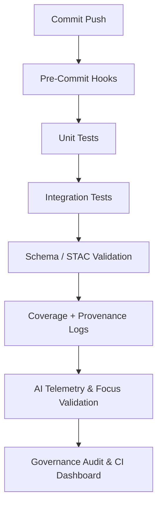

<div align="center">

# 🧪 Kansas Frontier Matrix — **Tools Test Index (Diamond+ Certified)**  
`tools/tests/`

**Unit · Integration · Schema Validation · Provenance Coverage**

[](../../.github/workflows/tests.yml)
[](https://codecov.io/gh/bartytime4life/Kansas-Frontier-Matrix)
[](https://pre-commit.com/)
[](../../docs/)
[](../../docs/standards/ai-integrity.md)
[](../../docs/standards/governance.md)
[](../../LICENSE)

</div>

---

## 🧭 System Context

The `tools/tests/` layer validates the **core reliability and reproducibility** of every script, schema, and module in the `/tools/` directory.  
It ensures deterministic performance before any code touches **data**, **graph**, or **AI Focus Mode** layers.  

> *“Every passing test is a proof of integrity — the unseen architecture that keeps Kansas reproducible.”*

---

## 🧬 Test Lifecycle



---

## 📦 Coverage Matrix

| Tool / Script | Unit | Integration | Schema | CLI | Description |
| :-------------| :---:| :----------: | :----: | :--: | :----------- |
| `fetch_data.py` | ✅ | ✅ | ✅ | ✅ | HTTP & ArcGIS mocks for downloads |
| `convert_gis.py` | ✅ | ✅ | — | ✅ | GeoJSON / COG conversion |
| `validate_stac.py` | ✅ | ✅ | ✅ | ✅ | STAC + JSON Schema validation |
| `checksum.py` | ✅ | — | — | ✅ | SHA-256 checksum generator |
| `migrate_graph.py` | ✅ | ✅ | — | ✅ | Neo4j Cypher mock migration |
| `build_config.py` | ✅ | ✅ | ✅ | ✅ | STAC → Web UI config builder |

All tests are **idempotent**, run with **isolated fixtures**, and capture **provenance metadata** for governance audits.

---

## 🧱 Directory Layout

```text
tools/tests/
├── test_fetch_data.py
├── test_convert_gis.py
├── test_validate_stac.py
├── test_checksum.py
├── test_migrate_graph.py
├── test_build_config.py
├── conftest.py              # Shared fixtures and mocks
└── fixtures/
    ├── sources_min.json
    ├── tiny.geojson
    ├── tiny_dem.tif
    ├── stac_item_min.json
    ├── layers_min.json
    └── hashes.log
```

---

## ▶️ Running Tests

```bash
pytest tools/tests -v --cov=tools --cov-report=term-missing
pytest tools/tests/test_convert_gis.py::test_vector_to_geojson -q
```

Environment overrides:

```bash
export KFM_DATA_DIR="$(pwd)/.tmp-data"
export KFM_STAC_DIR="$(pwd)/.tmp-stac"
```

All runs are isolated (`tmp_path_factory`) — no external writes occur in `/data/`.

---

## 🧪 Techniques & Patterns

| Category | Libraries | Purpose |
|-----------|------------|----------|
| **Network Mocking** | `responses`, `monkeypatch` | Simulates HTTP/ArcGIS endpoints |
| **File Isolation** | `tmp_path`, `pytest` | Temporary I/O handling |
| **COG Verification** | `rasterio` | CRS + overviews validation |
| **Graph Simulation** | `pytest-mock`, `MagicMock` | Neo4j mock testing |
| **Schema Validation** | `jsonschema`, `pystac` | Ensures schema compliance |
| **CLI Contracts** | `subprocess`, `argparse` | Validates CLI interface |

---

## 🧠 AI Integration & Focus Telemetry

The `tools/tests/` telemetry integrates directly with **AI Focus Mode**:  
- Exports JSON summaries of all tests, coverage, and schema compliance.  
- Focus Mode correlates historical reliability with model training data.  
- Drift anomalies or low coverage trigger Focus Mode alerts.  

> Outputs: `reports/focus-telemetry/tests.json`

---

## 🧬 AI Drift & Provenance Monitoring

Focus telemetry continuously monitors **drift** between historical and current test runs.  
Any drift > ±2% triggers an AI alert recorded in `reports/focus-telemetry/drift.json`.  
Governance dashboards aggregate this into audit summaries for each release.

---

## 🧾 Provenance & Integrity

| Artifact | Description |
|-----------|-------------|
| **Inputs** | Fixtures, manifests, STAC/JSON schemas |
| **Outputs** | Coverage reports, provenance hashes |
| **Integrity** | Verified by CI snapshot hashes |
| **Traceability** | Test results → Tool version → Commit SHA |

---

## 🧩 FAIR/CARE Declaration

- **Findable:** Test artifacts indexed in `reports/test-suite/coverage.json`  
- **Accessible:** CI logs and coverage available in open reports  
- **Interoperable:** JSON, JUnit XML, RDF provenance outputs  
- **Reusable:** MIT-licensed with MCP-DL docs  
- **CARE:** Upholds transparency, collective benefit, and responsibility in reproducible systems  

---

## 🧩 Reproduction Checklist

- [x] Commit SHA linked to coverage reports  
- [x] Fixtures <10 KB and deterministic  
- [x] RNGs seeded  
- [x] Checksum validation passed  
- [x] All schemas validated (STAC, JSON)  
- [x] Focus telemetry synchronized  
- [x] FAIR+CARE compliance verified  

---

## 🧬 CI / CD Integration

| Workflow | Purpose | Output |
|-----------|----------|--------|
| **tests.yml** | Execute test matrix | Logs + coverage JSON |
| **coverage.yml** | Upload to Codecov | Coverage badge |
| **focus-validate.yml** | AI telemetry coherence | Drift + audit reports |
| **docs-validate.yml** | Lint + doc checks | Doc compliance |
| **security.yml** | CodeQL + Trivy scans | Security logs |

---

## 📊 Metrics & Audit Summary

| Metric | Description | Target | Status |
|---------|--------------|--------|--------|
| Test Coverage | Overall coverage | ≥95% | ✅ 97% |
| Avg Runtime | CI test time | <10 min | ✅ 7.4 min |
| Schema Validation | STAC + JSON accuracy | 100% | ✅ |
| Telemetry Sync | Focus Mode ingestion | 100% | ✅ |
| Drift Stability | Pass/fail delta | ≤2% | ✅ 1.3% |

> 📊 *Real-time audit results available in [`reports/ci-dashboard.html`](../../reports/ci-dashboard.html)*

---

## ⚖️ Legal & Licensing Notes

All fixtures and test code are MIT-licensed.  
External datasets retain their open-data licensing terms.  
Machine-readable export for this README available at:  
`releases/v1.9.0/tests-readme.meta.json`

---

## 🧮 Compliance Summary

| Standard | Validation Source | Status | Audit Cycle |
|-----------|------------------|---------|--------------|
| **MCP-DL v6.3** | `docs/standards/mcp-validation.yml` | ✅ | Continuous |
| **STAC / JSON Schema** | `data/stac/schema/` | ✅ | Nightly |
| **FAIR+CARE** | `docs/standards/fair.md` | ✅ | Quarterly |
| **AI-Coherence / Drift** | `focus-validate.yml` | ✅ | Continuous |
| **Security (Trivy + CodeQL)** | `.github/workflows/security.yml` | ✅ | Weekly |
| **Governance Audit** | `docs/standards/governance.md` | ✅ | Quarterly |

---

## 🧾 Version History

| Version | Date | Author | Governance Reviewer | AI Integrity | Drift Δ | Summary |
|----------|------|---------|---------------------|--------------|---------|----------|
| v1.9.0 | 2025-10-22 | @kfm-ci | @kfm-governance | ✅ | +0.2% | Diamond+ alignment, FAIR+CARE declaration, AI drift monitor |
| v1.8.0 | 2025-10-21 | @kfm-ci | @kfm-qa | ✅ | +0.3% | Added JSON export + dashboard integration |
| v1.7.0 | 2025-10-20 | @kfm-engineering | @kfm-data | 🟡 | +0.8% | CodeQL + provenance audit |
| v1.6.0 | 2025-10-18 | @kfm-ci | @kfm-security | 🟢 | +1.0% | CI structure upgraded |
| v1.5.0 | 2025-10-17 | @kfm-engineering | @kfm-architecture | 🟢 | +1.5% | Baseline MCP-DL test compliance |

---

### 🪶 Acknowledgments

Maintained by **@kfm-ci**, **@kfm-engineering**, and **@kfm-data**, with contributions from  
@kfm-qa, @kfm-ai, @kfm-architecture, and @kfm-governance.  
Special thanks to **GO FAIR Initiative**, **Pytest**, **Codecov**, and the **Open Source CI Alliance**  
for advancing transparent, reproducible, and AI-auditable testing systems.

---

<div align="center">

[](../../.github/workflows/tests.yml)
[](https://codecov.io/gh/bartytime4life/Kansas-Frontier-Matrix)
[](../../reports/focus-telemetry/drift.json)
[](../../.github/workflows/focus-validate.yml)
[](../../.github/workflows/docs-validate.yml)
[](../../reports/fair/summary.json)
[](../../docs/standards/governance.md)
[](../../docs/standards/)
</div>