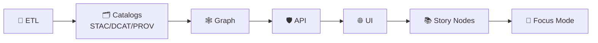

# 🧪 Tests — Kansas Frontier Matrix (KFM) / Kansas‑Matrix‑System


> KFM is a **trust-first** geospatial + knowledge + modeling system.  
> This folder is where we continuously prove that our **code**, **pipelines**, **contracts**, and **UI behaviors** are **correct**, **reproducible**, and **honest about uncertainty**. ✅🧾  
> KFM tests are **architecture-aware** (layers + boundaries) and **catalog-first** (metadata + provenance are first-class artifacts). 🗂️🧬

---

## 🧭 Quick navigation

- 🚀 Run tests now → [Quickstart](#-quickstart)
- 🧩 Subsystem map → [Test matrix](#-kfm-test-matrix-subsystems--what-to-assert)
- 🔒 Merge requirements → [CI gates](#-ci-gates-non-negotiable)
- 🧪 What to test → [Test pyramid](#-test-pyramid-how-we-keep-velocity--confidence)
- 🧾 Contracts (OpenAPI + STAC/DCAT/PROV) → [Contract & metadata tests](#-contract--metadata-tests)
- ✅ Data QA & publish gates → [Data validation gates](#-data-validation-gates-fail-fast)
- 🗺️ GIS correctness → [Geospatial tests](#️-geospatial-tests-gis-correctness)
- 🛰️ Remote sensing → [Remote sensing tests](#️-remote-sensing-tests-earth-engine--imagery)
- 🧠 Modeling/simulation validity → [Scientific validation](#-scientific--simulation-validation)
- 🌐 Frontend & visualization → [Web / frontend guidance](#-web--frontend-test-guidance)
- 🔐 Security + governance → [Security & ethics](#-security-governance--ethics-tests-defensive)
- 🧱 Suggested layout → [Folder layout](#️-suggested-folder-layout)
- 📚 Project library index → [Reference pointers](#-reference-pointers-library-index)

---

## 🚀 Quickstart

### 0) Preconditions (one-time)
- 🐍 Python env ready (`venv`, `conda`, `uv`, etc.)
- 🌐 Node env ready (`npm`, `pnpm`, or `yarn`)
- 🐳 Docker installed (recommended for integration parity)

> [!TIP]
> If your PR touches **DB/API/pipelines/contracts/catalogs**: run at least one Docker-backed integration pass before requesting review.  
> Container parity saves everyone time. 🐳✅

### 1) Fast checks (pre‑commit vibes ⚡)
```bash
# Python (fast)
pytest -q -m "not integration and not e2e and not slow"

# Web (fast — adjust to your repo)
npm test
```

### 2) Full suite (recommended on feature branches ✅)
```bash
# If you have Make targets (recommended)
make test

# Or explicit slices
pytest -q
pytest -q -m integration
npm run test:e2e
```

### 3) Integration tests with containers (preferred 🐳)
```bash
docker compose up -d --build
pytest -q -m integration
docker compose down -v
```

<details>
<summary>🧾 Command cheat sheet (copy/paste)</summary>

```bash
# Contracts only
pytest -q -m contracts

# Geo sanity
pytest -q -m geo

# Remote sensing sanity
pytest -q -m eo

# Validation (scientific V&V)
pytest -q -m validation

# “Surficial ETL” (example of dataset-scoped suite)
pytest -q -k "test_surficial_etl_"
```
</details>

---

## 🧩 KFM test matrix (subsystems + what to assert)

KFM is layered (clean boundaries) and tests should **pin the seams**:

| 🧱 Subsystem | 🎯 What must never break | 🧪 Best test types | 🧰 Typical tools |
|---|---|---|---|
| 🧪 ETL / pipelines | Deterministic outputs, idempotent reruns, schema + CRS correctness | unit ✅ + integration 🔌 + data QA gates ✅ | pytest, GDAL, GeoPandas, validators |
| 🗂️ Catalogs (STAC/DCAT/PROV) | Artifacts exist *before* graph/UI uses them; links resolve; provenance complete | contracts 🧾 + integration 🔌 | JSON Schema, jq, custom validators |
| 🕸️ Knowledge graph (Neo4j) | Graph loads only from catalogs; invariants & constraints hold | integration 🔌 + property tests 🧪 | Neo4j test container, Cypher assertions |
| 🛡️ API (FastAPI + GraphQL) | Contract stability, authz, CORS, deterministic pagination | contracts 🧾 + integration 🔌 | OpenAPI/GraphQL validation, TestClient |
| 🌐 UI (SPA) | Responsive + accessible, stable map behaviors, timeline correctness | unit 🧩 + component 🧱 + e2e 🧭 | Jest/Vitest, Playwright/Cypress |
| 🗺️ Maps / 3D (Mapbox/Cesium/WebGL) | Visual correctness (symbology, overlays), shader stability, perf budgets | visual 🖼️ + e2e 🧭 | screenshot diffs, WebGL harness |
| 📚 Story Nodes | Narrative links match sources; citations are non-broken; time ordering | unit 🧩 + contracts 🧾 | markdown/link validators |
| 🎯 Focus Mode (AI) | Truth-first behavior: citations/provenance, uncertainty, refusal on missing data | eval ✅ + contract-like tests 🧾 | golden prompts, retrieval tests |
| 🔐 Governance | License present, FAIR/CARE checks, auditability | gates ✅ + integration 🔌 | policy validators, CI checks |

---

## 🧠 Core invariant tests must protect

> [!IMPORTANT]
> KFM enforces a **non-negotiable** pipeline order:
>
> **ETL → Catalogs (STAC/DCAT/PROV) → Graph → APIs → UI → Story Nodes → Focus Mode**



### ✅ What tests should enforce (practically)
- 🧪 **ETL is deterministic** (stable IDs/hashes; idempotent reruns; explicit versions)
- 🗂️ **Catalog records exist** (STAC/DCAT/PROV) **before** graph/UI uses them
- 🕸️ **Graph loads only from catalogs** (no ad-hoc inserts in prod paths)
- 🛡️ **API is the only client boundary** (UI never queries graph/DB directly)
- 🔐 **Sensitivity/classification never downgrades silently** (requires audited redaction)
- 🧾 **Provenance is complete** (inputs → activities → outputs with run IDs/configs)
- 🏷️ **License is explicit before publish** (block “publish” if missing)

---

## 🧱 Test pyramid (how we keep velocity + confidence)

Most tests should be cheap and deterministic. Then we add fewer (but higher-value) integration + E2E checks.

```text
          🔺 E2E (few)          → critical user journeys (UI + API + DB)
        🔺🔺 Integration (some)  → services together (DB, API, pipelines)
      🔺🔺🔺 Unit (many)          → pure logic, transforms, validators
```

---

## 🧷 Core test principles (KFM style)

### ✅ Test public behavior, not private plumbing
Prefer testing **public entry points** (functions, use-cases, endpoints, contracts).  
This reduces refactor pain and encourages clean boundaries 🧼🏛️.

### 🔁 Determinism is a feature
For research/AI/simulation code: set seeds, pin dependencies, eliminate hidden state.

**Determinism checklist:**
- [ ] seeds set (Python, NumPy, ML frameworks)
- [ ] stable sorting (don’t rely on hash iteration order)
- [ ] time mocked/frozen where needed
- [ ] no network calls in unit tests (record/replay if unavoidable)
- [ ] fixtures are tiny & versioned (prefer synthetic/toy)
- [ ] floats use tolerances (`pytest.approx`, `np.testing.assert_allclose`)

### 🧾 Trust-first means we test uncertainty too
If outputs are probabilistic / estimated:
- test **ranges**, **invariants**, **calibration**, or **convergence** (not single-point exactness)
- attach uncertainty artifacts on failure (plots, traces, summaries)
- document tolerances + rationale (in code comments or `TEST_POLICY.md`)

### 📎 When a test fails, attach receipts
- upload CI artifacts: logs, diffs, screenshots, JSON snapshots, calibration plots
- make failures actionable (clear “what changed?” + “what to inspect?”)

---

## 🗂️ Suggested folder layout

Adapt as needed, but keep intent obvious:

```text
📦 repo-root/
├─ 🧪 tests/
│  ├─ 📄 README.md                      # you are here 👋
│  ├─ 🧷 fixtures/                      # tiny, deterministic test data only
│  │  ├─ 🗺️ geo/                        # small vectors/rasters (safe + tiny)
│  │  ├─ 🛰️ eo/                         # tiny EO chips / QA bit samples
│  │  ├─ 🖼️ media/                      # tiny images (JPEG/PNG/GIF) + metadata
│  │  ├─ 🧬 ml/                         # toy datasets / tiny model artifacts
│  │  ├─ 🧾 catalogs/                   # STAC/DCAT/PROV fixtures
│  │  ├─ 🧾 schemas/                    # JSON/YAML schemas used in tests
│  │  └─ 📘 FIXTURES.md                 # fixture rules + provenance notes
│  ├─ 🐍 python/
│  │  ├─ 🧩 unit/
│  │  ├─ 🔌 integration/
│  │  ├─ ✅ validation/                 # scientific V&V (tolerance-based)
│  │  ├─ ⏱️ perf/                       # benchmarks (nightly / non-gating)
│  │  ├─ 🔐 security/                   # defensive security checks (SAST-ish)
│  │  ├─ 🧷 helpers/
│  │  └─ 🧱 conftest.py
│  ├─ 🌐 web/
│  │  ├─ 🧩 unit/
│  │  ├─ 🧱 component/
│  │  ├─ 🧭 e2e/
│  │  ├─ 🖼️ visual/
│  │  └─ 🧷 helpers/
│  ├─ 🗄️ db/
│  │  ├─ 🧬 migrations/
│  │  ├─ 🔌 integration/
│  │  └─ 🧪 seed/
│  ├─ 🕸️ graph/
│  │  ├─ 🔌 integration/                # Neo4j containers, constraints, loaders
│  │  └─ 🧩 unit/                       # query builders, mappers
│  ├─ 📜 contracts/
│  │  ├─ 🛡️ api/                        # OpenAPI/GraphQL fixtures
│  │  ├─ 🗺️ stac/                       # STAC contract fixtures
│  │  ├─ 🏷️ dcat/                       # DCAT contract fixtures
│  │  └─ 🧬 prov/                       # PROV contract fixtures
│  ├─ 🧰 tools/                         # helper scripts (validators, runners)
│  └─ 📘 TEST_POLICY.md                 # merge gates + definition of done
└─ 🧰 scripts/                          # optional: CI glue & utilities
```

> [!NOTE]
> If you keep tests alongside code (e.g., `src/**/tests`), that’s fine—just keep **naming + markers** consistent.

---

## 🏷️ Test categories & markers (suggested)

### Python (`pytest`) markers
If you use `pytest`, standardize markers so developers can run focused slices:

```ini
# pytest.ini (example)
[pytest]
markers =
  unit: fast pure logic
  integration: hits db/services/filesystem
  e2e: end-to-end journeys (rare for python)
  slow: long-running tests (non-gating)
  validation: scientific/V&V tests (tolerance-based)
  perf: benchmarks (nightly)
  contracts: OpenAPI + metadata contract validation
  geo: GIS correctness checks
  eo: earth-observation / remote-sensing checks
  graph: graph (Neo4j + algorithms) checks
  security: defensive security checks (no offensive testing)
```

### Web tags
Use your stack’s convention (examples):
- Jest/Vitest: `test`, `test:unit`, `test:component`
- Playwright/Cypress: `test:e2e`
- Visual regression: `test:visual`

---

## 🛡️ CI gates (non-negotiable)

**Policy:** the pipeline must be green before merge. 🤖✅  
CI should mirror the project’s “build → test → publish” discipline and keep logs/artifacts for traceability.

Typical PR gates:
1) 🧹 format + lint (Python + JS/TS)
2) 🧱 build (frontend + backend; container build if applicable)
3) 🧪 unit tests
4) 🔌 integration tests (ephemeral DB/services via Compose)
5) 🧾 contract/schema validation (OpenAPI/GraphQL + STAC/DCAT/PROV where applicable)
6) ✅ data validation gates (schema + CRS + geometry + license + provenance)
7) 🔐 security scans (secrets, deps, container vulnerabilities; defensive posture)
8) 📈 coverage thresholds (target, not a religion)

### 🕛 Nightly / scheduled checks (recommended)
Keep PR CI fast. Push expensive checks to nightly:
- ⏱️ benchmarks (trend monitoring)
- 🧠 longer ML training runs (PRs use toy models)
- 🗺️ large raster workloads (PRs use fixtures & sampling)
- 🧪 deeper graph consistency checks (full graph rebuild + diff)
- 🔐 deeper security scanning (if it slows PR CI)

---

## 🧾 Contract & metadata tests

KFM is **contract-first** and **catalog-first**. Tests must protect:
- 🛡️ **OpenAPI / GraphQL** contracts (breaking changes are explicit + versioned)
- 🗂️ **STAC** (collections/items link validity + required fields)
- 🏷️ **DCAT** (distributions link to STAC/asset access points)
- 🧬 **PROV** (inputs → activities → outputs; run IDs/configs recorded)

### ✅ What to validate
- JSON parses + schema passes
- links resolve (STAC assets exist; DCAT distributions point somewhere real)
- provenance completeness (raw → work → processed trace exists)
- stable IDs/hashes present where required
- time metadata makes sense (monotonic where required; time windows applied correctly)

### Example checks (starter)
```bash
# JSON sanity
find data/stac data/catalog/dcat data/prov -name "*.json*" -print0 | xargs -0 -n 1 jq empty

# pytest contract suite (example)
pytest -q -m contracts
```

---

## ✅ Data validation gates (fail fast)

These gates are your “no-bad-data” firewall 🧱🔥 — especially for GeoParquet + COG pipelines and publish flows.

**Typical gate set (recommended):**
- ✅ Field non-empties: required columns present + non-null
- 🧭 CRS required: input CRS present; output CRS standardized (often EPSG:4326); original CRS recorded for lineage
- 🧱 Geometry valid: non-empty, `make_valid` if allowed, reject post-fix self-intersections if policy demands
- 🧊 Raster sanity: resolution/nodata consistent; alignment rules enforced
- 🧾 Catalog artifacts: STAC/DCAT/PROV emitted + validate
- 🏷️ License present: block publish if missing/ambiguous
- 🔐 Privacy/classification: no downgrades; sensitive outputs redacted/aggregated per policy

**Example CI hooks (pattern):**
```bash
# dataset-scoped tests (example)
pytest -q -k "test_surficial_etl_"

# schema checks (example helper)
python scripts/validate_geoparquet_schema.py

# CRS & geometry validators (example helper)
python scripts/geo/validate_geom.py

# license gate (example)
python scripts/governance/validate_license.py
```

> [!NOTE]
> Prefer deterministic identifiers for dataset rows/features (UUIDv5 or hash-based) so reruns match exactly unless inputs change. 🔁🧬

---

## 🐍 Python test guidance

### 🧩 Unit tests
Best for:
- parsers/validators
- coordinate transforms & unit conversions
- domain rules & invariants
- pure math transforms
- query builders (SQL/Cypher/GraphQL) as pure functions

✅ Tips:
- prefer tolerance-based asserts for floats
- encode invariants (monotonicity, conservation) instead of brittle constants
- include “sad paths” for invalid inputs

### 🔌 Integration tests
Best for:
- PostGIS interactions (spatial joins, buffers, reprojections)
- Neo4j interactions (catalog → graph loaders; constraints)
- API routes (FastAPI) against a test DB
- filesystem/object store adapters
- queue/worker boundaries (smoke-level)

✅ Tips:
- use Compose to create repeatable dependencies
- isolate state via transactions or per-test schemas
- avoid public internet in tests (mock or record/replay)

---

## 🕸️ Graph tests (Neo4j + algorithms)

KFM treats the graph as **derived truth** (built from catalogs + provenance), not a write-anywhere scratchpad.

Test categories:
- 🧾 **Graph build contract**: graph rebuild from catalogs is reproducible
- 🔒 **Constraints**: uniqueness, required properties, relationship rules
- 🧭 **Query invariants**: pagination stable; filters correct; time/space constraints respected
- 🧠 **Algorithm sanity**: small deterministic graphs for spectral/routing/clustering invariants (see “Spectral Geometry” reference)

Examples:
- “Graph contains only entities referenced by STAC/DCAT/PROV”
- “Every published dataset node links to a PROV Activity with run_id + config hash”
- “Small known graph has expected Laplacian spectrum / connectivity properties”

---

## 🛡️ API tests (FastAPI + GraphQL)

What to test:
- 🧾 OpenAPI schema validation (breaking changes must be explicit)
- 🧾 GraphQL schema validation + query shapes
- 🔐 AuthN/AuthZ: role-based access, classification enforcement
- 🧭 Pagination determinism: stable ordering, cursor correctness
- 🌍 Geo correctness: GeoJSON validity; bounding boxes; CRS behavior
- 🌐 CORS headers correct (UI must not need workarounds)

---

## 🌐 Web / frontend test guidance

### 🧱 Component tests (fast)
- render correctness given props/state
- event handling correctness
- accessibility checks (labels, keyboard nav, contrast)

### 📱 Responsive tests (mobile-first)
From CSS/layout perspective: breakpoints should be **tested**, not assumed.
- run component + E2E suites across multiple viewport sizes
- verify map controls remain usable on small screens
- check touch targets + scroll locking behaviors

### 🧭 E2E tests (few but powerful)
Focus on “money paths” 💸:
- auth/login
- load a layer (from catalog)
- timeline navigation (time slider updates map + panels)
- select a feature → details panel updates
- export/report flow (and provenance/metadata attached)

### 🖼️ Visual regression (maps + WebGL)
Maps can regress visually while “still passing logic tests.” Use screenshot diffs where it matters:
- symbology doesn’t silently change
- overlays remain legible at common zoom levels
- dark/light modes keep contrast
- WebGL rendering regressions are caught (tolerance-based diffs)

---

## 🗺️ Geospatial tests (GIS correctness)

Geospatial pipelines are fragile in predictable ways—test these explicitly:

- 🌍 **CRS sanity**: EPSG correctness; meters vs degrees issues
- 🧱 **Topology**: geometry validity, no self-intersections when required
- 🧩 **Overlay correctness**: clip/intersect/union behaviors
- 🧊 **Raster alignment**: resolution, nodata handling, resampling method
- 📦 **Format IO**: GeoJSON/GeoPackage/GeoParquet/COG round-trips
- 🧭 **Scale guardrails** (example): enforce expected map scales; warn on outliers
- 🧮 **Area sanity** (example): union area within tolerance of mask boundary (dataset-specific)

> [!NOTE]
> Always include CRS + units in test names or fixture metadata. It prevents “silent degrees vs meters” disasters. 🥲

---

## 🛰️ Remote sensing tests (Earth Engine & imagery)

Remote sensing workflows fail quietly unless you test assumptions:
- band availability & naming
- scale / resolution
- cloud masking logic (QA bits)
- temporal compositing rules
- index calculations (e.g., NDVI) & expected ranges
- export formats & metadata consistency

Truthiness checks that catch many bugs:
- output range sanity (e.g., NDVI ∈ [-1, 1])
- masked pixel counts within expected bounds
- timestamps monotonic; windows applied correctly

> [!TIP]
> Unit tests should not call live services. Prefer recorded fixtures, mock adapters, or small cached exports.

---

## 🧠 Scientific / simulation validation

Treat simulation/analysis code like **scientific instruments** 🔬:
- **verification**: implementation matches intended math
- **validation**: model matches reality within uncertainty
- **regression baselines**: detect drift across refactors

KFM-style simulation paradigms you may need to validate:
- 🤖 Agent-Based Modeling (ABM) (emergent behavior, distributional properties)
- ⏱️ Discrete-Event Simulation (DES) (queueing, events ordering, reproducibility)
- 🌊 System Dynamics (SD) (stocks/flows, stability, conservation)
- 🗺️ Continuous spatial / hybrid models (PDE-ish, coupled data → model → output)

### ✅ Recommended patterns
- analytical solution comparisons (tiny cases with known answers)
- convergence tests (timestep/resolution refinement reduces error)
- invariant checks (symmetry, conservation, monotonicity)
- tolerance-based golden files (with metadata + tolerances)
- uncertainty reporting checks (intervals, credible bands, PPC)

> [!TIP]
> If results are stochastic, test **properties** (ranges, quantiles, calibration) rather than exact values.

---

## 📊 ML / stats tests (don’t fool yourself)

Data science code needs tests beyond “it runs”:
- split is leak-free (train/val/test)
- metrics stable within tolerance
- baseline comparisons exist (simple model beats random)
- regression diagnostics exist (residuals, leverage, outliers)
- uncertainty reporting present where relevant
- multiple comparisons / p-hacking risks handled (where applicable)

> [!TIP]
> Attach sanity plots as CI artifacts on failure (confusion matrix, residuals, calibration curve). 📎

---

## 🧮 Optimization, topology, and “hard math” modules

If you include:
- generalized topology optimization
- constrained optimization loops
- spectral graph methods / clustering / routing
- high-performance data transforms

Add tests that check:
- invariants (symmetry, conservation, monotonicity)
- convergence behavior (within iteration limits)
- gradient checks (finite-difference sanity, if applicable)
- known micro-benchmarks (tiny, deterministic)
- constraint satisfaction (bounds respected; feasibility maintained)

---

## 🗄️ Database tests (Postgres/PostGIS)

Principles:
- use ephemeral DBs (containers)
- run migrations in CI
- isolate with transactions
- seed minimal fixtures (never production dumps)

Recommended:
- migration tests: upgrade/downgrade + schema assertions
- query tests: correctness + (where critical) index usage checks (`EXPLAIN`)
- contract tests: API responses match schema

---

## 🧰 Data management & interoperability tests

KFM targets interoperability and long-lived data products:
- validate data partitions & deterministic file layouts
- validate storage formats (GeoParquet, COG, Parquet) and metadata parity
- validate federation/export paths (catalog harvesting, API discovery)
- track versioning for datasets/models/configs (DVC or equivalent)

Performance posture (nightly, non-gating):
- regressions in IO throughput
- memory usage ceilings
- “hot path” query latency budgets (API + DB + graph)

---

## 🔐 Security, governance, & ethics tests (defensive)

KFM’s security stance is **defensive**: prevent leaks, enforce policy, keep audit trails.

Test themes:
- 🔐 AuthZ checks: classification boundaries & redaction rules enforced
- 🕵️ Secrets scanning: prevent committed tokens/keys
- 📦 Dependency scanning: vulnerable libraries flagged
- 🐳 Container scanning: base image CVEs flagged
- 🧾 FAIR/CARE governance gates: required metadata, access constraints honored
- 🧬 Auditability: immutable-ish logs/ledgers for publish actions (who/what/when)

> [!IMPORTANT]
> Do **not** add “offensive” testing instructions here. Security tests in this repo are for hardening, verification, and prevention.

---

## 🖼️ Media + imagery tests (maps, scans, exports)

If KFM ingests scanned maps/photos or exports images:
- confirm JPEG/PNG/GIF decode paths are stable
- verify EXIF orientation behavior (if applicable)
- ensure color space/profile handling does not silently shift
- validate tile pyramids / downsampling / resampling correctness
- ensure thumbnails are deterministic (same input → same output)

---

## 📱 Mobile mapping tests (optional but valuable)

If KFM targets mobile:
- offline tile cache behavior
- GPS drift tolerance handling
- touch controls & accessibility
- performance & battery budgets
- low-bandwidth resilience (degraded mode)

---

## ✅ PR checklist (copy/paste)

- [ ] Unit tests added/updated
- [ ] Integration tests added (if behavior crosses boundaries)
- [ ] Determinism confirmed (seeds + stable outputs) if ML/sim
- [ ] Contracts updated + verified (OpenAPI/GraphQL) if API changed
- [ ] Catalog/metadata tests updated (STAC/DCAT/PROV) if data outputs changed
- [ ] Data validation gates updated (schema/CRS/geometry) if ETL changed
- [ ] License + governance checks pass (block publish if missing license)
- [ ] UI changes include component tests + (if visual) snapshot updates
- [ ] CI is green (required)

---

## 🧯 Troubleshooting

### ❌ Tests fail only in CI?
- check lockfiles & pinned versions
- confirm containers match local versions
- eliminate reliance on local paths, locale, timezone, GPU availability

### 🎲 Flaky tests?
- remove sleeps; wait on conditions
- fix randomness (seed)
- mock/record external services

### 🐳 Docker stack won’t start?
```bash
docker compose logs -f
docker compose config
docker compose up -d --build
```

---

## 📚 Reference pointers (library index)

> Keep these in `docs/library/` (or your chosen path) and link them in ADRs / `TEST_POLICY.md` when needed.  
> These project files directly inform KFM’s test posture (V&V, stats rigor, GIS correctness, visualization stability, data governance, security hardening). 🧠🧾

<details>
<summary>🏛️ Architecture, system design, and “how KFM is supposed to work”</summary>

- 📘 `docs/library/Kansas Frontier Matrix (KFM) – Comprehensive Engineering Design.docx`  
- 🧠 `docs/library/Latest Ideas.docx`

</details>

<details>
<summary>🔬 Scientific modeling, simulation V&amp;V, and uncertainty</summary>

- 🔬 `docs/library/Scientific Modeling and Simulation_ A Comprehensive NASA-Grade Guide.pdf`  
- 🧬 `docs/library/Principles of Biological Autonomy - book_9780262381833.pdf`  
- 🧮 `docs/library/Generalized Topology Optimization for Structural Design.pdf`

</details>

<details>
<summary>📊 Statistics, regression, Bayesian, and analysis discipline</summary>

- 📈 `docs/library/regression-analysis-with-python.pdf`  
- 🧾 `docs/library/Regression analysis using Python - slides-linear-regression.pdf`  
- 🧪 `docs/library/Understanding Statistics & Experimental Design.pdf`  
- 🧠 `docs/library/think-bayes-bayesian-statistics-in-python.pdf`  
- 📉 `docs/library/graphical-data-analysis-with-r.pdf`  
- 🤖 `docs/library/Deep Learning for Coders with fastai and PyTorch - Deep.Learning.for.Coders.with.fastai.and.PyTorchpdf`

</details>

<details>
<summary>🗺️ Geospatial, remote sensing, cartography, and mapping UX</summary>

- 🛰️ `docs/library/Cloud-Based Remote Sensing with Google Earth Engine-Fundamentals and Applications.pdf`  
- 🧭 `docs/library/python-geospatial-analysis-cookbook.pdf`  
- 🗺️ `docs/library/making-maps-a-visual-guide-to-map-design-for-gis.pdf`  
- 📱 `docs/library/Mobile Mapping_ Space, Cartography and the Digital - 9789048535217.pdf`

</details>

<details>
<summary>🗄️ Data management, interoperability, and scale</summary>

- 🗃️ `docs/library/PostgreSQL Notes for Professionals - PostgreSQLNotesForProfessionals.pdf`  
- 🧱 `docs/library/Scalable Data Management for Future Hardware.pdf`  
- 🌐 `docs/library/Data Spaces.pdf`  
- 🕸️ `docs/library/Spectral Geometry of Graphs.pdf`

</details>

<details>
<summary>🌐 Web UI, WebGL visualization, and responsive design</summary>

- 📱 `docs/library/responsive-web-design-with-html5-and-css3.pdf`  
- 🧊 `docs/library/webgl-programming-guide-interactive-3d-graphics-programming-with-webgl.pdf`

</details>

<details>
<summary>🛡️ Security, concurrency, law, humanism, and governance</summary>

- 🧯 `docs/library/ethical-hacking-and-countermeasures-secure-network-infrastructures.pdf` *(defensive posture only)*  
- 🛡️ `docs/library/Gray Hat Python - Python Programming for Hackers and Reverse Engineers (2009).pdf` *(defensive awareness only)*  
- ⏱️ `docs/library/concurrent-real-time-and-distributed-programming-in-java-threads-rtsj-and-rmi.pdf`  
- 🧾 `docs/library/On the path to AI Law’s prophecies and the conceptual foundations of the machine learning age.pdf`  
- 🧑‍🤝‍🧑 `docs/library/Introduction to Digital Humanism.pdf`

</details>

<details>
<summary>📚 Language &amp; tooling reference shelves (programming books index)</summary>

- 📚 `docs/library/A programming Books.pdf`  
- 📚 `docs/library/B-C programming Books.pdf`  
- 📚 `docs/library/D-E programming Books.pdf`  
- 📚 `docs/library/F-H programming Books.pdf`  
- 📚 `docs/library/I-L programming Books.pdf`  
- 📚 `docs/library/M-N programming Books.pdf`  
- 📚 `docs/library/O-R programming Books.pdf`  
- 📚 `docs/library/S-T programming Books.pdf`  
- 📚 `docs/library/U-X programming Books.pdf`

</details>

<details>
<summary>🖼️ Media formats (if you ingest scans/images)</summary>

- 🖼️ `docs/library/compressed-image-file-formats-jpeg-png-gif-xbm-bmp.pdf`

</details>

---

## ✨ Small “next improvements” (optional, high ROI)

- Add `make test`, `make test-unit`, `make test-integration`, `make test-e2e`
- Add `make validate-data` (schema + CRS + geom + license + catalogs)
- Upload CI artifacts on failure (coverage HTML, E2E screenshots, diff images, STAC validation logs)
- Add nightly benchmarks for geospatial ops + API latencies (separate from PR gates)
- Add graph rebuild + diff test (catalog → graph) nightly