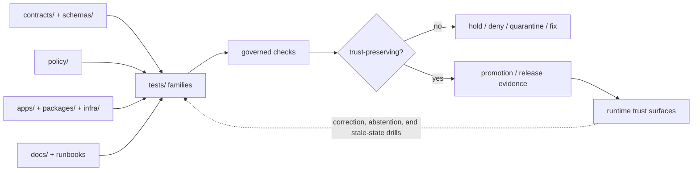

<!-- [KFM_META_BLOCK_V2]
doc_id: kfm://doc/<TODO-tests-readme-uuid>
title: tests
type: standard
version: v1
status: published
owners: @bartytime4life
created: <TODO: verify YYYY-MM-DD>
updated: 2026-03-16
policy_label: public
related: [../README.md, ../CONTRIBUTING.md, ../.github/README.md, ../.github/CODEOWNERS, ../contracts/README.md, ../docs/README.md]
tags: [kfm, tests, verification, readme]
notes: [owner confirmed from .github/CODEOWNERS; doc_id and original created date still need verification]
[/KFM_META_BLOCK_V2] -->

# tests

Governed verification surface for KFM unit, integration, contract, policy, reproducibility, accessibility, and end-to-end confidence work.

> **Status:** experimental  
> **Owners:** `@bartytime4life`  
> **Path:** `tests/README.md`  
> **Repo evidence:** current visible branch confirms `tests/` plus `accessibility/`, `contracts/`, `e2e/`, `integration/`, `policy/`, `reproducibility/`, and `unit/`; directory presence is branch-visible, but executable suite depth still requires direct checkout verification  
> **Quick jump:** [Scope](#scope) · [Repo fit](#repo-fit) · [Accepted inputs](#accepted-inputs) · [Exclusions](#exclusions) · [Current verified snapshot](#current-verified-snapshot) · [Directory tree](#directory-tree) · [Quickstart](#quickstart) · [Usage](#usage) · [Diagram](#diagram) · [Operating tables](#operating-tables) · [Task list](#task-list--definition-of-done) · [FAQ](#faq) · [Appendix](#appendix)


> [!IMPORTANT]
> `tests/` is not a generic QA bucket. In KFM, verification is part of governed publication, runtime trust, and correction discipline. Assets here should prove that contracts validate, policy fails closed, evidence resolves, runtime outcomes stay inspectable, and correction paths remain safer than persuasive overclaiming.

---

## Scope

`tests/` is the repository’s governed verification surface.

In KFM terms, this directory is where branch-visible confidence work gathers around the repo’s real obligations: deterministic local behavior, integration across governed boundaries, contract and schema validation, policy checks, accessibility-critical trust surfaces, reproducibility, and thin-slice end-to-end proof of release, runtime, and correction behavior.

This directory is worth keeping even when uneven. A thin but explicit verification surface is better than an implied one, because KFM treats verification as a first-class operating boundary rather than an afterthought.

[Back to top](#tests)

## Repo fit

**Path:** `tests/README.md`  
**Role in repo:** directory-level guide for governed verification and test-family boundaries

### Upstream anchors

| Direction | Surface | Why it matters |
|---|---|---|
| Upstream | [`../README.md`](../README.md) | Root project contract and top-level repo posture |
| Upstream | [`../CONTRIBUTING.md`](../CONTRIBUTING.md) | Contributor, review, and truth-discipline rules |
| Upstream | [`../.github/README.md`](../.github/README.md) | Repo governance, collaboration, and CI/CD entrypoint |
| Upstream | [`../contracts/README.md`](../contracts/README.md) | Authoritative contract families and machine-readable object layer |
| Upstream | [`../docs/README.md`](../docs/README.md) | Canonical governed documentation index |
| Upstream | [`../.github/CODEOWNERS`](../.github/CODEOWNERS) | Ownership and review boundary for `/tests/` |

### Confirmed downstream surfaces

| Direction | Surface | Current meaning |
|---|---|---|
| Downstream | [`./accessibility/`](./accessibility/) | Accessibility-focused verification family |
| Downstream | [`./contracts/`](./contracts/) | Contract-facing test family |
| Downstream | [`./e2e/`](./e2e/) | End-to-end verification family |
| Downstream | [`./integration/`](./integration/) | Integration-slice verification family |
| Downstream | [`./policy/`](./policy/) | Policy and governance behavior family |
| Downstream | [`./reproducibility/`](./reproducibility/) | Reproducibility and regression family |
| Downstream | [`./unit/`](./unit/) | Deterministic local-behavior family |

### Adjacent responsibility zones

- `../contracts/` and `../schemas/` hold authoritative contract and schema sources.
- `../policy/` holds rule bundles, reason codes, obligation logic, and policy fixtures.
- `../apps/`, `../packages/`, and `../infra/` hold runtime code and operational implementation.
- `../docs/` holds runbooks, standards, ADRs, and explanatory doctrine.
- `../tools/` holds validators, CLIs, support scripts, and verification-adjacent tooling.

> [!NOTE]
> The strongest KFM pattern is: **authoritative source of truth stays in its home; `tests/` proves the home behaves correctly.**

## Accepted inputs

Content that belongs in `tests/` includes:

- unit tests for deterministic local behavior
- integration tests for governed slices across real boundaries
- contract-validation tests for envelopes, examples, and schema drift
- policy tests for allow / deny / abstain / hold behavior
- negative-path tests for evidence failure, citation failure, rights failure, and stale-state handling
- end-to-end release-assembly tests
- runtime-proof suites for `ANSWER`, `ABSTAIN`, `DENY`, and `ERROR`
- correction and supersession drills
- accessibility-critical trust-surface checks
- reproducibility and bounded-regression checks where digests, counts, or stable metrics matter
- thin fixtures that are execution-oriented rather than canonical source examples

## Exclusions

The following do **not** belong here as authoritative source of truth:

- canonical schemas, OpenAPI files, vocabularies, or standards profiles  
  → keep them under `../contracts/` and `../schemas/`

- policy bundle source files, reviewer-role maps, or obligation registries  
  → keep them under `../policy/`

- runtime application code, ingestion workers, evidence resolvers, or UI components  
  → keep them under `../apps/`, `../packages/`, or `../infra/`

- release manifests, receipts, SBOMs, or promoted artifacts  
  → keep them in their designated governed artifact and release paths

- long-form narrative guidance, incident playbooks, or architecture rationale  
  → keep them under `../docs/`

- large raw datasets or branch-local scratch dumps  
  → keep them out of `tests/`; use governed data zones or local ignored paths instead

## Current verified snapshot

The visible branch currently proves the following:

- `tests/` exists as a real top-level repo surface.
- The directory currently contains `accessibility/`, `contracts/`, `e2e/`, `integration/`, `policy/`, `reproducibility/`, `unit/`, and `README.md`.
- `tests/e2e/` currently contains `correction/`, `release_assembly/`, `runtime_proof/`, and `README.md`.
- Several family directories currently expose scaffold README placeholders rather than visible executable suites.

> [!CAUTION]
> Directory presence is **CONFIRMED**. Active suite depth, fixture density, merge-blocking enforcement, and runtime coverage are still **UNKNOWN** or **NEEDS VERIFICATION** until a checked-out branch proves them.

## Status markers used in this README

| Marker | Meaning here |
|---|---|
| **CONFIRMED** | Visible on the current branch or directly grounded in stable KFM doctrine |
| **PROPOSED** | Buildable structure or practice that fits KFM doctrine but is not proven here as active repo reality |
| **UNKNOWN** | Not verified strongly enough to state as current repo fact |
| **NEEDS VERIFICATION** | A path, command, workflow, or implementation detail that should be checked against the checked-out branch before merge |

## Directory tree

### Current confirmed snapshot

```text
tests/
├── README.md
├── accessibility/
│   └── README.md
├── contracts/
│   └── README.md
├── e2e/
│   ├── README.md
│   ├── correction/
│   ├── release_assembly/
│   └── runtime_proof/
├── integration/
│   └── README.md
├── policy/
│   └── README.md
├── reproducibility/
│   └── README.md
└── unit/
    └── README.md
```

### Reading rule

Use the tree above for current branch truth. Do **not** silently convert directory presence into claims of mature, merge-blocking, or end-to-end verified coverage.

### What deeper maturity would look like (`PROPOSED` / `NEEDS VERIFICATION`)

As this surface matures, expect family directories to accumulate executable cases, fixtures, golden examples, invalid samples, and runner-specific config that map directly to repo contracts, policy bundles, runtime boundaries, and correction paths.

[Back to top](#tests)

## Quickstart

### Safe inspection commands

These commands are branch-safe because they inspect what is present without assuming more than the checkout proves.

```bash
# inspect the visible tests surface
find tests -maxdepth 4 -type f | sort

# inspect adjacent contract, schema, policy, and workflow-facing surfaces
find .github contracts docs policy schemas tests -maxdepth 4 -type f 2>/dev/null | sort | sed -n '1,240p'

# inspect likely KFM verification vocabulary without assuming a runner
grep -RIn "EvidenceBundle\|runtime_response_envelope\|audit_ref\|policy_label\|spec_hash" \
  tests contracts policy schemas 2>/dev/null || true
```

### Local review sequence

1. Verify which test families actually contain executable cases rather than scaffold README placeholders.
2. Verify which checks really block merges on the active branch.
3. Verify whether contracts, policies, docs, and tests move together in the same change stream.
4. Verify whether negative paths exist, not only happy-path confirmation.
5. Verify whether runtime evidence, abstention, denial, and correction behavior are exercised end to end.

> [!TIP]
> Prefer repo-native commands discovered from the checked-out branch over README-invented runner commands. Inspection-first is safer than guessing a test toolchain.

## Usage

### What `tests/` is

`tests/` is:

- the repo-facing proof surface for governed behavior
- the place where branch-level confidence work becomes explicit instead of implied
- the home for suites that protect KFM’s trust membrane, truth path, and fail-closed posture
- the directory that should make negative outcomes as inspectable as happy-path success

### What `tests/` is not

`tests/` is **not**:

- a substitute for authoritative schemas or policy bundles
- a place to hide implementation drift behind broad “coverage” language
- a scratch area for one-off local experiments
- a badge generator for CI theater
- a dumping ground for artifacts better owned by `contracts/`, `policy/`, `docs/`, or governed data/release paths

### Where a new test should live

Use the smallest fitting existing family before inventing a new top-level folder:

- choose [`./unit/`](./unit/) when the behavior is local, deterministic, and cheap to isolate
- choose [`./integration/`](./integration/) when a real boundary matters: ingest, resolver, store, API, or projection
- choose [`./contracts/`](./contracts/) when the main risk is schema or envelope drift
- choose [`./policy/`](./policy/) when the change affects allow/deny logic, reason codes, rights, or sensitivity behavior
- choose [`./accessibility/`](./accessibility/) when trust-visible interaction, keyboard flow, or error recovery is the main risk
- choose [`./reproducibility/`](./reproducibility/) when stable digests, counts, or bounded metrics matter
- choose [`./e2e/release_assembly/`](./e2e/release_assembly/) when promotion or publication state is the question
- choose [`./e2e/runtime_proof/`](./e2e/runtime_proof/) when request-time evidence, citations, or answer outcomes are the question
- choose [`./e2e/correction/`](./e2e/correction/) when supersession, rollback, stale visibility, or withdrawal must be exercised

### Working rule for scaffolded families

A present directory is not the same thing as an active suite. If a family currently contains only a placeholder README, treat it as a documented contract boundary waiting for executable proof, not as coverage already earned.

## Diagram


```mermaid
flowchart LR
    C["contracts/ + schemas/"] --> T["tests/ families"]
    P["policy/"] --> T
    R["apps/ + packages/ + infra/"] --> T
    D["docs/ + runbooks"] --> T

    T --> G["governed checks"]
    G --> Q{"trust-preserving?"}

    Q -->|no| F["hold / deny / quarantine / fix"]
    Q -->|yes| E["promotion / release evidence"]

    E --> S["runtime trust surfaces"]
    S -. correction, abstention, and stale-state drills .-> T
```

## Operating tables

### Family map

| Family | Branch-visible today | Current content signal | Intended burden |
|---|---|---|---|
| `unit/` | Yes | README scaffold confirmed | Deterministic local behavior |
| `integration/` | Yes | README scaffold confirmed | Governed slices across real boundaries |
| `contracts/` | Yes | README scaffold confirmed | Envelope, schema, and example validation |
| `policy/` | Yes | README scaffold confirmed | Allow / deny / abstain / hold behavior |
| `accessibility/` | Yes | README scaffold confirmed | Trust-visible accessibility and keyboard-critical flows |
| `reproducibility/` | Yes | README scaffold confirmed | Stable digests, counts, and bounded regression |
| `e2e/` | Yes | Directory plus README confirmed | End-to-end proof surface |
| `e2e/release_assembly/` | Yes | Leaf directory confirmed; leaf contents need verification | Promotion and publish-path proof |
| `e2e/runtime_proof/` | Yes | Leaf directory confirmed; leaf contents need verification | `ANSWER / ABSTAIN / DENY / ERROR` proof |
| `e2e/correction/` | Yes | Leaf directory confirmed; leaf contents need verification | Supersession, stale-state, and rollback drills |

### Change-trigger matrix

| If a PR changes… | Minimum verification expectation |
|---|---|
| contracts / schemas | valid examples, invalid fixtures, version note, and no silent envelope drift |
| policy / governance | allow + deny cases, negative fixtures, rationale alignment, and default-deny still intact |
| dataset onboarding | deterministic manifest/checksum behavior, contract validation, and at least one representative integration slice |
| evidence behavior | `EvidenceRef` / bundle resolution path, negative tests, and policy-safe denials |
| Story / Focus / evidence surfaces | citation visibility, abstention-safe behavior, and audit-path confidence |
| docs describing behavior | linked updates, no contradiction with tests/contracts/policy, and no overclaiming branch reality |
| release / promotion / correction | end-to-end release assembly, rollback or supersession drill, and stale-state handling |

### Negative paths worth proving early

| Negative path | Why it matters |
|---|---|
| citation verification failure | prevents plausible but unsupported output |
| evidence-bundle resolution failure | proves trust is operational, not decorative |
| policy denial for restricted material | enforces fail-closed behavior under ambiguity |
| stale projection warning | prevents quietly outdated derived layers |
| correction / supersession drill | prefers visible correction to confident confusion |
| accessibility failure on trust surface | prevents “verified” behavior that users cannot actually inspect |

## Task list / Definition of done

Treat this README as healthy only when the directory contract stays both readable and truthful.

- [ ] Keep branch-visible structure separate from assumptions about suite depth
- [ ] Keep owners aligned with `../.github/CODEOWNERS`
- [ ] Update this README whenever a test family is added, renamed, removed, or materially repurposed
- [ ] Do not describe a family as active coverage unless the branch actually contains executable cases
- [ ] Prefer negative-path proof for trust-sensitive changes, not just happy-path confirmation
- [ ] Keep `contracts/`, `schemas/`, `policy/`, `docs/`, and `tests/` coherent in the same PR when behavior changes
- [ ] Keep quickstart commands branch-safe; avoid inventing runner commands without checkout proof
- [ ] Preserve calm failure: visible incompleteness is better than theatrical confidence

## FAQ

### Why does `tests/` talk about governed verification instead of generic QA?

Because KFM treats verification as part of publication, runtime trust, and correction discipline. A suite here is valuable only if it helps prove that the system behaves safely, inspectably, and reversibly under both success and failure.

### Why does this README distinguish directory presence from active suites?

Because the visible branch confirms family directories, but several of those directories currently expose scaffold README placeholders. That is enough to document the boundary, but not enough to claim mature executable coverage.

### Should contract examples live in `tests/`?

Usually no. Canonical contract sources belong with the contract layer. `tests/` should consume, wrap, or validate them; it should not quietly replace the authoritative source.

### Do policy checks belong only under `policy/`?

No. Canonical rule bodies belong under `policy/`, but executable proof of governed outcomes can and should live under `tests/policy/` and the end-to-end families as coverage grows.

### Can I add a one-off script here?

Prefer not. Add repeatable, reviewable verification assets that map to an existing family. Keep local scratch work outside the governed test surface.

[Back to top](#tests)

## Appendix

<details>
<summary><strong>Branch-visible evidence and doctrinal overlays used to shape this README</strong></summary>

### Branch-visible repo inputs

- `../README.md`
- `../CONTRIBUTING.md`
- `../.github/README.md`
- `../.github/CODEOWNERS`
- `../contracts/README.md`
- `../docs/README.md`
- current `tests/` tree
- confirmed `tests/e2e/` child directories
- scaffold README placeholders confirmed under several child families

### Doctrinal overlays carried into this directory contract

- verification is cross-cutting, not a late QA appendix
- fail-closed behavior matters as much as happy-path success
- authoritative sources stay in their home directories
- negative outcomes are first-class governed states
- thin-slice end-to-end proof is more valuable than broad speculative coverage
- docs, contracts, policy, tests, and release evidence should move together when behavior changes

</details>
