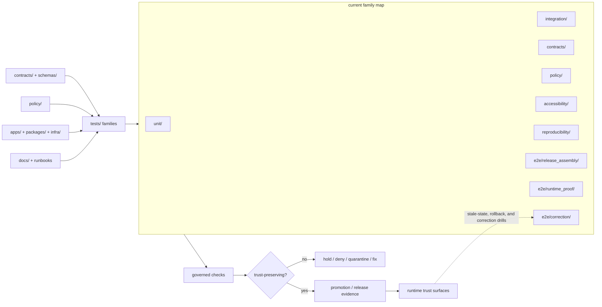

<!-- [KFM_META_BLOCK_V2]
doc_id: kfm://doc/<TODO-tests-readme-uuid>
title: tests
type: standard
version: v1
status: published
owners: @bartytime4life
created: <TODO: verify YYYY-MM-DD>
updated: 2026-03-22
policy_label: public
related: [../README.md, ../CONTRIBUTING.md, ../.github/README.md, ../.github/CODEOWNERS, ../contracts/README.md, ../docs/README.md]
tags: [kfm, tests, verification, readme]
notes: [doc_id and created date still need live-repo verification; owner is confirmed by current CODEOWNERS for /tests/; this revision aligns the README to the current public main-branch tests tree while keeping deeper suite depth and CI gating explicitly bounded]
[/KFM_META_BLOCK_V2] -->

# tests

Governed verification surface for KFM proof objects, trust cues, negative paths, and release/correction drills.

> [!NOTE]
> The meta-block value `status: published` preserves the supplied document-record baseline.
> The impact block below describes the current maturity of the `tests/` surface itself.

> **Status:** experimental  
> **Owners:** `@bartytime4life`  
> **Path:** `tests/README.md`  
> **Repo fit:** directory index for governed verification families, fixtures, drill expectations, and review-facing proof boundaries  
> **Quick jump:** [Scope](#scope) · [Repo fit](#repo-fit) · [Accepted inputs](#accepted-inputs) · [Exclusions](#exclusions) · [Current verified snapshot](#current-verified-snapshot) · [Directory tree](#directory-tree) · [Quickstart](#quickstart) · [Usage](#usage) · [Diagram](#diagram) · [Operating tables](#operating-tables) · [Task list](#task-list--definition-of-done) · [FAQ](#faq) · [Appendix](#appendix)


> [!IMPORTANT]
> `tests/` is not a generic QA bucket.
> In KFM, verification is part of governed publication, runtime trust, and correction discipline.
> A green check that cannot explain **why** a release is trustworthy is still incomplete.

---

## Scope

`tests/` is the repo-facing governed verification surface for Kansas Frontier Matrix.

In KFM terms, this directory gathers the proof burdens that sit closest to day-to-day engineering work: deterministic local behavior, governed boundary checks, contract and schema validation, policy enforcement, accessibility-critical trust surfaces, reproducibility expectations, and end-to-end proof of release, runtime, rollback, and correction behavior.

That is broader than “do the tests pass?” The stronger questions are:

- can the repo prove that contracts fail loudly instead of drifting silently?
- can policy prove `allow`, `deny`, `abstain`, or other guarded outcomes under realistic pressure?
- can runtime behavior stay inspectable when evidence fails, citations fail, or trust state changes?
- can rollback and correction remain visible instead of being polished away?

### Evidence boundary used here

| Evidence layer | What this README treats as settled |
|---|---|
| **CONFIRMED — current public repo** | The public `main` branch exposes `tests/` as a real top-level directory, confirms branch-visible test families, confirms `tests/e2e/` leaf directories, confirms adjacent docs such as `README.md`, `CONTRIBUTING.md`, `.github/README.md`, `contracts/README.md`, `docs/README.md`, and confirms `/tests/` ownership in `.github/CODEOWNERS` |
| **CONFIRMED — March 2026 KFM doctrine** | Verification is trust-bearing, not ornamental; negative tests matter; release proof, rollback, correction, stale visibility, evidence drill-through, and hydrology-first thin-slice proof are all part of the KFM verification model |
| **INFERRED / PROPOSED overlay** | Some manuals use shorthand starter families such as `tests/contract/` or `tests/regression/`; the current repo realizes those burdens with different branch-visible names |
| **NEEDS VERIFICATION** | Exact executable suite depth, actual runner/toolchain, merge-blocking workflow set, screenshot baseline inventory, fixture density, and whether rollback/correction drills have been exercised on the checked-out branch |

> [!CAUTION]
> Directory presence is **not** the same thing as mature coverage.
> This README distinguishes **what is visible on the current branch** from **what KFM doctrine says the verification system must eventually prove**.

### Status markers used here

| Marker | Meaning in this README |
|---|---|
| **CONFIRMED** | Visible on the current public branch or directly grounded in stable KFM doctrine |
| **INFERRED** | Strongly supported by adjacent repo docs or repeated doctrine, but not re-proven from a mounted checkout in this session |
| **PROPOSED** | Buildable structure, practice, or future consolidation that fits KFM doctrine but is not asserted as current repo fact |
| **UNKNOWN** | Not verified strongly enough in this session to state as current repo reality |
| **NEEDS VERIFICATION** | A path, command, workflow, or implementation detail that should be checked against the checked-out branch before merge |

## Repo fit

**Path:** `tests/README.md`  
**Role in repo:** directory-level guide for governed verification families and test-placement boundaries.

### Upstream anchors

| Surface | Why it matters | Status here |
|---|---|---|
| [`../README.md`](../README.md) | root project identity and operating posture | **CONFIRMED** |
| [`../CONTRIBUTING.md`](../CONTRIBUTING.md) | contributor workflow, review discipline, and documentation expectations | **CONFIRMED** |
| [`../.github/README.md`](../.github/README.md) | repo gatehouse for CI/CD, review boundaries, and governance automation | **CONFIRMED** |
| [`../.github/CODEOWNERS`](../.github/CODEOWNERS) | ownership and review boundary for `/tests/` | **CONFIRMED** |
| [`../contracts/README.md`](../contracts/README.md) | authoritative contract-source layer that tests should consume, not replace | **CONFIRMED** |
| [`../docs/README.md`](../docs/README.md) | governed documentation index and runbook surface | **CONFIRMED** |

### Confirmed downstream surfaces

| Surface | Current meaning |
|---|---|
| [`./accessibility/`](./accessibility/) | accessibility-focused verification family |
| [`./contracts/`](./contracts/) | contract-facing test family |
| [`./e2e/`](./e2e/) | end-to-end verification family |
| [`./integration/`](./integration/) | integration-slice verification family |
| [`./policy/`](./policy/) | policy and governance behavior family |
| [`./reproducibility/`](./reproducibility/) | reproducibility and bounded-regression family |
| [`./unit/`](./unit/) | deterministic local-behavior family |
| [`./e2e/correction/`](./e2e/correction/) | correction and supersession drill family |
| [`./e2e/release_assembly/`](./e2e/release_assembly/) | release / promotion / publish-path proof family |
| [`./e2e/runtime_proof/`](./e2e/runtime_proof/) | request-time runtime and outcome-proof family |

### Path reconciliation note

The public repo and the March 2026 manuals are directionally aligned, but not identical in naming.

| Verification burden | Current branch-visible repo path | Manual shorthand seen in doctrine | Working rule |
|---|---|---|---|
| contract validation | `tests/contracts/` | `tests/contract/` | keep the current repo’s plural path until the repo itself changes |
| accessibility trust checks | `tests/accessibility/` | often grouped under broader UI/regression language | keep the explicit top-level accessibility family |
| integration slices | `tests/integration/` | sometimes absorbed into general verification/e2e doctrine | keep the explicit integration family |
| reproducibility / bounded regression | `tests/reproducibility/` | often described as `regression` or reproducibility burden | keep current repo naming and describe the doctrinal burden clearly |
| release proof / runtime proof / correction | `tests/e2e/...` | `tests/e2e/` plus doctrinal drill language | current repo and doctrine are closely aligned here |

> [!TIP]
> Prefer **current repo names** over manual shorthand when writing commit-ready README text.
> Prefer **manual burden language** over folder aesthetics when deciding what a family must prove.

[Back to top](#tests)

## Accepted inputs

Content that belongs in `tests/` includes:

- unit tests for deterministic local behavior
- integration tests for governed slices across real boundaries
- contract-validation tests for envelopes, examples, and schema drift
- policy tests for allow / deny / abstain / hold behavior
- negative-path tests for evidence failure, citation failure, rights failure, and stale-state handling
- end-to-end release-assembly tests
- runtime-proof suites for `ANSWER`, `ABSTAIN`, `DENY`, and `ERROR`
- correction, supersession, withdrawal, and stale-visibility drills
- accessibility-critical trust-surface checks
- reproducibility and bounded-regression checks where digests, counts, or stable metrics matter
- thin fixtures that are execution-oriented rather than canonical source examples

## Exclusions

The following do **not** belong here as authoritative source of truth:

- canonical schemas, OpenAPI files, vocabularies, or standards profiles  
  → keep them under `../contracts/` and related schema surfaces

- policy bundle source files, reviewer-role maps, or obligation registries  
  → keep them under `../policy/`

- runtime application code, ingestion workers, evidence resolvers, or UI components  
  → keep them under `../apps/`, `../packages/`, or `../infra/`

- release manifests, receipts, SBOMs, or promoted artifacts as the **primary** record  
  → keep them in their designated governed artifact and release paths

- long-form narrative guidance, incident playbooks, or architecture rationale  
  → keep them under `../docs/`

- large raw datasets or branch-local scratch dumps  
  → keep them out of `tests/`; use governed data zones or local ignored paths instead

## Current verified snapshot

The current public `main` branch proves the following:

- `tests/` exists as a real top-level repo surface.
- `tests/README.md` exists.
- The branch-visible family set includes `accessibility/`, `contracts/`, `e2e/`, `integration/`, `policy/`, `reproducibility/`, and `unit/`.
- `tests/e2e/` exposes `README.md`, `correction/`, `release_assembly/`, and `runtime_proof/`.
- `/tests/` is assigned to `@bartytime4life` in `.github/CODEOWNERS`.

> [!WARNING]
> What is still **not** proven here:
> exact test runner(s), actual executable case depth inside each family, merge-blocking workflow inventory, screenshot baseline coverage, fixture density, and whether restore / rollback / correction drills have been exercised on a checked-out branch.

## Directory tree

### Current confirmed snapshot

```text
tests/
├── README.md
├── accessibility/
├── contracts/
├── e2e/
│   ├── README.md
│   ├── correction/
│   ├── release_assembly/
│   └── runtime_proof/
├── integration/
├── policy/
├── reproducibility/
└── unit/
```

### Reading rule

Use the tree above for **current branch truth**.

Do **not** silently convert visible directory presence into claims of mature, merge-blocking, or end-to-end verified coverage.

### What deeper maturity would look like (`PROPOSED` / `NEEDS VERIFICATION`)

As this surface matures, family directories should accumulate executable cases, valid and invalid fixtures, golden examples, screenshot baselines, query packs, runner-specific configuration, and archived drill evidence that map directly to repo contracts, policy bundles, runtime boundaries, and correction paths.

[Back to top](#tests)

## Quickstart

### Safe inspection commands

These commands are branch-safe because they inspect what is present without assuming a particular test runner.

```bash
# inspect the visible tests surface
find tests -maxdepth 4 -type d | sort
find tests -maxdepth 4 -type f | sort

# inspect adjacent contract, schema, policy, and workflow-facing surfaces
find .github contracts docs policy schemas tests -maxdepth 4 -type f 2>/dev/null | sort | sed -n '1,240p'

# inspect ownership and governance boundaries
sed -n '1,200p' .github/CODEOWNERS 2>/dev/null || true
sed -n '1,220p' .github/README.md 2>/dev/null || true
sed -n '1,220p' CONTRIBUTING.md 2>/dev/null || true

# inspect end-to-end family placement
find tests/e2e -maxdepth 2 -type d 2>/dev/null | sort

# inspect likely KFM verification vocabulary without assuming a runner
grep -RIn "EvidenceRef\|EvidenceBundle\|RuntimeResponseEnvelope\|CorrectionNotice\|ABSTAIN\|DENY\|ERROR" \
  tests contracts policy schemas docs 2>/dev/null || true
```

### First local review pass

1. Verify which family directories contain executable suites rather than scaffold README placeholders.
2. Verify which checks actually block merges on the active branch.
3. Verify whether contract, policy, docs, and tests move together in the same change stream.
4. Verify whether negative paths exist, not only happy-path confirmation.
5. Verify whether runtime evidence, abstention, denial, stale visibility, and correction behavior are exercised end to end.

> [!TIP]
> Prefer repo-native commands discovered from the checked-out branch over README-invented runner commands.
> Inspection-first is safer than guessing a toolchain.

## Usage

### What `tests/` is

`tests/` is:

- the repo-facing proof surface for governed behavior
- the place where branch-level confidence work becomes explicit instead of implied
- the home for suites that protect KFM’s truth path, trust membrane, and fail-closed posture
- the directory that should make negative outcomes as inspectable as happy-path success

### What `tests/` is not

`tests/` is **not**:

- a substitute for authoritative schemas or policy bundles
- a place to hide implementation drift behind broad “coverage” language
- a scratch area for one-off local experiments
- a badge generator for CI theater
- a dumping ground for artifacts better owned by `contracts/`, `policy/`, `docs/`, or governed data / release paths

### Where a new test should live

Use the smallest fitting existing family before inventing a new top-level folder.

| Family | Place work here when… |
|---|---|
| [`./unit/`](./unit/) | behavior is local, deterministic, and cheap to isolate |
| [`./integration/`](./integration/) | a real boundary matters: ingest, resolver, store, API, or projection |
| [`./contracts/`](./contracts/) | the main risk is schema, envelope, or example drift |
| [`./policy/`](./policy/) | the change affects allow/deny logic, reason codes, rights, or sensitivity behavior |
| [`./accessibility/`](./accessibility/) | trust-visible interaction, keyboard flow, reduced-friction inspection, or calm failure is the main risk |
| [`./reproducibility/`](./reproducibility/) | stable digests, counts, or bounded metrics matter most |
| [`./e2e/release_assembly/`](./e2e/release_assembly/) | promotion, release evidence, or publish-path integrity is the question |
| [`./e2e/runtime_proof/`](./e2e/runtime_proof/) | request-time evidence, citations, or finite answer outcomes are the question |
| [`./e2e/correction/`](./e2e/correction/) | supersession, rollback, stale visibility, withdrawal, or correction propagation must be exercised |

### Working rule for scaffolded families

A present directory is **not** the same thing as an active suite.

If a family currently contains only a placeholder README or thin scaffold, treat it as a documented contract boundary waiting for executable proof, not as coverage already earned.

## Diagram


```mermaid
flowchart LR
    C["contracts/ + schemas/"] --> T["tests/ families"]
    P["policy/"] --> T
    A["apps/ + packages/ + infra/"] --> T
    D["docs/ + runbooks"] --> T

    subgraph F["current family map"]
      U["unit/"]
      I["integration/"]
      K["contracts/"]
      PO["policy/"]
      AX["accessibility/"]
      R["reproducibility/"]
      E["e2e/release_assembly/"]
      RP["e2e/runtime_proof/"]
      CO["e2e/correction/"]
    end

    T --> F
    F --> G["governed checks"]
    G --> Q{"trust-preserving?"}

    Q -->|no| H["hold / deny / quarantine / fix"]
    Q -->|yes| PR["promotion / release evidence"]
    PR --> RT["runtime trust surfaces"]

    RT -. stale-state, rollback, and correction drills .-> CO
```

## Operating tables

### Family map

| Family | Branch-visible now | Primary burden | Doctrinal note |
|---|---|---|---|
| `unit/` | Yes | deterministic local behavior | directly matches manual doctrine |
| `integration/` | Yes | governed slices across real boundaries | current repo keeps this family explicit |
| `contracts/` | Yes | envelope, schema, and example validation | current repo uses plural path; some manuals use singular shorthand |
| `policy/` | Yes | allow / deny / abstain / hold behavior | directly aligns with policy-gate doctrine |
| `accessibility/` | Yes | trust-visible accessibility and keyboard-critical flows | repo keeps this burden explicit instead of hiding it under generic regression language |
| `reproducibility/` | Yes | stable digests, counts, and bounded regression | overlaps with what some manuals describe as regression / rebuild burden |
| `e2e/release_assembly/` | Yes | promotion and publish-path proof | strongly aligned with release-proof doctrine |
| `e2e/runtime_proof/` | Yes | `ANSWER / ABSTAIN / DENY / ERROR` proof | strongly aligned with runtime outcome doctrine |
| `e2e/correction/` | Yes | supersession, stale-state, rollback, and correction drills | strongly aligned with correction lineage doctrine |
| `regression/` | No current branch evidence | doctrinal shorthand for some UI / map / rebuild burdens | keep this as doctrine, not current path claim |

### Change-trigger matrix

| If a PR changes… | Minimum verification expectation |
|---|---|
| contracts / schemas | valid examples, invalid fixtures, version note, and no silent envelope drift |
| policy / governance | allow + deny cases, negative fixtures, rationale alignment, and default-deny still intact |
| source onboarding or transforms | deterministic manifest/checksum behavior, validation checks, and at least one representative integration slice |
| evidence behavior | `EvidenceRef` / bundle resolution path, negative tests, and policy-safe denials |
| Story / Focus / evidence surfaces | citation visibility, abstention-safe behavior, and audit-path confidence |
| docs describing behavior | linked updates, no contradiction with tests / contracts / policy, and no overclaiming branch reality |
| release / promotion / correction | end-to-end release assembly, rollback or supersession drill, and stale-state handling |

### Negative paths worth proving early

| Negative path | Why it matters |
|---|---|
| citation verification failure | prevents plausible but unsupported output |
| evidence-bundle resolution failure | proves trust is operational, not decorative |
| policy denial for restricted material | enforces fail-closed behavior under ambiguity |
| stale projection warning | prevents quietly outdated derived layers |
| correction / supersession drill | prefers visible correction to confident confusion |
| accessibility failure on trust surface | prevents “verified” behavior that users cannot actually inspect |

## Task list / Definition of done

Treat this README as healthy only when the directory contract stays both readable and truthful.

- [ ] Keep branch-visible structure separate from assumptions about suite depth
- [ ] Keep owners aligned with `../.github/CODEOWNERS`
- [ ] Update this README whenever a test family is added, renamed, removed, or materially repurposed
- [ ] Do not describe a family as active coverage unless the branch actually contains executable cases
- [ ] Prefer negative-path proof for trust-sensitive changes, not just happy-path confirmation
- [ ] Keep `contracts/`, `schemas/`, `policy/`, `docs/`, and `tests/` coherent in the same PR when behavior changes
- [ ] Keep quickstart commands branch-safe; avoid inventing runner commands without checkout proof
- [ ] Preserve calm failure: visible incompleteness is better than theatrical confidence

## FAQ

### Why does `tests/` talk about governed verification instead of generic QA?

Because KFM treats verification as part of publication, runtime trust, and correction discipline. A suite here matters only if it helps prove that the system behaves safely, inspectably, and reversibly under both success and failure.

### Why keep the current repo names instead of renaming everything to match the manuals?

Because repo-native truth outranks cleaner theory. The manuals are valuable for burden language, but current public paths such as `tests/contracts/`, `tests/accessibility/`, `tests/integration/`, and `tests/reproducibility/` should not be silently rewritten into something the branch does not use.

### Does the current branch prove merge-blocking coverage?

No. The public tree proves directory presence and ownership boundaries. It does **not** by itself prove runner choice, suite depth, required checks, workflow gating, or exercised rollback / correction history.

### Where should accessibility and reproducibility work live right now?

Under the current explicit families: `tests/accessibility/` and `tests/reproducibility/`. Those names already exist on the public branch and cleanly express two burdens that KFM doctrine cares about.

### Why is hydrology still the preferred first thin slice?

Because KFM’s March 2026 manuals repeatedly treat hydrology as comparatively public-safe while still exercising source descriptors, validation, release evidence, map-first delivery, evidence drill-through, runtime outcomes, and correction / rollback behavior.

[Back to top](#tests)

## Appendix

<details>
<summary><strong>Appendix A — Evidence basis used for this README</strong></summary>

This revision is grounded in two evidence layers:

1. **Current public repo evidence** on `bartytime4life/Kansas-Frontier-Matrix` `main`, including:
   - top-level repo presence of `tests/`, `contracts/`, `docs/`, `.github/`, and contributor-facing root docs
   - the current `tests/` family tree
   - the current `tests/e2e/` leaf family tree
   - current ownership mapping from `.github/CODEOWNERS`

2. **March 20–21, 2026 KFM doctrinal manuals**, especially the layers that sharpen:
   - verification as trust-bearing governance
   - negative-path and fail-closed behavior
   - release proof, rollback, and correction discipline
   - hydrology-first thin-slice rationale
   - the difference between repo reality and target-state manuals

</details>

<details>
<summary><strong>Appendix B — Direct verification still needed before merge</strong></summary>

Before treating this README as fully settled local-checkout documentation, verify:

- the exact contents of each current family directory
- the test runner(s), config files, and invocation surface
- the actual GitHub workflow set and required checks
- screenshot baseline presence, if any
- fixture placement and density
- whether rollback, restore, or correction drills have archived evidence
- whether any future refactor intends to consolidate split families

</details>

<details>
<summary><strong>Appendix C — Reconciliation rule if the checked-out branch differs</strong></summary>

If the checked-out branch later differs from the public tree used here:

1. keep **burden-first** language intact
2. replace path claims with branch-visible paths immediately
3. preserve the distinction between **current repo truth** and **manual shorthand**
4. downgrade anything unsupported by the checked-out branch to **UNKNOWN** or **NEEDS VERIFICATION**

The goal is not to preserve a guessed tree.
The goal is to preserve truthful verification law.

</details>

<details>
<summary><strong>Appendix D — Why this README keeps both repo reality and doctrine visible</strong></summary>

The repo and the March 2026 manuals are aligned on principle:

- verification is cross-cutting
- negative outcomes are first-class
- release, runtime, and correction are one governance story
- proof objects matter

They diverge mainly in **how families are named and split** on disk.
This README keeps both visible so contributors do not have to choose between repo truth and doctrinal clarity.

</details>
