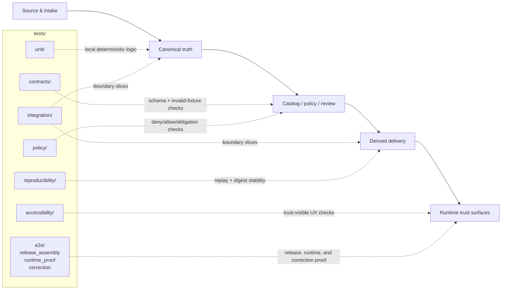

<!-- [KFM_META_BLOCK_V2]
doc_id: kfm://doc/<TODO-tests-readme-uuid>
title: tests
type: standard
version: v1
status: published
owners: @bartytime4life
created: <TODO: verify YYYY-MM-DD>
updated: 2026-03-18
policy_label: public
related: [../README.md, ../CONTRIBUTING.md, ../.github/README.md, ../.github/CODEOWNERS, ../contracts/README.md, ../docs/README.md]
tags: [kfm, tests, verification, readme]
notes: [doc_id and created date still need verification; owner carried forward from the supplied baseline and should be rechecked against .github/CODEOWNERS]
[/KFM_META_BLOCK_V2] -->

# tests

Governed verification surface for KFM proofs, gates, negative paths, and trust-preserving delivery.

> **Status:** experimental  
> **Owners:** `@bartytime4life` *(carried forward from the supplied baseline; recheck against `../.github/CODEOWNERS` before merge)*  
> **Path:** `tests/README.md`  
> **Quick jump:** [Scope](#scope) · [Repo fit](#repo-fit) · [Accepted inputs](#accepted-inputs) · [Exclusions](#exclusions) · [Directory tree](#directory-tree) · [Quickstart](#quickstart) · [Usage](#usage) · [Diagram](#diagram) · [Operating tables](#operating-tables) · [Task list](#task-list--definition-of-done) · [FAQ](#faq) · [Appendix](#appendix)


> [!IMPORTANT]
> `tests/` is not a generic QA bucket. In KFM, verification is part of governed publication, runtime trust, rollback, and correction discipline. The job of this directory is to make trust-preserving behavior explicit, inspectable, and hard to bluff.

---

## Scope

`tests/` is the repo-facing verification surface for KFM.

In KFM terms, this directory should gather the suites, fixtures, and proof-oriented checks that make the canonical path, trust membrane, policy posture, release evidence, and runtime answer behavior real enough to review. That means more than “does the code run?” It means “can the system prove why a value was admitted, promoted, shown, withheld, corrected, or denied?”

A thin but explicit verification surface is better than implied confidence. KFM’s doctrine repeatedly prefers visible incompleteness over persuasive overclaiming, and this README follows that rule.

> [!CAUTION]
> This revision is grounded in the mounted March 2026 KFM manuals **plus the supplied `tests/README.md` baseline**. The current session did **not** expose a live repo checkout, test tree, workflow YAML, manifests, or runtime logs. Exact on-disk directory presence, sibling README files, and merge-blocking enforcement therefore still need direct repo verification before merge.

### Status markers used here

| Marker | Meaning in this README |
|---|---|
| **CONFIRMED** | Grounded in the mounted March 2026 KFM corpus or the supplied target-file baseline text |
| **INFERRED** | Strongly implied by the supplied baseline plus current KFM doctrine, but not directly rechecked in a mounted repo tree |
| **PROPOSED** | Recommended structure, rule, or workflow that fits KFM doctrine but is not proven as mounted implementation |
| **UNKNOWN** | Not established strongly enough in the current session to present as settled repo reality |
| **NEEDS VERIFICATION** | Recheck directly in the working tree, workflow inventory, or runtime evidence before merge |

## Repo fit

**Path:** `tests/README.md`  
**Role:** directory-level guide for governed verification families, proof burdens, and maintenance rules

### Upstream anchors

| Surface | Why it matters |
|---|---|
| [`../README.md`](../README.md) | Root project contract, repo posture, and top-level navigation |
| [`../CONTRIBUTING.md`](../CONTRIBUTING.md) | Contribution and review discipline for behavior-significant change |
| [`../.github/README.md`](../.github/README.md) | Collaboration and CI/CD context for merge-blocking verification |
| [`../.github/CODEOWNERS`](../.github/CODEOWNERS) | Ownership and review boundary for `/tests/` |
| [`../contracts/README.md`](../contracts/README.md) | Authoritative contract and schema-adjacent source layer |
| [`../docs/README.md`](../docs/README.md) | Canonical documentation index and runbook surface |

### Downstream surfaces

| Surface | Intended responsibility | Status in this rewrite |
|---|---|---|
| [`./unit/`](./unit/) | Deterministic local behavior and helper semantics | **INFERRED** from supplied baseline |
| [`./integration/`](./integration/) | Cross-boundary verification slices | **INFERRED** from supplied baseline |
| [`./contracts/`](./contracts/) | Contract schemas, examples, and invalid-fixture checks | **INFERRED** from supplied baseline; doctrine-backed |
| [`./policy/`](./policy/) | Policy bundle, reason/obligation, and role-boundary tests | **INFERRED** from supplied baseline; doctrine-backed |
| [`./accessibility/`](./accessibility/) | Trust-visible accessibility and reduced-motion checks | **INFERRED** from supplied baseline; doctrine-backed |
| [`./reproducibility/`](./reproducibility/) | Deterministic rebuilds, bounded replay, and spec/digest stability | **INFERRED** from supplied baseline; doctrine-backed |
| [`./e2e/`](./e2e/) | End-to-end release, runtime, and correction proof | **INFERRED** from supplied baseline |
| [`./e2e/release_assembly/`](./e2e/release_assembly/) | Promotion, manifest, and proof-pack completeness | **INFERRED** from supplied baseline; explicitly aligned with later KFM target-state docs |
| [`./e2e/runtime_proof/`](./e2e/runtime_proof/) | Citation-negative, EvidenceBundle, and runtime outcome proof | **INFERRED** from supplied baseline; explicitly aligned with later KFM target-state docs |
| [`./e2e/correction/`](./e2e/correction/) | Supersession, withdrawal, rollback, and stale-state propagation | **INFERRED** from supplied baseline; explicitly aligned with later KFM target-state docs |

## Accepted inputs

Content that belongs in `tests/` includes:

- unit tests for deterministic local behavior
- integration tests for governed slices across real boundaries
- contract-validation tests for envelopes, examples, invalid fixtures, and drift
- policy tests for allow, deny, abstain, hold, generalize, and role-boundary behavior
- accessibility-critical trust-surface checks
- reproducibility and bounded-regression checks where spec hashes, digests, or counts matter
- end-to-end proof suites for release assembly, runtime trust, and correction behavior
- thin fixtures that exist to execute or fail a gate
- smoke, canary, stale-state, and rollback drills tied to trust-bearing behavior
- test-side schemas, harness notes, and golden outputs that make governed expectations executable

## Exclusions

The following do **not** belong here as authoritative source-of-truth content:

- canonical contract or schema definitions  
  → keep those under `../contracts/` and related schema surfaces

- primary policy bundle sources, reason registries, reviewer-role maps, or governance registries  
  → keep those under `../policy/`

- runtime application code, workers, resolvers, connectors, or UI components  
  → keep those under app/package/runtime surfaces

- release artifacts, proof packs, manifests, SBOMs, and attestation bundles as primary published records  
  → emit them from their governed lanes and reference them from tests instead of treating `tests/` as the artifact vault

- long-form architecture rationale, ADRs, or operator runbooks  
  → keep those under `../docs/`

- scratch files, one-off local experiments, or unreviewed data dumps  
  → keep them out of the governed verification surface

## Directory tree

> [!NOTE]
> The tree below is the working snapshot carried forward from the supplied baseline. It is useful as a repo-ready contract for the directory, but it still needs direct working-tree confirmation before merge.

```text
tests/
├── README.md
├── accessibility/
│   └── README.md
├── contracts/
│   └── README.md
├── e2e/
│   ├── README.md
│   ├── correction/
│   ├── release_assembly/
│   └── runtime_proof/
├── integration/
│   └── README.md
├── policy/
│   └── README.md
├── reproducibility/
│   └── README.md
└── unit/
    └── README.md
```

This split is not decorative. It separates proof burdens: local logic, boundary slices, contract drift, policy failure, accessibility-critical trust cues, reproducibility, and end-to-end release/runtime/correction proof should not all collapse into one undifferentiated test bucket.

[Back to top](#tests)

## Quickstart

### Safe inventory commands

Use inspection-first commands that reveal what is present without assuming a specific test runner:

```bash
# inventory the visible tests surface
find tests -maxdepth 4 \( -type f -o -type d \) | sort

# inspect adjacent governed surfaces that usually co-change with tests
find tests contracts policy docs .github -maxdepth 4 -type f 2>/dev/null | sort | sed -n '1,240p'

# locate the core proof-object vocabulary across likely verification surfaces
grep -RIn "source_descriptor\|ingest_receipt\|validation_report\|dataset_version\|catalog_closure\|EvidenceBundle\|runtime_response_envelope" \
  tests contracts policy docs .github 2>/dev/null || true

# locate negative-state vocabulary that should stay visible in trust-bearing paths
grep -RIn "ABSTAIN\|DENY\|stale-visible\|withdrawn\|superseded\|correction_notice" \
  tests policy docs 2>/dev/null || true
```

### First verification pass

1. Confirm the actual `tests/` tree and sibling READMEs in the checked-out repo.
2. Confirm which verification jobs are really merge-blocking.
3. Confirm which families contain executable cases versus placeholder README contracts.
4. Confirm whether contracts, policy bundles, examples, and tests move together in the same governed stream.
5. Confirm whether at least one thin slice exercises release, runtime, and correction behavior end to end.

> [!TIP]
> Prefer repo-native evidence over README prose. In KFM, a documented gate that has no mounted fixture, workflow, or proof object should still be treated as **PROPOSED** until the repo proves otherwise.

## Usage

### What `tests/` is

`tests/` is:

- the repo-facing proof surface for governed behavior
- the place where negative outcomes become first-class and testable
- the directory that helps keep derived convenience layers subordinate to authoritative truth
- the seam where contracts, policy, release evidence, runtime trust, and correction expectations become executable

### What `tests/` is not

`tests/` is **not**:

- a substitute for authoritative schemas or policy bundles
- a place to hide implementation uncertainty behind broad “coverage” language
- a dumping ground for artifacts better owned elsewhere
- a detached QA corner whose results do not affect promotion, publication, or rollback
- a place where public-safe behavior may be implied without proof objects

### Where a new test should land

Choose the smallest truthful family before inventing a new top-level folder:

- use [`./unit/`](./unit/) for local, deterministic behavior and pure helper logic
- use [`./integration/`](./integration/) when a real boundary matters: connector, store, resolver, API, or projection build
- use [`./contracts/`](./contracts/) when the core risk is envelope, schema, example, or invalid-fixture drift
- use [`./policy/`](./policy/) when the change affects rights, sensitivity, roles, denial logic, or reason/obligation grammar
- use [`./accessibility/`](./accessibility/) when trust-visible interaction, keyboard flow, or reduced-motion behavior is the main risk
- use [`./reproducibility/`](./reproducibility/) when the burden is stable spec hashes, digests, counts, or bounded replay
- use [`./e2e/release_assembly/`](./e2e/release_assembly/) when the question is promotion, manifest, or proof-pack completeness
- use [`./e2e/runtime_proof/`](./e2e/runtime_proof/) when the question is EvidenceBundle resolution, citation-negative behavior, or `ANSWER / ABSTAIN / DENY / ERROR`
- use [`./e2e/correction/`](./e2e/correction/) when supersession, withdrawal, rollback, or stale-visible propagation must be exercised

### Working rule for scaffolded families

A present directory or placeholder README is not the same thing as active coverage. Treat scaffolded families as documented contract boundaries waiting for executable proof, not as coverage already earned.

## Diagram


```mermaid
flowchart LR
    A["Source & intake"] --> B["Canonical truth"]
    B --> C["Catalog / policy / review"]
    C --> D["Derived delivery"]
    D --> E["Runtime trust surfaces"]

    subgraph T["tests/"]
      U["unit/"]
      I["integration/"]
      CT["contracts/"]
      P["policy/"]
      AX["accessibility/"]
      R["reproducibility/"]
      E2["e2e/\nrelease_assembly\nruntime_proof\ncorrection"]
    end

    U -. local deterministic logic .-> B
    I -. boundary slices .-> B
    I -. boundary slices .-> D
    CT -. schema + invalid-fixture checks .-> C
    P -. deny/allow/obligation checks .-> C
    AX -. trust-visible UX checks .-> E
    R -. replay + digest stability .-> D
    E2 -. release, runtime, and correction proof .-> E
```

## Operating tables

### Family map

| Family | Primary burden | Why it exists in KFM | Current posture in this rewrite |
|---|---|---|---|
| `unit/` | Deterministic local behavior | Keeps helper logic, transforms, and local semantics honest | **INFERRED** from supplied baseline |
| `integration/` | Governed boundary slices | Proves connector, API, resolver, and store behavior across real seams | **INFERRED** from supplied baseline |
| `contracts/` | Schema, example, and invalid-fixture drift | KFM repeatedly treats schema gates and valid/invalid fixtures as merge-blocking proof | **INFERRED** path, doctrine-backed |
| `policy/` | Deny-by-default and decision grammar | KFM requires policy bundles, reason codes, obligation codes, and role-sensitive fail-closed tests | **INFERRED** path, doctrine-backed |
| `accessibility/` | Keyboard, reduced-motion, and trust-visible cues | Evidence Drawer reachability and trust-visible UI cues are part of the product contract | **INFERRED** path, doctrine-backed |
| `reproducibility/` | Spec/digest stability and bounded replay | KFM repeatedly requires reproducibility checks for generated artifacts and released derivatives | **INFERRED** path, doctrine-backed |
| `e2e/release_assembly/` | Release evidence and promotion readiness | Later KFM manuals explicitly propose this path for release proof | **INFERRED** path, doctrine-backed |
| `e2e/runtime_proof/` | Evidence resolution and runtime outcome proof | Later KFM manuals explicitly propose this path for runtime proof | **INFERRED** path, doctrine-backed |
| `e2e/correction/` | Supersession, withdrawal, rollback, stale-visible propagation | Later KFM manuals explicitly propose this path for correction proof | **INFERRED** path, doctrine-backed |

### Change-trigger matrix

| If a PR changes… | Minimum verification expectation |
|---|---|
| contracts or schemas | schema gate, valid and invalid fixtures, representative contract tests, and no silent envelope drift |
| policy bundles or registries | allow and deny cases, reason/obligation grammar checks, role-boundary cases, and fail-closed defaults |
| source onboarding or connector logic | unit + integration coverage, replay checks, deterministic manifests/checksums, and representative policy labeling |
| release or promotion logic | release assembly proof, documentation/runbook alignment, and correction/rollback readiness |
| runtime answering, Focus, or Evidence Drawer behavior | runtime-proof coverage, citation-negative tests, EvidenceBundle drill-through, and visible negative-state handling |
| trust-visible UI behavior | accessibility gate, keyboard path coverage, reduced-motion-safe trust cues, and no hidden bypass around evidence or policy |
| docs that change governed behavior | documentation gate plus agreement across contracts, examples, runbooks, and test expectations |

### Negative-path proofs worth protecting early

| Negative path | Why it matters |
|---|---|
| broken evidence resolution | prevents plausible but unsupported public claims |
| citation-negative runtime response | ensures the system abstains, denies, or errors instead of bluffing support |
| policy denial for restricted or sensitive material | proves fail-closed behavior under ambiguity |
| stale projection visibility | prevents derived layers from silently outranking release truth |
| correction / supersession drill | keeps rollback and correction visible instead of silently overwritten |
| inaccessible trust cue | prevents “verified” behavior that users cannot actually inspect |

## Task list / Definition of done

A healthy `tests/README.md` should make the directory more truthful, not more theatrical.

- [ ] Recheck the live `tests/` tree, sibling README files, and owner metadata in the working repo before merge
- [ ] Keep directory structure claims separate from unverified implementation maturity
- [ ] Do not describe a family as active coverage unless executable cases exist in-tree
- [ ] Keep contracts, policy bundles, fixtures, docs, and tests aligned for behavior-significant change
- [ ] Prefer negative-path proof for trust-sensitive changes, not just happy-path confirmation
- [ ] Preserve trust-visible accessibility under keyboard and reduced-motion paths
- [ ] Maintain at least one correction or rollback drill for any trust-bearing thin slice
- [ ] Update this README when a family is added, renamed, removed, or materially repurposed

## FAQ

### Why does `tests/` talk about governed verification instead of generic QA?

Because KFM treats verification as part of publication, runtime trust, and correction discipline. A suite here matters only if it helps prove that the system behaves safely, inspectably, and reversibly under both success and failure.

### Why are some statements marked **INFERRED** or **NEEDS VERIFICATION**?

Because the current session exposed PDFs only. The March 2026 manuals strongly confirm the doctrine, but they do not by themselves prove the current mounted repo tree, workflow inventory, or runtime coverage.

### Why keep `contracts/`, `policy/`, `accessibility/`, and `reproducibility/` as named verification families?

Because later KFM manuals make those burdens explicit: schemas need valid and invalid fixtures, policy must fail closed, trust-visible surfaces must remain keyboard-usable and reduced-motion safe, and generated artifacts must be reproducible enough to review.

### Should canonical examples live in `tests/`?

Usually not. Canonical schema and policy sources should live with their own authoritative layers. `tests/` should consume them, execute them, or fail them.

### Why is hydrology the preferred first thin slice?

Because the mounted KFM manuals repeatedly treat hydrology as a public-safe, place/time-rich lane that can prove one governed path without forcing immediate escalation into higher-burden sensitive domains.

[Back to top](#tests)

## Appendix

<details>
<summary><strong>Appendix A — Evidence basis used for this README</strong></summary>

This README was shaped primarily by the March 2026 KFM testing, verification, delivery, contract, app-surface, and canonical-manual layers. The strongest project-specific pressure came from:

- the testing and verification reference
- the governed delivery and CI/CD doctrine
- the canonical/reference-manual family
- the contract/schema/policy overlays
- the app-surface and UI/UX doctrine
- the prioritization memo that keeps the first slice small and public-safe

The supplied `tests/README.md` baseline was preserved where it was already strong, then tightened to keep repo reality separate from doctrine-backed recommendation.

</details>

<details>
<summary><strong>Appendix B — Direct verification still needed before merge</strong></summary>

Before treating this README as fully settled repo documentation, verify:

- the live `tests/` tree and sibling README files
- `../.github/CODEOWNERS` ownership for `/tests/`
- which families contain executable suites versus placeholder docs
- actual workflow YAML and required checks that block merge or promotion
- contract and fixture inventory for valid and invalid examples
- sample proof objects, if any, for release, runtime, and correction lanes
- whether the hydrology-first thin slice already exists in part or at all

</details>
