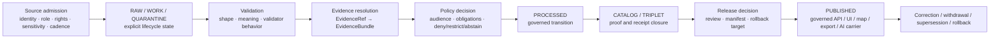

<!-- [KFM_META_BLOCK_V2]
doc_id: kfm://doc/tests-readme
title: tests/ — Canonical Enforceability Root and Mixed-Maturity Test Matrix
type: readme; root-readme; canonical-test-root; enforceability-index; ci-and-fixture-boundary
version: v1.2
status: draft; repository-grounded; canonical-responsibility-root; mixed-maturity; schema-tests-executable; policy-boundary-tests-executable; governed-api-tests-app-owned; maplibre-tests-partial; many-parent-lanes-readme-only; no-single-full-suite-target; no-network-by-default; fail-closed; non-authoritative
owners: OWNER_TBD — QA steward · Test architecture steward · Contract steward · Schema steward · Fixture steward · Validator steward · Policy steward · Evidence steward · Source steward · Pipeline steward · Runtime/API/UI stewards · Release steward · Security and sensitivity reviewers · Domain stewards · CI steward · Docs steward
created: 2026-05-11
updated: 2026-07-16
supersedes: v1.1 refreshed-from-uploaded-markdown edition
policy_label: public-doc; tests; enforceability; trust-spine; fixtures; validators; no-network; fail-closed; evidence-aware; policy-aware; release-gated; correction-aware; rollback-aware; no-parallel-authority; no-publication
current_path: tests/README.md
truth_posture: CONFIRMED target README and prior blob, Directory Rules responsibility-root doctrine, root Python and pytest configuration, exact Makefile test/schema/validation/boundary/API/MapLibre targets, executable schema fixture modules, executable policy boundary modules, executable MapLibre negative tests, app-owned governed-API tests, shared validator runtime and five-entry aggregate, substantive contracts/schema/validator/policy-boundary/API workflow definitions, substantive but conflicted MapLibre performance workflow, staged promotion-gate definition, TODO-only policy/deny/E2E/UI/accessibility workflows, current child README maturity for contracts, cross-domain, domains, E2E, fixtures, invalid, MapLibre, pipelines, policy, release, runtime proof, schemas, source, UI, valid, and validators, and bounded direct-lane inventories recorded by those child READMEs / PROPOSED complete recursive test registry, one canonical full-suite command, explicit lane ownership manifest, nonempty collection and fixture guarantees, stable outcome/reason vocabularies, structured QA artifacts, coverage and mutation thresholds, hermetic browser/runtime harnesses, substantive policy engine tests, release and runtime-proof suites, branch-protection requirements, promotion dependency, and operational rollback drills / CONFLICTED make test labeled full suite while collecting only tests/schemas and tests/contracts; make validate excluding policy boundary, API, MapLibre, E2E, UI, source, release, runtime-proof, and validator-unit lanes; tests/api and tests/runtime_proof ownership versus app-owned governed-API tests; tests/validators ownership versus shared-runtime coverage under tests/schemas and workflow validators; tests/valid and tests/invalid compatibility lanes versus owner-specific assertions; tests/cross_domain surviving path versus doctrine's tests/<topic> form; tests/maplibre versus discussed tests/packages/maplibre placement; no-network doctrine versus external MapLibre workflow dependencies; schema-shape success versus semantic, evidence, policy, release, and public-safety claims; and PolicyDecision versus engine-native outcome vocabulary / UNKNOWN exhaustive recursive test and fixture inventory, dynamic test generation, ignored or generated files, exact collected case count, current repository-wide pass rate, coverage, mutation score, flake rate, branch-protection settings, production parity, complete workflow trigger coverage, emitted governed QA reports, and operational promotion behavior / NEEDS VERIFICATION accepted owners, CODEOWNERS, canonical lane registry, full-suite semantics, fixture-home permanence, cross-domain and package-local placement decisions, policy evaluator binding, accepted runtime envelope profile, reason-code registries, sensitive-fixture review process, artifact retention, workflow ownership, required checks, correction consumers, and rollback execution
evidence_snapshot:
  repository: bartytime4life/Kansas-Frontier-Matrix
  repository_id: "1059091169"
  visibility: public
  base_ref: main
  base_commit: da40c9b4e55b2851556ec19ca57e40af41203a6a
  target_prior_blob: 5614de99433bca29d6a03d665fb4e00ec23eb5fb
  confirmed_direct_test_modules:
    - tests/schemas/test_common_contracts.py
    - tests/schemas/test_hydrology_alias_contracts.py
    - tests/policy/test_control_plane_register_meta_contract.py
    - tests/policy/test_explorer_web_adapter_boundary.py
    - tests/policy/test_pipeline_connector_non_publisher.py
    - tests/maplibre/test_perf_governance_negative_paths.py
  confirmed_direct_test_helpers:
    - tests/policy/boundary_constants.py
    - tests/maplibre/perf_fixture_builder.py
  confirmed_app_owned_companion_tests:
    - apps/governed-api/tests/test_abstain_routes.py
    - apps/governed-api/tests/test_boundary_guards.py
  confirmed_execution_surfaces:
    - Makefile
    - pyproject.toml
    - tools/validators/_common/run_all.py
    - .github/workflows/contracts-validate.yml
    - .github/workflows/schema-validation.yml
    - .github/workflows/validator-suite.yml
    - .github/workflows/policy-boundary-guards.yml
    - .github/workflows/api-test.yml
    - .github/workflows/maplibre-perf-governance.yml
    - .github/workflows/promotion-gate.yml
  bounded_inventory_note: this root README synthesizes commit-pinned child READMEs and individually inspected representative files; it is not an exhaustive recursive listing of historical, ignored, generated, branch-local, dynamically collected, package-local, connector-local, domain-local, external, or uninspected tests
related:
  - ../docs/doctrine/directory-rules.md
  - ../Makefile
  - ../pyproject.toml
  - ./contracts/README.md
  - ./cross_domain/README.md
  - ./domains/README.md
  - ./e2e/README.md
  - ./fixtures/README.md
  - ./invalid/README.md
  - ./maplibre/README.md
  - ./pipelines/README.md
  - ./policy/README.md
  - ./release/README.md
  - ./runtime_proof/README.md
  - ./schemas/README.md
  - ./source/README.md
  - ./ui/README.md
  - ./valid/README.md
  - ./validators/README.md
  - ./schemas/test_common_contracts.py
  - ./schemas/test_hydrology_alias_contracts.py
  - ./policy/test_control_plane_register_meta_contract.py
  - ./policy/test_explorer_web_adapter_boundary.py
  - ./policy/test_pipeline_connector_non_publisher.py
  - ./maplibre/test_perf_governance_negative_paths.py
  - ../apps/governed-api/tests/test_abstain_routes.py
  - ../apps/governed-api/tests/test_boundary_guards.py
  - ../tools/validators/_common/README.md
  - ../tools/validators/_common/run_all.py
  - ../fixtures/README.md
  - ../contracts/README.md
  - ../schemas/README.md
  - ../policy/README.md
  - ../release/README.md
  - ../.github/workflows/contracts-validate.yml
  - ../.github/workflows/schema-validation.yml
  - ../.github/workflows/validator-suite.yml
  - ../.github/workflows/policy-boundary-guards.yml
  - ../.github/workflows/api-test.yml
  - ../.github/workflows/maplibre-perf-governance.yml
  - ../.github/workflows/promotion-gate.yml
tags: [kfm, tests, enforceability, pytest, fixtures, schemas, contracts, validators, policy, source, pipelines, runtime-proof, governed-api, ui, e2e, maplibre, release, no-network, fail-closed, correction, rollback]
notes:
  - "v1.2 replaces blanket implementation uncertainty with a repository-grounded mixed-maturity matrix."
  - "Executable coverage is confirmed for selected schema, policy-boundary, MapLibre, and app-owned governed-API tests; many other parent lanes remain README-only."
  - "make test is executable but narrow: it runs tests/schemas and tests/contracts only. make validate adds the five-entry schema-validator aggregate but still is not a repository-wide full suite."
  - "Workflow names and green states do not expand their actual commands; TODO-only jobs remain scaffolds."
  - "This revision changes documentation only and creates no test, fixture, validator, schema, contract, policy, workflow behavior, application behavior, data, receipt, proof, release record, runtime behavior, or public surface."
[/KFM_META_BLOCK_V2] -->

<a id="top"></a>

# `tests/` — Canonical Enforceability Root and Mixed-Maturity Test Matrix

> **Purpose.** Prove that KFM's trust membrane, lifecycle, evidence, policy, release, correction, rollback, and public-surface boundaries are enforceable. Tests may demonstrate scoped behavior; they never become source authority, semantic truth, schema authority, policy, evidence, release approval, publication, or production truth.

<p>
  
  
  
  
  
  
  
</p>

**Quick navigation:** [Status](#status-and-evidence-boundary) · [Purpose](#purpose-and-audience) · [Authority](#authority-and-directory-rules-basis) · [Inventory](#confirmed-current-inventory) · [Lane matrix](#lane-maturity-and-routing-matrix) · [Trust spine](#trust-spine-and-lifecycle-invariants) · [Test contract](#minimum-test-case-contract) · [Classes](#required-test-classes) · [Fixtures](#fixture-and-test-data-contract) · [Outcomes](#outcome-vocabularies-and-claim-discipline) · [Determinism](#determinism-network-security-and-side-effects) · [Coverage](#coverage-non-vacuity-and-anti-tautology) · [Commands](#current-local-execution-surfaces) · [CI](#workflow-and-ci-maturity) · [Failures](#failure-interpretation) · [Passing](#what-a-passing-check-does-not-prove) · [Review](#review-burden-and-change-control) · [Done](#definition-of-done-for-the-root-test-system) · [Plan](#smallest-sound-improvement-sequence) · [Open](#open-verification-register) · [Evidence](#evidence-ledger) · [Rollback](#documentation-correction-and-rollback)

---

## Status and evidence boundary

> [!IMPORTANT]
> **Snapshot:** `main@da40c9b4e55b2851556ec19ca57e40af41203a6a`<br>
> **Prior target blob:** `5614de99433bca29d6a03d665fb4e00ec23eb5fb`<br>
> **Root posture:** canonical enforceability responsibility<br>
> **Implementation posture:** mixed and partial<br>
> **Canonical full-suite command:** not established<br>
> **Default network posture:** denied unless a separately governed live tier is explicit

The v1.1 README correctly described the doctrine but understated current implementation evidence. The repository now supports a narrower, more precise conclusion:

- selected schema tests execute under `tests/schemas/`;
- selected structural and static policy-boundary tests execute under `tests/policy/`;
- selected scalar MapLibre negative tests execute under `tests/maplibre/`;
- governed-API scaffold tests execute under the application-owned `apps/governed-api/tests/`;
- a shared Draft 2020-12 validator runtime and five-entry aggregate execute under `tools/validators/`;
- several workflows call those surfaces;
- many other root test lanes remain README-only, compatibility-only, TODO-wired, or dependent on adjacent tests rather than direct modules;
- no single command or workflow was established as complete repository-wide test coverage.

### Safe conclusion

`tests/` is the canonical root for authored enforceability proof. It is not yet a unified, coverage-complete test system.

| Question | Current answer | Truth posture |
|---|---|---:|
| Is `tests/` the enforceability root? | Yes. | `CONFIRMED` |
| Is pytest configured at the repository root? | Yes: Python 3.11+, optional pytest, repository root on `pythonpath`. | `CONFIRMED` |
| Are direct executable tests present? | Yes, in selected schema, policy, and MapLibre lanes. | `CONFIRMED` |
| Are application-owned companion tests present? | Yes, under `apps/governed-api/tests/`. | `CONFIRMED` |
| Is `make test` a full suite? | No. It runs `tests/schemas` and `tests/contracts` only. | `CONFIRMED` |
| Is `make validate` a full suite? | No. It runs `make schemas` and the narrow `make test`. | `CONFIRMED` |
| Do all child lanes have executable tests? | No. Many are README-only. | `CONFIRMED` where checked |
| Does every workflow execute substantive checks? | No. Several named test workflows echo TODO commands. | `CONFIRMED` |
| Are exact collection counts, coverage, mutation score, and flake rate known? | No. | `UNKNOWN` |
| Are test checks required by branch protection or promotion? | Not established by inspected files. | `NEEDS VERIFICATION` |
| Does a green check prove release or publication? | No. | `DENY` |

### Truth labels

| Label | Meaning here |
|---|---|
| `CONFIRMED` | Verified from current repository files, executable code, workflow definitions, or commit-pinned child READMEs. |
| `PROPOSED` | A recommended test, command, manifest, metric, workflow, or migration not established as current behavior. |
| `CONFLICTED` | Repository surfaces or vocabularies disagree; this README does not silently select a winner. |
| `UNKNOWN` | Not established by inspected evidence. |
| `NEEDS VERIFICATION` | Checkable, but not sufficiently verified for reliance, promotion, or public claims. |
| `DENY` | A prohibited authority, publication, bypass, or maturity interpretation. |

[Back to top](#top)

---

## Purpose and audience

This README is the root operating contract for maintainers who add, route, review, execute, or interpret KFM tests.

It is written for:

- QA and test architecture stewards;
- contract, schema, fixture, and validator maintainers;
- source, policy, evidence, pipeline, runtime, API, UI, MapLibre, and release stewards;
- domain and cross-domain maintainers;
- security, privacy, sensitivity, sovereignty, and rights reviewers;
- CI and branch-protection maintainers;
- reviewers deciding what a green result actually supports.

The durable question is:

> Can a bounded input move through the tested KFM responsibility boundaries with explicit evidence, policy, lifecycle, release, correction, and rollback posture—without a test, fixture, validator, workflow, UI, map, or generated statement becoming authority?

Tests answer that question for their declared scope. They do not make the tested claim true.

[Back to top](#top)

---

## Authority and Directory Rules basis

Directory Rules place files by primary responsibility, not topic.

```text
tests/                            authored enforceability proof
fixtures/                         reusable deterministic examples
tests/fixtures/                   test-local deterministic examples
contracts/                        semantic meaning
schemas/                          machine-checkable shape
policy/                           admissibility and obligations
tools/validators/                 reusable validator implementation
pipelines/                        executable orchestration
apps/ and packages/               application and reusable implementation
data/                             lifecycle, evidence, receipts, proofs, catalogs
release/                          promotion, correction, withdrawal, rollback
artifacts/                        temporary build and QA outputs
```

The existing path `tests/README.md` is correctly placed. No move, new root, or ADR is required for this update.

### Authority boundary

| Responsibility | Authority home | Role of `tests/` |
|---|---|---|
| Test assertions and test routing | `tests/` | Own authored enforceability checks and test contracts. |
| Reusable fixtures | `fixtures/` | Consume; do not duplicate as a shadow fixture authority. |
| Test-local fixtures | `tests/fixtures/` | Consume within the documented local-fixture split. |
| Semantic meaning | `contracts/` | Assert against; never redefine here. |
| Machine shape | `schemas/` | Validate against; never define here. |
| Policy rules and decisions | `policy/` and accepted decision homes | Exercise; never invent or approve here. |
| Validator code | `tools/validators/` or accepted package roots | Test; never hide production validator behavior inside tests. |
| Pipeline logic | `pipelines/` and packages | Exercise; never implement orchestration here. |
| Runtime, API, UI, and renderer code | accepted app/package roots | Exercise through bounded interfaces. |
| Evidence, receipts, and proofs | governed data/proof roots | Reference synthetic or review-safe support; never store authoritative records here. |
| Release, correction, withdrawal, rollback | `release/` | Test requirements; never decide or publish here. |
| CI definitions | `.github/workflows/` | Invoke tests; workflow names do not expand test scope. |
| Temporary QA artifacts | `artifacts/qa/` or accepted artifact lanes | Emit only when governed and ignored or retained intentionally. |

> [!WARNING]
> `tests/` must not become a second schema, contract, policy, source registry, fixture registry, validator implementation, data store, receipt store, proof store, release system, runtime, application, renderer, or publication root.

[Back to top](#top)

---

## Confirmed current inventory

### Root project and execution surfaces

| Surface | Confirmed behavior | Boundary |
|---|---|---|
| `pyproject.toml` | Python `>=3.11`; `jsonschema>=4.26,<5`; optional `pytest>=9.1.1,<10`; `pythonpath = ["."].` | Configuration does not prove collection or pass state. |
| `make test` | `python -m pytest tests/schemas tests/contracts -q` | Narrow; not a full suite. |
| `make schemas` | `python tools/validators/_common/run_all.py` | Five hard-coded validator entrypoints. |
| `make validate` | Runs `make schemas` then `make test`. | Omits many substantive and planned lanes. |
| `make boundary-guards` | Runs three `tests/policy` modules plus governed-API boundary tests. | Structural/static plus scaffold API behavior. |
| `make boundary-guards-ci` | Same suite with JUnit XML under `artifacts/qa/`. | Artifact is QA output, not proof or release authority. |
| `make governed-api-smoke` | Runs all app-owned governed-API tests. | App scaffold only; not production deployment proof. |
| `make governed-api-verify` | Runs app tests and a non-blocking forbidden-import grep. | The `|| true` grep is informational, not a failing guard. |
| MapLibre Make targets | Run smoke, diff, validator, proof-shaped, manifest, and cleanup tooling. | Separate mixed-maturity chain; not root full-suite coverage. |

### Confirmed direct executable modules

The following files were individually verified. This is a bounded inventory, not a complete recursive count.

| Path | Primary assertion | Current boundary |
|---|---|---|
| `tests/schemas/test_common_contracts.py` | Selected immediate v1 schema families accept valid fixtures and reject invalid fixtures when matching fixture directories exist. | Hard-coded families; fixture-gated; not semantic or policy proof. |
| `tests/schemas/test_hydrology_alias_contracts.py` | Three Hydrology aliases accept one valid fixture and reject an added top-level field. | Narrow alias coverage. |
| `tests/policy/test_control_plane_register_meta_contract.py` | Nine control-plane registers have required metadata, ISO dates, owners, doctrine refs, allowed status, and entries. | Structural metadata only. |
| `tests/policy/test_explorer_web_adapter_boundary.py` | Selected renderer-import and internal-store literal boundaries under Explorer Web. | Static source scan; not rendered UI behavior. |
| `tests/policy/test_pipeline_connector_non_publisher.py` | Selected connector and pipeline write contexts do not target catalog, published, or release paths. | Static lexical scan; not all mutation paths. |
| `tests/maplibre/test_perf_governance_negative_paths.py` | Rejects zero frame budget, negative memory budget, and out-of-range tile error rate. | Three scalar negative checks; not browser or workflow proof. |

### Confirmed test helpers

| Path | Role | Boundary |
|---|---|---|
| `tests/policy/boundary_constants.py` | Shared forbidden internal-store literals for policy and API guards. | Test constant source; not policy authority. |
| `tests/maplibre/perf_fixture_builder.py` | Builds and locally checks a frozen scalar performance fixture. | Test helper; not the MapLibre workflow or schema validator. |

### Confirmed app-owned companion tests

| Path | What it establishes | Why it is not direct `tests/` coverage |
|---|---|---|
| `apps/governed-api/tests/test_abstain_routes.py` | Registered scaffold routes return deterministic `ABSTAIN` responses matching a bounded DecisionEnvelope subset. | Application-owned test location. |
| `apps/governed-api/tests/test_boundary_guards.py` | 404/405 behavior, route manifest, forbidden imports, and internal-store literal boundaries. | Application-owned test location. |

### Confirmed validator execution adjacent to tests

`tools/validators/_common/` contains working code:

```text
local_resolver.py
  -> indexes schemas/contracts/v1/**/*.schema.json by $id

jsonschema_runner.py
  -> creates Draft 2020-12 validators
  -> validates explicit files
  -> supports valid/invalid fixture mode

run_all.py
  -> invokes five hard-coded top-level validator entrypoints
  -> stops on first nonzero result
```

The aggregate includes:

1. `validate_source_descriptor.py`
2. `validate_evidence_bundle.py`
3. `validate_runtime_response_envelope.py`
4. `validate_decision_envelope.py`
5. `validate_run_receipt.py`

This is executable validation, not direct `tests/validators/` unit coverage and not a complete validator inventory.

[Back to top](#top)

---

## Lane maturity and routing matrix

The matrix below reflects current child README evidence. It does not infer executable depth from directory or README presence.

| Lane | Current maturity | Safe conclusion | Preferred next proof |
|---|---|---|---|
| `tests/api/` | README parent plus deny child; direct modules not established | API test taxonomy exists; substantive scaffold tests are app-owned. | Align parent with app-owned tests or add explicit routing/migration contract. |
| `tests/contracts/` | Direct lane README-only; schema-fixture coverage adjacent | Semantic-contract suite not established. | Add direct metadata, meaning, boundary, and cross-root linkage tests. |
| `tests/cross_domain/` | README-only, one surfaced child, placement conflicted | Surviving underscore parent is a routing guard, not proof. | Resolve naming/placement and register children before expansion. |
| `tests/domains/` | Broad README tree; child maturity varies | Domain test organization exists; executable depth is not uniform. | Require each child to publish its direct module, fixture, command, and CI inventory. |
| `tests/e2e/` | README parent and Agriculture child; TODO workflow | No substantive E2E harness or suite established. | Build deterministic governed composition harness. |
| `tests/fixtures/` | Test-local fixture parent; many child READMEs; mixed payload evidence | Fixture split is documented, but inventory and consumers are incomplete. | Add manifests and consumer linkage without duplicating root `fixtures/`. |
| `tests/invalid/` | README-only compatibility lane | Negative tests belong primarily with their responsibility owner. | Retain as routing guard or retire through migration. |
| `tests/maplibre/` | Executable helper plus three scalar negative tests; substantive but conflicted workflow | Partial MapLibre test implementation exists. | Fix hermeticity, trigger paths, schemas, governance validator, and placement. |
| `tests/pipelines/` | README-only; distributed static non-publisher guard | Dedicated pipeline behavior suite not established. | Test lifecycle, idempotency, receipts, partial failure, and non-publisher behavior. |
| `tests/policy/` | Three direct modules plus constants; substantive path-filtered workflow | Structural and static boundary suite exists; policy-engine behavior does not. | Add evaluator, bundle, obligation, rights, sensitivity, and replay tests. |
| `tests/release/` | README-only; adjacent schema and promotion surfaces | Dedicated release-governance suite not established. | Add promotion, correction, withdrawal, supersession, and rollback cases. |
| `tests/runtime_proof/` | README-only root; adjacent validators and app tests; profile conflict | Partial scaffold proof exists outside the root; proof is not closed. | Resolve envelope profile and domain placement, then add composed proof cases. |
| `tests/schemas/` | Two executable pytest modules; partial coverage | Selected machine-shape and alias behavior is proven. | Add complete discovery, nonempty polarity, metaschema, `$id`, `$ref`, and coverage manifest checks. |
| `tests/source/` | README-only compatibility lane; descriptor validator and fixture coverage adjacent | SourceDescriptor shape is checked; source-governance behavior is not complete. | Add role, rights, sensitivity, cadence, citation, activation, and registry tests. |
| `tests/ui/` | README-only; static Explorer boundary guard elsewhere; TODO UI/a11y workflows | No component, browser, accessibility, or visual suite established. | Add governed payload rendering, keyboard, ARIA, leakage, correction, and rollback tests. |
| `tests/valid/` | README-only compatibility lane | Positive assertions belong with their gate owner. | Retain as routing guard or retire through migration. |
| `tests/validators/` | README-only direct lane; working shared runtime and aggregate adjacent | Validator mechanics execute, but dedicated unit and entrypoint contract tests are absent. | Add resolver, runner, CLI, fixture polarity, exit-code, diagnostics, and aggregate completeness tests. |

### Cross-cutting routing law

Route a test by the primary assertion:

| Primary assertion | Preferred owner |
|---|---|
| Machine shape and schema references | `tests/schemas/` |
| Semantic contract meaning and boundary | `tests/contracts/` |
| Policy, obligation, rights, sensitivity, access | `tests/policy/` |
| Validator mechanics or entrypoint behavior | `tests/validators/` |
| Source admission and source-role discipline | `tests/source/` or owning domain/connector lane |
| Pipeline transformation and lifecycle behavior | `tests/pipelines/` or owning package/domain tests |
| Governed API route/envelope behavior | `tests/api/` or application-owned tests with explicit routing |
| Runtime finite-outcome composition | `tests/runtime_proof/` or app tests under an accepted profile |
| UI trust-state rendering and interaction | `tests/ui/` or package/app-local tests with explicit routing |
| MapLibre renderer/performance boundary | `tests/maplibre/` pending placement resolution |
| Release, correction, withdrawal, rollback | `tests/release/` |
| Domain-owned behavior | `tests/domains/<domain>/` |
| Genuinely cross-domain composition | governed cross-domain lane after placement review |
| End-to-end composed request path | `tests/e2e/<owner>/` |
| Generic “valid” or “invalid” classification | Route to the owner above; compatibility lanes are not default homes |

[Back to top](#top)

---

## Trust spine and lifecycle invariants

Every consequential test should declare which segment of the trust spine it exercises.


```mermaid
flowchart LR
  A["Source admission<br/>identity · role · rights · sensitivity · cadence"] -->
  B["RAW / WORK / QUARANTINE<br/>explicit lifecycle state"] -->
  C["Validation<br/>shape · meaning · validator behavior"] -->
  D["Evidence resolution<br/>EvidenceRef → EvidenceBundle"] -->
  E["Policy decision<br/>audience · obligations · deny/restrict/abstain"] -->
  F["PROCESSED<br/>governed transition"] -->
  G["CATALOG / TRIPLET<br/>proof and receipt closure"] -->
  H["Release decision<br/>review · manifest · rollback target"] -->
  I["PUBLISHED<br/>governed API / UI / map / export / AI carrier"] -->
  J["Correction / withdrawal / supersession / rollback"]
```

### Lifecycle invariant

```text
RAW -> WORK / QUARANTINE -> PROCESSED -> CATALOG / TRIPLET -> PUBLISHED
```

Promotion is a governed state transition, not a file move.

### Required invariants

1. **No public/internal-store bypass.** Standard public clients use governed interfaces, not RAW, WORK, QUARANTINE, candidate, canonical, or internal stores.
2. **No source-role upgrade.** Ingest, normalization, joining, map rendering, AI summary, cataloging, and release do not silently increase source authority.
3. **Cite or abstain.** Evidence-dependent claims resolve support or narrow/abstain.
4. **Policy before exposure.** Rights, sensitivity, sovereignty, consent, living-person, infrastructure, archaeology, species, and location risks fail closed.
5. **Tests are not release.** Test success cannot create a PromotionDecision, ReleaseManifest, CorrectionNotice, WithdrawalNotice, or RollbackCard.
6. **Generated output is subordinate.** Model text, screenshots, tiles, graphs, indexes, summaries, and reports do not become truth because a test accepts them.
7. **Correction remains reachable.** Consequential paths preserve correction, invalidation, supersession, withdrawal, and rollback targets.
8. **Sensitive values do not leak.** Failures, snapshots, logs, JUnit XML, artifacts, and diagnostics remain public-safe for the declared review class.

[Back to top](#top)

---

## Minimum test case contract

Every new consequential test should make its support and limits inspectable.

```yaml
test_id: kfm.test.<owner>.<behavior>
owner:
  responsibility_root: tests
  lane: tests/<lane>
  steward: OWNER_TBD

system_under_test:
  implementation_refs:
    - path/to/code
  contract_refs:
    - contracts/...
  schema_refs:
    - schemas/...
  policy_refs:
    - policy/...
  validator_refs:
    - tools/validators/...

case:
  purpose: one bounded assertion
  preconditions: []
  fixture_refs: []
  fixture_class: valid | invalid | deny | restrict | abstain | error | correction | rollback
  expected_test_result: pass
  expected_system_outcome: optional and vocabulary-qualified
  negative_or_positive_companion: kfm.test....
  deterministic: true
  network: denied
  filesystem:
    writes: temporary-only
    canonical_store_mutation: denied
  sensitivity:
    class: public-safe-synthetic
    exact_sensitive_values: denied
  evidence_posture: synthetic-ref | resolved-test-bundle | not-applicable
  policy_posture: exercised | mocked-explicitly | not-applicable
  release_posture: unreleased-test-only
  correction_ref: optional
  rollback_ref: optional

claim_limit:
  proves: named gates only
  does_not_prove:
    - truth
    - source authority
    - production parity
    - release approval
    - publication
```

### Required fields in prose or metadata

A test does not need to serialize the YAML above, but it must make these facts reviewable:

- owner and placement rationale;
- system under test;
- contract, schema, policy, and validator bindings;
- fixture source and expected class;
- expected test-framework result;
- expected system outcome, if any;
- companion positive or negative control;
- network and filesystem posture;
- sensitive-data handling;
- evidence and release limits;
- correction and rollback relevance;
- deterministic inputs and clocks;
- what the test explicitly does not prove.

[Back to top](#top)

---

## Required test classes

### Foundation

| Class | Required assertion |
|---|---|
| Schema conformance | Supported shape passes; unsupported shape fails; coverage cannot disappear silently. |
| Contract semantics | Meaning, exclusions, maturity, and responsibility boundaries remain explicit. |
| Validator mechanics | Registry, resolver, CLI, exit codes, diagnostics, fixture polarity, and side effects behave predictably. |
| Fixture integrity | Expected classes are present, nonempty where required, public-safe, and linked to consumers. |
| Identity and time | Deterministic identity and distinct time kinds remain explicit where material. |

### Governance

| Class | Required assertion |
|---|---|
| Source admission | Identity, role, rights, sensitivity, cadence, citation, and activation fail closed. |
| Evidence resolution | EvidenceRef resolves to adequate bounded support or the result narrows/abstains. |
| Policy behavior | Inputs, outcomes, obligations, reason codes, versions, digests, and replay are enforceable. |
| Lifecycle transition | No phase is skipped and no public path reads pre-PUBLISHED state. |
| Receipt and proof | Records match what ran and remain distinct from evidence and release authority. |
| Release governance | Promotion, correction, withdrawal, supersession, and rollback require explicit support and review. |

### Public and runtime surfaces

| Class | Required assertion |
|---|---|
| Governed API | Routes, methods, envelopes, access, evidence, policy, release, and leakage boundaries hold. |
| Runtime proof | Finite outcomes compose from evidence, policy, freshness, and release state under an accepted profile. |
| UI trust state | Evidence, caveats, denial, correction, rollback, time, and accessibility remain visible. |
| Map and renderer | Renderer code consumes governed public-safe artifacts and preserves sensitivity/release boundaries. |
| End-to-end | A complete request path composes lower-level gates without bypass. |
| AI boundary | Generated language remains subordinate to resolved evidence and policy; unsupported claims abstain. |

### Reliability and reversibility

| Class | Required assertion |
|---|---|
| No-network default | Default suite fails on undeclared outbound access. |
| Idempotency and replay | Repeated runs with fixed inputs produce equivalent results and no duplicate authority objects. |
| Partial failure | Interrupted or failed runs leave no silent promotion or canonical mutation. |
| Correction propagation | Corrected/withdrawn support invalidates dependent carriers where required. |
| Rollback drill | Governed rollback targets are testable without treating the drill as an actual release action. |
| Non-regression | Stable IDs, aliases, lineage, compatibility windows, and public behavior are intentionally preserved or migrated. |

[Back to top](#top)

---

## Fixture and test-data contract

KFM currently documents two fixture homes with a strict responsibility split.

| Home | Intended use | Guardrail |
|---|---|---|
| `fixtures/` | Reusable, cross-cutting, deterministic examples shared across tests, validators, and pipelines. | Canonical reusable fixture responsibility; not source or lifecycle data. |
| `tests/fixtures/` | Small fixtures local to a test area. | Must not become a competing reusable fixture authority. |

### Schema fixture convention

The confirmed generic schema harness derives cases from:

```text
schemas/contracts/v1/<family>/<name>.schema.json
fixtures/contracts/v1/<family>/<name>/
├── valid/
│   └── valid_*.json
└── invalid/
    ├── invalid_*.json
    └── invalid_*.expected_error.txt
```

Current discovery is limited to immediate schemas in seven hard-coded families and only creates cases when the matching fixture directory exists.

### Required fixture classes

| Class | Purpose |
|---|---|
| `valid` | One supported path succeeds at named gates. |
| `invalid` | Malformed or unsupported shape/meaning fails. |
| `deny` | Policy or access refusal remains explicit and non-leaking. |
| `restrict` / `redact` | Public-safe transform or staged access is enforced. |
| `abstain` / `hold` | Insufficient evidence, review, freshness, or policy closure does not invent an answer. |
| `error` | Harness, dependency, config, or runtime failure remains bounded. |
| `stale` / `superseded` / `withdrawn` | Temporal and release-state invalidation works. |
| `correction` | Correction linkage and dependent invalidation are testable. |
| `rollback` | Reversal target and rollback prerequisites remain inspectable. |

### Nonempty and polarity rules

A fixture-backed suite should fail when:

- the required valid set is empty;
- the required invalid set is empty;
- the test discovers zero schemas or zero target files unexpectedly;
- an invalid fixture passes;
- a valid fixture fails;
- expected error assertions are absent for a consequential invalid case;
- a fixture path is renamed without consumer updates;
- a README describes payloads that are not present;
- a sensitive fixture lacks review-safe transformation.

### Sensitive-fixture safeguards

Never commit real:

- exact protected species locations;
- archaeology-sensitive coordinates;
- living-person identifiers;
- DNA or genomic material;
- private genealogy or consent data;
- critical infrastructure detail;
- private land/ownership records beyond synthetic form;
- secrets, credentials, private endpoints, or production logs.

Use synthetic, generalized, aggregated, redacted, withheld, or denied examples. Record why the transform is sufficient for the test.

[Back to top](#top)

---

## Outcome vocabularies and claim discipline

Do not collapse different result systems.

| Layer | Example vocabulary | Meaning |
|---|---|---|
| Test framework | passed, failed, skipped, error, xfail | Did the assertion execute as expected? |
| Process/CLI | exit `0`, nonzero, current validator `2` for no files | Did the command complete under its process contract? |
| Schema validator | valid, invalid, harness/config error | Did the instance conform to the configured schema? |
| Runtime envelope | `ANSWER`, `ABSTAIN`, `DENY`, `ERROR` | What bounded runtime outcome is returned? |
| Policy engine/design | `ALLOW`, `RESTRICT`, `HOLD`, `DENY`, `ABSTAIN`, or project-specific profile | What use is permitted and with which obligations? |
| Lifecycle | RAW, WORK, QUARANTINE, PROCESSED, CATALOG, TRIPLET, PUBLISHED | What governed state is the material in? |
| Release | candidate, reviewed, promoted, held, withdrawn, superseded, rolled back | What is the governed release state? |

The repository currently contains vocabulary tension between the canonical-candidate PolicyDecision schema and engine-native policy terminology. Tests must name the profile they exercise; they must not normalize conflicting vocabularies silently.

### Claim ladder

A green assertion may support only the narrowest applicable statement:

```text
test executed
  -> named assertion passed
  -> configured gate behaved as expected
  -> bounded workflow step may rely on that result
  -> broader trust-spine reliance requires all declared dependencies
  -> release still requires governed promotion
```

Forbidden upgrades:

```text
schema valid -> semantically true
fixture accepted -> source admitted
validator pass -> evidence closed
policy-shaped object -> policy approved
workflow green -> full suite green
test green -> production parity
CI green -> release approved
rendered output -> published truth
```

[Back to top](#top)

---

## Determinism, network, security, and side effects

### Default posture

All default tests should be:

- deterministic;
- local;
- no-network;
- synthetic or public-safe;
- time-controlled;
- locale-controlled where relevant;
- side-effect bounded;
- repeatable;
- safe to run from a clean checkout;
- explicit about temporary artifacts.

### Network contract

Default tests must not call:

- source APIs or live feeds;
- geocoders or map services;
- tile, style, sprite, glyph, or CDN endpoints;
- policy services;
- model runtimes;
- external databases;
- public release services;
- private endpoints.

A live tier must be separately named, opt-in, credential-scoped, non-default, rate-aware, and excluded from ordinary PR gates unless explicitly governed.

### Filesystem contract

Tests may write only to:

- pytest-provided temporary directories;
- explicitly declared temporary artifact roots;
- accepted ignored QA locations such as `artifacts/qa/` when the workflow owns cleanup and retention.

Tests must not mutate:

- canonical contracts, schemas, policies, or registries;
- RAW, WORK, QUARANTINE, PROCESSED, CATALOG, TRIPLET, or PUBLISHED stores;
- release records;
- production configuration;
- committed fixture baselines without an explicit update action.

### Security assertions

Consequential suites should test:

- path traversal and symlink boundaries;
- absolute-path and repository-root escape attempts;
- malformed JSON/YAML and oversized payloads;
- recursion and resource limits;
- secret and token leakage in logs;
- private path leakage in error messages;
- subprocess argument safety;
- temporary-file cleanup;
- sensitive geometry reconstruction risk;
- no-publication side effects;
- cancellation and interrupted-run cleanup.

[Back to top](#top)

---

## Coverage, non-vacuity, and anti-tautology

A green result is unacceptable when nothing meaningful ran.

### Required non-vacuity controls

| Risk | Required control |
|---|---|
| Zero tests collected | Assert an expected minimum or explicit manifest count. |
| Fixture-gated discovery silently disappears | Require expected schema/fixture bindings and nonempty polarity. |
| Static scan sees no target files | Fail unless an explicit empty-target state is approved. |
| Workflow only echoes TODO | Mark scaffold; do not report substantive test success. |
| Path filter misses authoritative dependency | Test trigger manifest and update filters atomically. |
| Negative test has no positive control | Pair with a known-safe case proving the detector can distinguish states. |
| Positive test has no negative companion | Add a case proving the gate is not unconditional. |
| Validator aggregate omits executable entrypoint | Compare aggregate membership to an accepted manifest. |
| Expected invalid fixture prints generic `FAIL` | Distinguish expected rejection from harness failure in structured results. |
| `|| true` masks a guard | Treat as informational unless a separate failing assertion exists. |
| Skips/xfails increase silently | Report and gate unexplained changes. |
| Snapshot changes are auto-accepted | Require human-reviewed update reason and source fixture linkage. |

### Root coverage model

A future root coverage artifact should report:

```text
lane
  -> direct test modules
  -> collected cases
  -> fixture families and polarity
  -> implementation bindings
  -> contract/schema/policy bindings
  -> workflow callers and triggers
  -> pass/fail/skip/xfail counts
  -> coverage and mutation metrics where meaningful
  -> artifacts emitted
  -> promotion significance
  -> unresolved gaps
```

No such complete governed artifact was established in the inspected snapshot.

[Back to top](#top)

---

## Current local execution surfaces

### Confirmed commands

```bash
# Narrow direct pytest target: selected schema tests plus the tests/contracts path.
make test

# Equivalent current command.
python -m pytest tests/schemas tests/contracts -q

# Five hard-coded top-level schema validator entrypoints.
make schemas

# Current aggregate of make schemas followed by the narrow make test.
make validate

# Structural/static policy and governed-API boundary suite.
make boundary-guards

# Same boundary suite with JUnit XML at artifacts/qa/policy-boundary-guards.xml.
make boundary-guards-ci

# App-owned governed-API tests.
make governed-api-smoke

# App tests plus an informational, non-blocking forbidden-import grep.
make governed-api-verify

# Confirmed direct MapLibre scalar negative tests.
python -m pytest tests/maplibre/test_perf_governance_negative_paths.py -q
```

### Important command limits

| Command | What it currently omits |
|---|---|
| `make test` | Direct policy tests, app-owned API tests, MapLibre tests, E2E, UI, pipelines, source behavior, release behavior, runtime-proof composition, validator-unit tests, most domain suites. |
| `make schemas` | Validators outside the five-entry hard-coded aggregate and direct pytest schema modules. |
| `make validate` | Everything omitted by both commands above. |
| `make boundary-guards` | Policy engine behavior, obligations, full source/lifecycle/release behavior, rendered UI, browser runtime, and exhaustive mutation boundaries. |
| `make governed-api-smoke` | Root tests and production deployment behavior. |
| MapLibre commands | Root Python suite and hermeticity guarantees. |

### Proposed, not canonical

```bash
# PROPOSED until collection, runtime, and ownership are verified.
python -m pytest tests -q
```

Even if this command collects successfully, it would not automatically include app-owned tests, Node/browser workflows, validator scripts, or external package-local suites. A future full-suite command must declare those boundaries rather than rely on filesystem accident.

[Back to top](#top)

---

## Workflow and CI maturity

### Substantive workflow definitions

| Workflow | Current command path | Current scope |
|---|---|---|
| `contracts-validate` | installs `.[test]`; runs `make test` | Narrow schema pytest coverage plus `tests/contracts` path. |
| `schema-validation` | installs root project; runs `make schemas` | Five-entry validator aggregate. |
| `validator-suite` | runs `make schemas`; separately rejects one invalid EvidenceBundle fixture | Aggregate plus one explicit fail-closed canary. |
| `policy-boundary-guards` | path-filtered; runs `make boundary-guards-ci`; uploads JUnit | Three policy modules plus app-owned API boundary module. |
| `api-test` | runs `make governed-api-smoke`; separately runs abstain-route test | Governed-API scaffold and envelope subset. |
| `MapLibre Perf Governance` | Node/browser smoke, visual diff, validators, proof-shaped builders, uploads | Substantive but currently conflicted and not closed proof. |
| `promotion-gate` | doctrine prerequisite, doctrine schema, promotion validator, Hydrology promote step | Staged promotion workflow; required-check and operational readiness remain unverified. |

### TODO-only workflow definitions

| Workflow | Current behavior |
|---|---|
| `policy-test` | Echoes TODO for OPA tests and policy fixture coverage. |
| `deny-test` | Echoes TODO for public boundary, RAW leakage, and model-runtime deny tests. |
| `e2e-smoke` | Echoes TODO for mock runtime and smoke execution. |
| `ui-build` | Echoes TODO for Explorer build and tests. |
| `accessibility` | Echoes TODO for axe and keyboard navigation. |

A TODO workflow may be green because its echo command succeeded. That green state is not evidence that the named behavior was tested.

### Trigger discipline

Workflow presence does not prove that:

- every relevant file change triggers the workflow;
- path filters include schemas, contracts, fixtures, policies, and shared helpers that affect the test;
- the workflow is required by branch protection;
- artifacts are retained long enough for review;
- local commands and CI commands are equivalent;
- retries, skips, or failures are surfaced consistently;
- the workflow blocks promotion or release.

The MapLibre workflow is a concrete example of trigger and wiring conflict: it watches `apps/web/**` while repository implementation documentation centers `apps/explorer-web/`, uses external dependencies, and is not currently closed proof.

### CI acceptance contract

A workflow should not be described as substantive test coverage until it:

1. invokes real assertions;
2. fails on zero collection where zero is unexpected;
3. has complete dependency triggers or an explicit always-run policy;
4. records exact commands and versions;
5. preserves deterministic no-network posture or declares a governed live tier;
6. emits reviewable machine output when consequential;
7. distinguishes expected rejection from harness failure;
8. reports skips and exclusions;
9. has an owner and correction path;
10. has documented promotion significance;
11. is reproducible locally;
12. has a rollback path for workflow or test regressions.

[Back to top](#top)

---

## Failure interpretation

| Failure | Safe interpretation | Do not infer |
|---|---|---|
| Schema valid fixture fails | Shape, resolver, fixture, or binding drift exists. | The underlying claim is false. |
| Schema invalid fixture passes | Schema or fixture coverage is too permissive. | Policy approved the object. |
| Contract path has no direct tests | Semantic enforceability is unproven. | Contract prose is necessarily wrong. |
| Validator wrapper exits nonzero | Validation or harness failed for that invocation. | Release must be rolled back automatically. |
| Policy boundary test fails | A structural or static boundary may be violated. | A complete policy engine decision exists. |
| Governed-API scaffold test fails | Scaffold route/envelope/boundary behavior drifted. | Production service health is known. |
| MapLibre scalar test fails | A local budget constraint is violated. | Browser rendering or public map correctness is known. |
| TODO workflow succeeds | The echo step ran. | The named test behavior passed. |
| Promotion workflow prerequisite fails | Promotion chain is incomplete for that run. | This documentation file caused the repository-wide prerequisite gap. |
| Zero tests are collected | Coverage is absent or routing is wrong. | Success. |
| Sensitive fixture review fails | Fixture cannot be used in the declared review class. | Real sensitive data should be exposed for debugging. |

Failures should be actionable, bounded, and non-leaking. Error messages should identify the violated gate and fixture or implementation reference without printing restricted payloads.

[Back to top](#top)

---

## What a passing check does not prove

A passing test, command, or workflow does not by itself prove:

- source authority or admission;
- semantic correctness;
- evidence adequacy;
- rights clearance;
- sovereignty or cultural approval;
- consent validity;
- sensitivity approval;
- freshness or temporal truth;
- complete schema or validator coverage;
- complete policy evaluation;
- review completion;
- lifecycle promotion;
- catalog or triplet closure;
- release approval;
- publication;
- public safety;
- production deployment;
- production parity;
- correction propagation;
- operational rollback readiness;
- branch-protection significance;
- absence of untested paths;
- absence of dynamic, package-local, domain-local, or external tests.

Use the narrowest claim supported by the actual assertion and its dependencies.

[Back to top](#top)

---

## Review burden and change control

| Change type | Minimum review |
|---|---|
| Root test contract or full-suite semantics | QA/test architecture + affected lane stewards + CI + docs |
| New direct test lane | QA + Directory Rules/architecture + implementation owner |
| New schema or contract test | QA + schema/contract owner + fixture owner |
| New policy or sensitive-data test | QA + policy + security/sensitivity + affected domain |
| New source-admission test | QA + source/registry + rights/sensitivity + connector/domain |
| New validator-runtime test | QA + validator/Python tooling + schema/fixture owners |
| New pipeline behavior test | QA + pipeline/package/domain owner + receipt/release reviewers where material |
| New API/runtime/UI/E2E test | QA + app/runtime/UI owner + policy/evidence/release owners |
| New MapLibre/browser test | QA + renderer/UI + performance + security/release |
| New release/correction/rollback test | QA + release + evidence/policy + correction/rollback |
| Fixture change | QA + fixture consumer + domain/sensitivity review where applicable |
| Workflow trigger or command change | CI + every affected test owner |
| Removal, skip, or xfail of trust-spine coverage | QA + affected owner + explicit risk and rollback note |
| Baseline/snapshot acceptance | UI/map owner + QA + source fixture and review reason |

### Change discipline

- Prefer the smallest test or documentation change that closes a verified gap.
- Do not centralize tests merely because they share a result label.
- Keep test code near the responsibility it proves unless an accepted routing rule says otherwise.
- Update docs when behavior, commands, fixtures, workflows, or maturity change.
- Pair breaking test-contract changes with migration and rollback notes.
- Never weaken a gate merely to make CI green without documenting the trust impact.

[Back to top](#top)

---

## Definition of done for the root test system

The root test system is not complete merely because individual workflows are green.

A mature root requires:

- [ ] a machine-readable registry of test lanes, owners, direct modules, implementation bindings, fixture families, commands, workflows, and maturity;
- [ ] an accepted canonical full-suite command or an explicit orchestrator that invokes every required proof surface;
- [ ] clear inclusion of app-owned, package-local, domain-local, validator, and Node/browser suites;
- [ ] no TODO-only workflow reported as substantive testing;
- [ ] zero-collection and nonempty-fixture safeguards;
- [ ] stable test-framework, process, runtime, policy, validator, lifecycle, and release outcome vocabularies;
- [ ] deterministic no-network default enforcement;
- [ ] sensitive-fixture review and leakage tests;
- [ ] coverage for source admission, evidence resolution, policy, lifecycle, receipts/proofs, release, correction, rollback, API, runtime, UI, map, and E2E composition;
- [ ] explicit contract/schema/policy/fixture/validator bindings;
- [ ] structured QA artifacts with stable identity, command, commit, environment, case counts, failures, skips, and artifact hashes;
- [ ] workflow trigger coverage for all authoritative dependencies;
- [ ] local and CI parity;
- [ ] documented branch-protection and promotion significance;
- [ ] correction and rollback procedures for tests, fixtures, baselines, workflows, and generated QA artifacts;
- [ ] owners and CODEOWNERS accepted;
- [ ] current pass, coverage, mutation, and flake metrics reported without overclaiming production parity.

[Back to top](#top)

---

## Smallest sound improvement sequence

### Phase 1 — Inventory and registry

1. Create a machine-readable test-lane registry under an accepted control-plane or QA metadata home after Directory Rules review.
2. Record direct modules, helpers, fixtures, implementation bindings, commands, workflows, and owners.
3. Fail when a registered required path disappears.
4. Keep README lane matrices generated or cross-checked from the registry without making generated text authority.

### Phase 2 — Non-vacuity

1. Add zero-collection guards.
2. Add nonempty valid/invalid fixture assertions.
3. Add nonempty target assertions for static scans.
4. Add positive controls to negative scanners.
5. Distinguish expected invalid rejection from runner failure.

### Phase 3 — Root orchestration

1. Define a canonical root test orchestrator.
2. Include direct pytest lanes, app-owned tests, validator aggregates, and Node/browser suites explicitly.
3. Keep fast, standard, extended, and live tiers separate.
4. Record exact exclusions rather than calling a partial target “full.”

### Phase 4 — Trigger and artifact discipline

1. Audit workflow path filters against implementation, contract, schema, fixture, policy, helper, and config dependencies.
2. Emit stable JUnit or equivalent structured reports.
3. Record collection, skip, xfail, and duration data.
4. Define artifact retention, correction, and deletion rules.

### Phase 5 — Missing governance behavior

1. Add source-role, rights, sensitivity, cadence, citation, and activation tests.
2. Add policy evaluator, bundle, obligation, replay, and reason-code tests.
3. Add pipeline lifecycle, idempotency, partial failure, and receipt tests.
4. Add release, correction, withdrawal, supersession, and rollback suites.
5. Resolve runtime envelope profile and add composed runtime proof.

### Phase 6 — Public surfaces

1. Implement substantive UI, accessibility, browser, and E2E workflows.
2. Make browser tests hermetic by default.
3. Resolve MapLibre placement and workflow wiring conflicts.
4. Add sensitive-value leakage, correction propagation, and cache invalidation tests.

### Phase 7 — Promotion integration

1. Decide which checks are required.
2. Separate test authorship, policy review, and release approval duties.
3. Bind promotion to governed QA artifacts without treating tests as release authority.
4. Exercise rollback of a test-driven promotion candidate in a non-publishing drill.

[Back to top](#top)

---

## Open verification register

| ID | Question | Status | Required evidence |
|---|---|---|---|
| TEST-ROOT-01 | Who owns the root test architecture and each direct lane? | `NEEDS VERIFICATION` | Accepted owners and CODEOWNERS. |
| TEST-ROOT-02 | What is the canonical full-suite command? | `OPEN` | Accepted orchestrator and command contract. |
| TEST-ROOT-03 | Should `make test` be renamed or expanded because it is currently narrow? | `OPEN` | Maintainer decision and compatibility plan. |
| TEST-ROOT-04 | Should `make validate` include policy, API, MapLibre, runtime, release, UI, and E2E checks? | `OPEN` | Tier design and runtime budget. |
| TEST-ROOT-05 | What is the complete direct and package-local test inventory? | `UNKNOWN` | Recursive inventory and dynamic collection report. |
| TEST-ROOT-06 | What are the exact collected case counts? | `UNKNOWN` | CI collection artifact. |
| TEST-ROOT-07 | Are fixture families required to contain both valid and invalid cases? | `OPEN` | Fixture contract and exception policy. |
| TEST-ROOT-08 | Is the `tests/fixtures/` versus `fixtures/` split permanent? | `NEEDS VERIFICATION` | ADR or accepted root contract. |
| TEST-ROOT-09 | Should `tests/valid/` and `tests/invalid/` be retained? | `OPEN` | Migration and inbound-reference inventory. |
| TEST-ROOT-10 | Is `tests/source/` retained as a compatibility lane or promoted to a direct suite? | `OPEN` | Source test placement decision. |
| TEST-ROOT-11 | How should app-owned API tests relate to `tests/api/`? | `CONFLICTED` | Accepted app/root test ownership rule. |
| TEST-ROOT-12 | Which runtime envelope profile is canonical for runtime proof? | `CONFLICTED` | ADR and schema/contract migration. |
| TEST-ROOT-13 | Where do domain runtime-proof children belong? | `CONFLICTED` | Domain placement decision. |
| TEST-ROOT-14 | Is `tests/cross_domain/` the accepted cross-domain test namespace? | `CONFLICTED` | Naming/placement ADR. |
| TEST-ROOT-15 | Is `tests/maplibre/` the accepted renderer-test home? | `NEEDS VERIFICATION` | Package/test placement decision. |
| TEST-ROOT-16 | Which executable validators must be in the aggregate? | `UNKNOWN` | Entrypoint registry and coverage rule. |
| TEST-ROOT-17 | What is the stable validator exit-code and diagnostics contract? | `OPEN` | Direct validator unit tests and versioned contract. |
| TEST-ROOT-18 | What is the accepted policy outcome vocabulary? | `CONFLICTED` | Policy/runtime contract decision. |
| TEST-ROOT-19 | Which policy evaluator and bundle are active? | `UNKNOWN` | Executable binding and runtime evidence. |
| TEST-ROOT-20 | Which workflows are required by branch protection? | `UNKNOWN` | Repository settings evidence. |
| TEST-ROOT-21 | Which workflows block promotion? | `UNKNOWN` | Promotion policy and required-check mapping. |
| TEST-ROOT-22 | Are workflow path filters complete? | `NEEDS VERIFICATION` | Dependency-to-trigger audit. |
| TEST-ROOT-23 | What are current pass, coverage, mutation, and flake metrics? | `UNKNOWN` | Governed QA report. |
| TEST-ROOT-24 | How are skips and xfails reviewed? | `OPEN` | CI policy and trend report. |
| TEST-ROOT-25 | How is no-network behavior enforced across Python and browser tests? | `NEEDS VERIFICATION` | Harness code and deny canaries. |
| TEST-ROOT-26 | What resource limits apply to fixtures and validators? | `OPEN` | Security/performance test contract. |
| TEST-ROOT-27 | What sensitive-fixture review is mandatory? | `NEEDS VERIFICATION` | Review workflow and ownership. |
| TEST-ROOT-28 | Which QA artifacts are retained and for how long? | `OPEN` | Artifact policy and cleanup procedure. |
| TEST-ROOT-29 | How do correction and withdrawal invalidate cached test baselines? | `OPEN` | Consumer map and invalidation tests. |
| TEST-ROOT-30 | Has an operational rollback drill been executed? | `UNKNOWN` | Logs, receipts, and review record. |

[Back to top](#top)

---

## Evidence ledger

| Evidence | Status | Supports | Limits |
|---|---:|---|---|
| Prior `tests/README.md` blob `5614de99...` | `CONFIRMED` | Existing doctrine, tree, trust spine, pyramid, fixture split, review guidance. | Stale blanket uncertainty and placeholder commands. |
| `docs/doctrine/directory-rules.md` | `CONFIRMED doctrine` | Responsibility-root placement and lifecycle separation. | Specific implementation still requires repository evidence. |
| `pyproject.toml` | `CONFIRMED` | Python, jsonschema, pytest extra, and root pythonpath. | Does not prove collection or pass state. |
| `Makefile` | `CONFIRMED` | Exact local commands and omissions. | Help text overstates “full test suite.” |
| `tests/schemas/README.md` and two modules | `CONFIRMED` | Executable partial schema coverage and known blind spots. | Not complete schema, semantic, policy, or release proof. |
| `tests/contracts/README.md` | `CONFIRMED` | Direct semantic lane is README-only; adjacent shape tests exist. | No direct semantic suite. |
| `tests/policy/README.md` and modules | `CONFIRMED` | Executable structural/static boundary suite. | Not a policy engine. |
| `tests/maplibre/README.md` and direct module | `CONFIRMED` | Three scalar negative tests and mixed-maturity workflow. | Not browser correctness or closed proof. |
| `tests/runtime_proof/README.md` | `CONFIRMED` | App tests, validators, profile conflict, and no direct root suite. | Runtime proof remains open. |
| `tests/source/README.md` | `CONFIRMED` | Descriptor validation and source-governance gaps. | No complete source behavior suite. |
| `tests/validators/README.md` | `CONFIRMED` | Working shared runtime, aggregate, and direct unit-test gaps. | Direct lane remains README-only. |
| `tests/release/README.md` | `CONFIRMED` | Release test boundary and adjacent partial surfaces. | No dedicated release suite. |
| `tests/pipelines/README.md` | `CONFIRMED` | Pipeline test routing and static non-publisher guard. | No dedicated behavior suite. |
| `tests/ui/README.md` | `CONFIRMED` | Static boundary guard and placeholder-heavy UI status. | No component/browser/a11y suite. |
| `tests/e2e/README.md` | `CONFIRMED` | E2E taxonomy and TODO workflow. | No substantive harness. |
| `tests/valid/README.md` and `tests/invalid/README.md` | `CONFIRMED` | Compatibility routing and owner-specific placement rules. | No direct suites. |
| `tests/cross_domain/README.md` | `CONFIRMED` | Surviving path and placement conflict. | No executable parent suite. |
| `tests/domains/README.md` | `CONFIRMED parent index` | Broad domain README navigation. | Child executable maturity varies and is not exhaustively inventoried here. |
| `tests/fixtures/README.md` | `CONFIRMED parent` | Test-local fixture split and safety rules. | Parent inventory is stale/partial. |
| `tools/validators/_common/` | `CONFIRMED executable` | Shared schema registry, runner, and five-entry aggregate. | Hard-coded and lacking direct helper unit coverage. |
| Workflow definitions | `CONFIRMED` | Exact commands, path filters, artifacts, substantive versus TODO behavior. | Definitions are not pass logs or branch-protection settings. |

### No-loss assessment

The following strong v1.1 material is preserved and strengthened:

- canonical test-root authority;
- trust-spine purpose;
- lifecycle invariant;
- schema, contract, validator, policy, evidence, release, API, UI, E2E, runtime-proof, and domain classes;
- forbidden public/internal-store bypasses;
- valid, invalid, deny, abstain/error, correction, and rollback fixture classes;
- two-home fixture split;
- no-network default;
- sensitive-fixture safeguards;
- reviewer responsibilities;
- local reproducibility;
- FAQ-level claim limits.

The revision removes only stale or overbroad maturity language, placeholder-only command framing, and an incomplete tree that omitted confirmed lanes such as MapLibre and cross-domain routing.

[Back to top](#top)

---

## Documentation correction and rollback

This README is a routing and evidence-boundary document. It does not change executable behavior.

### Before merge

- close the draft pull request; or
- restore prior blob `5614de99433bca29d6a03d665fb4e00ec23eb5fb` in a transparent follow-up commit.

### After merge

- revert the documentation commit; or
- submit a corrective documentation PR with updated evidence and truth labels.

### When implementation changes

Update this README when any of the following changes materially:

- root or lane ownership;
- direct test inventory;
- Makefile commands;
- fixture discovery;
- validator aggregate membership;
- workflow commands or path filters;
- TODO workflows become substantive;
- runtime envelope or policy outcome profiles;
- MapLibre or cross-domain placement;
- no-network enforcement;
- sensitive-fixture policy;
- branch-protection or promotion dependencies;
- QA artifact schemas and retention;
- correction or rollback behavior.

A documentation rollback does not roll back tests, fixtures, validators, workflows, applications, data, releases, or production systems. Those require their own governed correction and rollback paths.

[Back to top](#top)

---

*Last reviewed against `main@da40c9b4e55b2851556ec19ca57e40af41203a6a` on 2026-07-16 · Status: draft · Authority: canonical test root · Implementation: mixed maturity*
