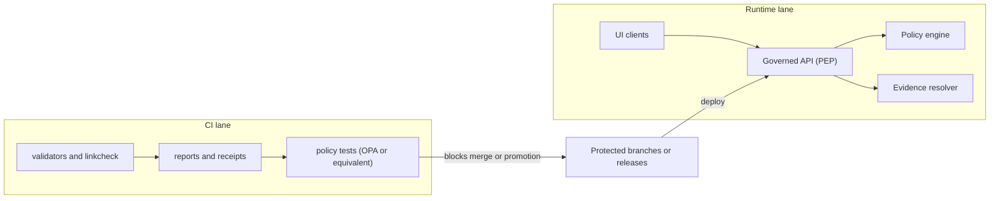

<!-- [KFM_META_BLOCK_V2]
doc_id: kfm://doc/8d2fb4f2-0f5f-4b7f-bb8d-acde0d0be6f7
title: tools — Validators, link checkers, and CLI utilities
type: standard
version: v3
status: draft
owners: TBD
created: 2026-03-03
updated: 2026-03-05
policy_label: public
related:
  - tools/validators/
  - tools/linkcheck/
  - policy/
  - contracts/
tags: [kfm, tools, validation, governance, policy, determinism]
notes:
  - Status tags are used on all non-trivial statements: CONFIRMED, PROPOSED, UNKNOWN.
  - Tools are deterministic, testable, and safe-by-default; prefer machine-readable outputs for CI.
  - This doc describes the intended contract; anything labeled UNKNOWN must be verified in the current checkout.
[/KFM_META_BLOCK_V2] -->

<a id="top"></a>

<div align="center">

# 🧰 `tools/` — Validators, link checkers, and CLI utilities

**Purpose:** Evidence-first tooling that enforces KFM’s **Promotion Contract** by validating catalogs, links, policy inputs, and integrity signals before anything is **publishable**.

<!-- Badges (placeholders — replace TODOs with real workflow names/paths once verified) -->


</div>

> **Status:** draft • **Owners:** TBD  
> **Policy label:** public  
> **Primary posture (design intent):** **fail-closed**, **default-deny**, **machine-checkable outputs**  
> **Reminder (design invariant):** clients/UI never bypass the governed API + policy boundary (trust membrane).  
> **Hallucination posture:** treat repo structure as **UNKNOWN until you verify it in your checkout**.

<div align="center">

[Impact](#impact) ·
[Scope](#scope) ·
[Where it fits](#where-it-fits) ·
[Inputs](#inputs) ·
[Exclusions](#exclusions) ·
[Reality check](#reality-check) ·
[Directory tree](#directory-tree) ·
[Quickstart](#quickstart) ·
[Tool behavior contract](#tool-behavior-contract) ·
[CI wiring patterns](#ci-wiring-patterns) ·
[Tool registry](#tool-registry) ·
[Promotion Contract mapping](#promotion-contract-mapping) ·
[Work package alignment](#work-package-alignment) ·
[Adding a tool](#adding-a-tool) ·
[Safety and sensitivity](#safety-and-sensitivity) ·
[Unknowns and verification](#unknowns-and-verification) ·
[FAQ](#faq) ·
[Sources](#sources)

</div>

---

## Status tags used in this README

<details>
<summary>Click to expand</summary>

- **CONFIRMED (design):** documented in KFM vNext design / governance / inventory inputs (contract intent).
- **CONFIRMED (checkout):** verified by in-repo artifacts in *your current checkout* (include the command output).
- **PROPOSED:** recommended pattern or target structure; safe to discuss, not safe to enforce until ratified.
- **UNKNOWN:** not verified in your current checkout; includes the smallest steps to verify.

</details>

> [!IMPORTANT]
> **Hallucination guardrail (repo-critical):** Do not claim a tool/path exists or is implemented until verified in the live repo tree for *your* branch/checkout.  
> This README is written to **fail closed**: anything uncertain is labeled **UNKNOWN** and paired with a verification step.

[↑ Back to top](#top)

---

## Impact

- **CONFIRMED (design):** `tools/` is governance-adjacent: validators/link-checkers/hashing utilities are expected to be merge- and/or promotion-blocking checks. A small change here can silently weaken enforcement if not reviewed and tested.
- **UNKNOWN (checkout):** which `tools/` checks are currently required status checks (verify in `.github/workflows/` and branch protection).

[↑ Back to top](#top)

---

## Scope

- **CONFIRMED (design):** `tools/` is the home for **validators, link checkers, and CLI utilities** that support CI gates and promotion/publishing controls.
- **CONFIRMED (design):** Catalog validation is a first-class gate: KFM treats **DCAT + STAC + PROV** (“the triplet”) as contract surfaces. Broken catalogs or broken cross-links must block merge/promotion (or keep data in quarantine).
- **PROPOSED:** Represent checks as deterministic tools with machine-readable reports so CI is **auditable** and **merge-blocking**.

[↑ Back to top](#top)

---

## Where it fits

- **CONFIRMED (design):** KFM’s lifecycle is a set of storage zones + validation gates (truth path), not a metaphor.
- **CONFIRMED (design):** Tools support the “trust foundation” work: deterministic identity (`spec_hash`), triplet validators, and link-checking.
- **CONFIRMED (design):** CI and runtime policy should share semantics (or at minimum share fixtures/outcomes) so CI guarantees are meaningful.
- **PROPOSED:** Treat `tools/` as **the check layer**: anything that can be expressed as a deterministic check should live here and be wired into CI.

### Conceptual lanes: CI ↔ runtime


```mermaid
flowchart LR
  subgraph CI_LANE["CI lane"]
    V["validators and linkcheck"] --> R["reports and receipts"]
    R --> P["policy tests (OPA or equivalent)"]
  end

  subgraph RUNTIME_LANE["Runtime lane"]
    UI["UI clients"] --> API["Governed API (PEP)"]
    API --> PDP["Policy engine"]
    API --> ER["Evidence resolver"]
  end

  P -->|blocks merge or promotion| Merge["Protected branches or releases"]
  Merge -->|deploy| API
```

[↑ Back to top](#top)

---

## Inputs

### Acceptable inputs

- **CONFIRMED (design):** Catalog artifacts and lineage bundles (DCAT, STAC, PROV) and their cross-links.
- **CONFIRMED (design):** Receipts/manifests that bind **inputs + transforms + outputs** via checksums/digests.
- **PROPOSED:** Schema contracts and controlled vocabularies used by validators (JSON Schema, OpenAPI, DCAT/STAC/PROV profiles).
- **PROPOSED:** Policy bundles and fixtures used by CI policy tests (default-deny posture).
- **PROPOSED:** Test fixtures for validators/linkcheckers (small, synthetic, safe-to-share).

### Outputs

- **CONFIRMED (design):** Machine-readable validation outputs suitable for CI gating (non-zero exit or failing job on gate failure).
- **PROPOSED:** JSON/JSONL reports for artifact upload + downstream review, plus optional human-readable summaries.

[↑ Back to top](#top)

---

## Exclusions

Do **not** put these in `tools/`:

- **PROPOSED:** Long-running servers, UI code, or production services (belongs in `apps/` / service packages).
- **PROPOSED:** Pipeline business logic (belongs in pipeline/orchestration packages; tools validate outputs, they do not *become* pipelines).
- **PROPOSED:** Secrets, API keys, or private datasets (tools must run with least privilege; use fixtures).
- **PROPOSED:** One-off scripts without tests/fixtures or deterministic outputs.

[↑ Back to top](#top)

---

## Reality check

> Do this **before** you change anything that might become a merge-blocking gate.

- **UNKNOWN (checkout):** authoritative repo tree and the current `tools/` footprint.
  - Minimum steps:
    1. `git rev-parse HEAD`
    2. `tree -L 3 tools`
    3. `rg -n "spec_hash|dcat|stac|prov|linkcheck|catalog_linkcheck" tools -S`

- **UNKNOWN (checkout):** which gates are merge-blocking in CI.
  - Minimum steps:
    1. `ls .github/workflows`
    2. `rg -n "tools/" .github/workflows -S`

[↑ Back to top](#top)

---

## Directory tree

### What exists in *your checkout* (required)

- **UNKNOWN (checkout):** the authoritative `tools/` tree in *your current checkout*.
  - **Paste these into PR/notes** when changing gates:
    1. `git rev-parse HEAD`
    2. `tree -L 3 tools`

### Design-required tool families (paths may vary)

- **CONFIRMED (design):** WP‑01/WP‑02 require tooling for:
  - deterministic hashing for identity/versioning (`spec_hash`, stable across OS),
  - catalog validators for DCAT/STAC/PROV,
  - a triplet link checker (broken links block merges/promotions).
- **CONFIRMED (design):** design inputs show at least two *path conventions* for catalog validation tooling:
  - a `tools/validators/...` style (seen in repo inventory snapshots),
  - a `tools/validation/catalog/...` style (seen in integration-kit style “repo add” lists).

### Common layouts (documented variants)

> These are **not promises** about your current branch; they are documented patterns.

```text
# Variant A (historical snapshot style)
tools/
├── hash/                       # spec_hash helpers (name varies)
├── validators/                 # DCAT/STAC/PROV validators
└── linkcheck/                  # triplet link checker

# Variant B (integration kit style)
tools/
└── validation/
    └── catalog/                # STAC/DCAT/PROV schema + cross-link checks
```

[↑ Back to top](#top)

---

## Quickstart

> Everything in this section is **checkout-dependent**. Prefer discovery (`tree`, `rg`) over guessing filenames.

### 1) Discover what exists (safe)

```bash
git rev-parse HEAD
tree -L 3 tools
rg -n "spec_hash|dcat|stac|prov|linkcheck|catalog_linkcheck" tools -S
```

### 2) Run tools in help/version mode (pattern)

```bash
# Replace <tool> with actual entrypoints found by tree/rg
<tool> --help
<tool> --version || true
```

### 3) Typical local runs (pattern)

> [!IMPORTANT]
> These are *patterns* (PROPOSED) until you confirm exact entrypoints/flags.

```bash
# Validate catalogs (example paths — adapt to your repo)
<validate_dcat>  data/catalog/dcat/<dataset>.jsonld
<validate_stac>  data/catalog/stac/<dataset>/
<validate_prov>  data/prov/<dataset>/bundle.json

# Link-check cross-links across the triplet
<catalog_linkcheck> data/catalog/
```

<details>
<summary>Historical entrypoints seen in a repo snapshot (for orientation only)</summary>

- **CONFIRMED (historical snapshot):** one repo inventory snapshot referenced Node.js CLIs under `tools/validators/` such as:
  - `tools/validators/validate_dcat.js`
  - `tools/validators/validate_stac.js`
  - `tools/validators/validate_docs.js`
  - `tools/validators/validate_links.js`
  - `tools/validators/dcat_validator/README.md`

- **UNKNOWN (checkout):** whether those exact filenames still exist in *your* branch.

</details>

[↑ Back to top](#top)

---

## Tool behavior contract

### Determinism + fail-closed posture

- **CONFIRMED (design):** determinism is a deliverable constraint (e.g., `spec_hash` stability across OS; CI blocks drift).
- **CONFIRMED (design):** catalog validators/linkchecks are expected to run in CI, and broken links should block merge/promotion.

### CLI contract (recommended)

- **PROPOSED:** Every tool **MUST**:
  - support `--help`,
  - return **exit code 0** on success and **non-zero** on failure,
  - fail closed on missing required inputs (schemas, catalogs, receipts) when used as a promotion gate,
  - avoid nondeterminism (stable sorting; pinned deps; no time-based IDs unless injected),
  - log in a CI-friendly way (single-line summaries + optional verbose mode).

- **PROPOSED:** Every tool **SHOULD**:
  - support `--version`,
  - support `--format json|text`,
  - support `--report <path>` (JSON/JSONL) when used as a hard CI gate,
  - include `report_schema_version` in machine outputs.

### Recommended report shape (example)

```json
{
  "report_schema_version": "kfm.tool.report.v1",
  "tool": "kfm.validate_dcat",
  "tool_version": "0.1.0",
  "ok": false,
  "checked": [
    {"path": "data/catalog/dcat/dataset.jsonld", "kind": "dcat.dataset"}
  ],
  "errors": [
    {"code": "missing_required_field", "path": "$.license", "message": "license is required"}
  ],
  "warnings": [],
  "timing_ms": 1234
}
```

### Network policy (safe-by-default)

- **PROPOSED:** Tools should default to **no network I/O** unless explicitly enabled (e.g., `--network` / `--fetch`).
- **PROPOSED:** If network is enabled, tools should log endpoints accessed (never secrets) and record validators (ETag/Last-Modified) in receipts when relevant.

[↑ Back to top](#top)

---

## CI wiring patterns

> These are **PROPOSED** examples. Always align to your actual `.github/workflows/**`.

### Minimal “catalog gates” job (pattern)

```yaml
# .github/workflows/catalog-gates.yml (example)
name: catalog-gates
on:
  pull_request:
    paths:
      - "data/**"
      - "tools/**"
      - "contracts/**"
      - "policy/**"

jobs:
  validate-catalogs:
    runs-on: ubuntu-latest
    permissions:
      contents: read
    steps:
      - uses: actions/checkout@v4

      # Replace with your toolchain (node/python/etc)
      - name: Discover tools
        run: |
          tree -L 3 tools
          rg -n "dcat|stac|prov|linkcheck" tools -S || true

      - name: Run catalog validation (entrypoints TBD)
        run: |
          echo "Replace <validate_*> with real tools discovered above"
          # <validate_dcat> ...
          # <validate_stac> ...
          # <validate_prov> ...
          # <catalog_linkcheck> ...
```

[↑ Back to top](#top)

---

## Tool registry

> This registry separates **design intent** from **what is verified in your checkout**.

### Design-required families

| Contract surface | Expected tool family | Status | Why it exists | Verify in checkout |
|---|---|---:|---|---|
| Deterministic identity/versioning | `spec_hash` helper/CLI | **CONFIRMED (design)** | Stable dataset versioning + drift detection | `rg -n "spec_hash" tools -S` |
| Catalog validation | DCAT validator | **CONFIRMED (design)** | Triplet is a contract surface | `tree -L 3 tools` |
| Catalog validation | STAC validator | **CONFIRMED (design)** | Asset metadata + time/space indexing | `tree -L 3 tools` |
| Catalog validation | PROV validator | **CONFIRMED (design)** | Lineage bundles are required | `tree -L 3 tools` |
| Link integrity | Triplet link checker | **CONFIRMED (design)** | Cross-links must resolve without guessing | `rg -n "linkcheck|catalog_linkcheck" tools -S` |
| Policy parity | Policy fixture tests (OPA/Rego or equivalent) | **CONFIRMED (design)** | Shared CI/runtime semantics (or shared fixtures/outcomes) | `tree -L 3 policy` + workflows |
| Promotion harness | Gate runner / orchestration | **PROPOSED** | Make contract gates merge-blocking consistently | `rg -n "promote|gate" tools .github/workflows -S` |

> [!NOTE]
> A row marked **CONFIRMED (design)** means “documented as required in design/work-package intent,” not “guaranteed present in this checkout.”

[↑ Back to top](#top)

---

## Promotion Contract mapping

- **CONFIRMED (design):** Promotion to PUBLISHED is blocked unless minimum gates are met.
- **CONFIRMED (design):** Gate **A–D** are stable across multiple inputs; gates **E–G** have **documented variants** depending on which design input you treat as primary.
- **PROPOSED:** Pick one canonical mapping and pin it in `docs/governance/promotion_contract.md` (or equivalent), then have CI enforce it fail-closed.

### Stable core gates (consistent across inputs)

| Gate | Intent (what must be true) | Tool coverage (typical) |
|---|---|---|
| A | Identity & versioning (`dataset_id`, `dataset_version_id`, stable `spec_hash`, digests) | hashing + checksum/digest verifiers |
| B | Licensing & rights metadata + upstream terms snapshot | validators + policy tests |
| C | Sensitivity classification + redaction/generalization plan (when needed) | policy tests + redaction verifiers |
| D | Catalog triplet validation (DCAT/STAC/PROV validate + cross-link) | validators + linkcheck |

### Documented variants for gates E–G

> **Both** variants are *documented*. Treat this section as a reconciliation aid until the repo selects a single canonical contract.

**Variant E–G (Delivery-plan framing):**
- E: QA & thresholds (dataset-specific)
- F: Run receipt & audit record
- G: Release manifest (artifacts + digests)

**Variant E–G (Definitive-guide framing):**
- E: Run receipt and checksums
- F: Policy tests and contract tests
- G: Optional but recommended (production posture)

### Practical “tools ↔ gates” matrix (recommended)

| Check | Gate(s) it supports | Expected artifact(s) |
|---|---|---|
| `spec_hash` stability | A | `spec_hash`, golden test vectors |
| Catalog profile validation | D (and B/C where encoded) | validator report(s) |
| Link integrity validation | D | linkcheck report |
| License/rights completeness check | B | rights report + terms snapshot ref |
| Sensitivity/redaction verification | C | redaction receipt + policy decision refs |
| Run receipt schema validation | E/F (depends on canonical contract) | `run_receipt.json` (or equivalent) |
| Policy fixture tests | F (definitive-guide framing) | conftest/OPA report |

[↑ Back to top](#top)

---

## Work package alignment

- **CONFIRMED (design):** vNext build order includes work packages for spec hashing and for catalog validators/link checking; those are first-class deliverables.
- **PROPOSED:** `tools/` should fully cover WP‑01/WP‑02 and provide CI harness support for policy parity work.

| Work package | What it builds | What belongs in `tools/` |
|---|---|---|
| WP‑01 | Deterministic `spec_hash` + controlled vocab validation | hashing CLI + golden tests |
| WP‑02 | DCAT/STAC/PROV validators + link checker | validators + linkcheck tooling |
| WP‑03 | Policy pack + fixtures (default-deny) | policy lives in `policy/`; tools may add guard scripts |
| WP‑04 | Evidence resolver service (runtime) | tools provide fixtures + contract tests (optional) |

[↑ Back to top](#top)

---

## Adding a tool

### Definition of Done (minimum)

- **PROPOSED:** A new tool is not “real” until it is:
  - documented (README with inputs/outputs + exit codes),
  - tested (fixtures + unit tests; property tests where helpful),
  - deterministic (same inputs → same output bytes, stable ordering),
  - wired into CI as a required check if it enforces Promotion Contract gates.

### Template (recommended)

```text
tools/<tool-name>/
├── README.md
├── src/                      # optional
├── tests/                    # fixtures + unit tests
└── package.json / pyproject  # if needed
```

[↑ Back to top](#top)

---

## Safety and sensitivity

- **CONFIRMED (design):** Sensitive-location leakage is treated as a high-impact risk; mitigations include restricted precise datasets + public generalized derivatives, redaction tests, and default-deny controls.
- **CONFIRMED (design):** Licensing/rights are promotion gates; “online availability” does not imply reuse permission.
- **PROPOSED:** Any tool that reads geometry or location-like fields should support a safe-mode verification path:
  - confirms required redaction receipts exist for non-public releases,
  - checks “no precise coordinates” rules for public layers where applicable,
  - detects PII-like columns in public-facing schemas.

### Safe-by-default checks (recommended)

- **PROPOSED:** Add a safety validation suite that verifies:
  - `policy_label` consistency,
  - required redaction receipts exist when `policy_label != public`,
  - public-safe schema rules,
  - no prohibited fields leak into PUBLISHED artifacts.

[↑ Back to top](#top)

---

## Unknowns and verification

### What you must verify in each checkout

- **UNKNOWN (checkout):** which `tools/` checks are required to merge in CI.
  - Minimum steps:
    1. `ls .github/workflows`
    2. `rg -n "tools/" .github/workflows -S`
    3. Confirm required checks in branch protection settings (if enabled).

- **UNKNOWN (checkout):** the exact validator flags and report shapes.
  - Minimum steps:
    1. Run each tool with `--help`
    2. Capture one “pass” and one “fail” report as fixtures under `tools/**/tests/fixtures/`

### Verification checklist (copy/paste)

- [ ] Captured repo commit hash (`git rev-parse HEAD`)
- [ ] Captured `tools/` tree (`tree -L 3 tools`)
- [ ] Verified which validators/link checks exist and their CLI flags
- [ ] Confirmed which CI checks block merge
- [ ] Added/updated fixtures for one failing and one passing catalog case
- [ ] Confirmed determinism (same inputs → same report bytes)

[↑ Back to top](#top)

---

## FAQ

### Why do tools “fail closed”?
- **CONFIRMED (design):** KFM treats promotion/publishing as a governed act; failing validation must block promotion so PUBLISHED surfaces never serve unverifiable or unlicensed artifacts.

### Why so many JSON reports?
- **PROPOSED:** Reports bridge tooling and policy: CI can upload them, policy checks can evaluate them, and stewards can review them without rerunning local commands.

### Can tools auto-fix catalogs?
- **PROPOSED:** Yes—but put mutations behind `--write` and keep CI in read-only validation mode so merges remain explainable and deterministic.

[↑ Back to top](#top)

---

## Sources

These are the **design inputs** used to label claims in this README (treat as contract intent until superseded by in-repo canonical docs):

- **KFM — Architecture, Governance, and Delivery Plan** (includes Promotion Contract framing, verification checklist, work packages overview).
- **KFM — Source Snapshots bundle (vNext)** (triplet definition, policy parity notes, work package details, Promotion Contract variant).
- **KFM Prime Document** (repo inventory notes; historical mentions of `tools/validators/*` entrypoints and fail-closed behavior).
- **KFM “New Ideas” packs** (optional patterns/snippets; treat as PROPOSED unless adopted and wired in CI).

[↑ Back to top](#top)
