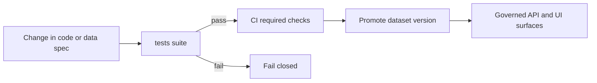
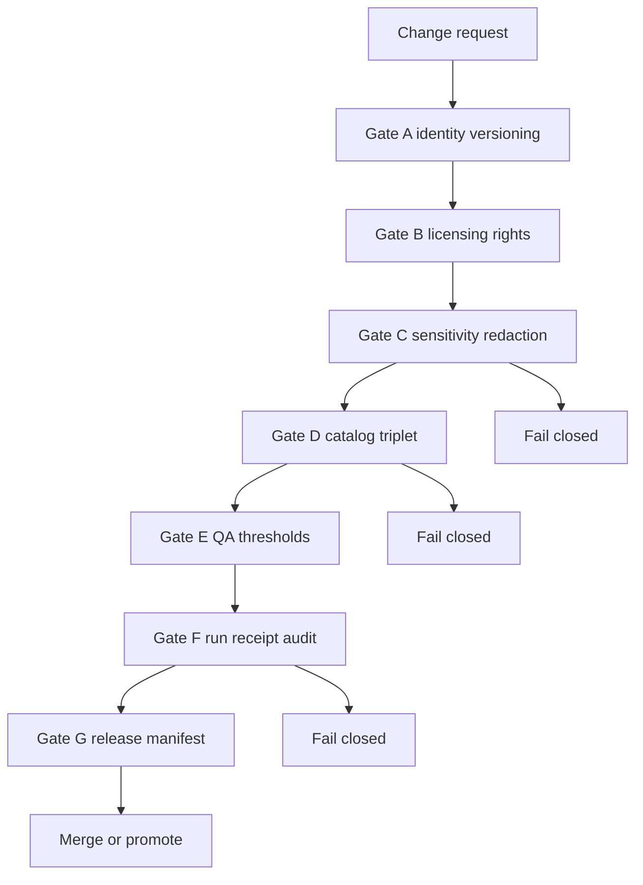

<!-- [KFM_META_BLOCK_V2]
doc_id: kfm://doc/209b3e45-0223-4c7c-a0ee-aff3a8482f2c
title: tests/README.md
type: standard
version: v2
status: draft
owners: kfm-platform
created: 2026-03-03
updated: 2026-03-03
policy_label: public
related:
  - ../README.md
  - ../docs/
  - ../policy/
  - ../contracts/
tags: [kfm, tests]
notes:
  - Defines the governed testing taxonomy and how test suites map to Promotion Contract gates.
  - Written fail-closed: unknown repo specifics are explicitly flagged as UNKNOWN with verification steps.
  - Aligns test intent to KFM invariants: truth path, trust membrane, catalog triplet, cite-or-abstain, and evaluation harness.
[/KFM_META_BLOCK_V2] -->

# tests/ — Governed test suites and fixtures

Make KFM trust enforceable by automating **policy**, **contracts**, and **end-to-end evidence resolution** checks so merges and promotions **fail closed** when governance invariants regress.

> **Status:** draft · **Owners:** `kfm-platform` · **Mode:** GOVERNED  
> **Primary contracts:** Promotion Contract gates, catalog triplet, policy-as-code, evidence resolution  
> **Golden rule:** if a claim cannot be proven by allowed evidence, tests should force the system to **abstain or reduce scope**.


## Quick navigation

- [Scope](#scope)
- [Where this fits](#where-this-fits)
- [Evidence labeling](#evidence-labeling)
- [Project anchors and invariants](#project-anchors-and-invariants)
- [Quickstart](#quickstart)
- [Test taxonomy](#test-taxonomy)
- [Promotion Contract mapping](#promotion-contract-mapping)
- [Directory layout](#directory-layout)
- [Fixtures and test data rules](#fixtures-and-test-data-rules)
- [Adding a new test](#adding-a-new-test)
- [Rego v1 readiness](#rego-v1-readiness)
- [Unknowns and smallest verification steps](#unknowns-and-smallest-verification-steps)

---

## Scope

- **[CONFIRMED]** `tests/` exists to make KFM’s governance **enforceable** through automated checks that run in CI and locally.
- **[CONFIRMED]** Tests here SHOULD be written to **fail closed**: if required evidence, catalogs, policy labels, or receipts are missing, tests must fail and block promotion.
- **[PROPOSED]** This directory is the **single home** for:
  - unit tests
  - contract and schema tests
  - policy tests (OPA/Rego and fixtures)
  - integration tests (evidence resolver + governed APIs)
  - end-to-end UI tests (Map, Story publish gate, Focus)
  - evaluation harness tests (golden queries)

### Exclusions

- **[CONFIRMED]** No secrets, tokens, private keys, or credentials.
- **[CONFIRMED]** No production-sized datasets or large binaries.
- **[CONFIRMED]** No restricted/precise sensitive locations unless explicitly approved, protected, and required by a stewarded test plan.
- **[PROPOSED]** No “mystery fixtures” without a short provenance note.

[Back to top](#tests--governed-test-suites-and-fixtures)

---

## Where this fits

- **Path:** `tests/`
- **Upstream dependencies:**
  - `contracts/` for schemas, OpenAPI, controlled vocabularies
  - `policy/` for OPA/Rego policies + fixtures
  - `data/` for example catalog artifacts and registry entries
- **Downstream impact:**
  - CI required checks that block merges and promotions
  - promotion automation and steward sign-off workflows


```mermaid
flowchart LR
  Dev[Change in code or data spec] --> Tests[tests suite]
  Tests -->|pass| CI[CI required checks]
  Tests -->|fail| Block[Fail closed]

  CI --> Promote[Promote dataset version]
  Promote --> Serve[Governed API and UI surfaces]
```

[Back to top](#tests--governed-test-suites-and-fixtures)

---

## Evidence labeling

Every meaningful statement in this README is labeled:

- **[CONFIRMED]** backed by KFM project design docs or explicit project governance rules.
- **[PROPOSED]** recommended repo convention; adopt or adjust via small PRs.
- **[UNKNOWN]** not verified in the live repo; the smallest verification steps are listed.

> **[PROPOSED]** When you change how tests run in CI, update this README and convert **UNKNOWN → CONFIRMED** once verified.

[Back to top](#tests--governed-test-suites-and-fixtures)

---

## Project anchors and invariants

The following are the **non-negotiable invariants** that tests must enforce or continuously guard.

| Invariant | What it means | How tests enforce it |
|---|---|---|
| **Truth path lifecycle** | Upstream → RAW → WORK/QUARANTINE → PROCESSED → CATALOG/TRIPLET → PUBLISHED | Contract tests for zone artifacts and promotion gates; no PUBLISHED surface without passing gates |
| **Promotion Contract gates** | Promotion blocks unless minimum gates A–G pass | Gate tests map to CI checks and required artifacts |
| **Trust membrane** | Clients never access storage/DB directly; access crosses policy boundary | Static checks and integration tests to prevent bypass; E2E checks for UI-only-over-API |
| **Catalog triplet is a contract surface** | DCAT + STAC + PROV validate and cross-link; EvidenceRefs resolve | Schema validation + link checks + EvidenceRef resolution tests |
| **Cite-or-abstain** | If citations cannot be verified or are denied by policy, abstain or reduce scope | Contract tests for citation resolution + policy allow/deny + regression tests |
| **Evaluation harness** | Golden queries run in CI; merge is blocked on regressions | `tests/eval/` harness with stored baselines and diffs |

> **[PROPOSED]** Treat each invariant above like an API: breaking it is a **breaking change** requiring a steward-approved plan and updated tests.

[Back to top](#tests--governed-test-suites-and-fixtures)

---

## Quickstart

### Repo test command parity

- **[UNKNOWN]** The repo’s canonical test runner(s) and exact commands.
- **Smallest verification steps to make this CONFIRMED:**
  1. Run `tree -L 3 tests/` to confirm structure.
  2. Inspect `.github/workflows/*` for required checks and exact commands.
  3. Inspect root build tooling (`Makefile`, `package.json`, `pyproject.toml`) to confirm local runners.

### Proposed one-command local entrypoint

> **[PROPOSED]** Maintain a single entrypoint that matches CI (or the closest equivalent).

```bash
# PROPOSED: canonical local command that matches CI required checks
make ci.test
```

### Proposed suite-level entrypoints

Use only what the repo actually uses; keep everything else **UNKNOWN** until verified.

```bash
# PROPOSED: Python
pytest
```

```bash
# PROPOSED: JS/TS
pnpm test
```

```bash
# PROPOSED: Policy (Conftest)
conftest test <path-to-input> -p policy/
```

```bash
# PROPOSED: E2E UI
pnpm playwright test
```

> **[CONFIRMED]** If local runs cannot faithfully reproduce CI (tooling drift), treat changes as **not promotable** until parity is restored.

[Back to top](#tests--governed-test-suites-and-fixtures)

---

## Test taxonomy

### Unit tests

- **[PROPOSED]** Fast, deterministic tests for pure functions, schema helpers, parsers, and canonical hashing (`spec_hash`) routines.
- **[PROPOSED]** No network. No filesystem writes outside temp dirs.

### Contract tests

- **[CONFIRMED]** Catalog surfaces and evidence behaviors are contracts and must be tested.
- **[PROPOSED]** Validate:
  - schema conformance (DCAT, STAC, PROV, receipts)
  - cross-link integrity (IDs, hrefs, EvidenceRefs resolvable)
  - stable deterministic hashing via golden tests

### Policy tests

- **[CONFIRMED]** CI and runtime must share policy semantics, otherwise CI guarantees are meaningless.
- **[PROPOSED]** Fixture-driven allow/deny tests:
  - allow/deny outcomes
  - obligations (redaction/generalization requirements)
  - default-deny posture

### Integration tests

- **[CONFIRMED]** Evidence resolution and policy enforcement require integration tests.
- **[PROPOSED]** Validate:
  - EvidenceRef → EvidenceBundle resolution
  - policy enforcement path coverage
  - fail-closed behavior when citations cannot be verified

### End-to-end tests

- **[CONFIRMED]** Evidence-first UX should be validated end-to-end for Map, Story, and Focus.
- **[PROPOSED]** Scope examples:
  - evidence drawer opens from map and story interactions
  - license and dataset version are visible
  - keyboard navigation paths work

### Evaluation harness tests

- **[CONFIRMED]** Focus Mode has an evaluation harness with golden queries and should block merges on regressions.
- **[PROPOSED]** Harness outputs are governed artifacts:
  - store diffs/summaries as CI artifacts
  - define regression budgets: citation resolvability must remain 100% for allowed users

[Back to top](#tests--governed-test-suites-and-fixtures)

---

## Promotion Contract mapping

> **[CONFIRMED]** Promotion to PUBLISHED is blocked unless minimum gates are met, and these gates are intended to be automated in CI and reviewed during steward sign-off.


```mermaid
flowchart TB
  PR[Change request] --> A[Gate A identity versioning]
  A --> B[Gate B licensing rights]
  B --> C[Gate C sensitivity redaction]
  C --> D[Gate D catalog triplet]
  D --> E[Gate E QA thresholds]
  E --> F[Gate F run receipt audit]
  F --> G[Gate G release manifest]
  G --> OK[Merge or promote]

  D --> Block1[Fail closed]
  C --> Block2[Fail closed]
  F --> Block3[Fail closed]
```

### Gate-to-test matrix

| Gate | What must be proven | Typical suite | Typical location |
|---|---|---|---|
| **A** Identity and versioning | `dataset_id`, `dataset_version_id`, deterministic `spec_hash`, artifact digests | contract | `tests/contract/` |
| **B** Licensing and rights | license fields present + terms snapshot if required | contract + policy | `tests/contract/`, `tests/policy/` |
| **C** Sensitivity and redaction | policy label present; obligations enforced | policy + integration | `tests/policy/`, `tests/integration/` |
| **D** Catalog triplet validation | DCAT/STAC/PROV validate + cross-link; EvidenceRefs resolve | contract + integration | `tests/contract/`, `tests/integration/` |
| **E** QA thresholds | dataset-specific QA reports exist and thresholds met | integration | `tests/integration/` |
| **F** Run receipt and audit record | receipt completeness, hashes, and optional signature checks | contract + policy | `tests/contract/`, `tests/policy/` |
| **G** Release manifest | promotion recorded as a manifest referencing digests | contract | `tests/contract/` |

### Suite matrix

| Suite | Runs on PR | Runs on promotion lane | Fail posture | Notes |
|---|---:|---:|---|---|
| unit | **[UNKNOWN]** | **[UNKNOWN]** | fail closed | fast and deterministic |
| contract | **[UNKNOWN]** | **[UNKNOWN]** | fail closed | schemas + linkchecks |
| policy | **[UNKNOWN]** | **[UNKNOWN]** | fail closed | default-deny |
| integration | **[UNKNOWN]** | **[UNKNOWN]** | fail closed | may require services |
| e2e | **[UNKNOWN]** | **[UNKNOWN]** | fail closed | gate UI evidence UX |
| eval | **[UNKNOWN]** | **[UNKNOWN]** | fail closed | golden queries |

> **[PROPOSED]** Make “promotion lane” explicit: a CI job that runs the gate checks end-to-end, publishes artifacts to a staging location, and blocks publish unless all gates pass.

[Back to top](#tests--governed-test-suites-and-fixtures)

---

## Directory layout

### Minimal intent

- **[CONFIRMED]** `tests/` contains unit, integration, e2e tests and fixtures.

### Target layout

This is a **target** layout, not a claim about what exists today.

```text
tests/
  README.md
  unit/                 # PROPOSED: pure unit tests
  contract/             # PROPOSED: schema + linkcheck + spec_hash golden tests
  policy/               # PROPOSED: Rego unit tests (Conftest) + fixtures
  integration/          # PROPOSED: evidence resolver + API integration tests
  e2e/                  # PROPOSED: UI E2E (Map Explorer, Story publish gate)
  eval/                 # PROPOSED: Focus Mode eval harness (golden queries)
  fixtures/             # PROPOSED: small synthetic inputs + golden outputs
```

> **[PROPOSED]** Keep this layout stable so test paths become “retrieval anchors” for humans and automation.

[Back to top](#tests--governed-test-suites-and-fixtures)

---

## Fixtures and test data rules

### Allowed

- **[PROPOSED]**
  - tiny, synthetic datasets
  - redacted/generalized examples when policy requires
  - golden JSON for schema validation (valid + invalid)
  - golden EvidenceRefs with expected EvidenceBundle shapes

### Disallowed

- **[CONFIRMED]**
  - secrets, tokens, private keys
  - large binaries or production datasets
  - restricted/precise sensitive locations unless explicitly approved
  - fixtures that cannot explain what they represent

### Fixture documentation

- **[PROPOSED]** Every fixture directory contains a short `README.md` describing:
  - what the fixture represents
  - policy label expectations
  - expected allow/deny outcome
  - how to regenerate it deterministically

[Back to top](#tests--governed-test-suites-and-fixtures)

---

## Adding a new test

### Minimal, safe, additive workflow

1. **[PROPOSED]** Add or update a fixture using the smallest possible inputs.
2. **[PROPOSED]** Add the test next to the fixture.
3. **[PROPOSED]** Make failures actionable: what failed, where, and how to reproduce locally.
4. **[PROPOSED]** If governance-related, update the policy fixture set so CI and runtime semantics stay aligned.

### Definition of done

- [ ] **[PROPOSED]** Deterministic: no network unless explicitly stubbed/recorded.
- [ ] **[PROPOSED]** Reproducible locally and in CI with the same command or wrapper.
- [ ] **[PROPOSED]** If policy-related: includes allow and deny fixtures.
- [ ] **[CONFIRMED]** No sensitive or restricted data added.
- [ ] **[PROPOSED]** README updated if taxonomy, commands, or layout changed.

[Back to top](#tests--governed-test-suites-and-fixtures)

---

## Rego v1 readiness

- **[CONFIRMED]** Policy-as-code is a core gate; toolchain changes can silently break enforcement if not tested.
- **[PROPOSED]** Add a dedicated policy compatibility guard in CI to keep OPA/Rego upgrades safe.

### Proposed guard commands

```bash
# PROPOSED: Rego v1 migration helpers / compatibility checks
opa check --v0-v1 --strict ./policy
opa fmt --write --v0-v1 ./policy
```

### Proposed CI guard

- **[PROPOSED]** Add a job (example name: `policy_v1_guard`) that:
  - runs `opa check --v0-v1 --strict` over `policy/**.rego`
  - fails closed on any errors
  - pins conftest or passes an explicit `--rego-version` during transition

> **[PROPOSED]** If a downstream tool lags behind Rego v1 semantics, pin versions and treat compatibility as a tested contract.

[Back to top](#tests--governed-test-suites-and-fixtures)

---

## Unknowns and smallest verification steps

These are intentionally phrased as **small, attachable** checks you can drop into a PR description.

- **[UNKNOWN]** Which test runners exist and which ones are required checks.
  - **Verify:** inspect `.github/workflows/*` and root build configs; record the exact commands.

- **[UNKNOWN]** Whether Conftest/OPA is already wired as a required status check.
  - **Verify:** search CI workflows for `conftest`, `opa`, and `policy/`.

- **[UNKNOWN]** Exact contract schemas present and their versions.
  - **Verify:** list `contracts/` and run validators against example fixtures.

- **[UNKNOWN]** Where the Focus Mode harness lives and how it stores goldens.
  - **Verify:** search for `tests/eval/` and “golden queries”; run it once and attach CI artifacts.

- **[UNKNOWN]** Whether trust-membrane checks exist today.
  - **Verify:** search for tests asserting “no direct DB/storage access from UI”; confirm network policies.

### Minimum verification checklist

- [ ] Capture repo commit hash and a root directory tree.
- [ ] Extract the CI required-check list and which ones block merge.
- [ ] Pick one MVP dataset and prove it can pass gates A–G into PUBLISHED.
- [ ] Prove citations resolve end-to-end in Map Explorer and Story publish.
- [ ] Run Focus evaluation harness and store golden outputs + diffs as artifacts.

[Back to top](#tests--governed-test-suites-and-fixtures)

---

<details>
<summary>Appendix: Optional patterns for keeping test suites fast and governed</summary>

- **[PROPOSED]** Use path filters in CI to avoid running heavyweight suites on unrelated changes.
- **[PROPOSED]** Cache dependency installs, but never cache policy outcomes or receipt verification results.
- **[PROPOSED]** Store E2E artifacts (screenshots, traces) as CI artifacts for auditing.

</details>
