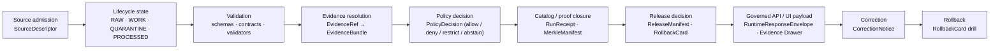

<!-- [KFM_META_BLOCK_V2]
doc_id: kfm://doc/tests-readme
title: tests/
type: standard
version: v1
status: draft
owners: KFM QA stewards · CODEOWNERS (TBD)
created: 2026-05-11
updated: 2026-05-11
policy_label: public
related:
  - directory-rules.md
  - KFM_Unified_Implementation_Architecture_Build_Manual.pdf
  - KFM_Whole_UI_Governed_AI_Expansion_Report.pdf
  - kfm_encyclopedia.pdf
tags: [kfm, tests, governance, trust-spine, fixtures]
notes:
  - "Doctrine CONFIRMED; concrete subtree presence, runner, and CI wiring remain PROPOSED until repo is mounted."
  - "Authority class: canonical."
[/KFM_META_BLOCK_V2] -->

# `tests/`

> Enforceability proof for the KFM trust spine — from source admission through release, correction, and rollback.

<!-- Badges are placeholders until CI, license, and version targets are verified in a mounted repo. -->


| Status | Owners | Last reviewed |
|---|---|---|
| Draft · doctrine CONFIRMED · implementation **PROPOSED** | KFM QA stewards · `CODEOWNERS` *(TBD)* | 2026-05-11 |

---

## Mini-TOC

- [1. Purpose](#1-purpose)
- [2. Authority level](#2-authority-level)
- [3. Status](#3-status)
- [4. Scope and repo fit](#4-scope-and-repo-fit)
- [5. What belongs here](#5-what-belongs-here)
- [6. What does NOT belong here](#6-what-does-not-belong-here)
- [7. Directory tree](#7-directory-tree)
- [8. The trust-spine test flow](#8-the-trust-spine-test-flow)
- [9. Test pyramid and test classes](#9-test-pyramid-and-test-classes)
- [10. Fixture rule and fixture homes](#10-fixture-rule-and-fixture-homes)
- [11. Quickstart and usage](#11-quickstart-and-usage)
- [12. Validation](#12-validation)
- [13. Review burden](#13-review-burden)
- [14. Related folders](#14-related-folders)
- [15. ADRs](#15-adrs)
- [16. FAQ](#16-faq)
- [17. Appendix — extended notes](#17-appendix--extended-notes)
- [18. Last reviewed](#18-last-reviewed)

---

## 1. Purpose

`tests/` exists to **prove the doctrine is enforceable** — not merely to prove code runs. A passing suite must demonstrate that controlled inputs move through source admission, lifecycle state, validation, evidence resolution, policy decision, catalog/proof closure, release decision, governed API/UI payload, correction, and rollback **without crossing forbidden boundaries**.

This is the canonical home for KFM's enforceability evidence. A green test run is the operational form of the project's invariants.

> [!IMPORTANT]
> A passing suite that does **not** exercise the trust spine is not sufficient. Tests here must demonstrate boundary discipline — not just functional correctness. Source: BLD-GREEN §§16, 24; BLD-COMP §§3.2, 30; IMPL-PIPE §22.

---

## 2. Authority level

**Canonical.** `tests/` is a top-level responsibility root under the KFM directory contract.

| Property | Value |
|---|---|
| Class | Canonical |
| Pairs with | `fixtures/` (or `tests/fixtures/` — see §10) |
| Proves authority of | `contracts/`, `schemas/`, `policy/`, `release/`, governed API/UI, pipelines, validators |
| Generated content allowed? | No — tests are authored, not emitted |
| Trust-bearing? | Yes — failure should block promotion |

Source: `directory-rules.md` §§5–6, §20 (canonical-root list); KFM Unified Build Manual §26 (Testing strategy).

---

## 3. Status

- **Doctrine — CONFIRMED.** The testing strategy, test pyramid, and fixture rules are stated in the attached KFM doctrine.
- **Implementation — PROPOSED / NEEDS VERIFICATION.** The presence and depth of the subtree below, the test runner(s), CI workflows, and pass-rates are **not** verified in this session and remain PROPOSED until inspected in a mounted repository.

> [!NOTE]
> Statements in this README about *doctrine* (what tests must do) are CONFIRMED. Statements about *what exists in the current repo* (paths, runners, workflows, coverage) are PROPOSED or UNKNOWN until verified.

---

## 4. Scope and repo fit

`tests/` sits at the repo root alongside the other canonical roots it validates. Its job is exclusively enforceability.

**Upstream of `tests/`** (what `tests/` validates):

- `contracts/` — object meaning
- `schemas/` — machine-checkable shape
- `policy/` — admissibility and release policy
- `apps/governed-api/` — finite-outcome envelopes
- `apps/explorer-web/` — UI trust state and boundary discipline
- `pipelines/`, `pipeline_specs/` — pipeline behavior
- `release/` — manifests, rollback, corrections
- `packages/evidence-resolver/`, `packages/policy-runtime/` — resolver and policy boundaries

**Downstream of `tests/`** (where `tests/` results land):

- CI workflows under `.github/workflows/` (PROPOSED: `contracts-ui-ai.yml`, `ui-governed.yml`)
- `release/` promotion gates (test outcomes feed gate decisions)
- `data/receipts/` / `data/proofs/` (when tests emit receipts for trust-spine runs — PROPOSED)

> Reviewer's one-line check: *"Does this test exercise the trust spine end-to-end, or only a unit's local behavior?"*

---

## 5. What belongs here

Accepted content under `tests/`:

- **Schema tests** — required fields, versions, and shape conformance for every governed object family.
- **Contract tests** — object meaning matches the vocabulary in `contracts/` and the lifecycle role it plays.
- **Validator unit tests** — for every validator under `tools/validators/`.
- **Policy tests** — including negative cases (unknown rights, unverified sensitivity, missing review, stale source) that must **fail closed**.
- **Evidence-resolution tests** — `EvidenceRef` resolves to a complete `EvidenceBundle` or the answer is `ABSTAIN`.
- **Lifecycle-state tests** — `RAW → WORK/QUARANTINE → PROCESSED → CATALOG/TRIPLETS → PUBLISHED` transitions are governed; no phase is skipped.
- **Receipt and proof tests** — `RunReceipt`, `EvidenceBundle`, integrity manifests; proofs prove what they claim to prove.
- **Release-manifest tests** — every `ReleaseManifest` carries proof, correction path, and rollback target.
- **Governed API envelope tests** — the API returns finite-outcome `RuntimeResponseEnvelope` values (`ANSWER`, `ABSTAIN`, `DENY`, `ERROR`) and never leaks internal stores.
- **UI trust-state tests** — Evidence Drawer, Focus Mode, layer catalog, and shell render correct trust state and negative outcomes.
- **End-to-end (e2e) tests** — smoke, navigation, negative behavior, and accessibility paths.
- **Runtime-proof tests** — finite-outcome and abstain proof under `tests/runtime_proof/`.
- **Domain-specific tests** — under `tests/domains/<domain>/`; the domain is a **segment**, not a root.

---

## 6. What does NOT belong here

> [!WARNING]
> The wrong-place list is as important as the right-place list. Misplacement here causes silent authority drift.

- **Production code.** Tests verify behavior; they do not implement it.
- **Real exact sensitive geometry, living-person identifiers, DNA/genomic data, rare-species coordinates, archaeological site geometry, or critical-infrastructure detail.** Sensitive lanes use **public-safe transformed fixtures** only.
- **Live network calls or live source credentials** in the default suite. The default tier is deterministic and no-network.
- **A second schema home, policy home, contract home, or registry home.** Tests reference these; they do not redefine them.
- **Trust-bearing receipts, proofs, or release decisions.** Those live under `data/receipts/`, `data/proofs/`, and `release/` — not `tests/`.
- **Generated build artifacts.** Those belong in `artifacts/` (compatibility, scoped) or `data/published/`.
- **Domain folders as test roots.** Domain is `tests/domains/<domain>/`, never `tests/<domain>/` alongside `tests/api/`.
- **A duplicate fixture home.** See §10.

---

## 7. Directory tree

> **PROPOSED.** This tree mirrors `directory-rules.md` §6.6. Actual presence and depth of each subtree must be verified against the mounted repository.

```text
tests/
├── README.md                  # this file
├── contracts/                 # object-meaning tests
├── schemas/                   # machine-shape tests
├── policy/                    # admissibility / release policy tests (incl. negative)
├── validators/                # validator unit tests
├── pipelines/                 # executable pipeline behavior tests
├── api/                       # governed-API envelope and route tests
├── ui/                        # UI trust-state component tests
├── e2e/                       # end-to-end shell, navigation, negative behavior, a11y
├── runtime_proof/             # finite-outcome (ANSWER/ABSTAIN/DENY/ERROR) and abstain proof
├── fixtures/                  # OPTIONAL — unit-test-scoped fixtures (see §10)
└── domains/
    ├── hydrology/
    ├── people/                # public-safe transformed fixtures only
    ├── fauna/                 # rare-species coords excluded
    └── …                      # one folder per active domain
```

> [!NOTE]
> Per `directory-rules.md` §6.6, you **MAY** keep fixtures under `tests/fixtures/` instead of root `fixtures/`. You **MUST NOT** have two competing fixture homes unless the README declares the difference. See §10 for KFM's resolution.

---

## 8. The trust-spine test flow

A passing run should walk this spine. Each gate has a corresponding test class (see §9).


```mermaid
flowchart LR
    A["Source admission<br/>SourceDescriptor"] --> B["Lifecycle state<br/>RAW · WORK · QUARANTINE · PROCESSED"]
    B --> C["Validation<br/>schemas · contracts · validators"]
    C --> D["Evidence resolution<br/>EvidenceRef → EvidenceBundle"]
    D --> E["Policy decision<br/>PolicyDecision (allow / deny / restrict / abstain)"]
    E --> F["Catalog / proof closure<br/>RunReceipt · MerkleManifest"]
    F --> G["Release decision<br/>ReleaseManifest · RollbackCard"]
    G --> H["Governed API / UI payload<br/>RuntimeResponseEnvelope · Evidence Drawer"]
    H --> I["Correction<br/>CorrectionNotice"]
    I --> J["Rollback<br/>RollbackCard drill"]

    classDef gate fill:#eef,stroke:#446,stroke-width:1px,color:#112;
    class A,B,C,D,E,F,G,H,I,J gate;
```

> [!IMPORTANT]
> No test path may bypass these gates by reading directly from `data/raw|work|quarantine`, calling a model runtime directly, or short-circuiting policy. Crossings of these boundaries are **failures**, not warnings.

[Back to top](#tests)

---

## 9. Test pyramid and test classes

### 9.1 Pyramid (PROPOSED order of construction)

Start at the base. Higher layers depend on lower layers being green.

1. Deterministic, no-network fixture tests
2. Schema and contract tests
3. Validator unit tests
4. Policy negative tests
5. Evidence-resolution tests
6. Lifecycle-state tests
7. Receipt / proof tests
8. Release-manifest tests
9. Governed API envelope tests
10. UI trust-state tests
11. End-to-end smoke and accessibility
12. *(Last)* Live-source or runtime tests — gated, never the default

Source: KFM Unified Build Manual §26 (Testing strategy); BLD-COMP §§5.3, 20; IMPL-PIPE §§22, 26.

### 9.2 Required test classes

> Default implementation status for every class below: **PROPOSED**. Mark CONFIRMED only with evidence from a mounted repo.

| # | Class | Example assertion | Default status |
|---|---|---|---|
| 1 | Schema test | Required fields and versions are present | PROPOSED |
| 2 | Contract test | Object meaning matches vocabulary and lifecycle role | PROPOSED |
| 3 | Source-role test | A source is not used outside its authority | PROPOSED |
| 4 | Evidence test | `EvidenceRef` resolves or the answer abstains | PROPOSED |
| 5 | Policy test | Unknown rights or sensitivity **deny** release | PROPOSED |
| 6 | Lifecycle test | No phase is skipped; no public read of pre-PUBLISHED state | PROPOSED |
| 7 | Receipt / proof test | `RunReceipt` and proof closure match what ran | PROPOSED |
| 8 | Release test | Manifest carries proof, correction path, rollback target | PROPOSED |
| 9 | Governed-API envelope test | Outcomes are finite: `ANSWER` / `ABSTAIN` / `DENY` / `ERROR` | PROPOSED |
| 10 | UI trust test | Evidence Drawer renders state and negative outcomes | PROPOSED |
| 11 | AI boundary test | MockAdapter cannot answer without admissible evidence | PROPOSED |
| 12 | Rollback drill | A dry-run release can be reversed via `RollbackCard` | PROPOSED |
| 13 | Non-regression test | Prior lineage / aliases preserved across rewrites | PROPOSED |

### 9.3 Forbidden-boundary assertions

These are not optional. They are part of the suite's job.

- No browser fetch of `RAW`, `WORK`, `QUARANTINE`, candidate, or canonical internal stores.
- No direct model-client call from the frontend.
- No tile, style, sprite, or glyph load that is not listed in a `MapReleaseManifest`.
- Exact sensitive geometry fixtures **deny** before tile build or public release.
- No public path through `apps/admin/`.

Source: Master MapLibre §12 (Validation and Test Plan); BLD-GREEN §18; IMPL-PIPE §24.

[Back to top](#tests)

---

## 10. Fixture rule and fixture homes

### 10.1 The fixture rule

> [!IMPORTANT]
> Every major object family must have at least one **valid**, one **invalid**, one **denied**, one **abstention**, and one **rollback / correction** fixture. Sensitive lanes use **public-safe transformed** fixtures only. Source: KFM Unified Build Manual §26.

Concretely, that means for each of `SourceDescriptor`, `EvidenceBundle`, `PolicyDecision`, `LayerManifest`, `LayerDescriptor`, `KFMGeoManifest`, `FocusRequestEnvelope`, `FocusResponseEnvelope`, `CitationValidationReport`, `StoryManifest`, `ReviewRecord`, `RunReceipt`, `PromotionDecision`, `ReleaseManifest`, `RollbackCard`, `CorrectionNotice`, `RuntimeResponseEnvelope`, and `EvidenceDrawerPayload`, the five-fixture rule applies.

### 10.2 Two homes — disambiguated

`directory-rules.md` §6.6 allows two fixture homes but forbids drift between them. The KFM convention is:

| Home | Purpose | Status |
|---|---|---|
| `tests/fixtures/` | **Unit-test-scoped** fixtures owned by a particular test directory. Local to a test's needs. | PROPOSED |
| `fixtures/` (root) | **Cross-cutting** golden, valid, invalid, and synthetic fixtures shared across multiple test areas and pipelines. | PROPOSED |

If only one home is present in the mounted repo, this README must be updated to declare the resolved single home and remove the other from doctrine. Until then, both are allowed with the split above.

### 10.3 Sensitive-fixture safeguards

- No real exact locations, living-person identifiers, DNA/genomic material, rare-species coordinates, critical-infrastructure detail, or archaeological site geometry.
- Sensitive lanes carry a `public_safe_transform` marker and document the transform applied.
- Negative fixtures that **must deny** carry an `expected_policy_outcome: DENY` field.

Example fixture filenames seen in KFM doctrine (PROPOSED):

```text
tests/fixtures/map/sensitive_geometry_deny_fixture.json
tests/fixtures/map/stale_source_fixture.json
tests/fixtures/focus/answer.valid.json
tests/fixtures/focus/abstain_uncited.invalid.json
tests/fixtures/focus/deny_restricted.valid.json
tests/fixtures/runtime/decision_envelope.answer.valid.json
tests/fixtures/runtime/decision_envelope.deny.valid.json
tests/fixtures/ui/evidence_drawer/answer.valid.json
tests/fixtures/ui/evidence_drawer/deny_restricted.valid.json
tests/fixtures/ui/evidence_drawer/abstain_missing_evidence.valid.json
```

[Back to top](#tests)

---

## 11. Quickstart and usage

> [!CAUTION]
> Commands below are **PROPOSED** placeholders. The actual runner(s), package manager(s), and invocation conventions must be verified in a mounted repo and this section updated accordingly.

```bash
# Run the full test suite (PROPOSED)
TODO

# Run a single tier of the pyramid (PROPOSED)
TODO test:schemas
TODO test:contracts
TODO test:policy
TODO test:evidence
TODO test:api
TODO test:ui
TODO test:e2e
TODO test:runtime-proof

# Run domain-scoped tests (PROPOSED)
TODO test --domain hydrology
```

> [!NOTE]
> Default execution must be deterministic and offline. Any tier that requires network access must be gated by an explicit flag and excluded from the default `test` target.

---

## 12. Validation

How this folder itself is checked. Items below are **PROPOSED** unless verified.

- **CI workflows** (PROPOSED): `.github/workflows/contracts-ui-ai.yml` (schema, fixture, policy validation), `.github/workflows/ui-governed.yml` (PR-safe UI validation).
- **Pre-merge gate**: every PR that touches `contracts/`, `schemas/`, `policy/`, `apps/governed-api/`, or `apps/explorer-web/` should trigger the relevant `tests/` tiers.
- **No-public-write check**: release dry-run must produce zero public artifacts. Source: kfm_encyclopedia §14 (PR-09 promotion dry-run).
- **Rollback drill**: at least one rollback drill receipt per release candidate. Source: kfm_encyclopedia §14 (PR-10).
- **Fixture coverage check**: every governed object family has the five required fixtures (valid, invalid, denied, abstention, rollback/correction).
- **Boundary scan**: a static check that test code never imports from forbidden roots (e.g., direct model clients, canonical internal stores). PROPOSED.

> [!WARNING]
> Validation that runs only in CI is not enough. The same checks must be runnable locally with the same outcomes. Reproducibility is part of the trust spine.

---

## 13. Review burden

| Change type | Required reviewers | Notes |
|---|---|---|
| New test directory | QA stewards · directory steward · CODEOWNERS *(TBD)* | Apply `directory-rules.md` §16 path-validation checklist |
| New fixture under `tests/fixtures/` or `fixtures/` | QA stewards · subsystem owner | Must include `expected_*` outcome fields where applicable |
| Sensitive-lane fixture | QA stewards · security steward · domain steward | Must carry `public_safe_transform` marker |
| Policy negative test | QA stewards · policy steward | Must demonstrate **fail-closed** behavior |
| Release / rollback test | QA stewards · release steward | Must reference a `ReleaseManifest` and a `RollbackCard` |
| Removing a test | QA stewards · subsystem owner · directory steward | Removal of trust-spine coverage requires an ADR |

> `CODEOWNERS` entries for `tests/**` are **TODO** until verified in a mounted repo.

---

## 14. Related folders

| Folder | Relationship to `tests/` |
|---|---|
| [`contracts/`](../contracts/) | Object meaning that contract tests assert against |
| [`schemas/`](../schemas/) | Machine shape that schema tests assert against |
| [`policy/`](../policy/) | Admissibility policy exercised by policy tests |
| [`fixtures/`](../fixtures/) | Cross-cutting fixtures; co-home with `tests/fixtures/` per §10 |
| [`tools/validators/`](../tools/validators/) | Validators whose units are tested here |
| [`apps/governed-api/`](../apps/governed-api/) | Trust membrane exercised by API and runtime-proof tests |
| [`apps/explorer-web/`](../apps/explorer-web/) | UI surface exercised by UI and e2e tests |
| [`release/`](../release/) | Release decisions, manifests, and rollback cards exercised by release tests |
| [`data/receipts/`](../data/receipts/) · [`data/proofs/`](../data/proofs/) | Receipts and proofs whose closure is asserted here |
| [`docs/`](../docs/) | Doctrine, ADRs, and runbooks that govern this folder |

> Relative links assume a mounted repo with the canonical layout. Paths remain **PROPOSED** until verified.

---

## 15. ADRs

| ADR | Topic | Status |
|---|---|---|
| `docs/adr/ADR-0001-schema-home.md` | Default schema home: `schemas/contracts/v1/...` | PROPOSED reference |
| *TODO — ADR on fixture-home split* | Resolves `tests/fixtures/` vs `fixtures/` per §10 | NEEDS VERIFICATION |
| *TODO — ADR on runtime-proof scope* | Defines what `tests/runtime_proof/` must cover | NEEDS VERIFICATION |

ADR entries above are **PROPOSED**; verify presence in a mounted repo and update.

---

## 16. FAQ

> [!TIP]
> If a question below has no answer yet, the answer is *"it remains UNKNOWN until verified."* Do not infer from absence.

<details>
<summary><strong>Do unit tests that pass count as proof?</strong></summary>

Not by themselves. A green unit suite is necessary but not sufficient. The trust spine (§8) must be exercised by the broader suite for the release gate to accept it. Source: KFM Unified Build Manual §26.

</details>

<details>
<summary><strong>Can a test read directly from <code>data/raw</code> or <code>data/work</code>?</strong></summary>

No. The forbidden-boundary assertions in §9.3 explicitly cover this. A test that reads pre-PUBLISHED state directly is itself a violation and must be refactored to consume governed-API payloads or fixtures.

</details>

<details>
<summary><strong>Where do fixtures for sensitive domains live?</strong></summary>

Under `tests/fixtures/<area>/` or `fixtures/domains/<domain>/`, always as **public-safe transformed** fixtures. Never real exact locations, living-person data, DNA, rare-species coordinates, infrastructure detail, or archaeological geometry.

</details>

<details>
<summary><strong>What does a "finite outcome" test prove?</strong></summary>

That the governed API returns exactly one of `ANSWER`, `ABSTAIN`, `DENY`, or `ERROR`, with a `RuntimeResponseEnvelope` shape that matches its schema, and that each outcome is reachable from a fixture that justifies it.

</details>

<details>
<summary><strong>Is live network access ever allowed in tests?</strong></summary>

Only behind explicit flags and only in tiers explicitly designated as live-source / runtime. The default test target must be deterministic and offline. Source: KFM Unified Build Manual §18, §26.

</details>

<details>
<summary><strong>How is a rollback drill counted as a test?</strong></summary>

A rollback drill produces a receipt that demonstrates a dry-run release can be reversed using its `RollbackCard`. The drill itself is a test; the receipt is its artifact. Source: kfm_encyclopedia §14 (PR-10).

</details>

[Back to top](#tests)

---

## 17. Appendix — extended notes

<details>
<summary><strong>A. Initial implementation package (PROPOSED)</strong></summary>

KFM doctrine recommends a deliberately boring opening sequence (BLD-COMP Appendix C; IMPL-PIPE §26):

1. **PR-001** — path and authority baseline
2. **PR-002** — core object semantics
3. **PR-003** — schema and fixture wave
4. **PR-004** — policy negative suite
5. **PR-005** — evidence closure dry-run
6. **PR-006** — release dry-run / receipt-oriented proof slice

Only after this sequence should public UI or connector work proceed.

</details>

<details>
<summary><strong>B. Required object families covered by fixtures</strong></summary>

`SourceDescriptor` · `EvidenceRef` · `EvidenceBundle` · `PolicyDecision` · `RuntimeResponseEnvelope` · `LayerCatalogItem` · `LayerDescriptor` · `LayerManifest` · `KFMGeoManifest` · `FocusRequestEnvelope` · `FocusResponseEnvelope` · `CitationValidationReport` · `StoryManifest` · `StoryNode` · `ReviewRecord` · `CorrectionNotice` · `PromotionDecision` · `RunReceipt` · `ReleaseManifest` · `RollbackCard` · `EvidenceDrawerPayload`.

Source: KFM Whole-UI / Governed-AI Expansion Report; Master MapLibre §12.

</details>

<details>
<summary><strong>C. Mapping from canonical roots to test classes</strong></summary>

| Root validated | Primary test class(es) | Suggested subtree |
|---|---|---|
| `contracts/` | Contract | `tests/contracts/` |
| `schemas/` | Schema | `tests/schemas/` |
| `policy/` | Policy (incl. negative) | `tests/policy/` |
| `tools/validators/` | Validator unit | `tests/validators/` |
| `pipelines/`, `pipeline_specs/` | Pipeline, lifecycle | `tests/pipelines/` |
| `apps/governed-api/` | Governed-API envelope, AI boundary | `tests/api/`, `tests/runtime_proof/` |
| `apps/explorer-web/` | UI trust state, a11y | `tests/ui/`, `tests/e2e/` |
| `release/` | Release, rollback drill | `tests/runtime_proof/`, release tests |
| Domain folders | Domain-scoped variants of all classes | `tests/domains/<domain>/` |

</details>

<details>
<summary><strong>D. Non-regression posture</strong></summary>

Prior domain reports and IMPL-REF must be preserved as lineage, not silently overwritten. Domain expansion includes continuity maps, migration notes, alias / deprecation handling, and non-regression tests before replacing prior scaffold semantics. Source: KFM Unified Build Manual §26.

</details>

<details>
<summary><strong>E. Doctrinal sources used by this README</strong></summary>

- `directory-rules.md` §§4–6, §15, §16, §20
- `KFM_Unified_Implementation_Architecture_Build_Manual.pdf` §§18, 26
- `KFM_Whole_UI_Governed_AI_Expansion_Report.pdf` (test/fixture inventory tables)
- `Master_MapLibre_Components-Functions-Features_compressed.pdf` §12 (Validation and Test Plan)
- `kfm_encyclopedia.pdf` §§K, N, 14 (tests and validators; PR roadmap)

</details>

[Back to top](#tests)

---

## 18. Last reviewed

**2026-05-11.** Re-review trigger: any of —

- a mounted repo enables verification of the proposed subtree, runners, or CI;
- an ADR resolves the fixture-home split (§10);
- the test-class list in §9.2 changes;
- forbidden-boundary assertions (§9.3) are revised;
- doctrine in any of the source documents listed in Appendix E is revised.

Older than 6 months → flag for review per `directory-rules.md` §15.

---

### Related docs

- [`directory-rules.md`](../directory-rules.md) — placement law, root authority, path-validation checklist
- `docs/adr/` — Architecture Decision Records *(TODO — verify path in mounted repo)*
- `docs/registers/DRIFT_REGISTER.md` — drift entries *(TODO — verify)*
- `docs/registers/VERIFICATION_BACKLOG.md` — open verification items *(TODO — verify)*
- `fixtures/README.md` — cross-cutting fixture rules *(PROPOSED counterpart)*
- `release/README.md` — release decisions and rollback *(PROPOSED counterpart)*

---

*Last updated: 2026-05-11 · Status: draft · Authority: canonical · [Back to top](#tests)*
