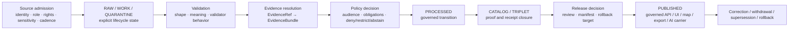

<!-- [KFM_META_BLOCK_V2]
doc_id: kfm://doc/tests-readme
title: tests/ — Canonical Enforceability Root and Mixed-Maturity Test Matrix
type: README
version: v1.3
status: draft; repository-grounded; canonical test root; mixed-maturity; no-full-suite-established; non-authoritative
owner: NEEDS VERIFICATION — current CODEOWNERS routes /tests/ and /fixtures/ to @bartytime4life; independent QA/test stewardship, required review, and separation-of-duties enforcement are not verified
created: NEEDS VERIFICATION — file predates the v1.2 repository-grounded rewrite
updated: 2026-07-23
supersedes: v1.2 documentation at the same path; no executable behavior, fixture, workflow, release object, or public surface is superseded
policy_label: repository-facing; canonical-root; enforceability-proof; deterministic; no-network-default; fail-closed; public-safe-fixtures; non-publisher
owning_root: tests/
responsibility: authored enforceability proof and test-routing contract for KFM schemas, contracts, validators, policy boundaries, source admission, lifecycle behavior, evidence resolution, release controls, applications, runtime envelopes, UI/map surfaces, domain lanes, correction, and rollback
truth_posture: cite-or-abstain; passing assertions support only their declared gates and do not establish truth, source authority, policy approval, release, publication, or production parity
evidence_snapshot:
  repository: bartytime4life/Kansas-Frontier-Matrix
  base_ref: main
  base_commit: f3abc3195c09711135674db0ae972aa8c232f329
  prior_blob: 2c03b844ab8007453e091c3b24160a209e5214ff
  directory_rules_blob: 18653c00ba193a4afaa3e07a0924452807fb98ef
  contributing_blob: 935f8bbefd8f966275887c9f58277746b9c67c28
  codeowners_blob: dd2a84aa514d8ecd9208bc347f90f9a2ed37dd61
  makefile_blob: 51537af34ee065c2de571134688415042b83b22a
  pyproject_blob: 3bba45d49de489c221734ee2446b21083f84fb28
  workflows_readme_blob: afb4f79ce2c5267cb1679f48186260e6edebf8b2
  workflow_inventory: 41 tracked .yml files at the workflow README snapshot
  aggregate_validator_count: 6
  boundary_suite_count: 15 tests in four modules
related:
  - ../CONTRIBUTING.md
  - ../docs/architecture/directory-rules.md
  - ../.github/CODEOWNERS
  - ../.github/workflows/README.md
  - ../Makefile
  - ../pyproject.toml
  - ../fixtures/README.md
  - ../tools/validators/README.md
  - ../contracts/README.md
  - ../schemas/README.md
  - ../policy/README.md
  - ../release/README.md
notes:
  - "v1.3 is a same-path documentation modernization and evidence refresh after 717 intervening commits from the v1.2 evidence base."
  - "Directory Rules §15 controls the required canonical-root README section order."
  - "Current repository evidence confirms several executable tests and workflow checks, but no accepted root-wide full-suite command, complete test-lane registry, comprehensive coverage artifact, branch-protection mapping, or production-parity proof."
  - "The Makefile test and validate targets remain intentionally narrow. They must not be described as the full repository suite."
  - "Policy-test is no longer echo-only: it now contains bounded readiness/drift checks. It still does not execute an accepted policy evaluator or emit PolicyDecision authority."
  - "Deny-path checks, SourceDescriptor validation, EvidenceRef validator polarity, PromotionDecision shape checks, schema inventory checks, and the 15-test boundary suite are current bounded evidence surfaces."
[/KFM_META_BLOCK_V2] -->

<a id="top"></a>

# `tests/` — Canonical Enforceability Root and Mixed-Maturity Test Matrix

[](#status)
[](#authority-level)
[](#status)
[](#validation)
[](#determinism-network-security-and-side-effects)
[](#authority-level)

> **One-line purpose.** `tests/` owns authored, deterministic evidence that a declared KFM rule or behavior is enforceable for a bounded scope; it never becomes the authority for truth, contracts, schemas, policy, evidence, release, publication, or production state.

**Quick navigation:** [Purpose](#purpose) · [Authority](#authority-level) · [Status](#status) · [Belongs](#what-belongs-here) · [Does not belong](#what-does-not-belong-here) · [Inputs](#inputs) · [Outputs](#outputs) · [Validation](#validation) · [Review](#review-burden) · [Related roots](#related-folders) · [ADRs](#adrs) · [Inventory](#verified-execution-surfaces) · [Lanes](#lane-maturity-and-routing-matrix) · [Test contract](#minimum-test-case-contract) · [CI](#workflow-and-ci-maturity) · [Open verification](#open-verification-register)

> [!IMPORTANT]
> A green test supports only the named assertion, fixture, gate, and checked revision. It does **not** by itself prove that a claim is true, a source is admitted, evidence is adequate, policy approved exposure, a release is authorized, or production behaves the same way.

> [!CAUTION]
> No canonical root-wide full-suite command is established. [`make test`](../Makefile) runs only `tests/schemas` and `tests/contracts`; `make validate` adds six configured schema-fixture validators but still omits many direct, app-owned, browser, domain, release, runtime, and workflow-specific suites.

> [!NOTE]
> `WORKFLOW_HOLD`, `WORKFLOW_SKIPPED_EXPLICIT`, a static readiness pass, a schema-shape pass, and a substantive behavior test are different outcomes. Workflow names and green conclusions must not be used to erase those distinctions.

---

<a id="purpose-and-audience"></a>

## Purpose

`tests/` is KFM's canonical responsibility root for **authored enforceability proof**. It answers one bounded question:

> Can a declared contract, schema, policy boundary, source rule, lifecycle transition, validator behavior, application boundary, release prerequisite, or public-surface invariant be exercised deterministically with explicit expected outcomes and without the test becoming authority?

This root serves maintainers, reviewers, domain stewards, source and rights reviewers, schema and contract owners, validator authors, application teams, CI owners, security reviewers, and release stewards.

Tests should make the following inspectable:

- what system or rule is under test;
- which contracts, schemas, policies, validators, fixtures, and implementation paths bind the assertion;
- which positive, negative, deny, restrict, abstain, stale, correction, or rollback condition is expected;
- which filesystem, network, time, locale, and sensitivity assumptions apply;
- what a pass proves;
- what a pass explicitly does **not** prove;
- how a failure can be diagnosed without leaking restricted material;
- when correction or rollback of the test, fixture, workflow, or downstream artifact is required.

Tests are part of KFM's working control plane, but they remain subordinate to the responsibility roots that own meaning, shape, admissibility, evidence, release, and publication.

[Back to top](#top)

---

<a id="authority-and-directory-rules-basis"></a>

## Authority level

| Field | Authority |
|---|---|
| **Directory class** | **Canonical, implementation-bearing root** |
| **Primary responsibility** | Authored enforceability proof and test routing |
| **May own** | Test modules, test helpers, assertions, test-local configuration, collection rules, and test-local fixtures whose scope is explicitly bounded |
| **Must not own** | Semantic contracts, canonical schemas, policy rules, source registries, validator implementations, lifecycle data, evidence records, receipts/proofs, release decisions, production configuration, or public runtime code |
| **Public-path posture** | **DENY direct public use.** Test outputs are review signals, not public truth or normal API/UI/map/AI inputs |
| **Promotion posture** | A test may be a prerequisite to promotion; it is never a PromotionDecision or release approval |
| **Truth posture** | Cite or abstain; make support and claim limits visible |

Directory Rules place files by **primary responsibility**, not topic. The existing path `tests/README.md` is correctly placed because `tests/` owns enforceability proof. This same-path documentation update creates no root, moves no file, changes no lifecycle phase, and requires no ADR.

### Responsibility boundary

| Responsibility | Authority home | Role of `tests/` |
|---|---|---|
| Semantic meaning and invariants | [`contracts/`](../contracts/README.md) | Assert against; never redefine |
| Machine-checkable shape | [`schemas/`](../schemas/README.md) | Validate against; never become schema authority |
| Admissibility, rights, sensitivity, access, obligations | [`policy/`](../policy/README.md) | Exercise reviewed rules or explicit mocks; never approve |
| Reusable validator implementation | [`tools/validators/`](../tools/validators/README.md) | Test entrypoints, diagnostics, polarity, and side effects |
| Reusable deterministic fixtures | [`fixtures/`](../fixtures/README.md) | Consume and verify; do not duplicate as a shadow registry |
| Test-local deterministic fixtures | [`tests/fixtures/`](fixtures/README.md) | Own only when use is local and documented |
| Source identity and activation | `data/registry/sources/` and accepted control-plane homes | Exercise admission behavior; never admit a source |
| Lifecycle material | Governed `data/` phases | Use synthetic or review-safe samples; never mutate canonical stores |
| Receipts and proofs | `data/receipts/`, `data/proofs/` | Validate shapes and relationships; test output is not a canonical receipt or proof by location |
| Release, correction, withdrawal, rollback | [`release/`](../release/README.md) | Exercise prerequisites and denial paths; never publish or reverse production state |
| CI orchestration | [`.github/workflows/`](../.github/workflows/README.md) | Workflows call tests and report bounded outcomes |
| Application, package, runtime, renderer behavior | Accepted `apps/`, `packages/`, and `runtime/` homes | Exercise through bounded interfaces; app-local tests remain valid when ownership is explicit |
| Temporary QA reports | `artifacts/qa/` | Emit only under an accepted cleanup, retention, and sensitivity contract |

> [!WARNING]
> `tests/` must not become a second schema, contract, policy, source registry, fixture registry, validator implementation, data store, receipt store, proof store, release system, runtime, application, renderer, or publication root.

[Back to top](#top)

---

<a id="status-and-evidence-boundary"></a>

## Status

Snapshot: `main@f3abc3195c09711135674db0ae972aa8c232f329`, inspected on 2026-07-23.

| Surface | Current evidence | Safe conclusion |
|---|---|---|
| `tests/README.md` | **CONFIRMED** at prior blob `2c03b844...`; this revision is v1.3 | Canonical-root documentation exists and is modernized in place |
| Root Python test configuration | **CONFIRMED** in [`pyproject.toml`](../pyproject.toml) | Python `>=3.11`, `jsonschema>=4.26,<5`, optional `pytest>=9.1.1,<10`, root `pythonpath` |
| `make test` | **CONFIRMED command-bearing and narrow** | Runs only `tests/schemas` and `tests/contracts` |
| `make schemas` | **CONFIRMED command-bearing** | Runs six configured top-level validators in fixture mode |
| `make validate` | **CONFIRMED partial aggregate** | Runs `make schemas` then the narrow `make test`; not a full suite |
| Boundary suite | **CONFIRMED substantive** | Four modules, 15 tests, JUnit QA report, structural/static scope |
| Governed API suite | **CONFIRMED app-owned** | Smoke, ABSTAIN-envelope, route, method, import, and internal-store-literal checks |
| Schema and fixture validation | **CONFIRMED substantive but partial** | Repository schema JSON/meta-schema/ID checks plus configured fixture families |
| SourceDescriptor and EvidenceRef checks | **CONFIRMED bounded** | Nonempty SourceDescriptor fixture validation and a two-test EvidenceRef validator polarity module |
| PromotionDecision check | **CONFIRMED bounded shape test** | Validates configured fixtures for a PROPOSED schema; does not promote |
| Policy evaluator | **UNKNOWN / not established** | `policy-test` performs readiness and drift checks but no accepted evaluator or bundle execution |
| E2E, UI build/test, accessibility | **PROPOSED / held** | Readiness/scaffold workflows expose missing executable commands; no substantive browser/E2E/a11y suite |
| MapLibre | **CONFIRMED partial** | Script syntax and three pure-Python scalar negative cases; browser performance and proof closure remain held |
| Root full-suite command | **UNKNOWN / not accepted** | No command explicitly composes all required direct, app-owned, package-local, domain, browser, validator, and live tiers |
| Complete test inventory and case count | **UNKNOWN** | Bounded modules and counts are known; no complete governed registry or collection artifact |
| Required checks and branch protection | **NEEDS VERIFICATION** | File inspection cannot prove ruleset coupling |
| Production parity, release, publication | **UNKNOWN / DENIED as inference** | Test and workflow presence do not prove runtime, release, or public state |

### Material corrections from v1.2

- The configured validator aggregate contains **six**, not five, entrypoints; `validate_evidence_ref.py` is now included.
- `make governed-api-verify` now enforces its forbidden-import scan with a failing exit path; it is no longer accurately described as a non-blocking `|| true` check.
- `policy-test` is no longer an echo-only workflow. It contains bounded, fail-closed readiness and fixture-boundary checks while still withholding policy-engine claims.
- `deny-test` now runs narrow repository-owned route, method, internal-store-literal, and runtime-import denial assertions.
- Source, release, and doctrine-prerequisite workflows now invoke direct test modules under `tests/source/`, `tests/release/`, and `tests/policy/`.
- The workflow root documents **41 tracked `.yml` files**, explicit permissions on all 41, GitHub-hosted runners, no `pull_request_target`, no direct `secrets.*` references, and mutable major-version action tags.
- The prior blanket “TODO workflow” taxonomy is replaced by explicit scaffold, readiness/hold, and command-bearing/partial categories.

### Truth-label use

- **CONFIRMED** means the file, command, workflow definition, test source, or static contract was inspected at the pinned snapshot.
- **PROPOSED** means a target maturity, command, registry, placement decision, or implementation is recommended but not established.
- **UNKNOWN** means evidence was insufficient to establish the claim.
- **NEEDS VERIFICATION** means a concrete repository, run, setting, or review check remains.

No pass rate, coverage percentage, mutation score, flake rate, branch-protection state, deployment state, or release readiness is claimed by this README.

[Back to top](#top)

---

## What belongs here

Good fits for `tests/` include:

- deterministic schema, contract, validator, policy-boundary, source-admission, lifecycle, evidence-resolution, release, correction, rollback, API, runtime, UI, map, integration, and end-to-end assertions;
- positive and negative controls that prove a gate distinguishes permitted from rejected states;
- test helpers whose only responsibility is exercising tests;
- test-local fixtures that are too narrow to become reusable fixture authority;
- test configuration, collection contracts, markers, and manifests;
- regression tests for stable IDs, aliases, temporal semantics, source roles, citations, sensitivity transforms, correction propagation, and rollback;
- public-safe security tests for path traversal, boundary bypass, leakage, malformed inputs, resource limits, interrupted runs, and prohibited side effects;
- app- or package-local tests when the implementation owner deliberately keeps the suite adjacent and the root routing/CI contract indexes it.

### Route by the primary assertion

| Primary assertion | Preferred owner |
|---|---|
| Machine shape, `$id`, `$ref`, fixture polarity | `tests/schemas/` |
| Semantic contract meaning and exclusions | `tests/contracts/` |
| Policy, obligations, rights, sensitivity, access | `tests/policy/` |
| Validator CLI, resolver, diagnostics, exit code, side effects | `tests/validators/` |
| Source identity, role, rights, cadence, citation, activation | `tests/source/` or owning connector/domain lane |
| Pipeline transformation, lifecycle, idempotency, partial failure | `tests/pipelines/` or owning package/domain suite |
| Governed API route and envelope behavior | `tests/api/` or explicit app-owned tests |
| Finite runtime outcome composition | `tests/runtime_proof/` or accepted app/package-local suite |
| UI trust-state rendering, interaction, accessibility | `tests/ui/` or explicit app/package-local suite |
| MapLibre renderer and performance boundary | `tests/maplibre/` pending placement reconciliation |
| Promotion, release, correction, withdrawal, rollback | `tests/release/` |
| Domain behavior | `tests/domains/<domain>/` |
| Genuinely cross-domain composition | Accepted cross-domain lane after placement review |
| Full composed request path | `tests/e2e/<owner>/` |
| Generic “valid” or “invalid” result | Route to the gate owner above; compatibility lanes are not default homes |

Tests should be close enough to their responsibility owner to remain intelligible, but not so distributed that root orchestration, collection, or promotion significance becomes invisible.

[Back to top](#top)

---

## What does NOT belong here

| Do not put in `tests/` | Correct home or boundary |
|---|---|
| Canonical object meaning or invariants | `contracts/` |
| Canonical JSON Schema, enums, DTOs, OpenAPI | `schemas/` and verified API contract homes |
| Policy rules, allowlists, denylists, hidden thresholds, release decisions | `policy/` and accepted decision homes |
| Production validator logic hidden in tests | `tools/validators/`, packages, or the implementation owner |
| Reusable cross-cutting fixtures | `fixtures/` |
| Source descriptors, activation decisions, source registry records | governed source registry/control-plane homes |
| RAW, WORK, QUARANTINE, PROCESSED, CATALOG, TRIPLET, or PUBLISHED payloads | correct governed `data/` phase |
| Canonical EvidenceBundle, receipt, proof, manifest, signature, rollback card | `data/proofs/`, `data/receipts/`, `release/` |
| Pipeline orchestration | `pipelines/` and `pipeline_specs/` |
| Application, shared library, renderer, or runtime implementation | `apps/`, `packages/`, `runtime/` |
| Production secrets, tokens, private endpoints, logs, personal data | denied; use synthetic/public-safe test material |
| Exact protected species, archaeology, infrastructure, private-land, living-person, genealogy, DNA/genomic coordinates or identifiers | denied; use synthetic, withheld, generalized, aggregated, redacted, or denial fixtures |
| A generated test report presented as evidence authority or release approval | accepted QA artifact lane with explicit claim limits |

A test file must not define the rule it claims to verify in a way that makes the test tautological or creates a second authority.

[Back to top](#top)

---

<a id="inputs-and-outputs"></a>

## Inputs

Tests may read, when the test contract permits:

- implementation code from accepted app, package, pipeline, connector, runtime, tool, and script homes;
- semantic contracts from `contracts/`;
- machine schemas from `schemas/`;
- reviewed policy and policy fixtures from `policy/`;
- reusable fixtures from `fixtures/`;
- test-local fixtures from `tests/fixtures/`;
- source descriptors, registry records, receipts, proofs, and release objects only as synthetic or review-safe test inputs;
- repository configuration, manifests, and workflow metadata needed to test declared boundaries;
- explicit temporary directories, fixed clocks, deterministic environment variables, and caller-provided local paths.

### Input admission rules

- Pin or freeze inputs where reproducibility requires it.
- Deny undeclared outbound network access in default tests.
- Use public-safe, synthetic, generalized, or redacted values.
- Distinguish a fixture representing an object from an authoritative instance of that object.
- Make source role, temporal scope, expected outcome vocabulary, and review class explicit.
- Never infer a missing contract, schema, policy, or fixture path merely to keep a test green.
- Fail or hold on unexpected empty discovery when nonempty coverage is required.

[Back to top](#top)

---

## Outputs

Accepted test outputs include:

- test-framework results and exit codes;
- bounded stdout/stderr diagnostics;
- JUnit XML or equivalent QA reports;
- collection, skip, xfail, duration, and flake observations;
- coverage and mutation reports when configured and bounded;
- temporary files under test-owned directories;
- explicit readiness or hold summaries;
- candidate validation reports or receipts only when the owning schema, destination, cleanup, and claim limit are established.

Every output must state its role. A test log, JUnit file, screenshot, visual diff, fixture, generated report, or workflow summary is a **review signal**, not source truth, evidence closure, policy approval, release approval, or publication.

### Output safety

Outputs must not reveal:

- credentials, tokens, private endpoints, or internal filesystem secrets;
- exact sensitive locations or reconstruction hints;
- living-person, genealogy, consent, DNA, or genomic data;
- private source terms or restricted payloads;
- critical-infrastructure detail beyond the approved review class.

Temporary QA outputs belong in accepted artifact lanes such as `artifacts/qa/` and require explicit retention, correction, and cleanup behavior. Trust-bearing receipts, proofs, and release records remain in their canonical roots.

[Back to top](#top)

---

## Validation

### README validation

This root README is checked against [Directory Rules §15](../docs/architecture/directory-rules.md#15-required-readme-contract):

- the required H2 sections appear in the required order;
- `kfm://doc/tests-readme`, the same path, H1, and maintained legacy anchors are preserved;
- repository-relative links resolve;
- tables and fenced blocks are balanced;
- badges link to visible evidence boundaries and do not imply dynamic CI, release, or production status;
- implementation claims are bounded to the pinned repository evidence;
- current commands and workflow descriptions match fetched sources;
- no sensitive fixture values or secrets are introduced.

### Repository-native commands

| Command | Confirmed current scope | Important limit |
|---|---|---|
| `make test` | `python -m pytest tests/schemas tests/contracts -q` | Narrow schema/contract path only |
| `make schemas` | Six configured top-level validators in fixture mode | Not a validator-tree or semantic/policy inventory |
| `make validate` | `make schemas` then `make test` | Partial aggregate, not full suite |
| `make boundary-guards` | Three root policy modules plus app-owned API boundary module | Structural/static boundaries, not policy-engine behavior |
| `make boundary-guards-ci` | Same suite plus JUnit under `artifacts/qa/` | QA report, not proof/release authority |
| `make governed-api-smoke` | All tests under `apps/governed-api/tests` | Scaffold/API-owned scope only |
| `make governed-api-verify` | App tests plus a blocking forbidden renderer/model import scan | Not runtime network or dependency isolation proof |
| `python -m pytest tests/maplibre/test_perf_governance_negative_paths.py -q` | Three scalar negative checks | Not browser performance or visual correctness |
| `python -m pytest tests/schemas/test_evidence_ref_validator.py -q` | Validator accepts one valid fixture and rejects missing `ref` | Two-case polarity only |
| `python -m pytest tests/policy/test_doctrine_artifact_required.py -q` | Required-doctrine failure visibility and temporary receipt-shaped output | Does not admit doctrine artifacts |
| `python -m pytest tests/source/test_doctrine_artifact_descriptor_schema.py -q` | DoctrineArtifactDescriptor fixture validator returns success | Shape/fixture path only |
| `python -m pytest tests/release/test_promotion_decision_schema.py -q` | PromotionDecision fixtures validate | PROPOSED shape only; no promotion |

### Confirmed validator aggregate

[`tools/validators/_common/run_all.py`](../tools/validators/_common/run_all.py) invokes, in order:

1. `validate_source_descriptor.py`
2. `validate_evidence_ref.py`
3. `validate_evidence_bundle.py`
4. `validate_runtime_response_envelope.py`
5. `validate_decision_envelope.py`
6. `validate_run_receipt.py`

It stops on the first nonzero result. This is executable validation, not direct `tests/validators/` unit coverage and not a complete validator inventory.

### Validation performed for this documentation revision

- complete-file baseline read;
- current Directory Rules, CONTRIBUTING, CODEOWNERS, Makefile, pyproject, workflow index, selected workflow definitions, validators, and direct tests inspected;
- required root-README section order checked;
- no-loss and stable-anchor review;
- Markdown heading, link, table, fence, and badge checks;
- secret/sensitive-content scan;
- remote byte and changed-path verification after mutation.

### Not performed by this README update

- no repository tests, validators, browser suites, policy engine, source connector, release dry run, rollback drill, or deployment was executed locally in the authoring environment;
- no branch-protection settings, required-check mapping, production logs, dashboards, coverage report, mutation score, flake report, or runtime trace was inspected;
- no executable behavior was changed.

### Full-suite status

The following remains **PROPOSED**, not canonical:

```bash
python -m pytest tests -q
```

Even if it collects successfully, it would not automatically include app-owned tests, package-local suites, Node/browser checks, validator scripts, workflow readiness assertions, or governed live tiers. A canonical root orchestrator must enumerate those surfaces and exclusions explicitly.

[Back to top](#top)

---

<a id="review-burden-and-change-control"></a>

## Review burden

Current GitHub routing maps `/tests/` and `/fixtures/` to `@bartytime4life`. That is **CONFIRMED review routing**, not proof of independent QA stewardship, required code-owner review, branch protection, policy approval, release approval, or completed review.

| Change type | Minimum review burden |
|---|---|
| Root test contract or full-suite semantics | QA/test architecture, affected lane owners, CI, docs |
| New direct test lane or placement change | QA, Directory Rules/architecture, implementation owner |
| Schema or contract tests | QA, schema/contract owner, fixture owner |
| Policy, rights, sensitivity, access, or sensitive-data tests | QA, policy, security/sensitivity, affected domain |
| Source-admission tests | QA, source/registry, rights/sensitivity, connector/domain |
| Validator mechanics or CLI tests | QA, validator/tooling, schema and fixture owners |
| Pipeline behavior tests | QA, pipeline/package/domain, receipt/release reviewers where material |
| API, runtime, UI, browser, or E2E tests | QA, app/runtime/UI, evidence/policy/release owners |
| MapLibre/browser performance tests | QA, renderer/UI, performance, security/release |
| Promotion, release, correction, withdrawal, rollback tests | QA, release, evidence/policy, correction/rollback |
| Fixture changes | QA, fixture consumer, domain/sensitivity reviewer where applicable |
| Workflow trigger, command, check-name, or artifact change | CI and every affected test owner; branch-protection review |
| Skip, xfail, deletion, or narrowing of trust-spine coverage | QA, affected owner, explicit risk and rollback note |
| Snapshot or baseline acceptance | UI/map owner, QA, source fixture owner, human-reviewed reason |

### Separation of duties

- Test authors do not become sole approvers of policy-significant behavior.
- A passing test does not approve a source, policy decision, promotion, release, correction, or rollback.
- Workflow authorship, test authorship, human review, merge approval, and release/publication authority remain distinct where risk warrants it.
- Sensitive fixtures require the appropriate domain, rights, sovereignty, privacy, or security review.
- Generated test content and reports remain subordinate to human review and accepted authority surfaces.

[Back to top](#top)

---

## Related folders

| Related surface | Relationship to `tests/` |
|---|---|
| [`fixtures/`](../fixtures/README.md) | Reusable deterministic valid, invalid, deny, abstain, correction, and rollback examples |
| [`contracts/`](../contracts/README.md) | Meaning and invariants tests exercise |
| [`schemas/`](../schemas/README.md) | Machine shapes and identity tests validate |
| [`policy/`](../policy/README.md) | Admissibility rules and obligations tests exercise |
| [`tools/validators/`](../tools/validators/README.md) | Reusable validators whose entrypoints, polarity, diagnostics, and side effects require tests |
| [`apps/governed-api/`](../apps/governed-api/README.md) | App-owned governed API tests and boundary checks |
| [`apps/explorer-web/`](../apps/explorer-web/README.md) | Canonical public shell; UI/browser tests remain incomplete |
| [`pipelines/`](../pipelines/README.md) | Lifecycle and non-publisher behavior under test |
| [`release/`](../release/README.md) | Promotion, correction, withdrawal, and rollback authority tests must not replace |
| [`data/receipts/`](../data/receipts/README.md) | Canonical process-memory records; test reports are not receipts by location |
| [`data/proofs/`](../data/proofs/README.md) | Proof authority; test results are supporting evidence only when explicitly admitted |
| [`.github/workflows/`](../.github/workflows/README.md) | Orchestrates CI, permissions, triggers, artifacts, holds, and check names |
| [`artifacts/qa/`](../artifacts/qa/README.md) | Temporary or retained QA outputs under a declared contract |
| [`CONTRIBUTING.md`](../CONTRIBUTING.md) | Contribution, evidence, validation, review, and rollback expectations |
| [Directory Rules](../docs/architecture/directory-rules.md) | Canonical placement doctrine and root README contract |

[Back to top](#top)

---

## ADRs

| Decision surface | Current status | Test-root consequence |
|---|---|---|
| [`ADR-0001 — schema home`](../docs/adr/ADR-0001-schema-home--schemas-contracts-v1-is-canonical.md) | **PROPOSED** | Tests should validate machine shape under `schemas/contracts/v1/` without treating proposal status as acceptance |
| [`ADR-0003 — singular policy root`](../docs/adr/ADR-0003-policy-singular-is-canonical-%28policies-is-compatibility%29.md) | **PROPOSED** | Tests and workflows should not create a parallel `policies/` authority |
| [`ADR-0017 — SourceDescriptor admission`](../docs/adr/ADR-0017-source-descriptor-admission-process.md) | **PROPOSED** | Source tests exercise shape and readiness but do not admit or activate sources |
| Root full-suite orchestration | **OPEN / no accepted ADR established** | Do not label partial Make targets as the full suite |
| `tests/fixtures/` versus `fixtures/` | **NEEDS VERIFICATION** | Preserve the documented local/reusable split; avoid duplicate fixture authority |
| `tests/cross_domain/` naming and placement | **CONFLICTED** | Do not expand the lane until naming/ownership is reconciled |
| `tests/maplibre/` versus package/app-local renderer tests | **NEEDS VERIFICATION** | Retain current bounded tests; resolve ownership before broad expansion |
| Runtime envelope and policy outcome profiles | **CONFLICTED** | Tests must name the profile exercised and avoid silent vocabulary normalization |

No ADR is required for this v1.3 same-path documentation refresh. Any future change that creates a root, parallel authority, or structural migration follows Directory Rules and migration discipline.

[Back to top](#top)

---

## Last reviewed

| Field | Value |
|---|---|
| **Date** | 2026-07-23 |
| **Repository snapshot** | `main@f3abc3195c09711135674db0ae972aa8c232f329` |
| **Prior README blob** | `2c03b844ab8007453e091c3b24160a209e5214ff` |
| **Review class** | Documentation-only, repository-grounded, same-path modernization |
| **Implementation changes** | None |
| **Next mandatory review** | When commands, aggregate membership, direct test inventory, fixture discovery, workflow maturity, required checks, lane ownership, or correction/rollback behavior changes materially |
| **Staleness flag** | Review within six months even if no trigger fires |

### Changelog

| Date | Version | Change | Status |
|---|---:|---|---|
| 2026-07-23 | v1.3 | Reordered the canonical-root contract to Directory Rules §15; refreshed evidence against current main; corrected validator, governed-API, policy, deny, source, release, schema, CI, and MapLibre claims; preserved strong test doctrine and legacy anchors. | **CONFIRMED documentation change / executable maturity bounded** |
| 2026-07-16 | v1.2 | Replaced broad scaffold claims with a repository-grounded mixed-maturity test matrix and trust-spine contract. | **LINEAGE / prior repository-grounded edition** |

[Back to top](#top)

---

<a id="confirmed-current-inventory"></a>

## Verified execution surfaces

The inventory below is **bounded** to fetched files and workflow-bound test references. It is not a complete recursive count.

### Root orchestration and configuration

| Surface | Current behavior | Boundary |
|---|---|---|
| [`pyproject.toml`](../pyproject.toml) | Python `>=3.11`; `jsonschema>=4.26,<5`; optional `pytest>=9.1.1,<10`; root `pythonpath` | Configuration, not collection/pass proof |
| [`Makefile`](../Makefile) `test` | `python -m pytest tests/schemas tests/contracts -q` | Narrow |
| `schemas` | Six configured shared-runner validators | Fixture-based machine-shape checks |
| `validate` | `schemas` then `test` | Partial aggregate |
| `boundary-guards` | Three root policy modules plus app API boundary module | Static/structural |
| `boundary-guards-ci` | Same plus JUnit | QA artifact only |
| `governed-api-smoke` | App-owned API test directory | Scaffold/API scope |
| `governed-api-verify` | App tests plus blocking import-boundary grep | Source/import boundary, not runtime isolation |
| MapLibre targets | Script, validator, proof-shaped, and cleanup commands | Mixed maturity; not root suite |

### Direct root test modules verified

| Path | Primary assertion | Current limit |
|---|---|---|
| [`tests/schemas/test_common_contracts.py`](schemas/test_common_contracts.py) | Immediate schemas in seven named families validate paired fixture directories | Fixture-gated; no complete schema-tree semantics |
| [`tests/schemas/test_hydrology_alias_contracts.py`](schemas/test_hydrology_alias_contracts.py) | Narrow Hydrology alias behavior | Selected aliases only |
| [`tests/schemas/test_evidence_ref_validator.py`](schemas/test_evidence_ref_validator.py) | EvidenceRef validator accepts one valid fixture and rejects missing `ref` with exit-code/output assertions | Two cases |
| [`tests/policy/test_control_plane_register_meta_contract.py`](policy/test_control_plane_register_meta_contract.py) | Required control-plane metadata and entry constraints | Structural metadata |
| [`tests/policy/test_explorer_web_adapter_boundary.py`](policy/test_explorer_web_adapter_boundary.py) | Selected renderer-import and internal-store literal boundaries | Static source scan |
| [`tests/policy/test_pipeline_connector_non_publisher.py`](policy/test_pipeline_connector_non_publisher.py) | Selected connector/pipeline write contexts avoid catalog/published/release targets | Static lexical scope |
| [`tests/policy/test_doctrine_artifact_required.py`](policy/test_doctrine_artifact_required.py) | Required-doctrine policy file exists; missing canonical artifacts fail visibly; temporary output is written | Does not admit artifacts or prove policy evaluation |
| [`tests/source/test_doctrine_artifact_descriptor_schema.py`](source/test_doctrine_artifact_descriptor_schema.py) | DoctrineArtifactDescriptor validator succeeds in fixture mode | One entrypoint result |
| [`tests/release/test_promotion_decision_schema.py`](release/test_promotion_decision_schema.py) | PromotionDecision validator succeeds in fixture mode | PROPOSED shape only |
| [`tests/maplibre/test_perf_governance_negative_paths.py`](maplibre/test_perf_governance_negative_paths.py) | Rejects zero frame, negative memory, and out-of-range tile-error budgets | Scalar checks, no browser |

### App-owned companion tests

| Path | What it establishes | Boundary |
|---|---|---|
| `apps/governed-api/tests/test_abstain_routes.py` | Scaffold routes return bounded ABSTAIN envelopes | App-owned scaffold behavior |
| `apps/governed-api/tests/test_boundary_guards.py` | Route/method manifest, import, and internal-store-literal boundaries | App-owned static/scaffold scope |

### Adjacent executable validator support

`tools/validators/_common/` supplies a local `$id` resolver, Draft 2020-12 runner, and six-entry fail-fast aggregate. It is working code, but direct unit coverage for registry completeness, duplicate handling, resolver error branches, CLI diagnostics, aggregate completeness, and side effects remains incomplete.

[Back to top](#top)

---

<a id="lane-maturity-and-routing-matrix"></a>

## Lane maturity and routing matrix

A README, directory, or workflow name is not proof of executable depth.

| Lane | Current maturity | Safe conclusion | Preferred next proof |
|---|---|---|---|
| `tests/api/` | Routing documentation; substantive tests are app-owned | API taxonomy exists; root/app ownership needs explicit indexing | Adopt routing contract or migration; add auth/policy/evidence/release cases |
| `tests/contracts/` | Included by `make test`; direct semantic suite not established | Path participation does not prove contract semantics | Meaning, exclusions, maturity, and cross-root binding tests |
| `tests/cross_domain/` | Documentation/routing surface; placement conflicted | Not an accepted expansion default | Resolve naming and register children |
| `tests/domains/` | Broad README tree; mixed child maturity | Domain organization exists; depth varies | Per-child module, fixture, command, workflow, owner inventory |
| `tests/e2e/` | Readiness workflow and docs; no composed harness | No substantive E2E suite | Deterministic Explorer + API + mock runtime harness |
| `tests/fixtures/` | Test-local fixture root with mixed child payload maturity | Local/reusable split is documented | Manifest consumers; prevent reusable-authority drift |
| `tests/invalid/` / `tests/valid/` | Compatibility/routing lanes | Generic polarity is not ownership | Retain only as routing guard or migrate |
| `tests/maplibre/` | Helper plus three direct scalar negative tests; static workflow checks | Partial implementation exists | Hermetic browser fixtures, runtime metrics, visual diff, release boundaries |
| `tests/pipelines/` | Documentation; non-publisher guard lives under policy | Dedicated pipeline behavior suite absent | Lifecycle, idempotency, receipts, partial failure, mutation denial |
| `tests/policy/` | Four verified direct modules plus constants; 15-test boundary suite includes three | Structural/static and doctrine-prerequisite checks exist | Accepted evaluator, bundles, obligations, rights/sensitivity, replay |
| `tests/release/` | One direct PromotionDecision fixture test | Shape validation exists; release governance absent | ReleaseManifest, review, correction, withdrawal, rollback composition |
| `tests/runtime_proof/` | Documentation; app tests and validators adjacent | No accepted composed runtime proof | Resolve envelope profile; add evidence/policy/freshness/release cases |
| `tests/schemas/` | Common fixture harness, Hydrology aliases, EvidenceRef polarity | Partial machine-shape evidence | Complete discovery, nonempty polarity, metaschema, coverage manifest |
| `tests/source/` | One direct doctrine descriptor test; SourceDescriptor checks elsewhere | Bounded source shape/readiness evidence | Role, rights, sensitivity, cadence, citation, activation, registry behavior |
| `tests/ui/` | Documentation/static boundary elsewhere; UI/a11y held | No component/browser/a11y suite | Trust states, keyboard, ARIA, leakage, correction, rollback |
| `tests/validators/` | Documentation; working shared runtime adjacent | Validator mechanics execute; direct unit contract incomplete | Resolver/runner/CLI/exit-code/diagnostic/aggregate tests |

[Back to top](#top)

---

<a id="trust-spine-and-lifecycle-invariants"></a>

## Trust spine and lifecycle invariants

Every consequential test should declare the segment of the trust spine it exercises.


```mermaid
flowchart LR
  A["Source admission<br/>identity · role · rights · sensitivity · cadence"] -->
  B["RAW / WORK / QUARANTINE<br/>explicit lifecycle state"] -->
  C["Validation<br/>shape · meaning · validator behavior"] -->
  D["Evidence resolution<br/>EvidenceRef → EvidenceBundle"] -->
  E["Policy decision<br/>audience · obligations · deny/restrict/abstain"] -->
  F["PROCESSED<br/>governed transition"] -->
  G["CATALOG / TRIPLET<br/>proof and receipt closure"] -->
  H["Release decision<br/>review · manifest · rollback target"] -->
  I["PUBLISHED<br/>governed API / UI / map / export / AI carrier"] -->
  J["Correction / withdrawal / supersession / rollback"]
```

```text
RAW -> WORK / QUARANTINE -> PROCESSED -> CATALOG / TRIPLET -> PUBLISHED
```

Promotion is a governed state transition, not a file move, test pass, workflow conclusion, commit, pull request, or merge.

### Required invariants

1. **No public/internal-store bypass.** Standard public clients use governed interfaces, not RAW, WORK, QUARANTINE, candidate, canonical, or internal stores.
2. **No source-role upgrade.** Ingest, normalization, joining, rendering, AI summary, cataloging, and release do not silently increase authority.
3. **Cite or abstain.** Evidence-dependent claims resolve support or narrow/abstain.
4. **Policy before exposure.** Rights, sensitivity, sovereignty, consent, living-person, infrastructure, archaeology, species, and location risks fail closed.
5. **Tests are not release.** Test success cannot create or approve a PromotionDecision, ReleaseManifest, CorrectionNotice, WithdrawalNotice, or RollbackCard.
6. **Generated output is subordinate.** Model text, screenshots, tiles, graphs, indexes, summaries, and reports do not become truth because a test accepts them.
7. **Correction remains reachable.** Consequential paths preserve correction, invalidation, supersession, withdrawal, and rollback targets.
8. **Sensitive values do not leak.** Failures, snapshots, logs, JUnit XML, artifacts, and diagnostics remain public-safe for the declared review class.
9. **Empty discovery is not success.** Required suites and fixture polarities fail when nothing meaningful runs.
10. **Expected rejection is not harness failure.** Negative cases assert the intended reason, output surface, and exit contract.

[Back to top](#top)

---

<a id="minimum-test-case-contract"></a>

## Minimum test case contract

Every new consequential test should make support and limits reviewable.

```yaml
test_id: kfm.test.<owner>.<behavior>
owner:
  responsibility_root: tests
  lane: tests/<lane>
  steward: NEEDS VERIFICATION

system_under_test:
  implementation_refs:
    - path/to/code
  contract_refs:
    - contracts/...
  schema_refs:
    - schemas/...
  policy_refs:
    - policy/...
  validator_refs:
    - tools/validators/...

case:
  purpose: one bounded assertion
  preconditions: []
  fixture_refs: []
  fixture_class: valid | invalid | deny | restrict | abstain | error | stale | correction | rollback
  expected_test_result: pass
  expected_system_outcome: optional and vocabulary-qualified
  negative_or_positive_companion: kfm.test....
  deterministic: true
  network: denied
  filesystem:
    writes: temporary-only
    canonical_store_mutation: denied
  sensitivity:
    class: public-safe-synthetic
    exact_sensitive_values: denied
  evidence_posture: synthetic-ref | resolved-test-bundle | not-applicable
  policy_posture: exercised | mocked-explicitly | not-applicable
  release_posture: unreleased-test-only
  correction_ref: optional
  rollback_ref: optional

claim_limit:
  proves: named gates only
  does_not_prove:
    - truth
    - source authority
    - production parity
    - release approval
    - publication
```

A test need not serialize this YAML, but the same facts must be inspectable in code, metadata, fixtures, documentation, or an accepted registry:

- owner and placement rationale;
- system under test and exact implementation references;
- contract, schema, policy, validator, and fixture bindings;
- expected framework result and system outcome vocabulary;
- positive/negative companion;
- network, filesystem, time, locale, and randomness posture;
- sensitive-data handling;
- evidence and release limits;
- correction and rollback relevance;
- what the test explicitly does not prove.

[Back to top](#top)

---

<a id="required-test-classes"></a>

## Required test classes

### Foundation

| Class | Required assertion |
|---|---|
| Schema conformance | Supported shape passes; unsupported shape fails; coverage cannot disappear silently |
| Contract semantics | Meaning, exclusions, maturity, and responsibility boundaries remain explicit |
| Validator mechanics | Registry, resolver, CLI, exit codes, diagnostics, fixture polarity, and side effects are predictable |
| Fixture integrity | Expected classes are present, nonempty where required, public-safe, and linked to consumers |
| Identity and time | Stable identity and distinct time kinds remain explicit where material |

### Governance

| Class | Required assertion |
|---|---|
| Source admission | Identity, role, rights, sensitivity, cadence, citation, and activation fail closed |
| Evidence resolution | EvidenceRef resolves to adequate bounded support or the result narrows/abstains |
| Policy behavior | Inputs, outcomes, obligations, reason codes, versions, digests, and replay are enforceable |
| Lifecycle transition | No phase is skipped and no public path reads pre-PUBLISHED state |
| Receipt and proof | Records match what ran and remain distinct from evidence and release authority |
| Release governance | Promotion, correction, withdrawal, supersession, and rollback require explicit support and review |

### Public and runtime surfaces

| Class | Required assertion |
|---|---|
| Governed API | Routes, methods, envelopes, access, evidence, policy, release, and leakage boundaries hold |
| Runtime proof | Finite outcomes compose from evidence, policy, freshness, and release state under a named profile |
| UI trust state | Evidence, caveats, denial, correction, rollback, time, and accessibility remain visible |
| Map and renderer | Renderer consumes governed public-safe artifacts and preserves sensitivity/release boundaries |
| End-to-end | Complete request path composes lower-level gates without bypass |
| AI boundary | Generated language remains subordinate to resolved evidence and policy; unsupported claims abstain |

### Reliability and reversibility

| Class | Required assertion |
|---|---|
| No-network default | Default suite fails on undeclared outbound access |
| Idempotency and replay | Fixed inputs produce equivalent results and no duplicate authority objects |
| Partial failure | Interrupted runs leave no silent promotion or canonical mutation |
| Correction propagation | Corrected/withdrawn support invalidates dependent carriers where required |
| Rollback drill | Targets are testable without treating the drill as an actual release action |
| Non-regression | Stable IDs, aliases, lineage, compatibility windows, and public behavior are preserved or migrated intentionally |

[Back to top](#top)

---

<a id="fixture-and-test-data-contract"></a>

## Fixture and test-data contract

KFM documents two fixture homes with a responsibility split.

| Home | Intended use | Guardrail |
|---|---|---|
| [`fixtures/`](../fixtures/README.md) | Reusable, cross-cutting deterministic examples shared by tests, validators, and pipelines | Canonical reusable fixture responsibility; not source or lifecycle data |
| [`tests/fixtures/`](fixtures/README.md) | Small fixtures local to one test area | Must not become a competing reusable fixture authority |

### Confirmed schema-fixture convention

```text
schemas/contracts/v1/<family>/<name>.schema.json
fixtures/contracts/v1/<family>/<name>/
├── valid/
│   └── valid_*.json
└── invalid/
    ├── invalid_*.json
    └── invalid_*.expected_error.txt
```

The common harness currently scans immediate schemas in seven named families and creates cases only when the matching fixture directory exists. Separate workflows now add nonempty-polarity checks for configured validator families and selected release/source objects.

### Required fixture classes

| Class | Purpose |
|---|---|
| `valid` | One supported path succeeds at named gates |
| `invalid` | Malformed or unsupported shape/meaning fails |
| `deny` | Policy or access refusal is explicit and non-leaking |
| `restrict` / `redact` | Public-safe transform or staged access is enforced |
| `abstain` / `hold` | Insufficient evidence, freshness, review, or policy closure does not invent an answer |
| `error` | Harness, dependency, config, or runtime failure remains bounded |
| `stale` / `superseded` / `withdrawn` | Temporal and release-state invalidation works |
| `correction` | Correction linkage and dependent invalidation are testable |
| `rollback` | Reversal target and prerequisites remain inspectable |

### Nonempty and polarity rules

A fixture-backed suite should fail when:

- a required valid or invalid set is empty;
- zero schemas or target files are discovered unexpectedly;
- an invalid fixture passes;
- a valid fixture fails;
- a consequential invalid fixture lacks expected-error evidence;
- a static negative scanner has no positive control;
- a path is renamed without consumer updates;
- a README describes payloads that are absent;
- a sensitive fixture lacks a review-safe transform;
- the harness crashes and the test treats any nonzero exit as expected rejection.

### Sensitive-fixture safeguards

Never commit real exact protected-species locations, archaeology-sensitive coordinates, living-person identifiers, DNA/genomic material, private genealogy/consent data, critical-infrastructure detail, restricted private-land records, secrets, credentials, private endpoints, or production logs.

Use synthetic, generalized, aggregated, redacted, withheld, or denied examples, and record why the transform is adequate for the test.

[Back to top](#top)

---

<a id="outcome-vocabularies-and-claim-discipline"></a>

## Outcome vocabularies and claim discipline

Do not collapse result systems.

| Layer | Example vocabulary | Meaning |
|---|---|---|
| Test framework | passed, failed, skipped, error, xfail | Did the assertion execute as expected? |
| Process/CLI | exit `0`, `1`, `2`, or tool-specific nonzero | Did the command complete under its contract? |
| Schema validator | valid, invalid, harness/config error | Did the instance conform to configured shape? |
| Runtime envelope | `ANSWER`, `ABSTAIN`, `DENY`, `ERROR` | What bounded runtime result is returned? |
| Policy | `ALLOW`, `RESTRICT`, `HOLD`, `DENY`, `ABSTAIN`, or named profile | What use is permitted and with which obligations? |
| Workflow readiness | `WORKFLOW_HOLD`, `WORKFLOW_SKIPPED_EXPLICIT`, failure, substantive pass | What maturity or drift state did CI establish? |
| Lifecycle | RAW, WORK, QUARANTINE, PROCESSED, CATALOG, TRIPLET, PUBLISHED | What governed state is material in? |
| Release | candidate, reviewed, promoted, held, withdrawn, superseded, rolled back | What is the governed release state? |

The repository contains vocabulary tension between PolicyDecision schemas, promotion decisions, runtime envelopes, and engine-native terminology. Tests must name the profile they exercise; they must not normalize conflicts silently.

### Claim ladder

```text
test executed
  -> named assertion passed
  -> configured gate behaved as expected
  -> bounded workflow step may rely on that result
  -> broader trust-spine reliance requires all declared dependencies
  -> release still requires governed promotion
```

Forbidden upgrades:

```text
schema valid -> semantically true
fixture accepted -> source admitted
validator pass -> evidence closed
policy-shaped object -> policy approved
workflow green -> full suite green
test green -> production parity
CI green -> release approved
rendered output -> published truth
```

[Back to top](#top)

---

<a id="determinism-network-security-and-side-effects"></a>

## Determinism, network, security, and side effects

### Default posture

Default tests should be deterministic, local, no-network, synthetic or public-safe, time-controlled, locale-controlled where relevant, side-effect bounded, repeatable from a clean checkout, and explicit about temporary artifacts.

### Network contract

Default tests must not call source APIs, live feeds, geocoders, map/tile/style/sprite/glyph/CDN endpoints, policy services, model runtimes, external databases, production services, release services, or private endpoints.

A live tier must be separately named, opt-in, credential-scoped, rate-aware, non-default, and excluded from ordinary PR gates unless explicitly governed.

Dependency installation in CI is not evidence that test logic itself may use live source or production networks.

### Filesystem contract

Tests may write only to pytest temporary directories, explicit temporary artifact roots, or accepted ignored QA locations such as `artifacts/qa/` when cleanup and retention are owned.

Tests must not mutate canonical contracts, schemas, policies, registries, lifecycle stores, release records, production configuration, published aliases, or committed fixture baselines without an explicit update action and review.

### Security assertions

Consequential suites should test:

- path traversal, symlink, absolute-path, and repository-root escape boundaries;
- malformed JSON/YAML, oversized payloads, recursion, and resource limits;
- secret, token, private path, and sensitive-data leakage in logs and artifacts;
- subprocess argument safety;
- temporary-file cleanup;
- sensitive geometry reconstruction risk;
- no-publication and no-canonical-mutation side effects;
- cancellation and interrupted-run cleanup;
- cache invalidation after correction, withdrawal, or rollback;
- public/client denial of canonical and pre-PUBLISHED stores.

[Back to top](#top)

---

<a id="coverage-non-vacuity-and-anti-tautology"></a>

## Coverage, non-vacuity, and anti-tautology

A green result is unacceptable when nothing meaningful ran.

| Risk | Required control |
|---|---|
| Zero tests collected | Assert expected minimum or registered count |
| Fixture-gated discovery silently disappears | Require expected bindings and nonempty polarity |
| Static scan sees no targets | Fail unless an approved empty state exists |
| Workflow only reports readiness | Label hold/skip; do not claim substantive behavior |
| Path filter misses an authoritative dependency | Test trigger manifest and update filters atomically |
| Negative case has no positive control | Pair with known-safe input |
| Positive case has no negative companion | Prove the gate is not unconditional |
| Aggregate omits an executable validator | Compare membership to accepted registry/manifest |
| Expected invalid prints generic failure | Assert expected reason, exit contract, and output prefix |
| `continue-on-error` or `|| true` masks a gate | Treat informational unless separate failure assertion exists |
| Skips/xfails grow silently | Report and review changes |
| Snapshot changes auto-accept | Require human-reviewed update reason and source-fixture linkage |
| Test reimplements the same rule inline | Bind to independent contract/schema/policy/implementation authority |

### Future root coverage artifact

A governed coverage artifact should report lane, direct modules, collected cases, fixtures and polarity, implementation/contract/schema/policy bindings, commands, workflow callers/triggers, pass/fail/skip/xfail counts, coverage/mutation metrics where meaningful, emitted artifacts, promotion significance, and unresolved gaps.

No complete artifact of that kind is established in the inspected snapshot.

[Back to top](#top)

---

<a id="current-local-execution-surfaces"></a>

## Current local execution surfaces

### Confirmed fast and bounded commands

```bash
make test
make schemas
make validate
make boundary-guards
make boundary-guards-ci
make governed-api-smoke
make governed-api-verify

python -m pytest tests/maplibre/test_perf_governance_negative_paths.py -q
python -m pytest tests/schemas/test_evidence_ref_validator.py -q
python -m pytest tests/policy/test_doctrine_artifact_required.py -q
python -m pytest tests/source/test_doctrine_artifact_descriptor_schema.py -q
python -m pytest tests/release/test_promotion_decision_schema.py -q
```

### Command limits

| Command | What it omits |
|---|---|
| `make test` | Root policy/source/release/MapLibre modules, app API tests, E2E, UI, pipelines, runtime proof, validator unit tests, most domain suites |
| `make schemas` | Validators outside the six-entry aggregate and semantic/policy/release behavior |
| `make validate` | Everything omitted by `make schemas` and `make test` |
| `make boundary-guards` | Policy evaluator, obligations, complete source/lifecycle/release behavior, browser/UI runtime, dynamic mutation paths |
| `make governed-api-smoke` | Root tests and production deployment behavior |
| MapLibre commands | Root suite, hermetic browser proof, release authority |
| Direct source/release/doctrine modules | Broader object-family, evidence, policy, review, and lifecycle composition |

A future command taxonomy should separate fast, standard, extended, browser, integration, security, release-drill, and governed live tiers.

[Back to top](#top)

---

<a id="workflow-and-ci-maturity"></a>

## Workflow and CI maturity

The workflow root records 41 tracked `.yml` files at its 2026-07-22 snapshot. Workflow definitions are evidence of orchestration and intended bounds, not current pass state, required-check status, release readiness, or production behavior.

### Substantive command-bearing or bounded checks

| Workflow | Current bounded behavior |
|---|---|
| `schema-validation` | Parses schema JSON, meta-schema checks schemas, enforces canonical `$id` uniqueness, requires nonempty configured fixtures, runs `make schemas` and schema/contract tests |
| `validator-suite` | Requires nonempty unique aggregate entries, runs `make schemas`, and verifies a precise invalid EvidenceBundle canary |
| `policy-boundary-guards` | Runs 15 tests in four modules, validates nonempty zero-failure JUnit, uploads 14-day QA artifact |
| `api-test` | Runs governed API smoke and focused ABSTAIN-envelope tests |
| `deny-test` | Runs route/method/API manifest, internal-store-literal, and forbidden-runtime-import checks |
| `source-descriptor-validate` | Requires nonempty SourceDescriptor polarity, runs validator and targeted schema test, surfaces schema-path drift |
| `promotion-gate` | Runs doctrine-prerequisite, doctrine descriptor, and PromotionDecision shape checks; keeps promotion held |
| `release-dry-run` | Inspects candidate readiness and runs PromotionDecision shape test; emits no release |
| `MapLibre Perf Governance` | Parses scripts/validators, invokes three negative functions, holds browser/proof/release claims |
| `contracts-validate`, `docs-control-plane`, `contract-drift`, `connector-gate`, `pmtiles-attestation`, `telemetry-policy`, `dependency-scan`, `codeql` | Command-bearing or partial checks with their own bounded authority |

### Readiness and explicit-hold workflows

| Workflow | Current boundary |
|---|---|
| `policy-test` | Readiness/drift checks for Rego, fixtures, bundle, placeholder runtime, Make target; no accepted evaluator |
| `evidence-resolver` | Static readiness around package/contracts/schemas/fixtures/validators/tests; no resolver command |
| `e2e-smoke` | Mock runtime and E2E readiness; no executable composed harness |
| `rollback-drill` | Inspects placeholders, schemas, records, aliases; no rollback simulation |
| `docs-build`, `link-check`, `focus-mock-test`, `hydrology-proof-slice` | Explicit readiness/hold surfaces |
| Domain workflows | Domain-specific readiness, placeholder, negative-boundary, or partial checks; maturity varies |

### Explicit scaffolds

- `accessibility` reports `WORKFLOW_SKIPPED_EXPLICIT` and `WORKFLOW_HOLD`; it does not run axe or keyboard tests.
- `ui-build` fails readiness while Explorer scripts, exact package-manager pin, and lockfile are not implementation-bearing.
- `citation-validation` remains a greenfield/non-enforcing scaffold according to the workflow inventory.

### Trigger and security posture

The workflow inventory confirms, for its pinned tree:

- explicit top-level permissions in all 41 workflows;
- no `pull_request_target` trigger;
- no self-hosted runner reference;
- no direct `secrets.*` expression;
- ordinary write scopes absent, with CodeQL retaining `security-events: write`;
- external actions referenced by mutable major or release tags rather than immutable commit SHAs;
- branch protection, required checks, workflow run success, artifact retention enforcement, and rulesets remain **NEEDS VERIFICATION**.

### CI acceptance contract

A workflow is not substantive test coverage until it invokes real assertions, fails on unexpected zero collection, covers authoritative dependencies, records exact commands/versions, declares network and secret posture, distinguishes rejection from harness failure, reports skips/exclusions, has an owner and correction path, states promotion significance, is locally reproducible where applicable, and has rollback/disable guidance.

[Back to top](#top)

---

<a id="failure-interpretation"></a>

## Failure interpretation

| Failure | Safe interpretation | Do not infer |
|---|---|---|
| Valid fixture fails | Shape, resolver, fixture, or binding drift | Underlying real-world claim is false |
| Invalid fixture passes | Schema/fixture gate is too permissive | Policy approved the object |
| Direct contract tests absent | Semantic enforceability is unproven | Contract prose is necessarily wrong |
| Validator exits nonzero | Validator or harness failed for that invocation | Release must be rolled back automatically |
| Boundary test fails | Named static/structural boundary may be violated | Complete policy decision exists |
| API scaffold test fails | Named route/envelope/boundary behavior drifted | Production service health is known |
| MapLibre scalar test fails | Local budget guard is violated | Browser rendering or map correctness is known |
| Readiness workflow succeeds | Held assumptions remain as inspected | Named implementation exists |
| Readiness workflow fails | A boundary disappeared or maturity changed and needs review | Newly surfaced code is necessarily wrong |
| Promotion prerequisite fails | Promotion chain is incomplete for that run | This README caused the gap |
| Zero tests collected | Coverage or routing is absent | Success |
| Sensitive fixture review fails | Fixture is unsafe for the declared review class | Real sensitive data should be exposed for debugging |

Failures should be actionable, bounded, and non-leaking. Diagnostics identify the gate and safe locator without printing restricted payloads.

[Back to top](#top)

---

<a id="what-a-passing-check-does-not-prove"></a>

## What a passing check does not prove

A pass does not by itself prove:

- source authority, admission, activation, or current rights;
- semantic correctness or evidence adequacy;
- sovereignty, cultural approval, consent, or sensitivity clearance;
- freshness, temporal truth, or complete schema/validator coverage;
- complete policy evaluation or obligation fulfillment;
- review completion or separation of duties;
- lifecycle promotion, catalog/triplet closure, release approval, or publication;
- public safety, production deployment, production parity, or runtime availability;
- correction propagation or operational rollback readiness;
- branch-protection significance;
- absence of untested dynamic, app-local, package-local, domain-local, browser, or external paths.

Use the narrowest statement supported by the assertion and all declared dependencies.

[Back to top](#top)

---

<a id="definition-of-done-for-the-root-test-system"></a>

## Definition of done for the root test system

The root system is not complete merely because individual checks are green.

- [ ] Machine-readable registry of lanes, owners, direct modules, implementation bindings, fixtures, commands, workflows, and maturity.
- [ ] Accepted full-suite orchestrator or explicit tiered orchestration.
- [ ] Explicit inclusion of app-owned, package-local, domain-local, validator, and Node/browser suites.
- [ ] No readiness or TODO scaffold reported as substantive testing.
- [ ] Zero-collection and nonempty-fixture safeguards.
- [ ] Stable framework, CLI, validator, runtime, policy, workflow, lifecycle, and release outcome vocabularies.
- [ ] Enforced deterministic no-network default.
- [ ] Sensitive-fixture review and leakage tests.
- [ ] Coverage for source admission, evidence resolution, policy, lifecycle, receipts/proofs, release, correction, rollback, API, runtime, UI, map, and E2E composition.
- [ ] Explicit contract/schema/policy/fixture/validator bindings.
- [ ] Structured QA artifacts with stable identity, commit, command, environment, counts, failures, skips, and hashes.
- [ ] Trigger coverage for authoritative dependencies.
- [ ] Local/CI parity or documented, tested differences.
- [ ] Required-check and promotion significance recorded.
- [ ] Correction and rollback procedures for tests, fixtures, baselines, workflows, and QA artifacts.
- [ ] Accepted owners and CODEOWNERS.
- [ ] Current pass, coverage, mutation, duration, and flake metrics reported without production-parity overclaim.

[Back to top](#top)

---

<a id="smallest-sound-improvement-sequence"></a>

## Smallest sound improvement sequence

### Phase 1 — Inventory and registry

1. Choose an accepted control-plane or QA metadata home after Directory Rules review.
2. Register direct modules, helpers, fixtures, bindings, commands, workflows, owners, and maturity.
3. Fail when a registered required path disappears.
4. Generate or cross-check README lane matrices without making generated text authority.

### Phase 2 — Non-vacuity

1. Add zero-collection guards.
2. Require nonempty valid/invalid fixture polarity where applicable.
3. Require nonempty targets for static scans.
4. Pair negative scanners with positive controls.
5. Distinguish expected rejection from runner/configuration failure.

### Phase 3 — Root orchestration

1. Define fast, standard, extended, browser, security, release-drill, and live tiers.
2. Include direct pytest lanes, app-owned tests, validator aggregates, package-local and Node/browser suites explicitly.
3. Record exact exclusions and time/network budgets.
4. Avoid naming a partial command “full.”

### Phase 4 — Trigger and artifact discipline

1. Audit path filters against implementation, contract, schema, fixture, policy, helper, config, and docs dependencies.
2. Emit stable structured reports.
3. Record collection, skip, xfail, duration, flake, and artifact data.
4. Define retention, sensitivity, correction, and deletion rules.

### Phase 5 — Missing governance behavior

1. Add source-role, rights, sensitivity, cadence, citation, and activation behavior.
2. Add accepted policy evaluator, bundle, obligation, replay, and reason-code tests.
3. Add pipeline lifecycle, idempotency, partial-failure, and receipt tests.
4. Add release, correction, withdrawal, supersession, and rollback suites.
5. Resolve runtime envelope and policy outcome profiles.

### Phase 6 — Public surfaces

1. Implement substantive UI, accessibility, browser, and E2E suites.
2. Keep browser tests hermetic by default.
3. Resolve MapLibre placement and package/app/root routing.
4. Add sensitive-value leakage, correction propagation, and cache invalidation tests.

### Phase 7 — Promotion integration

1. Decide required checks through governed review.
2. Separate test authorship, policy review, and release approval.
3. Bind promotion to accepted QA artifacts without treating tests as release authority.
4. Exercise rollback of a test-driven candidate in a non-publishing drill.

[Back to top](#top)

---

<a id="open-verification-register"></a>

## Open verification register

| ID | Question | Status | Required evidence |
|---|---|---|---|
| TEST-ROOT-01 | Who owns root test architecture and each direct lane? | `NEEDS VERIFICATION` | Accepted stewardship plus CODEOWNERS/ruleset evidence |
| TEST-ROOT-02 | What is the canonical full-suite or tiered orchestrator? | `OPEN` | Accepted command contract and implementation |
| TEST-ROOT-03 | Should `make test` be renamed or expanded because it is narrow? | `OPEN` | Compatibility and maintainer decision |
| TEST-ROOT-04 | What belongs in `make validate`? | `OPEN` | Tier design, budget, and ownership |
| TEST-ROOT-05 | What is the complete direct, app, package, domain, browser, and workflow test inventory? | `UNKNOWN` | Recursive inventory plus dynamic collection |
| TEST-ROOT-06 | What are complete collected case counts? | `UNKNOWN` | Governed CI collection artifact |
| TEST-ROOT-07 | Which fixture families require both valid and invalid cases? | `OPEN` | Fixture contract and exceptions |
| TEST-ROOT-08 | Is the `tests/fixtures/` versus `fixtures/` split permanent? | `NEEDS VERIFICATION` | ADR or accepted root contract |
| TEST-ROOT-09 | Should `tests/valid/` and `tests/invalid/` remain? | `OPEN` | Inbound-reference inventory and migration plan |
| TEST-ROOT-10 | Is `tests/source/` a direct suite or compatibility/routing lane? | `OPEN` | Source test placement decision |
| TEST-ROOT-11 | How should app-owned API tests relate to `tests/api/`? | `CONFLICTED` | Accepted ownership/routing contract |
| TEST-ROOT-12 | Which runtime envelope profile is canonical? | `CONFLICTED` | ADR and schema/contract migration |
| TEST-ROOT-13 | Where do domain runtime-proof children belong? | `CONFLICTED` | Domain placement decision |
| TEST-ROOT-14 | Is `tests/cross_domain/` the accepted namespace? | `CONFLICTED` | Naming/placement decision |
| TEST-ROOT-15 | Is `tests/maplibre/` the accepted renderer-test home? | `NEEDS VERIFICATION` | Package/app/root placement decision |
| TEST-ROOT-16 | Which executable validators belong in the aggregate? | `UNKNOWN` | Entrypoint registry and completeness rule |
| TEST-ROOT-17 | What is the stable validator exit-code and diagnostics contract? | `OPEN` | Versioned contract and direct tests |
| TEST-ROOT-18 | What policy outcome vocabulary is accepted? | `CONFLICTED` | Policy/runtime decision |
| TEST-ROOT-19 | Which policy evaluator and bundle are active? | `UNKNOWN` | Executable binding and run evidence |
| TEST-ROOT-20 | Which checks are required by branch protection? | `UNKNOWN` | Repository ruleset evidence |
| TEST-ROOT-21 | Which checks block promotion? | `UNKNOWN` | Promotion policy and required-check mapping |
| TEST-ROOT-22 | Are workflow path filters complete? | `NEEDS VERIFICATION` | Dependency-to-trigger audit |
| TEST-ROOT-23 | What are pass, coverage, mutation, duration, and flake metrics? | `UNKNOWN` | Governed QA report |
| TEST-ROOT-24 | How are skips and xfails reviewed? | `OPEN` | CI policy and trend report |
| TEST-ROOT-25 | How is no-network behavior enforced across Python and browser tiers? | `NEEDS VERIFICATION` | Harness and deny canaries |
| TEST-ROOT-26 | What resource limits apply? | `OPEN` | Security/performance contract |
| TEST-ROOT-27 | What sensitive-fixture review is mandatory? | `NEEDS VERIFICATION` | Review workflow and ownership |
| TEST-ROOT-28 | Which QA artifacts are retained and for how long? | `OPEN` | Artifact policy and cleanup |
| TEST-ROOT-29 | How do correction and withdrawal invalidate baselines and caches? | `OPEN` | Consumer map and invalidation tests |
| TEST-ROOT-30 | Has an operational rollback drill executed? | `UNKNOWN` | Logs, receipts, review record |
| TEST-ROOT-31 | Should readiness workflows share a machine-readable maturity vocabulary? | `OPEN` | Workflow contract and migration plan |
| TEST-ROOT-32 | When does a readiness failure mean “implementation surfaced” rather than regression? | `OPEN` | Graduation protocol and review ownership |

[Back to top](#top)

---

<a id="evidence-ledger"></a>

## Evidence ledger

| Evidence | Status | Supports | Limit |
|---|---:|---|---|
| Prior `tests/README.md` blob `2c03b844...` | `CONFIRMED` | v1.2 doctrine, inventory, test contract, fixtures, security, review, roadmap | Stale snapshot and several outdated workflow/command claims |
| `docs/architecture/directory-rules.md` | `CONFIRMED doctrine` | Canonical root placement and §15 README order | Some specific placement questions remain open |
| `CONTRIBUTING.md` | `CONFIRMED` | Evidence, change, test/fixture responsibility, review/rollback posture | Does not prove test behavior |
| `.github/CODEOWNERS` | `CONFIRMED routing` | `/tests/` and `/fixtures/` route to verified account | Not approval, stewardship assignment, or ruleset evidence |
| `Makefile` | `CONFIRMED` | Current commands, narrow aggregates, blocking API import guard | Command presence is not pass evidence |
| `pyproject.toml` | `CONFIRMED` | Python/jsonschema/pytest constraints and root pythonpath | Does not prove collection |
| `.github/workflows/README.md` | `CONFIRMED repository-grounded inventory` | 41-workflow taxonomy, permissions, runner/trigger/action posture | Snapshot is not run history or branch protection |
| `schema-validation.yml` | `CONFIRMED definition` | Schema inventory, unique IDs, six fixture families, schema/contract tests | No current run result claimed here |
| `validator-suite.yml` | `CONFIRMED definition` | Aggregate non-vacuity and precise EvidenceBundle canary | One configured aggregate/canary |
| `policy-boundary-guards.yml` | `CONFIRMED definition` | 15-test, four-module suite and JUnit contract | Static/structural, not policy engine |
| `policy-test.yml` | `CONFIRMED definition` | Readiness/drift and PolicyDecision fixture boundary | No evaluator/bundle execution |
| `deny-test.yml` | `CONFIRMED definition` | Narrow route/method/store/import denial checks | Not complete authorization |
| `api-test.yml` | `CONFIRMED definition` | App smoke and ABSTAIN-envelope checks | Scaffold/application scope |
| `source-descriptor-validate.yml` | `CONFIRMED definition` | Nonempty fixtures, validator/test wiring, path-drift hold | No source admission |
| `promotion-gate.yml` and `release-dry-run.yml` | `CONFIRMED definitions` | Doctrine, descriptor, PromotionDecision shape prerequisites | No promotion/release |
| `rollback-drill.yml` | `CONFIRMED definition` | Readiness and placeholder drift inspection | No rollback executed |
| `e2e-smoke.yml`, `ui-build.yml`, `accessibility.yml` | `CONFIRMED definitions` | Explicit held/scaffold boundaries | No E2E/UI/a11y proof |
| `maplibre-perf-governance.yml` | `CONFIRMED definition` | Syntax and three deterministic negative checks | No browser performance/proof closure |
| Fetched direct test modules | `CONFIRMED source` | Named assertions and exact boundaries | Bounded, not exhaustive |

### No-loss ledger

| v1.2 surface | v1.3 result |
|---|---|
| Stable `kfm://doc/tests-readme`, path, H1 | Preserved |
| Canonical test-root authority | Preserved and moved into required §15 Authority section |
| Trust spine and lifecycle invariant | Preserved and expanded |
| Minimum test case YAML | Preserved with evidence-bounded steward value |
| Required test classes | Preserved |
| Fixture split, polarity, and sensitive safeguards | Preserved and updated |
| Outcome vocabularies and claim ladder | Preserved; workflow readiness vocabulary added |
| Determinism, no-network, security, side effects | Preserved |
| Non-vacuity and anti-tautology | Preserved and sharpened |
| Local commands and limits | Corrected to current Makefile and modules |
| Workflow maturity | Rebuilt from current 41-workflow inventory and selected definitions |
| Failure interpretation and pass limits | Preserved |
| Review burden and separation | Preserved; current CODEOWNERS evidence added |
| Definition of done and phased roadmap | Preserved |
| Thirty-item verification register | Preserved and extended to 32 |
| Documentation correction and rollback | Preserved below |
| Legacy heading fragments | Maintained with custom anchors |

[Back to top](#top)

---

<a id="documentation-correction-and-rollback"></a>

## Documentation correction and rollback

This README is a routing and evidence-boundary document. It changes no executable behavior.

### Before merge

- close the draft pull request; or
- restore prior blob `2c03b844ab8007453e091c3b24160a209e5214ff` on the review branch.

### After merge

- revert the documentation commit; or
- submit a corrective documentation PR with updated evidence, truth labels, and changed-path review.

### When implementation changes

Update this README when any of the following changes materially:

- root or lane ownership;
- direct module inventory or collection;
- Makefile commands;
- fixture discovery or polarity requirements;
- validator aggregate membership;
- workflow commands, path filters, check names, permissions, or artifacts;
- a readiness/scaffold workflow graduates to implementation;
- runtime envelope or policy outcome profiles;
- MapLibre, cross-domain, API, or app-local test placement;
- no-network enforcement or live-tier rules;
- sensitive-fixture policy;
- branch-protection or promotion dependencies;
- QA artifact schemas and retention;
- correction, withdrawal, cache invalidation, or rollback behavior.

A documentation rollback does not roll back tests, fixtures, validators, workflows, applications, data, releases, or production systems. Each requires its own governed correction and rollback path.

[Back to top](#top)
